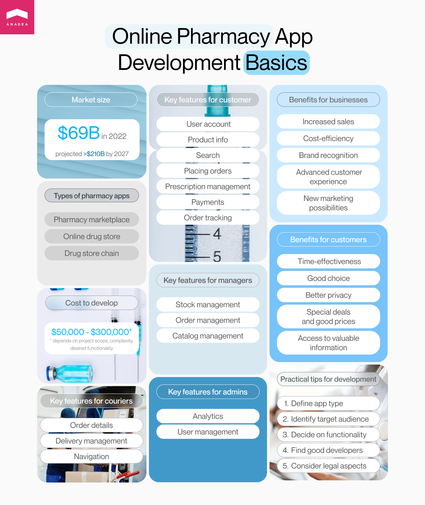

Today all industries are experiencing a phase of active digitalization. And the pharmacy market is not an exception. If some decades ago it was quite difficult to imagine that you would be able to buy pills or drops via the internet, today some drug stores can allow you to order even prescription medicines online and get them delivered in a couple of hours. The standards in the industry are gradually changing as well as people's expectations. And that's where online pharmacy app development is entering the game. In this article, we offer you to have a look at the peculiarities of software solutions of this kind and the benefits that a pharmacy delivery app can bring to your business.

## Online pharmacy: Market overview

The growing popularity of the pharmacy app development services that we can observe today is directly related to the expansion of <a href="https://anadea.info/solutions/medical-app-development" target="_blank">healthcare software development</a> in general. One of the hugest boosters of the interest in creating and launching software solutions in the medical sphere was the coronavirus pandemic. When the first wave of the coronavirus came and the strongest restrictive measures and lockdowns were introduced, it turned out that many people didn't have access to traditional healthcare services. With a view to ensuring better accessibility of their services started implementing online platforms and mobile apps that allowed patients to get possible help and consultations in a fully remote format.

At that time, the need for reliable delivery services also became pressing. And while eCommerce stores already knew how to organize their work in such a way that their clients would safely and quickly receive their orders, many pharmacies were absolutely unprepared for such conditions. Though before the pandemic medicine delivery apps already existed and were offered by some drug stores to their clients, in 2020, the demand for them skyrocketed.

Among the examples of pharmacy delivery apps, we can mention **Netmeds, CVS Pharmacy, PharmEasy, Walgreens, PillPack, and Capsule.**

The online pharmacy segment is an actively developing market. In 2020, the global online pharmacy <a href="https://www.globenewswire.com/en/news-release/2022/01/17/2367961/0/en/Global-Online-Pharmacy-Market-Size-To-Hit-USD-210-35-Billion-by-2028-at-a-17-83-CAGR-Growth-with-COVID-19-Analysis-Facts-Factors.html" target="_blank" rel="nofollow">market size</a> was around $69 billion. And analysts are quite optimistic about its further growth. According to them, by the end of 2028, the market volume can be over $210 billion as the projected CAGR for the period from 2021 to 2028 is almost 18%.

## Main types of online pharmacy apps

The general idea of a pharmacy delivery app is rather similar to the idea of any online shopping app. You need to provide users with the possibility to make an order online and safely pay for it. However, pharmacy app developers have an additional task. They need to pay special attention to the protection of users' sensitive data related to their health state but at the same time, it is also important to introduce features for identity verification and for processing recipes. We will have a closer look at the basic features of medicine delivery apps a little bit later in our article but before it, it is necessary to consider the types of solutions that an online pharmacy app development company can create for you.

- **A pharmacy marketplace**. Apps of this type let users look for the necessary medications from the offers of a row of different pharmacies that have joined this platform. Marketplaces usually have the functionality for comparing prices, writing reviews, as well as viewing rankings. This online pharmacy app development solution can become a good choice for small drug stores and new businesses. In this case, to start using an online solution, a business doesn't need to invest money in a custom platform or application. And at the same time, their products can become available to a very wide audience and they can increase their brand awareness and recognition.
- **An online drug store**. It is a standalone app that can be described as a digital representation of a traditional pharmacy. Such an application is launched by one pharmacy and users can get access only to its products. We recommend you consider the development of a solution of this type for well-established pharmacies that already have their client base and that are ready to invest in a custom app. It's important to mention that thanks to huge opportunities for customization, a pharmacy app developer can help pharmacies to launch an online solution that will be fully tailored to the peculiarities of their business and will reflect their corporate step and values.
- **A drug store chain.** These apps are very similar to online drug stores described above. But they are launched by businesses that have store chains and that need to have the possibility to manage several selling points at once. But in general, the functionality is practically the same.

## Online pharmacy app development: A win-win game

If you are thinking about the launch of a pharmacy delivery app, it is crucial to understand that this investment will bring benefits and new opportunities not only to your business but also to your customers. Given the specificity of such apps and the market in general, we can say without any doubt that these software solutions have important business and social functions. To prove this point, let's have a look at the provided advantages from both perspectives.

### Why are businesses interested in online pharmacy app development?

It may seem that launching an online solution for a pharmacy business is just a modern trend and that drug stores build their own software solution only because they want to keep up with their competitors. But it is much more than that. Pharmacy app development can open absolutely new horizons for drug stores and help to take their business to a completely new level.

- **Increased sales**. When you have an online app, users can view your products and make orders 24/7. They do not need to visit your store and devote time to that. It is simple and comfortable to buy online. While it is absolutely obvious that traditional pharmacies won't disappear in the nearest future, online apps can create an additional money inflow.
- **Cost-efficiency.** Of course, launching a software product will require investments from the side of your business. Moreover, you will need to allocate a budget for its support and maintenance. But given all the benefits that it will bring, your investment will pay off rather quickly. By launching an app, you greatly increase your sales just like if you opened a new pharmacy. Nevertheless, there is no need to maintain an additional physical store and pay salaries to employees.
- **Advanced customer experience.** Today people highly value the possibility to interact with businesses online. When you create a solution for that, you can significantly increase customer satisfaction by offering them the possibility to order your products online.
- **Brand recognition.** When you build an app and enter the online space, you can greatly expand your target audience and ensure higher brand awareness and recognition.
- **New marketing possibilities.** When the competition in the industry is tough, it is crucial to find creative ways to promote your products, and online platforms and apps can be a great choice for it. You can offer bonuses and discounts for those who buy something online as well as launch a loyalty program for users of your app.



### Why do people use online apps for ordering medications?

According to <a href="https://www.statista.com/outlook/dmo/ecommerce/united-states" target="_blank" rel="nofollow">Statista</a>, in 2023, nearly 80% of the US population make purchases online. And while online grocery shopping or buying clothes online today are completely common things, why should people come back to the traditional way of purchasing various items when they need medications? More and more people, especially, when we are talking about younger generations prefer to order various pills, drops, and vitamins online. And there is a clear explanation for that.

- **Time-effectiveness.** Even if it takes 5 minutes to get to the nearest drug store, in reality, you will spend significantly more. Just calculate: you need to go there and come back, you need to wait in the queue and then ask a pharmacist for the necessary positions, then you need to pay for your purchase and maybe wait for a change. When you are buying online, you spend less time. A good pharmacy delivery app allows you to buy a product just in a few clicks. As for deliveries, pharmacies usually try to organize them as soon as possible.
- **Good choice**. Very often a lot of products that are available online can be out of stock in the nearest drug store. Moreover, when people use a pharmacy marketplace they can view offerings from several pharmacies at the same time.
- **Better privacy**. A lot of people hate going to drug stores and buying medications there because in such a way their private information related to health can be revealed to other people. In the case of online solutions, there are no risks that somebody will occasionally find out your diagnosis or symptoms.
- **Special deal and good prices**. Many pharmacies try to win clients' attention by launching special campaigns and offering discounts online.
- **Access to valuable information**. When people use an online pharmacy app development solution, they can have a lot of useful info related to the purchased medications at hand. This information usually includes the description of the medication, instructions, dozes, and side effects. Of course, all these things can be found on the internet but this will require additional time.

## Pharmacy app development: Main features

If you run a traditional pharmacy business and you want to go online, you have two options.

The first one is to join a reliable marketplace. In this case, your products will be available to users of the platform alongside the products offered by your competitors. On one hand, this option is a very convenient one as it requires less effort and money from your side. Nevertheless, it won't let you build your brand's digital identity. Marketplaces are absolutely not a bad variant but they don't allow businesses to demonstrate their individuality and peculiarities.

But custom development of an online pharmacy app can help you with these tasks. Actually, when you work with an online pharmacy app development company, you have a lot of freedom in the questions of app design and functionality. A good development team will not only listen to your ideas but will also offer their own. At Anadea, we always do so as we know that our task is to build an application that will bring the highest value to the client's business.

When you need to define a set of features that your future app will have, the first thing that you need to do is to create a list of tasks/problems that your app will have to deal with. Based on these tasks and the peculiarities of the target audience, it will be significantly easier to determine the features that should be added to your app. Please, bear in mind, that the principle "the more, the better" doesn't work in this case. There is no sense to make your app heavier by expanding it with features that nobody will use.

When you are creating an online pharmacy delivery app, usually you need to build features for four groups of users:

- customers/buyers (your main target audience);
- pharmacists;
- couriers;
- admins.

### App features for customers

- **User account**. It's important to ensure the possibility to add and edit personal details, payment methods, view the history of orders, etc.
- **Product info**. It is recommended to add detailed descriptions to all the products, including side effects, manufacturer, expiry date, etc.
- **Search**. Filter search and search by name/type will enhance the user experience.
- **Making orders.** This section should allow users to view chosen items, add delivery details, and confirm the data.
- **Prescription management**. Some drugs can be bought only when they are prescribed by a doctor. It will be useful to add a feature that can allow users to add electronic medical documents and let pharmacists verify them before selling such products.
- **Payments**. It is a good idea to ensure several payment methods so that each person can find an appropriate way to pay for an order.
- **Order tracking.** Though not all modern apps have this feature, users usually highly value those applications that provide them with the possibility to track where their order is at the moment.

### App features for managers and pharmacists

- **Stock management.** Thanks to this feature, users get access to real-time information on the available products.
- **Order management**. This section will accumulate all requests from buyers, payment information, and the relevant status of each order.
- **Catalog management.** Pharmacists should have the possibility to edit information about products, their prices, discounts, etc.

### App features for couriers

- **Order details.** Couriers should have easy access to information about each delivery, including the client's address and the time when an order has to be shipped.
- **Delivery management.** When couriers can update the order status, pharmacists and managers can be better informed on completed deliveries.
- **Navigation**. It will be also useful to integrate Maps API so that couriers can find the best routes directly in the app.

### App features for admins

- **Analytics**. It can be a powerful tool for tracking the company's performance and developing the right business strategy.
- **User management.** Admins should have access for viewing all user information.

Let us highlight that when you are building a pharmacy delivery app, it doesn't mean that all the features mentioned above should be included in it. Everything depends on the peculiarities of your business model, your target audience, and your vision. For example, you can exclude features for couriers from your app and use another tool for managing their work.

## Practical pharma application development tips

At Anadea, we have rich expertise in building software solutions for various industries. And healthcare is one of them. We work with absolutely different types of apps and it helps us to continuously expand our knowledge and skills in this domain. For example, <a href="https://www.statista.com/outlook/dmo/ecommerce/united-states" target="_blank">here</a> we've shared our insights on building software for professional doctors.

And now we are ready to share our tips on how to build a successful pharmacy delivery app.

1. Clearly define what type of app you are going to build. For doing that, you need to objectively estimate your business capacities and your business model.

2. Identify your target audience. Here you need to make sure that you clearly understand who will use your app. Take into account the age of your users, gender, financial status, and location.

3. Decide on the functionality of your app and create a list of features that should be added to your app.

4. Find good pharmacy app developers who will help you to build your software solution. Always pay attention to the reputation of the company that you are going to work with, and check its portfolio and reviews written by its clients.

5. Listen to the opinion of your pharmacy app development company. It can be always very useful to listen to what professionals think about your ideas. But it doesn't mean that you need to agree to introduce all the changes to your idea that developers will propose. Though their opinion can be useful, it's your project and only you can make a final decision.

6. Do not forget about the legal aspect. When it comes to medical data, legal compliance is of great importance. You always need to check the relevant regulation in the regions where you want to make your app available. For example, in the EU it will be GDPR, and in the USA your app should correspond to the requirements often HIPAA regulations.

## Final word

As you can see, an online pharmacy app can be a very promising project for any traditional pharmacy business. The launch of such a solution can not only give your business a push to new heights but also play a huge social role. Medicine delivery can significantly increase the quality of living for many people. Today while such solutions are still not widely spread, a pharmacy delivery app can become a good competitive advantage for you. But we can presuppose that already in the near future such apps will become an industry standard.

If you are interested in launching such an app and are looking for a reliable team to help you with this task, do not hesitate to contact us. Our experts will carefully analyze your requirements and find the best tools and technologies to build an app that will go beyond your expectations.

Get in touch
