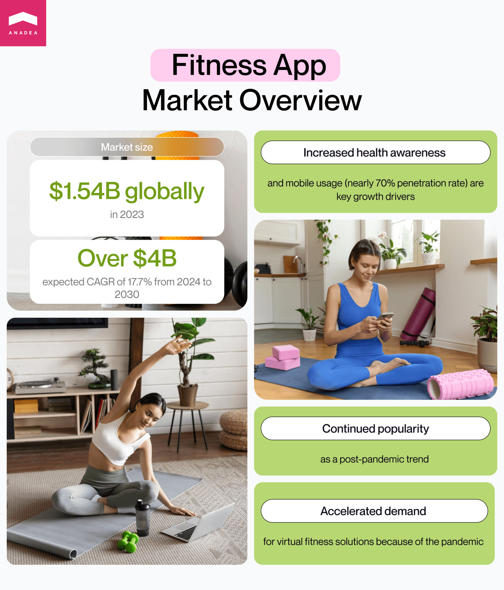
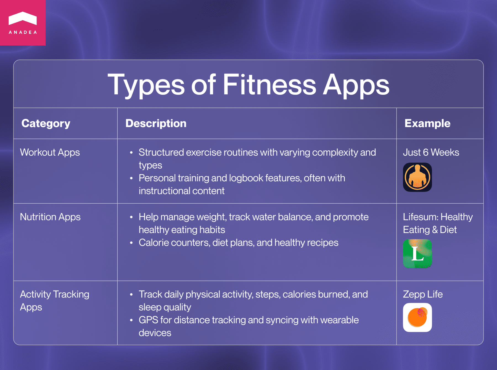
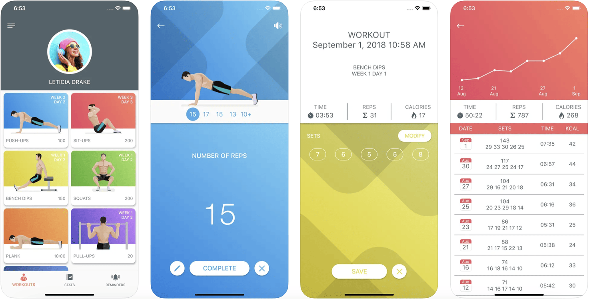
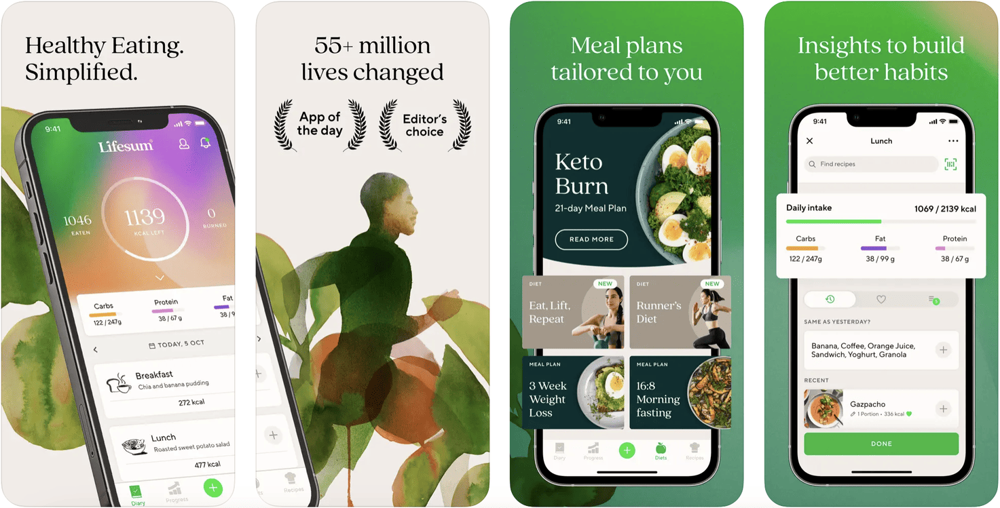
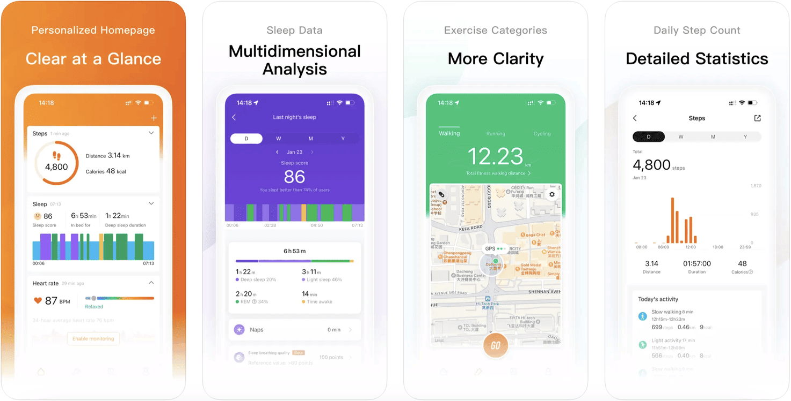
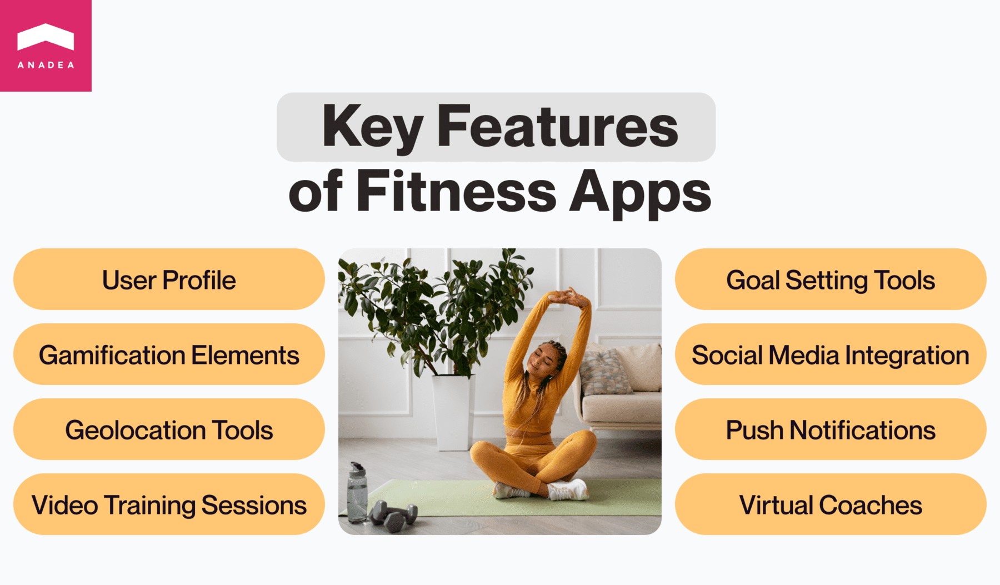
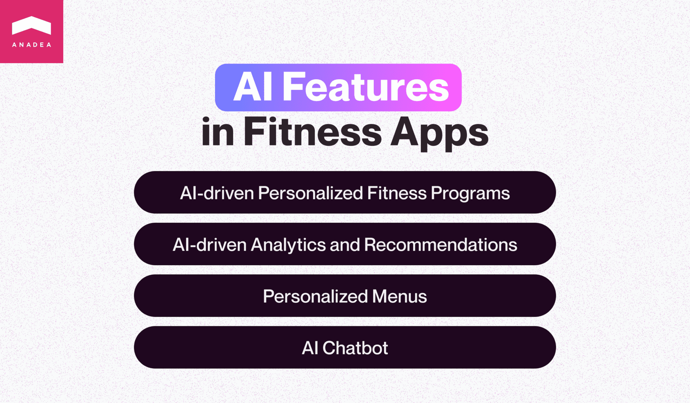
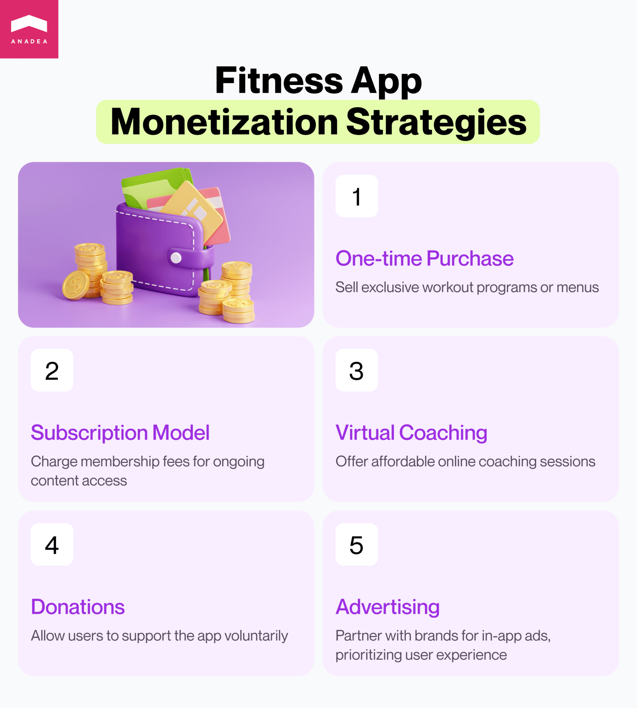

Today, we can observe that people pay much more attention to their health and well-being than even a decade ago. The reasons for that can be different for various regions and social groups, but one factor is obvious. Thanks to modern tech solutions, it has become easier for people to devote more time to themselves. To keep fit, it is not obligatory to attend a gym; it is enough just to have a cool fitness app. But even if you are a fan of gyms or fitness clubs, a relevant app can make the process of training much more engaging, efficient, and pleasant.

Solutions for the fitness industry come in different types and kinds. And with their increasing popularity, we still can observe the growing demand for fresh ideas. That’s why if you have plans for such a project, this blog post is for you! In it, we are going to share our insights into how to create your own fitness app that users will love.

## Fitness app market overview

Before building a fitness app, it will be useful to study the market and understand what is happening in the industry at the moment. It will help you to detect the key trends and define what existing issues you can address with your new solution.

In 2023, the size of the <a href="https://www.grandviewresearch.com/industry-analysis/fitness-app-market" target="_blank">global fitness app market</a> reached $1.54 billion. Analysts project that the market will be expanding with a CAGR of around 17.7% within the period from 2024 to 2030. It means that by the end of this period, the market size will be over $4 billion.

The COVID-19 pandemic, the related lockdowns, and a wide range of measures aimed at ensuring social distancing are often named among other factors that boosted the demand for <a href="https://anadea.info/solutions/sports-app-development/fitness-app-development" target="_blank">fitness app development</a>. During those times, virtual fitness became a good alternative to traditional gyms. As a result, we could see the jump in subscriptions and downloads of different types of fitness solutions, including but not limited to activity tracking tools, exercise applications, and <a href="https://anadea.info/blog/diet-and-nutrition-app-development" target="_blank">nutrition apps</a>.

However, even today, when traditional gyms are open, fitness applications are continuously gaining popularity. It means that if you have plans to create your own fitness app, it may turn out to be a very good idea.

What are the factors that drive the mass adoption of such solutions? **Growing social awareness of fitness well-being** and **increasing mobile penetration rate** (now it is close to <a href="https://www.statista.com/statistics/203734/global-smartphone-penetration-per-capita-since-2005/" target="_blank">70%</a>) are among the most powerful ones.

Discuss your idea

## Types of fitness apps

When our customers turn to us with questions on how to make fitness app, first of all, we ask them to think about a general concept of their future products. And to do it, it is necessary to choose the exact type of software that they want to deliver. There can be different approaches to the categorization of these solutions, but we prefer the following one.

### Workout apps

This category is a rather broad one. However, what unites these solutions under one roof is that they all help to organize and enhance the workout process. For example, personal training apps allow users to choose sets of exercises that would be tailored to their needs. It is possible to opt for the desired complexity level and types of exercises. It is very important to add descriptions, images, or videos that can demonstrate how each exercise should be done. That’s why for those who want to know how to make a workout app, we can recommend establishing cooperation with a good team of coaches who will help to create high-quality workout-related content.

There are also logbook apps that usually have a rather short set of features and tools for creating to-do lists and storing info about training sessions.

**Just 6 Weeks** is a well-known workout app that provides users with the possibility to choose a program for getting into shape.

### Nutrition apps

Such software products are designed to support those people who want to control their weight and eat healthily. These apps can be useful for controlling water balance, developing good eating habits, as well as calculating calorie consumption. Some applications can offer special goal-setting features. For example, a person will set a goal to reduce the consumption of coffee per day, and an app will help to track it.

Moreover, applications from this category can offer healthy recipes, tools for creating shopping lists, and a lot of expert information on how to change your lifestyle.

As an example, you can have a look at **Lifesum Food Tracker & Fasting**, which is much more than a calorie counter. It allows users to seamlessly introduce healthy nutrition to their lives. It offers a food diary with a barcode scanner, diet plans, a water tracker, and other helpful features.

### Activity tracking apps

Such applications are often used by those who do not attend gyms (and are not even fond of sports). They are intended to help people have enough physical activity per day and move enough. These solutions can count the number of steps made per day and the number of calories consumed and burnt.

Thanks to the integrated GPS functionality, they can also estimate the distance that a person has covered during walking. Moreover, they are often enriched with tools for evaluating the quality of sleep. A lot of applications from this group can be connected to wearable devices like fitness bracelets and smartwatches.

**Zepp Life** is a good example of such software. It can be coupled with a wide range of products like the **Xiaomi Mi Band** series and **Mi Watch Lite** and can provide users with precise exercise tracking and detailed analysis.

Talk to app developers

## Key features of fitness apps

When you want to build your own fitness app, you need to decide on the exact set of features that you are going to offer to users. It doesn’t mean that all the features that we will mention below should be included in your app, as they may just not correspond to your idea. However, some of them are universal and should be added to your app regardless of its goals.

* **User profile**. You need to allow users to create their profiles where they will indicate personal data, track their results, and view the range of available programs.
* **Goal setting tools**. It’s very important for people to see the goals that they want to achieve. There can be goals related to their weight, endurance, or the development of healthy habits (like drinking a glass of water in the morning before breakfast).
* **Gamification elements**. To motivate users to train more or to choose healthier food, you can allow them to get awards for their achievements. Even simple digital badges and leadership boards will work! Moreover, to reach goals, you can let users unlock premium fitness programs or recipes.
* **Passwordless authentication.** Simplify access to fitness tracking and programs with passwordless auth. This feature uses email, SMS, or biometrics, ensuring secure and effortless entry, allowing instant access to workout routines and health goals while enhancing user satisfaction.
* **Social media integration**. It would be cool if users could share their results and achievements with their friends and followers directly via your app.
* **Geolocation tools.** Thanks to this feature, users will be able to create and track their routes for walking or jogging, as well as estimate covered distances.
* **Push notifications.** Via notifications, you can remind users of the necessity to move more or drink water. It’s important to make this feature highly customizable so that people can choose the most comfortable regimes for them.
* **Video training sessions**. You can add training sessions in the format of recorded videos and it can be a core functionality of your solutions.
* **Virtual coaches**. Based on the concept of your software product, you can also allow users to get connected with coaches online via your app. Though this format of interaction with a coach can’t offer a full range of possibilities that are typical for face-to-face meetings in the gym, it is usually significantly cheaper.



## Ideas for advanced AI-driven fitness apps

It’s always very interesting to observe how our standards and expectations change under the influence of the latest technologies that are being gradually introduced. Now, with the progress made in the sphere of Artificial intelligence and Machine Learning, we expect that various apps will provide us with highly personalized experiences. But how can this trend for personalization and other new opportunities ensured by AI impact the fitness app segment?

Here are a couple of ideas for AI-powered functionality that you can develop for your solution.

1. **AI-driven personalized fitness program**. Your app can analyze the personal data of users, their health state, goals, interests, and preferences to offer them unique training programs. Such programs will be not only efficient but also highly engaging. You can use this idea when you want to build a workout app.
2. **Personalized menus.** In this case, AI can study the information about users to provide them with recipes following their personal requirements.
3. **AI-driven analytics and recommendations.** An app can analyze the results demonstrated by users and generate insights into their performance, progress, and areas for improvement.
4. **AI chatbot.** You can enrich your fitness app with a cool chatbot that will act as a friend, companion, or consultant for users. It can motivate users, support them, and share valuable tips.

Contact AI experts

## Build your own fitness app with a creator or rely on custom development?

One of the key decisions that you will need to make regarding building a fitness app is whether it will be created fully from scratch or you will use a special constructor for it. Let us state from the very beginning: both options have their pluses and minuses. And that’s only up to you to decide which option you will prefer based on your resources, possibilities, and expectations.

**Pros of using an app creator:**

* You can save you time and money that are typically required for developing a software solution.
* An app built with a creator can be used to test your idea.

**Cons of using an app creator:**

* Customization options are limited, and you need to use standard templates.
* You may face challenges with the integration of third-party services.
* Some app creators add their own ads to the applications built with their help.
* It may be impossible to enrich your app with your own features.

Is using an app creator a viable option? Definitely, yes, but not always. You can rely on such a tool when you need to quickly build a solution for some specific purposes, like your marketing campaign, for example.

When you are looking for ways how to make a fitness app that should be profitable, it’s better to choose custom development.

**Pros of custom fitness app development:**

* It is possible to build apps of any complexity and with any functionality.
* By working with a professional team, you can enjoy a full range of related services (from business analysis to post-launch support and maintenance).
* You can get valuable recommendations from experts who will work on the development of your app.
* You will get a really unique product that will fully correspond to your requirements.
* You can ensure the desired security and regulatory compliance level.

**Cons of custom fitness app development:**

* Development, in this case, will require more significant investments.
* It will take longer to build an app from scratch than to create it with a constructor.

But of course, to enjoy the advantages of this approach, you need to work with professional developers. At Anadea, we are proud to have real experts in fitness and <a href="https://anadea.info/solutions/sports-app-development" target="_blank">sports app development</a> on our team. That’s why if you choose us as your partner, you can be fully confident in the highest quality of the final result.

## How to create your own fitness app: Step-by-step plan

The better the development process is organized, the better outcomes you can expect to get. That’s why we’ve prepared a universal plan that you can apply when you decide to build your own fitness app.

* **Ideation.** First of all, you should clearly define what app you want to deliver, how its target audience will use it, and what goals you have.
* **Search for developers.** Though some companies have their own in-house developers, the majority of projects need to cooperate with external specialists. And working with a professional development firm is the most convenient way to hire experts who will build your fitness app.
* **Requirement gathering.** The development team needs to get as much info about your idea as possible. If you already have any supportive documents, you will need to share them with developers.
* **Planning.** Then the team will analyze your project, set realistic timelines, and explain to you how they will work on your solution.
* **Development and design.** This stage is typically the most time- and effort-consuming. Designers and developers will do their best to transform your ideas into a real product. In the majority of cases, it will be sensible to start with the creation of an MVP and test your idea this way before investing in the development of a full-scale solution.
* **Testing and release.** It is crucial to release your app only when all bugs are fixed, and you are sure that your solution works as it is supposed to. Moreover, in the case of mobile apps, you always need to bear in mind all the requirements that app marketplaces have. If your app doesn’t meet them, you won't have the possibility to make it available to users.
* **Post-launch support and maintenance.** These activities should cover not only your continuous monitoring of the app performance, detection of vulnerabilities, and bug fixing. It is also required to think about the necessity to enhance your fitness app and introduce updates based on the feedback received from users.

## How much does it cost to create your own fitness app?

When you want to build fitness app from scratch, it is always very difficult to predict the size of the required investment without studying the specificity of your project.

Based on our experience in building solutions for the fitness industry, we can say that the cost of MVP development will be, on average, $15,000. However, the cost of a full-scale solution with all the desired features will be higher and calculated individually for each project.

**What parameters will have the strongest impact on development costs?**

* The number of the desired features (and their complexity);
* The tech stack;
* The number and complexity of integrations;
* The size and composition of the team;
* Specific requirements and deadlines.

Request a free quote

## How profitable are fitness apps?

If you are going to make your own fitness app and invest in its development, it is quite obvious that it will be interesting for you to find out whether you will be able to enjoy good profits. The profitability of your app (as well as of any other project) will depend on a row of factors, including but not limited to:

* your monetization strategy;
* the size of your user base;
* user engagement.

But in general, we can say that such apps are rather profitable and can bring their owners from thousands to millions of dollars per year.

According to the data provided by [Statista](https://www.statista.com/outlook/hmo/digital-health/digital-fitness-well-being/health-wellness-coaching/fitness-apps/worldwide), in 2024, the revenue in the fitness app market will be around $6.86 billion. The ARPU (average revenue per user) is projected to be at the level of $17.84.

## Best ways to monetize a fitness app

Your profits will greatly depend on the chosen monetization approach. Modern business models and technologies open a wide range of possibilities for your project. We’ve gathered a couple of ideas for you that look the most promising in today’s market.

* **One-time purchase of a workout program or menu**. You can offer exclusive content on a paid basis.
* **Subscription**. A subscription-based model is very popular among fitness apps. It presupposes taking membership fees for having continued access to the offered content.
* **Virtual coaching.** It can be a very expensive initiative to work with a private coach in a gym. However, virtual consultations and classes are usually a more affordable option, which can explain the popularity of such services.
* **Donations**. Though this approach can’t guarantee a stable income, it can become a very convenient way for satisfied users to support your project.
* **Advertising**. It is a very common monetization strategy that is popular among apps of different types. You can work with different brands and place their ads on your app, but please try to make these ads manageable. User experience should be the highest priority for you.

## Our tips on how to make fitness app

To cut a long story short, let us share key practical recommendations based on our experience in fitness app development.

1. **Always attentively study the market** before making a final decision regarding your idea. Market research will help you to see what solutions are already available and what tasks still can’t be solved with the existing products. As a result, you will have a lot of useful data for inspiration and will be able to deliver a unique product that perfectly covers the ongoing needs.
2. **Cooperate with fitness experts** (coaches, nutritionists, movement therapists, etc.) to deliver high-quality content. Of course, the tech aspect of your solution is highly important, but it is also necessary to make sure that the offered programs and menus will help people and won't cause any harm or physical injuries.
3. **Hire developers who have expertise in the chosen business domain.** In this case, you will be able to fully rely on their skills and be sure that your app will meet all the modern industry standards and market demands.

At Anadea, we deeply understand the specificity of the fitness app segment. And we would always be happy to use our knowledge to build an advanced product based on your requirements. If you are considering the possibility of building a fitness app, send us a request for proposal. Do not hesitate to contact us!

Get in touch
