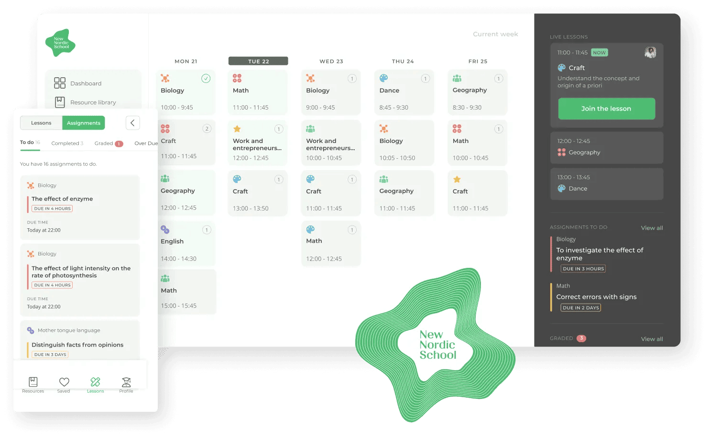

Even judging by our incoming contact requests, we can say that the demand for LMS development has grown a lot lately. To support this impression, we turned to statistics that stated that the LMS market value is expected to grow to $38 billion by 2027 (in 2019, it was valued at $8.76 billion). For us, that was the starting point to proceed investigating this topic and preparing this overview of the main steps of <a href="https://anadea.info/solutions/e-learning-software-development/lms" target="_blank">custom LMS development</a>.

## What is an LMS?

An LMS or Learning Management System is complex software aimed at automating routine tasks at educational institutions, from staff management, scheduling and bookkeeping to improving the learning process with quizzes, gamification, and so much more. We list the whole scope of LMS functions further.

But you already know what it is if you’re here looking to create your own LMS. Now, figure out what type of elearning management system will meet your needs best.

## Types of learning management systems

The difference between these types of LMS lies in pricing models and where the systems are stored. In terms of the purpose, they’re equal and solve the same problems of clients.

### Open source LMS

These are customizable LMS like **Moodle, Open edX** and **Canvas LMS**. Most of them are free or low cost (advanced features may be paid). Only these facts make open-source LMS very appealing for many institutions, and indeed, they cover the basic needs of most of them well. However, customizing and maintaining one would require a person skillful in programming who will be responsible for supporting and adjusting the system to the emerging needs of the institution.

### Commercial LMS

Clients pay for the right to use this kind of LMS, and changes to the system can only be made on the vendor’s side, i.e. commercial LMS give the client minor space for maneuver. Despite that, out-of-the-box LMS like **Edmodo** and **E-ducative** are in demand because of timely and continuous support which open-source LMS are lacking.

### On-premise LMS

On-premise (self-hosted) software is installed on the client’s servers. This way, clients have full control over corporate and user data which allows for the utmost security. Clients pay once to use the software and they pay every time a new update is out (the latter is optional).

### LMS as a Service

LMS as a Service is hosted in the cloud, i.e. this kind software is not downloaded to the device, as any SaaS. They are deployed and updated fast, so improvements and fixes, if any, are immediately delivered to the end user. Clients pay a monthly subscription fee which is either fixed for the entire institution or every individual user is paid for. The successful examples of LMS as a Service are **Looop, iSpring Learn** and **EdApp**.



## Building an LMS step-by-step

Regardless of the type of LMS you’re about to develop, here are some common places a founder encounters on their way.

### 1. Idea validation

The idea to build an LMS can hardly be called original, but we’re not here to be unique but to solve the needs of your business. The first question to ask yourself is: will it eventually pay off? You can judge this after you find out who your user is, validate their needs and make sure the solution will meet them. Also, plan how much you can afford to invest in custom learning management system development and everything it entails.

### 2. Building a strategy

The four major components of any implementation plan, or a strategic plan, are:

* planning the work,
* planning major and minor tasks (subtasks),
* planning the timing,
* planning what people will be involved in the process.

Having all these at a palm of your hand will increase the odds to move from defining goals to allocating resources wisely, passing checkpoints all the way through building a learning management system.

### 3. Finding skilled developers

Speaking about developers, the actual executors of your vision, it’s important to clarify what they should be skilled at. Some people select developers with an eye for the technology they master. In our opinion, the key criteria for choosing a team are <a href="https://anadea.info/projects" target="_blank">software development portfolio</a>, client testimonials, and conditions of cooperation. It’s also their job to select the most efficient technologies for your idea realization. Be it an LMS or any other software, the overall code quality is much more important than the language software is written in.

### 4. MVP development

An experienced web development team will be able to deliver a minimum viable product (basic version without bells and whistles) in 3–4 months. In this scenario, the main emphasis is on the platform simplicity and ability to deliver its primary functionality. At the beginning, you’ll hardly need more, as it’s way easier to modify an MVP than a solution that has initially been a complex system.

### 5. Launch and observation

As soon as you launch, perhaps the LMS won’t be exposed to a large audience. It makes sense to market your product when you know for sure it won’t be a disappointment to users. To make sure it won’t, do a trial run to collect the feedback from a small group of people. You can find these people on forums and freelance platforms.

### 6. Improvement and further improvement

Although an MVP for an LMS can be built within 12–16 weeks, in fact, bringing the software to what you actually imagine it to be will take longer. And even when the project is launched and in use, there’s still the need to solve emerging problems, add new features and adjust the platform to the demands of users. Having your custom software developed is a continuous process, it evolves along with your business.

The regular post-launch activities in software development are:

* marketing and advertising,
* collecting testimonials and reviews,
* measuring outcomes,
* finding ways to improve the product,
* updates and broadening the solution.

Yes, there’s still a lot of work to be done after the platform release, but there’s no denying that the hardest and the most expensive part of work will be over by this time.

## Basic functionalities of a learning management system

Despite the title of this item, only you decide what features of the learning management system are high-priority and what corners you could cut. If you’re not sure about prioritization, ask a Business Analyst for assistance.

### Course builder

The feature of most value for tutors which aids them to create plans for lessons and entire study courses by adding topics, tests and quizzes to challenge learners.

### Content management

The content management functionality enables media files upload to illustrate the study materials, be it video, audio, text or image content. The content uploaded to the system can be used at the lessons as well as for employee training, there are truly no limits to its applications.

### Skills assessment and testing

No school can do without recurrent knowledge checks to measure the results of learning. Skills assessments are held through tests (choice questions and free test tasks), and grades are given automatically or following a teacher's check.

### Progress tracking

Results of any assessment should be trackable and available to teachers and students, that’s why LMS are equipped with progress monitoring. Enable report generation by given periods and exporting them to a device and/or displaying them on the screen. The results may be based on the number of assignments completed, grades, time to complete tasks, etc. Allow for viewing statistics of the whole class/group performance and that of every learner.

### Calendar

A calendar with announcements, schedules, tasks and deadlines for individuals and groups of students is an agenda that’s always in front of their eyes. Planning and prioritizing is one of the important things not taught at schools but every student has to learn, and the calendar is a working tool for it.

Source: <a href="https://anadea.info/projects/nordic-learning-platform" target="_blank">Nordic Learning Platform</a> case study

### Integrations

To speed up custom LMS development, some functionality, instead of being written from scratch, can be replaced with third-party integrations. These functionalities can be messengers, social networks, payment gateways, calendars, email delivery services, or perhaps video conference tools. Side services integration saves time because what’s needed is already developed by someone else. However, if APIs are paid, this adds wages to the LMS development cost.

### Mobile responsiveness

Given that <a href="https://research.com/education/lms-statistics" target="_blank" rel="nofollow">70% of learners</a> are more motivated when they use mobile devices and that many people prefer smartphones over computers for learning, making your LMS fast and responsive on mobile can be a solution to improve retention and engagement. Users will have access to the platform wherever they are if it has an intuitive interface in mobile browser or a native app synced with the same backend.

### Social elements

Social elements allow students to have conversations with each other in publicly available discussion forums or private messages, start Q&A sessions with teachers/professors or participate in group chats.

### Classroom management

This broad group of features gives teachers ability to manage learners’ attendance, set dates of lessons and edit courses. Overall, it’s all about automating the way lessons are held.

### Knowledge base

A knowledge library can be used by teachers to upload useful materials (books, articles, custom wiki pages) for homework preparation, upcoming lessons (to avoid hand-outs), or simply add supplementary information for students who’d like to deepen their knowledge in the subject. Knowledge base is closely linked to the content management system and in essence is kind of an archive where all materials (PDFs, audios, videos, texts) are stored to be re-used in the future.

### Notifications

On our software development blog, we have a whole article dedicated to <a href="https://anadea.info/blog/edtech-insights-improving-students-performance-with-push-notifications" target="_blank">push notifications in eLearning</a>. Check it out to learn about their uses and the technical aspect of implementing pushes in the LMS. As a bulletin board, deadline announcer, campus news source or test results announcer, pushes do a great job in keeping all users informed about everything.

### Security

When someone’s personal data takes place, their privacy and involability are one of the first things that raise concerns. It applies to the LMS too, as learning management systems are used for storing student and employee information (personal records).

### Payment processing

If your LMS has eCommerce elements, such as selling courses and e-books, or if you’re about to build a SaaS LMS that suggests clients pay for subscription, take care about payment processing (LMS integration with payment gateways). Consider using banking APIs, as many banks share access to their APIs publicly, and such payment gateways popular in LMS development like **PayPal, Stripe** and **WePay**.

## Choosing a custom LMS development company

The recognized practices for choosing a web development team are customer reviews on platforms like Clutch, assessment of the company portfolio, and getting an impression based on making contact with a potential partner. Let’s take a closer look at them.

### Portfolio of delivered projects

Any company interested in attracting new customers has a portfolio of completed projects in which they describe their path to delivering solutions that solve the clients’ tasks. It’s logical that a company with a decent experience in <a href="https://anadea.info/solutions/e-learning-software-development" target="_blank">education software development</a> is more likely to gain your trust than a company not having it. To learn more, pass to our post on <a href="https://anadea.info/blog/software-development-company-portfolio" target="_blank">how to estimate a software development portfolio</a>.

### Pricing conditions

Don’t look at the estimation you get at the start as the final numbers, since there are always changes during the development: for instance, the client wants to replace one feature with another, alter design, etc. Although teams using Agile methodologies are prepared for such fluctuations, the latter always affect price in some way. But what always has to be rock solid are the conditions of your cooperation with the team consolidated in an agreement. If their rates change, a new agreement has to be prepared, and the same applies to any other novelty.

### Communication

This is what can justly describe the team’s professionalism. How do they respond to letters? How interested are they in your idea? How many and what kind of questions do they ask and what’s the average time to respond? Good contractors are those who value their clients, and this becomes clear from the communication that’s established between you and them.

### Clients: where are they now?

It’s like when searching for your classmates on Facebook, there’s a question: how are they doing today after all these years? Maybe it’s not that much different with software companies’ clients. Google some of their projects' names and find working websites and media exposure. A business that operates steadily is the biggest compliment to programmers and the rest of the team.

## Insights into learning management system cost

The most accurate estimation is the one given to your needs and budget, but knowing the points below won’t hurt.

### Approximate cost of custom LMS development

An MVP for a web-based learning management system, generally, starts **from $72 000** given Anadea’s $50 hourly rate. As for the team, it will consist of a full-time Back-end and Front-end developer and part-time Business Analyst, UX/UI designer, and QA engineer.

### How much is a learning management system?

In our work, we calculate the cost of development by multiplying the hourly rate by the actual working hours. Consequently, the longer the development, the bigger the cost. So what can be done in order to cut the costs are:

* **Involving a Business Analyst** who will help you prioritize features from your wishlist and see the best way to spend your money. A BA also has their hourly rates but can save you more in the long run as they know how to avoid many mistakes in starting a software business.
* **Making sure developers go well together.** As strange as it may sound, communication between executors can affect the process in both good and bad ways. To assure it’s always good at Anadea, the availability of an individual developer is not a decisive factor to assign them to the project. Here, we have fixed teams of developers who always work together so that there are no conflicts and related complications on the project.

Still, don’t aim at cutting costs by all means. You simply can’t avoid such categories of spending as hosting where your web app will be placed, quality assurance which is essential for all software projects, especially big ones, and so on. 'Cheap' is not the word for software development. But it surely can be cost-efficient if approached with diligence.

Request an LMS development quote

