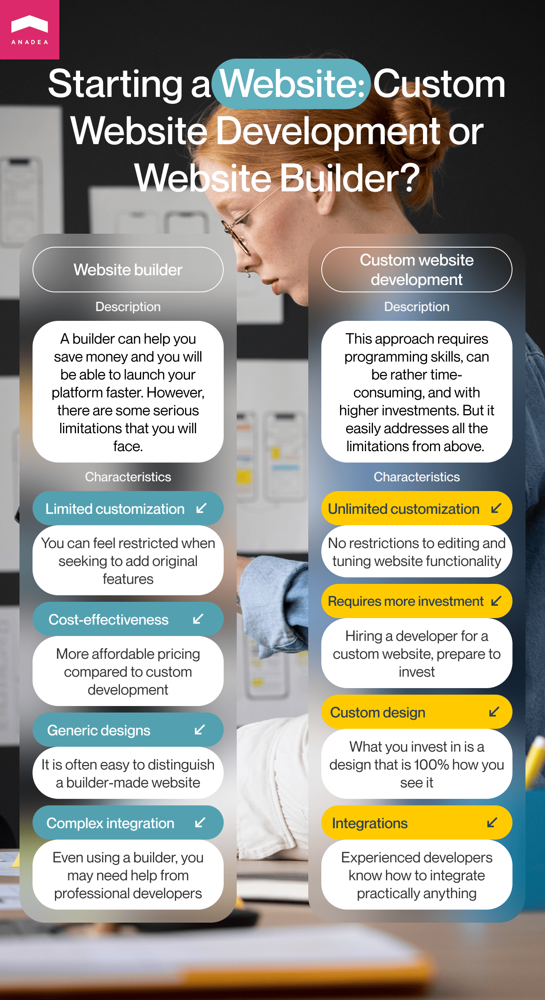

Do you remember the last time when you called a hotel to book a room? Yes, we know, it's a very complicated question. Probably you have never done it all. Today the processes in the hospitality industry don't look as they used to several decades ago. A major part of the interaction between a hotel and guests takes place on an online hotel booking system. And without any doubt, it is a win-win game. While clients can greatly save time and book a room with just a couple of clicks at any time of the day, hotels can automate this process and minimize risks caused by human factors.

In this blog post, we are going to speak about the use of software solutions for booking in the hospitality industry and explain how to create a hotel booking website that will meet the ongoing market demands and expectations.

## Why is it a good idea to build a hotel booking platform?

Online booking has become a standard. In general, the online travel market is thriving worldwide. Its volume <a href="https://www.statista.com/topics/2704/online-travel-market/#" target="_blank">reached</a> $475 billion in 2022 and according to the expectations voiced by experts, this figure can rise up to more than $1 trillion by 2030.

The share of online sales in the total revenue of the global travel and tourism market is projected to be around 69% in 2023.

According to travel <a href="https://www.travelperk.com/blog/online-travel-booking-statistics/" target="_blank">statistics</a> accumulated from different sources, over 80% of adult Americans make travel bookings online. People like the convenience provided to them by online solutions and, moreover, thanks to various loyalty campaigns run on the websites it is possible to get great discounts and other bonuses.

If we have a look at a well-known online hotel booking system **Booking.com**, we will see that the <a href="https://www.statista.com/statistics/225455/booking-holdings-total-revenue/" target="_blank">revenues</a> of the company that stands behind it are continuously growing with the exception of two years. 2020 and 2021 were definitely the most challenging years for the travel and tourism industry due to the restrictions implemented amid the coronavirus pandemic. Nevertheless, already in 2022, the company managed not only to return to the pre-pandemic levels but also to demonstrate a good increase in its revenue.

These results of Booking may be taken as evidence of the growing interest from the side of users in such solutions. Is it a good time now to think about launching a website for hotel booking? Sure, it is! Despite the growing competition in the industry, good ideas still have excellent chances to win their positions in the market. That's why we offer to analyze the basic goals, features, and capabilities of online hotel booking websites which will help you to elaborate your own approach to building such a platform. And if you want to provide your clients with any other solution for the tourism industry, we recommend you to read our previously published blog posts and find out <a href="https://anadea.info/blog/app-for-travel-and-tourism" target="_blank">how to build a travel app</a>.

## Hotel booking platform: Basic info

An online hotel booking system provides users with access to different hotel options on a single platform. These websites usually contain detailed descriptions of each offer with photos and reviews written by the guests who have already stayed at those places. For selecting the best variants, users can apply various filters such as prices, location, facilities, special offers, and other parameters. The majority of such platforms can also process financial transactions which allows users to pay for their hotel rooms online in advance and then just enjoy their stay upon arrival.

While some websites of this kind offer only hotel variants, some others also have other accommodation options for trips and holidays, like apartments, summer houses, and cottages. If you want to concentrate exclusively on the objects for rent from the second category, you may be interested in reading our article about how to <a href="https://anadea.info/blog/develop-an-app-like-airbnb" target="_blank">create an app like Airbnb</a>.

## User-friendliness in making a booking website

When you are planning to build a hotel website, you should make user experience one of the top priorities for you. Though we all know that we shouldn't judge books by their cover, we always do that. A similar principle works when a person wants to find a hotel where he or she will stay for some nights. The interaction with a website for hotel booking, its design, navigation, functionality, and offered services have a huge influence on the first impression and, consequently, on the further stay at the chosen hotel.

The quality, performance, and UI/UX design of your website will play a crucial role in building the reputation not only for your brand but also for all the hotels that will post their offers on your platform.

You should also bear in mind one simple rule: the better user experience you will ensure, the higher profits you will be able to get. If a user opens a web page and finds a good hotel but can't find any buttons for booking a room, it is obvious that this person will leave this website and look for another platform where everything will be intuitively clear. That's why it is highly recommended to track the bounce rate. If it is too high, it is necessary to analyze what can be wrong on your platform.

## The first step in online hotel booking system development

When our clients come to us with different questions on how to make booking website, we always recommend starting with deep market research. It should include an analysis of the solutions that are already available in the market and a study of the needs of the chosen target audience.

Such market research will help you to understand what products already exist, how different features solve various tasks, and what ways of interaction with such platforms are offered You can just visit such websites as a user and try to look for some hotels that can be potentially interesting to you. While doing that, you need to answer such simple questions as:

- Is it easy to use a search system?
- What filters can be used?
- Is it clear how to book a room?
- Can you read reviews?
- Are there a lot of photos available?
- Is it convenient to move from one page to another?
- What payment options are offered?

In other words, you need to understand whether you will be ready to use such a website as a user and what can be done better.

But that's only one part of the work that should be conducted at this stage. You also need to define a user persona. It means that you should find out who will be your "perfect visitor", whose needs you try to address, and who will be satisfied with your offer. As a website for hotel booking typically has a rather wide target audience, you may have several user personas. These semi-fictional characters will reflect the demands and expectations of real users.

To identify these personalities, you should conduct research and define the key information about people who will be included in your target audience. You should understand their age, gender, jobs, incomes, family status, interest, preferred social media channels, and place of living (here, it will be also necessary to define whether you are going to work with local or global markets).

By knowing what users want to get and what they like, you can build a significantly better UI/UX design that will have a positive influence on visitor satisfaction.

## How to make a booking website that will address users' needs?

The set of features that your website will have depends on the exact set of tasks that you want it to solve. Given the specificity and common goals of online booking systems, we can detect must-haves and additional features.

### Must-have features of a hotel booking platform

**Booking system**. That's a core feature of the entire website. Users should be provided with the possibility to opt for the preferred hotel, dates, room, additional services if any, and payment options. Once everything is correctly chosen and booked, a user should get a confirmation on the personal account or/and on the email. This data should also become available to the hotel team which will have to make all the arrangements by the check-in time.

**Room descriptions with photos**. One of the key benefits of online booking websites is that users can quickly get access to all the required information about hotels, their offers, rooms, prices, and amenities. Thanks to the added photos, it is very convenient to discard the variants that do not look attractive to you.

**Location**. All online booking websites have a location filter in their search systems which allows you to get a list of only those options that can be interesting to you for the upcoming trip. It is also a good idea to make it possible to look for hotel variants directly on the map.

**Contact details**. Users should be able to get in touch with hotels not only after a successful booking but also at the stage of the search. There are two options: you can either just publish contact details like email addresses and telephone numbers of each object or you can create a chat to let users contact hotels directly on your website. The majority of modern websites offer both options.

**Reviews**. For many users, reviews have the strongest influence on their decision. But to avoid different tricks with fake reviews from unfair market players, we recommend you provide the possibility to write comments only to those users who have booked a hotel room and stayed there. It will be also great if users can attach their own photos of rooms to demonstrate their current condition.

**Special offers.** Loyalty and bonus programs are an important part of such websites. They can motivate users to return to your platform every time when they need to book a room. Moreover, hotels should be permitted to announce their own discounts via your website, if they want to use them as a tool for promotion.

**Payment gateways**. Online payments have already become a standard for online booking websites. The integration of payment services is necessary to ensure the required level of convenience for hotel guests who can solve all financial questions online. That's why when you build a hotel website, you should think about adding various payment methods for offering some freedom of choice for users. We recommend you consider not only traditional bank transfers but also payment systems like PayPal and innovative options like crypto. Though cryptocurrencies are not still properly regulated in many countries, some jurisdictions already allow businesses to accept crypto payments.

### Advanced features

**Virtual tours**. Photos may be not enough for users to make a decision, especially if they are going to stay at one hotel for their long holiday. Virtual tours can save the situation and provide users with unique experiences. Such tours are usually composed of traditional images, videos, and 360-degree images.

**Multilingual support.** If you are making a booking website for an international audience, it is recommended to launch versions for different languages. It's a common practice in the modern world when a solution is launched in one language and other languages are added later.

**Currency converter**. For making it more comfortable for users to choose hotel options within their budget, you can add the possibility to change the currency for displaying prices. In this case, your website should be integrated with regularly updated databases that will contain the relevant exchange rates.

**Blog section**. Though this section is not mandatory, it can bring new users to your website and help to diversify experiences for those people who regularly visit your platform. In your blog, you can publish articles about different countries, journeys, and news from the travel industry.

**Recommendation engine**. <a href="https://anadea.info/services/machine-learning-software-development" target="_blank">AI- and ML-powered features</a> are actively gaining popularity and you can also enrich your website with such tools. They can understand users' needs based on their history of search and behavior on your website and provide highly personalized recommendations.

## Can you create booking website with a website builder?

If you have ever tried to find out how to create a hotel booking website, you've probably seen recommendations to use a website builder. It is a special tool that can allow you to create a website even if you do not have any programming skills which means that you won't need to edit the code manually.

On the one hand, this approach to website creation definitely looks quite attractive. It helps you to save money as your costs will be significantly reduced in comparison to traditional development. And you will be able to launch your platform faster.

But on the other hand, there are some serious limitations that you will face if you choose this option:

- **Generic designs.** It is obvious that you want your solution to look unique and catchy. Namely, UI/UX design can help users to remember your website and recognize it later. But a website builder won't let you implement all your ideas.

- **Limited customization options.** Some website builders offer a row of standard templates and you will need to use only them without a possibility to add a new section or to change the layout. All this greatly restricts you in your plans to deliver unique experiences to users.

- **Scalability issues**. When you create your website with a builder, you should be prepared for potential problems with its scalability in the future as very often such tools do not ensure the desired flexibility. And with time flow you may find your website unable to cope with the increased data volumes and load.

- **Reliance on third-party solutions**. In those cases when you build a fully custom website, you rely only on yourself and the skills of your developers. If in the future you will need to add some features or update something, you will be able to do it. When you rely on third-party tools, in the future you can get into a situation when these tools won't be available anymore if a vendor decides to stop supporting them or if this company goes bankrupt, for example.

- **Integration issues**. For your booking system, you may need to conduct multiple integrations (map APIs, payment services, etc.). A website builder may allow not all of them and you will face a new portion of limitations.

## Advantages of custom website development

The second option that you need to consider when you are planning to launch a website for hotel booking is <a href="https://anadea.info/services/web-development" target="_blank">custom website development</a>. It is the exact opposite of the first approach. Yes, custom development requires programming skills, it can be a rather time-consuming process, and the investments can be higher than in the first case. But it offers a wide range of benefits and can address all the limitations that we've discussed above. Among its benefits, we should mention:

- **Unique branding**. You do not need to choose the designs from ready-made collections.
- **Flexibility and scalability**. You can ask your development team to make it possible to expand your website and its capabilities in the future.
- **Integrations**. Of course, it won't be right to say that you can add any external service you wish but at least you have a lot of freedom in integrating the required tools.
- **Control over functionality**. You can build any features that will be required, without any restrictions caused by the lack of customization.



## How to choose the right development partner for launching a hotel booking platform?

If you opt for custom website development but do not have enough in-house resources for the realization of your project, you will need to establish cooperation with a reliable company that provides such services. The competition in the industry is very high as well as the number of companies with similar offers. That's why we've decided to share with you the key factors to take into account while choosing a development partner:

- **Business expertise.** It is important to make sure that the company has already worked with the clients from your business domain.
- **Tech stack**. Your developers should have experience in working with tools and technologies that will be required for your website.
- **Reviews**. Always read the comments and reviews left by the clients of your potential partner. For example, Clutch is a reliable platform that contains helpful rankings and other valuable information.
- **Portfolio**. We recommend you always get familiarized with the projects built by the team, especially if this team has already created any similar solutions for other clients. At Anadea, we have a row of successfully launched projects for the travel industry. You can find more details about them in our <a href="https://anadea.info/projects#travel" target="_blank">software company portfolio</a>.

Request a free quote

## How to design a hotel booking website: best practices

Thanks to our rich experience in building solutions of this kind and our continuous monitoring of market trends, we've outlined the key principles to follow if you want to build a cool website.

- **Responsive and mobile-friendly website**. Your platform should be compatible with screens of different shapes and sizes. And as the role of mobile devices in people's lives is growing, it is necessary to ensure comfortable interaction with your website on smartphones and tablets.
- **Simple navigation and clear buttons**. People are accustomed to solving various tasks quickly. If they spend too much time looking for the desired section or feature on your website, they are likely to start using another platform.
- **High-quality images and easy-to-read typography**. Visual components play a crucial role in our perception of information. They should help to understand the content and the navigation on your website.

## How to use an online booking engine?

Though your website can be developed fully from scratch, there are some solutions that can help you to streamline the process without introducing any restrictions for you. To build a hotel website, you can use an online booking engine that will function as a bridge between users and hotels. This program will allow user interfaces to accept requests and at the same time, it will be connected to the systems used by hotels to control the availability of their offers. In other words, thanks to such online engines, hotels can exclude employee participation from booking processes.

Thanks to the availability of ready booking engines like **Bookassist, SiteMinder,** or **InnRoad,** there is no need to reinvent the wheel. By choosing this option instead of building such an engine on your own, you can:

- reduce the time to market;
- decrease development costs;
- achieve excellent performance of the core functionality of your website.

## Key tips for creating an online hotel booking system

The process of making a booking website doesn't seriously differ from the creation of any other software. There should be stages of planning, design, development, and deployment, but we've defined some specific key points that you should consider if you want to build such a platform.

- **Choose the right SEO and content strategy**. To ensure your website visibility and attract users, you need to make it SEO- and mobile-friendly. Think about the content and do not forget to update it, smartly arrange headings and subheadings on pages. Optimize page load speed and pay attention to the page titles, meta descriptions, and URLs. In general, when you are launching a website for hotel booking, we recommend you hire a good SEO specialist with relevant experience.

- **Integrate other systems**. For smooth performance and rich functionality, it is necessary to conduct the integration of your solution with other relevant systems and services like payment gateways, a CRM system, social media platforms, and others. Such integrations are usually conducted via easy-to-use APIs, however, sometimes such processes are complicated by external factors. Thanks to integrating external services, you will ensure seamless data flow, expand the range of available features, and provide a better user experience.

- **Do not underestimate the importance of testing.** You need to test all the features of your website properly and fix all the bugs before. It is vital to check the correctness of the booking engine work in order to avoid any unpleasant situations when one room is booked twice or when a hotel is not notified that guests are going to arrive.

- **Think about marketing and promotion**. Today your opportunities in digital marketing are practically endless. To choose the best approaches to promoting your website, you need to analyze your target audience. What do these people like? What social media do they use? What bloggers do they follow? Based on the results of your research, you will be able to choose the right tools. Among the most popular tools, we can name email marketing, influencer marketing, promotion on social media, content marketing, and online reviews on external platforms,

- **Monitor the performance and regularly update your website.** We advise you to use advanced tools for tracking web traffic and getting valuable information about visitors and their behavior on the pages of our platform. This information will help you to understand the weak sides of your website and to adjust your pages to the needs of users. High-quality analytics data can be also helpful in making wider business decisions.

## Instead of a final word

While online booking is gaining popularity, solutions of this kind are highly demanded. That's why top-notch booking websites that ensure access to a wide range of hotels and provide convenient interaction with their interfaces have an excellent chance to attract the attention of potential users.

If you have ideas for launching your own website with hotel booking functionality, we advise you to deeply study the peculiarities of such platforms, their mist-have features, and the ways to enhance your solution with unique functionality.

At Anadea, we are always ready to help you. Given our expertise in building software products for the travel and tourism industry, we are sure that we will offer the best solution. Do not hesitate to contact us and schedule a consultation!

Get in touch
