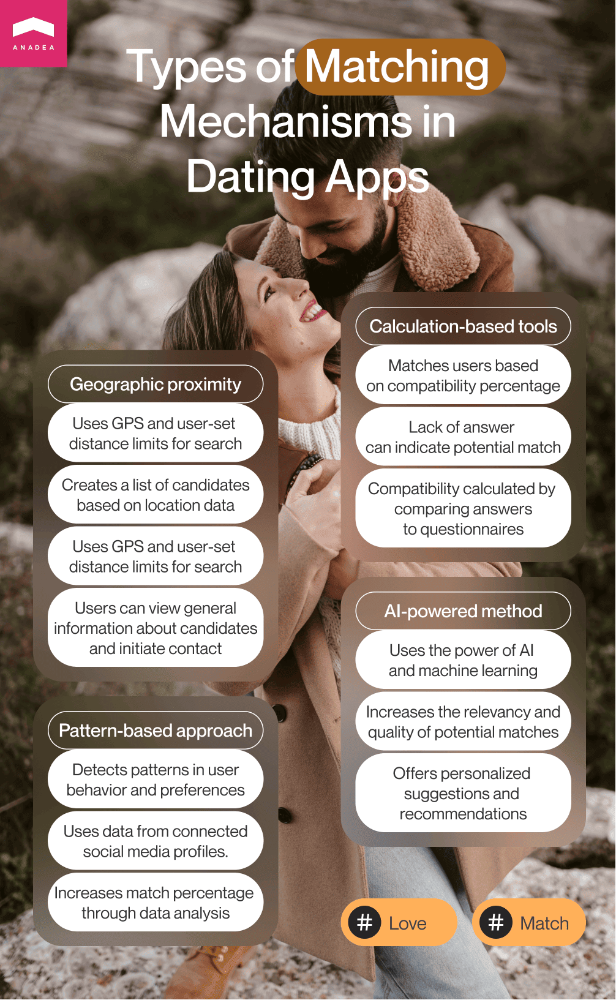
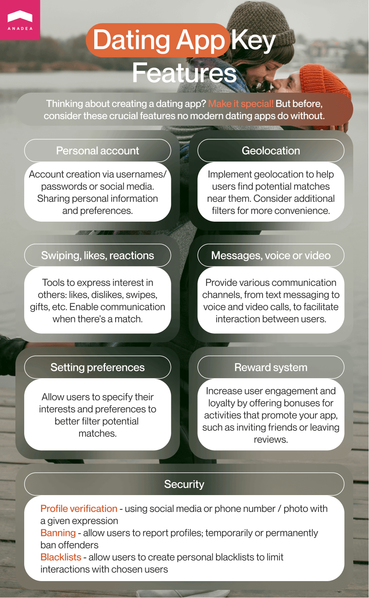
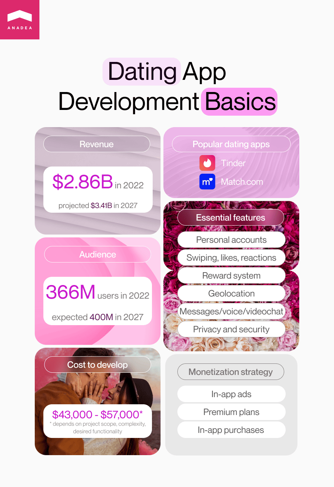

After the internet entered our lives, the way we communicate with others changed once and forever. Some decades years ago, when people felt lonely and wanted to find new friends or partners for building romantic relationships, they needed to visit public places, parties, or at least buy a newspaper with dating ads. Now, everything doesn't look so complicated. To meet a new person, it is enough to open an app marketplace and download a dating app where thousands of users have already created their accounts.

In this article, we are going to tell you more about the specificity of solutions of this type and share some useful practical tips on how to create a dating app like Tinder.

## Dating apps: What makes them special?

When you are thinking about building a dating app, you need to understand what are the core things that people typically like about such applications and what existing products lack. This knowledge will help you to make a dating app that will have a high chance to gain a huge user base already in the nearest future.

The popularity of dating apps is continuously growing. And at the moment, there are no factors that can indicate that this tendency will change. There were about 366 million users of online dating services in 2022. And according to <a href="https://www.statista.com/forecasts/891146/eservices-dating-services-online-user-by-segment-worldwide" target="_blank" rel="nofollow">experts</a>, this figure will hit the mark of 440 million in 2027.

The revenue of online dating services reached $2.86 billion and it is <a href="https://www.statista.com/forecasts/891138/eservices-dating-services-online-revenue-by-segment-worldwide" target="_blank" rel="nofollow">forecasted</a> that in 2027, the revenue of such platforms and apps will be around $3.41 billion.

Given these facts, it will be quite sensible to come to the conclusion that <a href="https://anadea.info/solutions/dating-app-development" target="_blank">dating app development</a> can be a feasible investment and a very promising project. Yes, there is a huge demand for dating applications as today, people absolutely adore this model of establishing contacts with potential partners.

But you should also understand that with the skyrocketing interest in such solutions from the side of users, we can also observe growth in the number of apps with similar functionality. There are thousands of dating websites and mobile apps worldwide. That's why for developing a dating app that will be able to stand out from the row and continuously attract the attention of users, you need to make sure that your solution perfectly meets the requirements and expectations of a target audience.

For understanding the preferences of users, it is interesting to have a look at the <a href="https://healthyframework.com/dating/advice/online-dating-statistics/" target="_blank" rel="nofollow">statistics</a> that demonstrate what services are named as favorite ones by different groups.

Younger adults of 18-29 y.o. who are the most active users of dating services prefer Tinder which is quite an obvious choice. At the same time, representatives of other age groups turn to Match.com more often.

That's why when you are planning to make a dating app, first of all, we recommend you think about the primary audience of your future software product and analyze what the most successful dating services offer to their users. Let's have a closer look at two major dating services that boast enormous popularity all over the world.

### Tinder

This application is known practically to all mobile internet users of the younger generation. Today the application has around 75 million active users monthly. Tinder was introduced in 2012 and it was the first solution of this king that offered a swipe left-swipe right feature. Though now this approach to showing you interest and disinterest seems to be a very simple one, more than a decade ago, it was a real innovation that managed to wow the audience quite quickly.

Today the application is available in more than 45 languages and people from 190 countries can use it.

The initial idea behind the app was to help users to get over the embarrassment and communicate only with those people who also demonstrated their sympathy to them, in other words, with those who expressed their readiness to establish contact.

The free version of the app allows you to get suggestions only in a restricted area. Paid features let you change the location of your search.

Many people use Tinder with a view to finding their true love while others just believe that it is a cool way to find new friends to communicate with them. In any case, we won't exaggerate if we say that Tinder has become a real game-changer. That's why it is not surprising at all that so many companies and startups today want to know how to create a dating app like Tinder.

### Match.com

Match.com is another giant in the online dating industry. Established in 1995, it became a pioneer in the space of web dating services. Now it can be accessed from more than 60 countries and it is available in 15 languages. This service has already become a legend.

However, the audience of Match.com quite differs from the group of those who prefer Tinder. Though young adults of 18-29 y.o. are also among the users of Match.com, the average age of those who are looking for their partners via this service is 35-44.

It is interesting that despite the fact that it is already a well-established app with a long history, the team that is developing it is continuously trying to implement new features and functionality in order to attract more users.

For example, during the pandemic, Match.com introduced a new feature called Dates. Users can indicate their preferences regarding offline dates (but this point rather obvious) as well as safety dating measures (and this one brightly demonstrates that the team is ready to stay flexible and to react to all the social changes with new solutions). Thanks to this feature you can see what expectations your potential matches have, whether they want you to wear a mask during dates or maybe they ask you to follow a particular dress code.

When the team decided to check whether users liked this feature, the results of the survey turned out to be rather surprising. The majority of people absolutely liked it and 93% admitted that they would like to continue using it.

Moreover, Match.com can offer users the possibility to organize video dates and make calls via custom phone numbers provided by the app.

And these features are just a perfect example of how you can adapt your solutions to changing market demand and expectations.



## How to build a dating app that will make perfect matches?

If you are thinking about developing a dating app, you may already know that probably the most crucial thing, in this case, is how your app creates matches. We are not going to say that all other features or their design do not matter at all, of course, they do, but without a good matching mechanism, your dating app simply won't meet the ongoing market needs.

There are no precise recommendations on the algorithms that you should use. However, given users' demands that are extremely high these days, we advise you to consider using a combination of algorithms for achieving the best results.

We can define two major parameters that people usually evaluate when they see a new account on a dating platform. They are appearance and interests. It means that these things should be visible to users when they are looking through the accounts of their potential matches.

But it's obvious that you should also rely on some other parameters to filter the accounts. For example, you can follow the principle chosen by Tinder and match people in accordance with their location. You can also go one step further and offer matches based on favorite books, films, or restaurants. Or you can create something really unique that still doesn't exist and provide a completely fresh look at all these dating apps.

We can offer a couple of different types of algorithms that you can use for building a dating app.

- **Geographic proximity**. A lot of mobile applications intended for helping people to establish new contacts rely on GPS as the main parameter for matching users. It works the following way. The app has distance limits for search. Based on these limits and the location-based data, it creates a list of candidates that can be offered to a user. Then, a user has the possibility to look through some general information about these people and establish contacts.

- **Preference pattern-based approach**. You can build an algorithm that will successfully detect patterns in behavior and preferences. For doing that you need to ensure the possibility for the algorithm to use data related to the users' connected social media profiles, comments, likes, followers, subscriptions, etc. Of course, the integration of such algorithms presupposes using huge volumes of data. Nevertheless, thanks to them, the percentage of successful matches will continuously grow.

- **Calculation-based tools**. Matching mechanisms can be also based on the calculation of a compatibility percentage and offering users a list of candidates with the highest figures. This percentage can be calculated by comparing the matching answers to the questions asked by the app bot. Even no answer (skipped questions) can be already a sign that users' opinions and interests can coincide.

- **AI-powered method.** The hype around artificial intelligence is extremely high these days. And you definitely shouldn't miss the opportunity to power your software product with advanced <a href="https://anadea.info/services/machine-learning-software-development" target="_blank">AI and ML features</a>. Thanks to implementing them, you will be able to offer users personalized suggestions and recommendations.

Create your own app

## Basic features of a dating app

The exact set of features that you will include in your dating app should be defined in accordance with the peculiarities of your target audience. You should try to understand what they want to get in a dating app of their dreams (or what their favorite apps lack now) and offer it to them.

Nevertheless, regardless of that, each dating app has a basic set of features that are highly recommended to build in order to make sure that your app corresponds to modern industry standards and that people will have the possibility to quickly get accustomed to its navigation, look, and functionality.

### Personal accounts

Each dating app should provide users with the functionality for creating their personal accounts and logging into them either by using their username and password or by doing that via their accounts on social media. And given the ongoing trends, the latter option is even more preferable these days but you can also offer both of them.

In their accounts, users should be asked to share some personal information including but not limited to location, age, preferences, etc. If you want to offer users a chance to find the best match based on their favorite dishes or books, you should definitely include such questions in the account forms.

### Swiping, likes, and other reactions

The next thing that each dating app should have is reactions (likes, dislikes, etc.). Users should have a convenient tool to demonstrate their interest in establishing contact with other users. It can be done via well-known swiping or via sending emojis or putting likes and other reactions. In general, we should admit that swiping is the fastest way to show your sympathy and interest. And by adding this feature, you can greatly enhance users' experience and make it more engaging and fascinating. When there is a match, users should be able to start communication with each other.

### Reward system

This feature can't be viewed as a specific one for dating apps. But it can greatly boost the loyalty and engagement of users. That's why you shouldn't miss this chance to increase their satisfaction. You can offer various bonuses (like a free boost or access to a bigger number of users' accounts daily) for inviting friends, leaving reviews, or any other activities that can promote your application.

### Geolocation

This feature is exactly what Tinder is based on. And of course, a lot of dating apps have copied it because this approach is believed to be the most convenient one for finding potential matches. You can also use it but we would also recommend you add some additional filters for users' convenience.

### Setting preferences

You can allow users to indicate their preferences and interests in order to better filter the list of candidates that will be offered for their consideration.

### Messaging, voice, or video chats

A dating app should also provide people with the opportunity to communicate with each other to find out whether they have a lot in common and whether there is any sense in continuing their interaction (and even starting dating). You can enrich your app not only with a traditional messaging chat but also a voice or video service.

### Security of a dating app

We've decided to pay special attention to the question of the safety and security of users. The specificity of dating apps, unfortunately, attracts a lot of dangerous and creepy individuals. That's why teams that are standing behind any dating apps should take a row of special steps and introduce some particular features that will help to protect users from such people.

- **Profile verification**. This step has already become a standard for apps of many types and you shouldn't ignore it when you are developing a dating app. To verify a profile, it is recommended to ask users to add links to their profiles on social media or share their phone numbers. As a rule, when people stay anonymous they believe that they can do whatever they want but when their anonymity is limited, the risk of a threat from their side becomes lower.
- **Banning**. Let users complain about the unacceptable behavior of other individuals and take actions like temporary or permanent ban introduction.
- **Blacklist**. This feature will allow users to create their own blacklists.

## Technologies to use

It doesn't matter what solution you are going to build, it is impossible to talk about the exact tech stack without analyzing your idea and the desired functionality. That's why the list that we are going to share below can be viewed only as a reference. And in reality, your application may require a different approach and, consequently, a different tech stack.

- Programming languages for creating a mobile app: Swift, Java
- Database: MongoDB, MySQL, PostgreSQL
- Frameworks: React Native, Node.js, Xamarin
- Cloud Platform: Amazon AWS, Azure
- Payment APIs: PayPal, Stripe
- Maps APIs: Google Maps, Mapbox, OpenStreetMap

## How can you make money on a dating app?

It is absolutely natural that when you start a dating app, you want to understand whether you will be able to monetize your efforts and what methods are available for doing that.

Though offering a paid app seems to be a very obvious option for making money, it is important to bear in mind that a download/registration fee may become a barrier for many potential users. When you want to earn on downloads or registrations, you need to take into account that by doing that, you can seriously restrict the number of those people who will be ready to use your service, especially when you are going to design a dating app for young adults (18-29 y.o.).

According to statistics, 3 of 4 dating services with the biggest user base for this age group are free. While the situation with applications for an age group of 45-54 y.o. is quite different. Only 1 of the top 4 products is free to use. These figures demonstrate that for defining what monetization methods will be suitable for you, you also need to closely analyze the peculiarities of the target group that you want to work with.

As the idea to introduce paid registrations and downloads is far not a universal one and it won't be suitable in all cases, we want to share with your some other hints that will help you to make up your mind.

1. **In-app ads**. Advertisers know how popular dating apps can be. That's why they are highly interested in promoting their brands via such solutions. Quite often restaurants, cafes, hotels, spa centers, and flower delivery services establish cooperation with online dating platforms for advertising their offerings in some particular regions. But of course, you should find the possibility to make advertising not very annoying. Otherwise, the risk to start losing users will be extremely high.

2. **Premium plans.** Among the most popular ways to monetize a dating app, we should mention paid access to some special features and possibilities. Such plans can allow users to show their interest to an unlimited number of people at the same time, remove limits on the number of users' accounts that can be viewed daily, or get the possibility to establish contact with all the people who liked their photos, etc. As you can understand, everything depends on the specificity and functionality of your dating app. Moreover, you can provide users with the paid option to switch off advertising in order to concentrate more on finding a match instead of being distracted by ads.

3. **In-app purchases.** In the case of dating services, you can offer users to buy special badges, stickers, or boosts that will help them to highlight their profiles and get higher chances to find the best match as soon as possible.

## Key steps for building a dating app

Let's summarize what steps can be included in your project when you want to launch a dating app.

1. Define your target audience, and study people's needs, and expectations. Try to find out what they expect from such apps, what they usually like about such apps, and what they want to improve in the existing solutions. These insights can be extremely valuable to you when are developing the requirements for your own software product.

2. Conduct market analysis. It's crucial to have a good understanding of the existing apps, their features, and their strengths and weaknesses. You need to know what apps are your closest rivals and to define what features will help you to stand out from the row.

3. Create a list of the features that will be included in your app. Based on the results of your research, you can prepare a set of the required features.

4. Build prototypes and wireframes. This step will help you to see whether your future product will correspond to your expectations and whether you need to change something already at this stage.

5. Then, it's time to proceed to UX and UI design. Here, it will be required to think about the look and feel of your application and ensure the best balance between visual authenticity and user-friendliness.

6. Choose the most relevant tech stack, develop and launch a minimum viable product (MVP). We recommend you start with an MVP as thanks to it you will be able to validate your idea and reduce your financial risks.

7. Promote your app and expand it with new features. The right promotion is of crucial importance for dating apps. Find good channels (like social media platforms) for advertising your solution and offer various incentives for joining your app.

## Conclusion

Today the online dating app industry is an actively growing one. Despite the fact that there is already a big number of players on the market, there is still enough space for newcomers, especially if their ideas are fresh and unique. If you want to learn more about how to make a dating app and are looking for a reliable team that will support you in building such a solution, at Anadea, we are always ready to help you. Our developers have the required expertise and knowledge to deliver even the most complex software products that will be fully tailored to your needs.

Contact us
