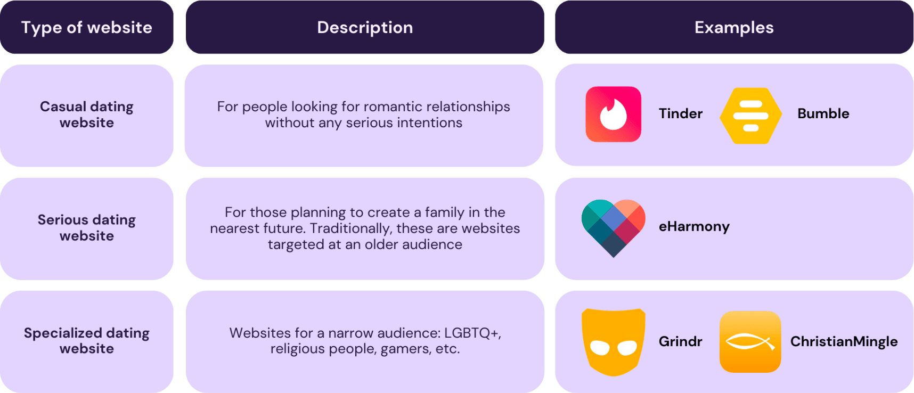

Do you know what are the most popular ways people meet their love? While such options as "through friends" or "at work" are still rather common, already in 2019 Stanford sociologist Michael Rosenfeld [revealed](https://news.stanford.edu/2019/08/21/online-dating-popular-way-u-s-couples-meet/) that the majority of traditional couples meet online. And without any doubt, we can say that the coronavirus pandemic, and especially its first wave in 2020, had a very strong impact on the further development of this tendency. People are accustomed to doing practically everything online and looking for a new love is one of those tasks that can be performed without the necessity to leave your home.

Given the demand for such services, creating a dating website can be a great idea for your business. And to realize its feasibility, let's have a look at some figures.

## Online dating market

In 2022, the [revenue](https://www.statista.com/forecasts/891138/eservices-dating-services-online-revenue-by-segment-worldwide) of the online dating industry worldwide was $2.86 billion and there are no signs that it can indicate that the growth rates are going to decrease. The industry revenue is projected to move higher to the mark of $3.39 billion by 2027. It means that the CAGR for the period from 2023 to 2027 will be around 3.2%.

As for the number of users of online dating services, in 2022, around 366 million people were seeking love via online platforms. Forecasts for 2027 are quite optimistic. In 2027, nearly 440 million people are [expected](https://www.statista.com/forecasts/891146/eservices-dating-services-online-user-by-segment-worldwide) to be among the users of such services.

Before you start thinking about how to create a dating website, you need to understand the peculiarities of the market where you will need to win your share and leave your rivals behind.

First of all, let us mention that there are different types of dating websites based on the goals that can be reached with their help.

- **Casual dating websites** are intended for looking for romantic relationships without any serious expectations. **Tinder** or **Bumble** are bright examples of such solutions. Users usually look for partners with whom they can go on a date and have some physical and emotional contact but nothing more like marriage or having children together.

- **Serious dating platforms** are for those people who are planning to create a family in the nearest future. Traditionally, these are websites targeted at an older audience. Their users usually do not want to waste time on casual dates and aim to find a partner with whom they can get married. **eHarmony** is often named among the platforms that can be included in this group.

- **Specialized dating websites** are designed for a limited target audience. For example, it can be a platform for LGBTQ+ like **Grindr**. There are also separate solutions for black people such as **BlackPeopleMeet** or Christian faith-based platforms like **Christian Mingle**. The online data industry also offers a row of platforms that unite people with special interests, such as gaming. **GamingPassions** is one of the most well-known solutions for gamers who want to find a partner with similar hobbies and preferences.

## What you should think about before creating a dating site

When you plan to create dating site, first of all, you should clearly identify your target audience and choose the precise niche where you want to develop your product.

While you have the variant to build a solution for a very wide group of potential users, you can also opt for a specific audience and develop a platform that will be intended for people with particular interests or expectations. Why is it important to make this decision before proceeding to dating website development? The answer is very simple. Without this decision, you won't be able to move further.

Already at the stage of planning, you need to have a good understanding of the needs and expectations of those people who will be potentially interested in your product. It is crucial not only for marketing your website and choosing the best channels for promotion but also for making important tech-related decisions.

For example, will you need any **integrations**? For creating a dating website for people who share similar interests (music fans, fitness lovers, people who like dogs, etc.) you may need to integrate third-party solutions and use external data for your matching algorithms. In the case of building a platform for music fans who want to find their love, you can connect their personal profiles with **Spotify** accounts which will help users to find potential partners with similar music preferences.

Different **age groups** also may expect different design solutions and approaches. While younger adults expect to see bright and more dynamic designs, older people prefer static and minimalist interfaces.

The number of dating websites is continuously growing. And when a person starts googling for an appropriate variant, they may find hundreds of similar solutions. You need to have something unique to offer them. That's why at the stage of planning your project, we recommend you study the market to find out what solutions already exist, what features they have, and what can be done better for ensuring a unique user experience.

## How to make a dating site: core features to include

Regardless of the exact niche that you will choose and the audience that you want to reach, there are some core features that should be built for any website of this type.

### Registration and profile creation

The user journey on a dating website always starts with the registration and creation of an account. You should build a form where a user will need to add important information required for matching. It is also necessary to create functionality for adding photos or you can also allow users to add videos where they can represent themselves and show important parts of their lives.

### Communication tools

When users find potential partners, you should allow them to communicate with each other. The most popular communication tool that is used on such websites is an online chat. Users can exchange messages and different files. But you can extend the functionality of your platform and add alternative options like video and voice calls.

### Searching and matching mechanisms

This is core functionality. Such a website is not a newspaper with dating ads. It should provide users with recommendations of not just randomly chosen people but of potential partners who can be interesting to them based on different parameters. You can also build a filter-based search system that will let users look for their love on their own.

### Monetization strategies

While planning how to start an online dating site, you should decide on the way to earn money on this project. There can be different approaches. For example, you can get money from advertisers or launch premium features. And it is not the end of all of the opportunities that you have. We will consider this point in more detail further in our article.

### Admin functionality

Administrators should get access to the information and content added by users to their personal accounts. They also should have the possibility to ban users in those cases when any suspicious activity is detected.

### Responsive design

The concept of responsive design presupposes building solutions that are compatible with different device screen sizes and shapes. You never know what devices people will use to interact with your website and you should ensure automatic adaption of its interfaces to different screens.

Create my website

## How to make a dating site: Two key approaches

If you have already started to look for the answers to the question of how to build a dating site, you probably know that there are two main approaches: developing form from scratch and using a white-label solution.

Though the first option can be rather challenging, the entire process is usually well-known to the majority of customers that we traditionally work with. You need to hire a good development team, share your requirements, choose the desired tech stack, and wait for the results. Of course, here the plan is very simplified. In reality, there are a lot of points to think about and the most important of them is [how to find a web developer](https://anadea.info/blog/how-to-find-a-web-developer). When you have excellent professionals by your side, you can fully rely on them and concentrate on your core business activities. Without any doubt, such a project will require serious investments from your side at the development and maintenance stages, but you can realize absolutely all your ideas.

A white-label solution can be explained as a product that is developed by a company without any branding with a view to selling this product to another company that will use its own brand for it. It means that instead of thinking about how to create a dating website, you will just need to find a company that sells white-label solutions, choose the most appropriate product, change it for your needs, and launch it for your audience. Moreover, you will be free from maintenance responsibilities as a seller will bear them. Of course, it sounds quite attractive but there are important disadvantages. For example, customization opportunities are limited, and in the majority of cases, you won't get access to your solution's source code and the server.

Let's compare the key characteristics of the two approaches.

![This table compares two different approaches to website development: purchasing a white-label solution and developing a website from scratch. In the white-label solution column, the table indicates that the solution will be built by the seller's team, the source code will be owned by the seller, and the website's maintenance and support will be managed by the seller's team. The customization and possible integrations with other systems are limited in this approach. The required budget for a white-label solution typically ranges from $3K-$10K for initial setup, with recurring monthly fees of $500-$1000. The project's timeframe for a white-label solution typically takes between 3-5 weeks. On the other hand, in the 'development from scratch' column, the solution will be built by your in-house or outsourced development team. The source code will be owned by you, and the maintenance and support of the website will also be handled by your in-house or outsourced team. The customization and possible integrations with other systems are unlimited in this approach. The required budget for developing a website from scratch is typically between $43K-$57K. The project's timeframe for developing a website from scratch is usually between 10-15 weeks.](white_label_vs_custom.png)

Please note that the named budgets and timeframes are very approximate as it is impossible to provide estimates without analyzing your ideas, goals, and expectations. If you have a huge project with a big number of integrations, it may require more time and financial resources to build such a website.

## Ways to enhance user experience

How to start a online dating site that will win users' hearts? To do it, you should offer a product that users really want to have. In other words, you have to listen to people's opinions and try to provide them with what they need to get as soon as possible.

Amid the continuously growing competition in the industry, you should have a website that stands out from the row of others and that can be changed with the flow of time. Even after the launch of your product, we recommend you regularly gather feedback from users in order to add new functionality or improve the existing features if there is such a necessity.

To find out what people what to get, you can either ask them directly about it via different kinds of surveys or you can apply website analytics to accumulate valuable insights into users' behavior.

What features are the trendiest ones in dating website development?

- **AI-driven matching**. It seems that artificial intelligence has captured the world and the online dating app industry is not an exception. AI tools can analyze previously made choices and indicated preferences in order to find users who can become a perfect match.

- **Social login**. Logging in can be a rather time-consuming and even irritating procedure when users need to add all the details manually every time when they want to use a website. But you can allow your website to use the info from any other services like Google or Facebook. It will greatly enhance user experience and streamline the process.

- **Location-based search.** Though this type of search is typical for mobile dating apps, you can also use it for your website. Location is one of the key criteria for those who are looking for relationships in real life.

- **Ice-breakers**. Even when a user has found a good candidate to continue communication it can be rather difficult to establish contact. You can add some simple in-app games or lists of interesting questions that can help users to learn more facts about each other in a very simple way.

- **Swiping**. "Swipe left" and "swipe right" are very convenient ways to show whether a candidate is interesting to you or not. Mainly, this approach is used in mobile apps but it can be also used in website development but in a little bit different realization.

## How can you earn money on your dating website?

There are several monetization strategies that you can apply when you launch an online dating website. You can choose any of them or combine different options depending on the peculiarities of your target audience.

- **Paid membership.** This option seems to be quite simple. People will pay for getting access to the functionality of your website. However, before introducing this business model, you should carefully analyze your chances to succeed with it. It is highly unlikely that people will be ready to pay for a service that they do not know and have never used before. However, you can introduce this option later when your brand is already well-established.

- **Advertisements and collaborations**. Dating apps often attract numerous advertisers. And you shouldn't miss this chance to build cooperation with them, especially when they offer services that are related to the dating industry. Ads from flower delivery services and SPA centers may be rather helpful to users. But be careful and do not make advertising too annoying.

- **Freemium features.** This model presupposes that the basic functionality of your website will be available for free, while advanced features will be available only on a paid basis. It's a good option for users to get familiarized with your platform without any financial risks and pay only when and if they are ready for it.

## How to make your dating website secure for users?

Dating websites are quite specific platforms that can be wrongly used by different creepy persons and people with serious mental problems. And when you launch such a site, you need to think about ways to protect people from the unfavorable actions of other users. We recommend you introduce strong personality verification measures. It can be a good idea to request people to add to their profiles their phone numbers or links to accounts on social media apps. Though it is not reasonable to make these details publicly available, at least admins should be able to verify this info.

Bans and blacklists are among other features that will allow users to feel more protected.

While banning users people should be able to indicate the reasons for the ban and admins should be responsible for checking the provided information and taking measures. Among the possible ways to punish users, there is a temporary or permanent block.

Personal blacklists are an effective tool to restrict users from contacting you if you believe that their behavior is inappropriate or offensive.

## Mobile optimization of a dating website

Today the global smartphone penetration [rate](https://www.statista.com/statistics/203734/global-smartphone-penetration-per-capita-since-2005/) is continuously going higher and higher. At the moment, it is around 68% with some countries demonstrating the figure of over 80% already.

It means that it is extremely important to think about how your website will work on mobile devices and to optimize it for mobile browsers.

We also recommend you analyze the requirements and behavior of your target audience with a view to detecting a potential necessity to launch a mobile app with similar functionality. You can read about [how to create a dating app](https://anadea.info/blog/how-to-create-a-dating-app-if-you-have-never-done-it-before) in one of our previously published articles.

## Conclusion

The demand for online dating websites is growing these days and according to experts who study the market, the positive tendencies in this industry are here to stay. The number of users is also expected to increase.

It means that despite a big number of already existing solutions, new websites will be positively welcomed if they meet the ongoing market needs and satisfy modern requirements.

But how to build a dating site that will succeed? One of the key conditions for it is to establish cooperation with a professional team that has outstanding expertise in [online dating solution development](https://anadea.info/solutions/dating-app-development). At Anadea, we are always open to new projects and will be happy to help you to realize your ideas!

Just contact us and get a project estimate absolutely for free!

Get estimate

## Frequently Asked Questions

### What is a dating website?

It is a web solution that helps people to find potential partners for building romantic relationships based on their common interests, preferences, location, and other parameters.

### How does a dating website match people?

There can be different approaches to choosing candidates that will be demonstrated to a user. But usually, it works with predictions made by algorithms. In other words, a website tries to create a list of people who will be liked by users. It can be done based on the indicated interests or previously made choices.

