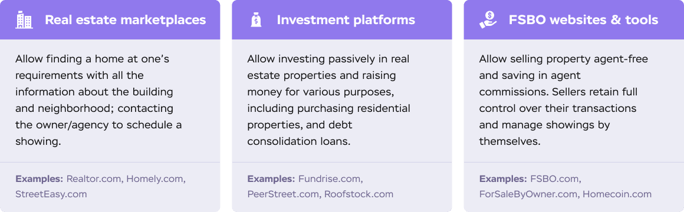
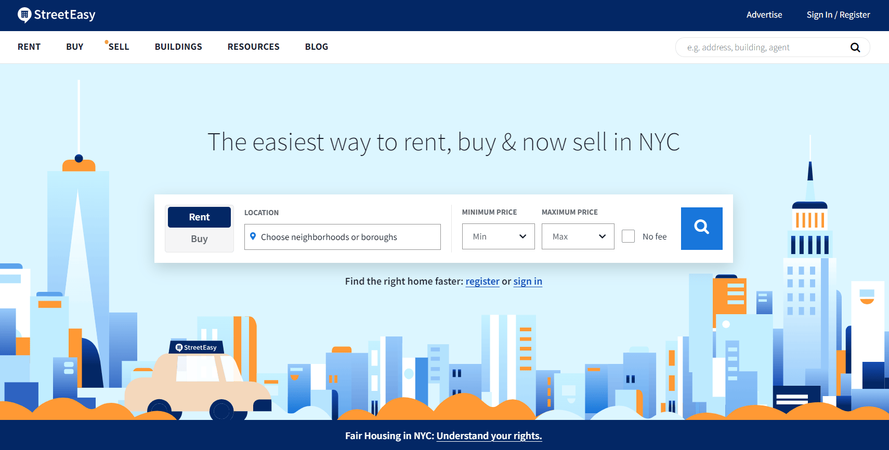
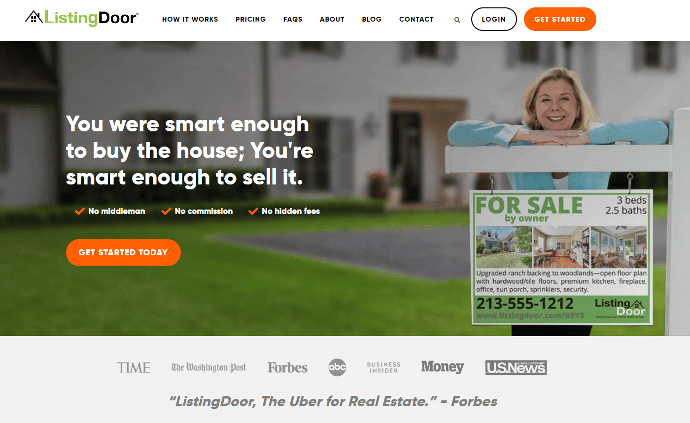

How many deals are closed on real estate websites every day, be it renting, buying, or selling? It’s impossible to calculate it even close to approximately since there are thousands and thousands of real estate websites with millions of visitors a day.

But if you are terrified by the huge, although abstract numbers, don’t be. The real estate industry has its own specifics that allow new market players to stand against the competition. Buying a house is not a 10-dollar deal, so before making any decision, a person lurks on every site they can find—and does so multiple times. Thus, another website with more unique offers is not an irritation, it can be a blessing.

If you are looking to launch your own real estate website, spare a few minutes to read our overview of the entire process of <a href="https://anadea.info/solutions/real-estate-software" target="_blank">real estate software development</a>. Knowing these details will help you make the right decisions that ensure that your project is completed on time and within budget while meeting all of your expectations. Let's dive in and see how to create a real estate website!

## Three types of real estate websites
All software always starts from a real-world problem that needs to be solved. In real estate, problems are usually related to facilitating business, helping homeowners, and making the process of finding and comparing properties easy and clearly visible.

Here and further in the article, we break real estate platforms into the following categories:

* __Real estate marketplaces__ that list properties for sale or rent based on user’s requirements, such as Realtor.com, Homely.com, <a href="https://anadea.info/projects/streeteasy" target="_blank">StreetEasy.com</a>.

* __Platforms for real estate investors__ (companies and individuals) that allow investing passively and raising funds for purchasing properties and debt consolidation loans—Fundrise.com, PeerStreet.com, Roofstock.com.

* __For-sale-by-owner (FSBO) websites__ and various tools for homeowners (calculators, reports, etc.) allowing them to sell the property without agents involved—FSBO.com, ForSaleByOwner.com, Homecoin.com.

Yes, the industry is not limited to these three. Such service providers as real estate appraisers, real estate attorneys, industry-specific accountants, money lenders, constructors, etc. can have a website too. However, websites for these professionals usually fall under the category of web development in general as they are not complex technology-wise and do not require particular industry knowledge from software engineers. In contrast, real estate marketplaces and FSBO platforms take longer to develop and more things have to be considered when building them.

## Real estate marketplaces
A real estate marketplace is the most widespread type of a real estate website platform and the easiest one to describe. If one is looking to buy or rent a home or an apartment, odds are 1000 of 100 they will come across a real estate marketplace on the first page of Google results.

So the benefits of creating a real estate website of this type are pretty obvious. They get a lot of traffic and are in demand in every region, any time of the year. Despite the competition, new websites continuously emerge.

The key feature of a real estate marketplace is connecting it to an MLS. If you run a real estate business, you know what MLS is. If you do not know what it is, here is a brief overview.

MLS stands for __multiple listing services__. Basically, a multiple listing service is a huge database of properties that can be downloaded by authorized real estate agents. The agents can share part of those listings on their website according to policies known as Internet Data Exchange. This is why listings are sometimes referred to as IDX listings.

Usually, browsing the listing is made possible via an API. To be a valid MLS, it should implement a Real Estate Transaction Standard (RETS).

One should differentiate listings from buildings. Buildings may contain many listings (or no listings at all). There are separate services that store spatial data for buildings. An example of such a service is <a href="https://www1.nyc.gov/site/planning/data-maps/open-data/dwn-pluto-mappluto.page" target="_blank" rel="nofollow">Pluto</a>.

MLS usually calls for paid membership because huge databases require high bandwidth. It is possible to use free solutions, but paid solutions are usually faster, bigger, and contain more valuable information.

### Must-have features of a real estate marketplace
Since roughly a quarter of customers nowadays are online shoppers and prefer to look for information about products online, real estate website development can help agents to leverage this trend. Due to the strong competition in this field, the following features should be included to make your app draw customers' attention with a fast and effective information search and selection process:

#### Short and simple registration process
A short and easy registration process with the option of logging in through social networks or email accounts goes without saying. Few users ever make it to the end of a complex multi-step registration.

#### Different user roles
Enable three different profiles: for homebuyers, sellers, and real estate agents, for each of them to have different functionalities. For example, homebuyers are shown properties for sale with an option of saving favorites, while an agent’s app shows them lists, schedules, and interested customers.

#### Property listing
A property listing that includes all necessary information about available properties is a basis for any application. This way, both sellers get a chance to add their property and users can search for one. Big and flexible databases that can handle scale-up are critical for a website as well.

#### Cost calculation
Cost calculator can help buyers to identify the cost of property in real time, which is important since it fluctuates on a regular basis. It is important that the calculator also takes taxes, interest on the loan, first payment details, etc. into account.

Anadea has built a predictive analytics model for the real estate industry that makes predictions of the percent of sale probability and number of potential buyers with >90% accuracy. <a href="https://anadea.info/contacts" target="_blank">Contact us</a> to learn more.

#### Filters and search
Enable various filters so that users can find what they need without wading through irrelevant propositions.

#### Favorites
This feature allows customers to shortlist suitable properties and make a decision in an easier way.

#### Email notifications
Homes are often being sold <a href="https://edition.cnn.com/2021/02/19/success/january-home-sales-inventory/index.html" target="_blank" rel="nofollow">within days</a>, so you can tune emails to notify users about new offers in their region or the status of announcements they marked Favorite earlier.

#### Detailed map
Maps will not only show the location of the property but also the surrounding infrastructure like stores, schools, hospitals, crime rate, and the average income of the neighborhood’s residents.

#### Calendar
Calendar is a helpful feature for agents, sellers, and customers since it allows seeing available time slots and dates and booking a meeting or property viewing on a website.

#### Live chat / Chatbot
In-app chat can help customers ask a real person or a trained chatbot for information about a specific property directly without leaving the website. Yes, chatbots are now this good—check out more info on our <a href="https://anadea.info/services/machine-learning-software-development" target="_blank">Artificial Intelligence services</a> page.

Hire real estate web developers

### What to consider when integrating an MLS
If your real estate platform requires MLS integration, here are some problems your developers will need to solve.

#### 1. Create a database for listings
The database will contain a standard set of fields—state, city, address, description, number of rooms, etc.—yet adjusted to your needs. If you are developing a business-to-business software, you will need accounts for companies or individuals, the ability to browse listings, find them by certain criteria, add them to their accounts, and so on.

#### 2. Choose a multi-listing service
It can be the Zillow, Trulia, DiverseSolutions, etc. We assume that you plan on marketing the project in your city or state. Make sure that the desired MLS contains valuable information. We would not recommend dissipating your energy on all possible geographic areas in your country.

#### 3. Register an account in the MLS and start integrating it
Sometimes the integration will require an agreement with the vendor. The agreement will allow you to get the data in the format you want. This is often cheaper than paying a development company for processing the data upon downloading.

#### 4. MLS databases are huge
It means that downloading the data is an expensive procedure (and this is one of the reasons why we recommend starting a project from importing listings for one state only). The best way to do it is to download a full feed once per day and partial feeds every 15–30 minutes.

A full feed may run to 1.5Gb. This amount of information plus attachments requires significant processing time, so you cannot import it often. Partial feeds are much smaller as they contain only changes made to the listings over the day. However, even partial feeds may contain redundant information. Sometimes agents change prices in their listings by a few dollars every now and then, so you may want to disregard records where the price has changed by $50 or less.

#### 5. Several MLS sources may contain repetitions
It happens that the same listings are in different MLS when an original listing is shared among multiple databases. You might think that the same listings mean the same data across all sources—and most of the time this is true. But if the original listing is updated, all databases update their records, but not all of them do it at the same time. This way, there is a risk that your real estate web app will receive contradictory information from a few sources. So, the developer will need to write some logic for resolving conflicts.

#### 6. The format of street addresses in a feed may vary
In this case, the real estate web developer will have to create a logic to normalize the addresses that vary from record to record. Content uniformity is the key to correct filtering and searching on a website.

#### 7. If the project assumes geocoding, you will need object coordinates
MLS feeds do not necessarily contain this information. If this is the case, you will need to sign up for another service (such as Pluto) and get another feed with buildings and their spatial data.

Be aware that not all buildings are geocoded. Sometimes you will need another paid API like Google or Bing to generate latitude and longitude for a street address. If you have one million records, this procedure will take significant time. Everything is time-consuming when you have one million records. So again, consider launching the product in your city first, then spread it to a larger area.

#### 8. You may also need information about deals not open to the public
This feature is not too common to commercial real estate platforms, but if this is one of your key features, you will need another third-party service like <a href="https://a836-acris.nyc.gov/CP/" target="_blank" rel="nofollow">Acris</a> to be integrated.



### Cost of MLS integration
Speaking of an MLS integration, it may look like a simple feature. However, it requires many aspects to be taken care of if you want your project to do something valuable rather than just be online.

Developing a prototype that integrates MLS and shows agents’ listings in their area can be as simple as 1 month of work ($19,000+). A prototype is a good type of project to step into the market.

A calibrated web app that processes valuable data at the right time assumes about 6 months ($105,000+).

## Platforms for real estate investors
Let’s talk about the second category of real estate projects—platforms for real estate investors. This is a kind of business where an investor can search for a home that can be bought, repaired, cleared from debt, and then sold at a higher price. Alternatively, platforms like Roofstock allow investing in real estate without buying property to make passive income.

However, there is something else besides a good eye and gifted hands that they need to make this venture a success. They need an easier way to find a suitable house.

This business defines a set of real-world problems and appropriate solutions that can be covered by the software. A project for real estate investors is usually a customer relationship management system (CRM).

Sometimes it may be referred to as _real estate ERP_, however, we would not recommend using it to avoid confusion with generic <a href="https://anadea.info/solutions/erp-development" target="_blank">ERP systems</a>. Management software for real estate usually automates property management, customer relationship, and accounting.

A real estate CRM would definitely have an MLS integrated (unless houses for all potential deals are entered into the CRM system manually). But a CRM also assumes accounts for users, a certain deal pipeline, and maybe some value-added features.

According to common practices in software development, the flow of the stage can be presented in the form of user stories—natural language descriptions of features written from the perspective of an end user. A simple real estate CRM flow may be described by the following set of user stories:

* As a company admin, I can create an account (an account is a profile of an investor—either a company or an individual).
* As a super admin, I can sign in to the admin area and view and update investors registered.
* As a company admin, I can create and delete users.
* As a company admin, I can create contacts.
* As a company admin, I can create statuses for deals.
* As a user, I can sign in and update my profile.
* As a user, I can browse contacts and update contact details.
* As a user, I can view properties (let’s say that properties are already imported from a certain MLS).
* As a user, I can filter properties by category, city, and street address.
* As a user, I can find properties by geo-coordinates.
* As a user, I can see property details. The details should contain a map.
* As a user, I can create a deal linked to a property.
* As a user, I can change deal status.
* As a user, I can see deals by statuses in a table view.
* As a user, I can close a deal.

### Cost to develop an investment real estate website
When you calculate a real estate web development cost, do not take into consideration just big features like MLS integration. The workflow is a separate cost category. A workflow is the most delicate and proprietary part of every custom project and it often requires more care than plain technical stuff.

The flow described above is basic compared to what seasoned real estate platforms have. It can be implemented within 6–8 weeks, which means $25,000–$30,000 for the features plus $18,000–$22,000 more if you need your real estate website to go with a custom graphic design.

If the system should contain an accounting module, the estimate will depend on the number of accounts and reports. It would be safe to say that each account requires about 2 weeks' worth of work ($10,000).

## FSBO platform development
The third category of real estate platforms describes tools for non-professionals. A good example of such a project is <a href="https://anadea.info/projects/listingdoor" target="_blank">ListingDoor</a> which allows people to get all the required information and printed materials if they want to sell their homes without hiring a professional broker. In other words, the project facilitates the FSBO (“for sale by owner”) process, recommends a price, and teaches users the best way to present their homes.

The seller's revenues are decreased by commissions, although certainly not as much as they may hope. The buyer's commission is still the seller's responsibility. A smart seller would also engage a lawyer to handle the legal documentation. Costs may apply to listing and promoting the house.

Some realtors provide a flat-fee service for sellers on a restricted budget. This just covers the MLS listing; other services are offered for a charge.

Professionals value data over the user interface. Non-professionals need a handy and attractive design. So, the price of tools for non-professionals will consist of the workflow (which requires a custom estimate), design (about $10,000), and value-added features.
Those value-added features can be:

* integrating email services;
* tasks, assignments, and reminders;
* personalized settings and saved searches;
* import/export data from/to Excel;
* loans, skip tracing, lead generation, etc.

Some real estate agents who work for purchasers refuse explicitly to exhibit FSBO listings or at least avoid doing so. They've got burnt previously on FSBO sellers who, in their opinion, act unreasonably or refuse to pay their commission.

If you aren't sure that you have the knowledge that an agent would bring to the endeavor, you shouldn't attempt an FSBO sale. This involves determining a fair asking price, properly promoting the home, staging it, and assembling the necessary documentation to finalize the deal.

## How to monetize a real estate website
### Bump-up offers
Popular online bulletin boards allow users to pin their offer above all others for several hours, a day, or longer. This significantly raises the visibility of an offer which is critical for sellers who want to close the deal as soon as possible.

### Selling space for advertisements
Real estate website is a good platform for selling house services, furniture, financial assistance, and much more that may be compatible with buying or selling a house. Therefore, promoting your services to advertisers makes sense to get additional income.

### Selling premium content
Real estate websites can offer premium content of more considerable value along with free content. It can be webinars, courses, or multimedia content, something that a reader will be ready to pay for.

### Premium plans
A working option to make money from your real estate web app is to charge a fee for premium features, such as advanced statistics, invoice generation, or free bump-ups for offers, without cutting down the basic functionality.

### Commissions
If your business model is based on real estate investment or short-term rentals, <a href="https://anadea.info/blog/develop-an-app-like-airbnb" target="_blank">like Airbnb</a> or Booking, you can offer users a platform for deal-making and thus charge a commission from every transaction processed on your website. However, most buying and selling deals are still closed with the help of real estate agents or directly between buyer and seller.

## Cost of building a real estate website
Prices to develop unique real estate tools are as different as the tools themselves. A plain tax calculator would take a day of work, but it would not make a standalone project. More likely, it could be part of a bigger real estate platform that provides a solution to a real-world problem, has a unique flow and custom graphic design.

When we talk about successful projects like that, we can mention that they all started from a <a href="https://anadea.info/guides/what-is-mvp" target="_blank">minimum viable product</a> release and grew bigger afterward. The first stage usually takes 2–3 months, which is $36,000–$54,000.

Eventually, the cost of website development for real estate will depend on the peculiarities of the workflow and the specifics of your project. If you need a personal estimate for your custom real estate website, <a href="https://anadea.info/contacts" target="https://anadea.info/contacts">contact us</a>. Direct communication and an individual estimate are always more indicative than bare numbers calculated for a generic real estate platform.

## Our experience delivering real estate web platforms
### StreetEasy, NY’s leading real estate marketplace
StreetEasy began as a website that displayed the housing market in New York City. The project eventually developed into the real estate marketplace, which offers in-depth knowledge of NYC areas and a fantastic user experience that lessens the stress associated with apartment seeking. Acquisition by Zillow and 6.7 million monthly visitors are just a tiny bit of facts about this amazing platform. Learn them all from our <a href="https://anadea.info/projects/streeteasy" target="_blank">case study</a>.

### ListingDoor, an FSBO we all deserve
ListingDoor is a solution for the US real estate market. This project was requested by Lappin Properties, a prosperous Houston business that has developed a system that enables consumers to sell their properties without the assistance of a broker. ListingDoor is integrated with 500+ local MLS across the USA and has been spotlighted by Forbes as “Uber for Real Estate Sales.” Find out more about ListingDoor from our <a href="https://anadea.info/projects/listingdoor" target="_blank">portfolio</a>.

Request estimate
