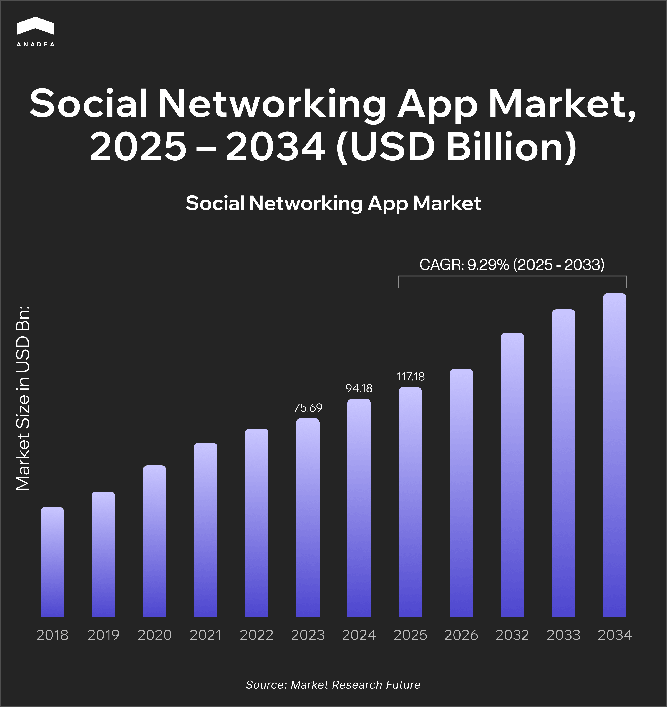
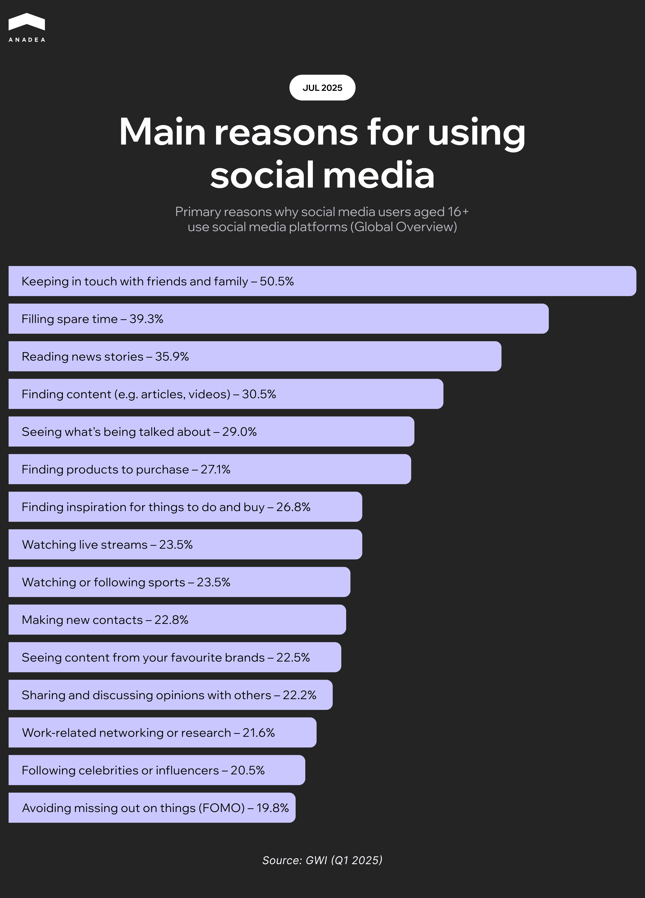

According to Statista, as of July 2025, [over 5 billion people ](https://www.statista.com/topics/1538/social-media-marketing/)use social networking apps. And this figure is continuously growing, as well as the volume of the social media app market. As per the data from the Market Research Future report, in 2025, it is valued at $117.18 billion, while in 2034, it is projected to be[ over $837 billion](https://www.marketresearchfuture.com/reports/social-networking-app-market-22708). Some of the factors that contribute to the expansion of this sector are high smartphone penetration, widespread mobile internet usage, the popularity of social commerce, and the rise of short-form video content.

While such giants as Instagram or Facebook seem to have cemented their leading positions long ago, there are great examples of successful apps that have started their journeys much later. One of them is Threads, which is known as Meta’s Twitter rival. As it was reported by Reuters, the app was launched in July 2023 and gained its first [100 million sign-ups within five days](https://www.reuters.com/technology/metas-twitter-rival-threads-hits-100-mln-users-record-five-days-2023-07-10/). This enormous demand is often explained by its smooth integration with Instagram. Thanks to this, the app fits seamlessly into the online habits of Millennials and Gen Z. These groups are among the [most active social app users ](https://datareportal.com/social-media-users)today.

But the integration of your app with popular platforms is not the only possible way to succeed. In this article, we invite you to explore how to make a social media app that will stand out in a crowded market.

## New Social Media App: Everything Starts with an Idea	

Before writing code for your future app, you need a well-formulated goal for your project. Start by asking yourself the following questions.

**What type of app will I build?**

These are the most common types of social media apps:

* Messaging apps (like WhatsApp or Telegram)
* Community-driven platforms (like Reddit or Discord)
* Content-sharing apps (like Instagram or TikTok)
* Dating apps (like Tinder or Bumble)
* Interest-based networks for niche audiences (like Strava for athletes and sport lovers, or Fishbrain for anglers)

**Who is my target audience?**

You can target either a wide or a niche audience. While some apps are created for people with different interests, you may decide to create a solution for a narrower group. For example, it can be a social app for pet owners or music lovers.

**What specific need do I want to address?**

First of all, you should study the interests of your target audience and define the existing gaps. Probably, they may need a convenient platform for idea-sharing, or they may need a reliable solution for connecting and finding support. The purposes behind your product will also help you define the set of features that you should build.

**What will encourage users to choose my app over existing ones?**

The answer to this question will have a direct impact on how you will market your app. For example, you can focus on creating some advanced functionality and promote your solution based on it. Or you can position your application as a unique online space for a specific social group.

### Successful Niche Apps

One of the greatest examples is Strava. It is designed for athletes, with a primary focus on running, cycling, and swimming. The app enables its users to record and analyze their workouts, connect with others, share progress, and compete on specific routes with others. Today, it has [over 150 million users from 185+ countries](https://press.strava.com/about).

Another example is Fishbrain. It is built specifically for anglers. The solution offers tools to improve and personalize the fishing experience. With its help, users can discover new fishing spots, identify species, and stay updated on local fishing regulations. It unites [over 15 million anglers](https://careers.fishbrain.com/), which makes it the number 1 app for fishing lovers.



## Social Media App Development: Core Features to Include

When you have finalized the idea of your application, it’s time to think about what features it will offer to users. Though some functionality will be designed in accordance with the exact type of solution that you will build, there are also some essential features for social media apps.

* **User profiles**. Users need to create personalized accounts that will serve as their identity within the app.
* **Feed or timeline**. It is a dynamic content stream that accumulates the latest posts from followers or communities.
* **Following system**. Your app should allow users to connect with others through friend requests or a follow-based model.
* **Notifications**. Push and in-app notifications help users stay informed about likes, comments, messages, and other activities from their network.
* **Direct messaging**. Private chats help users communicate privately with others.
* **Content posting**. Depending on your app concept, you should encourage users to share their written updates, photos, or short-form videos.
* **Interactive reactions**. Likes, comments, kudos, and other interactive elements drive engagement and community participation.
* **Community features**. You can enable users to create online communities based on their niche interests. It is also possible to allow these communities to organize discussions by theme, stream or watch content together, as well as host webinars and in-person gatherings.
* **AI-powered personalization**. AI models can adapt content feeds to user references and interaction patterns, as well as suggest new topics and communities.
* **AI-driven content creation tools**. You can equip your app with such functionality as automatic image editing and background removal. Apart from that, NLP tools can help users generate captions.
* **Admin panel**. Apart from user-facing functionality, you also should have an internal dashboard for reviewing content, handling reports, tracking activity on the platform, and managing accounts.

## Social Media App Development Tech Stack

After you have decided what features your app should have, the next crucial step is selecting the right tech stack to transform your ideas into a real product. 

The tech stack for each project should be chosen depending not only on the functionality of your solution, but also on goals, integrations, budget, and other factors. But based on our experience, we can share a list of technologies and tools that are often used for creating social networking apps.

* **Frontend frameworks**. These frameworks help build the part of the app that is seen by users. For cross-platform development, you can use Flutter or React Native. Meanwhile, for native development, Swift (iOS) or Kotlin (Android) will be suitable.
* **Backend frameworks**. These technologies are applied to create the “brain” of your solution that will process logic and ensure the correct communication between clients and the server. The most widely used options are Node.js, Firebase, and Django.
* **Database**. This system will store and organize data so that all features of your app will work in a proper way. Examples of databases: PostgreSQL, MongoDB, Firestore.
* **Cloud platform**. It handles file storage and computing resources. Popular options: AWS, Google Cloud, Microsoft Azure.
* **Push notifications**. This functionality is used to re-engage users with messages or updates. As a rule, it is integrated via APIs like OneSignal or Firebase Cloud Messaging (FCM).
* **Authentication protocols**. They secure access to your app and ensure that only authorized users can access certain features and data. For example, OAuth allows people to log in using their credentials from such platforms as Google or Facebook. Meanwhile, Firebase Auth supports authentication via email and password login, phone authentication, as well as third-party providers.
* **AI-powered tools**. Artificial intelligence can power both the user experience and backend efficiency of your solution. For instance, you can use deep learning frameworks like TensorFlow or PyTorch to build recommendation systems. OpenAI GPT APIs can be applied for natural language understanding and generation. Meanwhile, Remini API is a good choice for AI-powered image enhancement.

## How to Build a Social Media Platform: Design and Development 

The correctly chosen tech stack is essential for the smooth performance of your app and its rich functionality. But for delivering a successful app, you can’t ignore the importance of user experience. It often takes just a couple of seconds for people to decide whether they want to keep using an app. An intuitive UX ensures that users can navigate easily and understand features quickly. These factors have a strong influence on retention.

Given this, you should keep in mind the following tips.

* Focus on user experience. Prioritize seamless navigation and intuitive interactions.
* Start wireframing with design tools. You can use tools like Figma or Adobe XD to create wireframes and turn them into clickable prototypes.
* Apply mobile-first design principles. UI should be optimized for smaller screens first, then scaled up for tablets or desktops.

### App Development Tips

* Start with a minimum viable product (MVP) to test market fit faster and reduce time-to-market.
* Adopt Agile and work in sprints to stay adaptable and track progress incrementally.
* Choose between building an in-house development team or establishing cooperation with a reliable software partner (your choice should be based on your budget and goals).
* Rely on third-party APIs to speed up the development and reduce costs.
* Combine manual QA with automated testing to catch bugs early and reduce release risks.

## How to Monetize a Social Media Application

Development and design are crucial, but it's just as important to think about how you plan to monetize your app.

When creating your monetization strategy for a new social media app, you need to think about the right balance between revenue generation and user experience. There is no one-size-fits-all option. The right strategy depends on a wide range of factors, including your target audience, app type, and business goals. 

In the table below, you can find the most popular monetization models for social networking apps with their pros and cons.

<table>

<thead>

<tr>

<th>

<strong>Monetization model</strong>

</th>

<th>

<strong>Pluses</strong>

</th>

<th>

<strong>Minuses</strong>

</th>

<th>

<strong>Best&nbsp; for</strong>

</th>

</tr>

</thead>

<tbody>

<tr>

<td>

In-app ads (native, video, banners)

</td>

<td>

Easy integration with third-party ad networks;

 

Good scalability;

 

Revenue generation without charging users directly.

</td>

<td>

Risk of negative impact on user experience;

 

High user engagement is needed for profitability;

 

Effectiveness can be limited due to ad blockers or low CTRs.

</td>

<td>

Apps with high user engagement and large daily active user counts

</td>

</tr>

<tr>

<td>

Subscriptions and freemium models

</td>

<td>

Predictable revenue stream;

 

Encouragement of long-term engagement;

 

Users have a choice between free and premium experiences.

</td>

<td>

Risk of entry barrier (if users don&rsquo;t see enough value up front);

 

Continuous delivery of premium features is required to justify the cost;

 

Lower conversion rates (not all users are ready to pay).

</td>

<td>

Apps with clear value-adds like analytics, exclusive communities, etc.

</td>

</tr>

<tr>

<td>

In-app purchases (extra features, profile or content boosts, etc.)

</td>

<td>

Flexible and user-friendly model;

 

No interruption of the user experience (unlike the ad-based model);

 

Revenue generation from both free and engaged users.

</td>

<td>

Unpredictable revenue;

 

Careful pricing and feature selection required;

 

Necessity to clearly demonstrate the compelling value of paid features beyond the free tier.

</td>

<td>

Apps that emphasize user-generated content or user discoverability

</td>

</tr>

<tr>

<td>

Creator monetization (Premium features for influencers)

</td>

<td>

Engagement of high-value content creators;

 

Self-sustaining ecosystem;

 

Potential for viral growth.

</td>

<td>

Advanced infrastructure required (for payment processing, money withdrawal, etc.);

 

Risk of alienating non-creator users;

 

Complexity of moderation.

</td>

<td>

Creator-centric platforms

</td>

</tr>

</tbody>

</table>

For your app, you don’t need to choose only one approach. You can combine multiple strategies. Nevertheless, you should be careful in this case in order to avoid overwhelming users. We recommend you conduct A/B testing before implementing any changes in your monetization model.

## How to Launch and Successfully Grow a New Social Media App

The development of your app is only the first step of your long-term project. Development lays the foundation. But success is determined by what happens after the app is built.

Here are some launch and post-launch strategies that will help your solution thrive even in a highly competitive market.

### Beta Testing and Feedback Loop

Before making your app available to a wide audience, it will be a good idea to release it to a limited group of users. When a small group is interacting with your application, it is easier to identify bugs and performance issues.

We also recommend that you gather feedback from users to iterate quickly based on the real-time insights.

### Launch Strategies

There are several popular launch strategies that you can choose from:

* **Invite-only launch**. This approach will create exclusivity and curiosity among the target audience.
* **Community seeding**. In this case, you can start with a small but engaged user group. For example, you can open access to niche online groups.
* **Reward strategy**. You can make your application publicly available and offer incentives like premium features or badges to early adopters.

### KPI Tracking

To measure the growth of your app and make informed product-related decisions, you need to monitor the following key performance indicators:

* **Retention rate**. This metric shows whether users return to your app after their first visit. High retention means your app delivers real value to them.
* **DAUs/MAUs**. With this metric, you can understand how many unique users interact with your app daily or monthly.
* **Customer Acquisition Cost (CAC)**. CAC helps you evaluate the efficiency of your marketing efforts. This metric shows how much you spend to acquire a single user, including all expenses from ad to onboarding.

### Marketing Channels

To make sure that your app will gain users, you need to help your target audience learn about your solution. In the case of social software solutions, traditional marketing approaches like print ads or direct mail won’t bring the desired outcomes. You need to find the channels in the online space that will help you reach your potential users. For instance, you can use the following options:

* **TikTok**. This app is an excellent option to attract the attention of Gen Z audiences.
* **Reddit**. It is good for targeting niche communities, including tech enthusiasts, investors, creative minds, representatives of subcultures, etc.
* **Influencers**. You can establish cooperation with micro or niche influencers who are trusted by your target audience.

To get more detailed information, you can read our comprehensive guide on the [challenges of introducing a new mobile app to the market](https://anadea.info/guides/introducing-an-app-to-the-market).

## Time and Cost of Social Media App Development

Apart from development steps and marketing efforts, you also need to think about the timelines of your project and the required budget,

There is a range of factors that will have a direct impact on these aspects:

* Type of your solution (native, cross-platform, or hybrid)
* Tech stack
* Desired features
* Design complexity
* Model of cooperation with a development team (in-house developers or outsourcing)



The cost of [social media app development services ](https://anadea.info/solutions/social-media-app-development)at Anadea starts at $20K. When you want to create a social media app with advanced functionality powered by emerging technologies like AI and ML, your investments may go to around $250K.

As for timelines, our team may need at least 3 months for the simplest version of your app. The development of more complex solutions may take 6-9 months or more.

## How to Make a Social Media App Secure and Scalable

Once you have a functioning solution with an active user community, you can start thinking about scaling and further development. At this stage, security should be your top priority, since users are sharing sensitive data via your app.

Here are some practical tips on how to support the security and scalability of your application during its lifecycle.

* Implement proven authentication and authorization methods, including OAuth 2.0 or biometric login (if applicable).
* Encrypt data in transit and at rest to protect sensitive user information.
* Let users flag inappropriate content and integrate manual review by moderators or community managers.
* Introduce AI/ML-powered content filtering tools to detect hate speech or spam automatically.
* Apply tools like Redis to cache data that is frequently accessed.
* Implement load balancers. They will efficiently distribute traffic evenly across servers.
* Serve static content via a content delivery network (CDN) to minimize latency.

## Pitfalls to Avoid in Social Networking App Development

These recommendations will help you build a successful solution.

### Don’t Chase Vanity Metrics

Downloads and likes don’t guarantee success. Instead, you should focus on meaningful engagement and retention. That’s why you need to pay attention not only to the marketing tricks that will push potential users to download your solution, but also to the value of your product that will keep them engaged.

### Don’t Underestimate the Importance of Onboarding

The onboarding process should be smooth and simple. A confusing or lengthy first-time experience can lead to situations when users will uninstall your app even before getting familiar with its functionality. 

### Don’t Ignore Moderation and Legal Policies

Without setting clear terms of service and community guidelines early on, you can face serious legal, reputational, and safety issues.

## Final Word

It doesn’t matter whether you want to create a social media app to connect a niche community or to wow a broad audience with innovative features, your journey should start from gaining a deep understanding of user needs. When you know what users want to get, it will become significantly easier for you to design a clear growth strategy.

Focus on delivering real value, prioritizing user trust, and continuous improvements based on feedback will ensure your long-term success. 

And if you are looking for a reliable tech partner, at Anadea, we can support you at every step of our project. Our team can assist with MVP development, help you choose the right tech stack, conduct a code audit of your app, or start full-cycle development from scratch.

With our solid expertise in social media app creation, we can find the best solution for tasks of any complexity. [Contact us](https://anadea.info/free-project-estimate) for more details.
