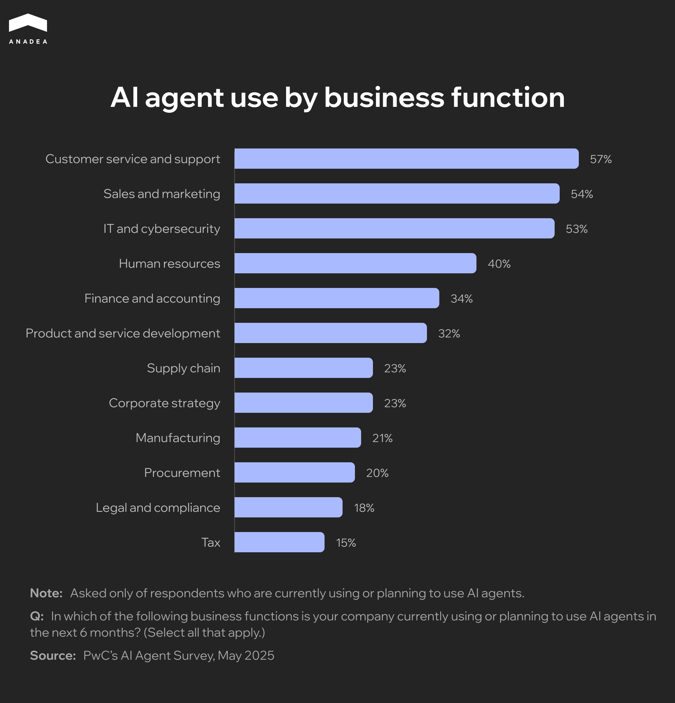
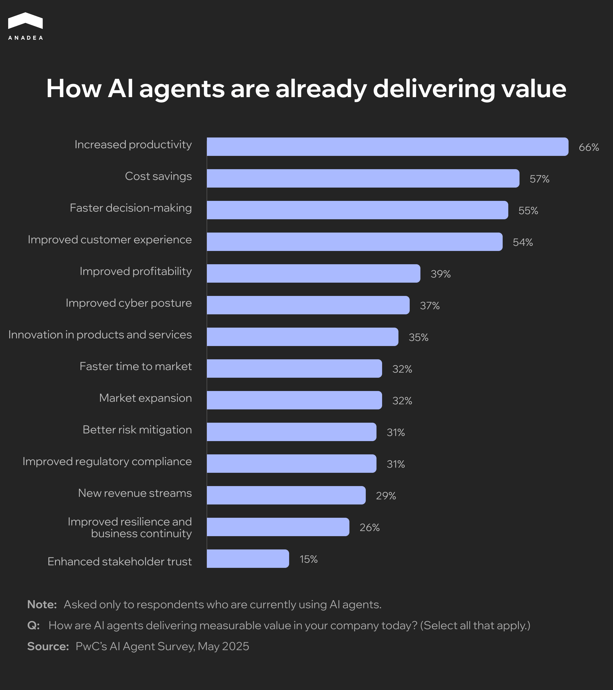
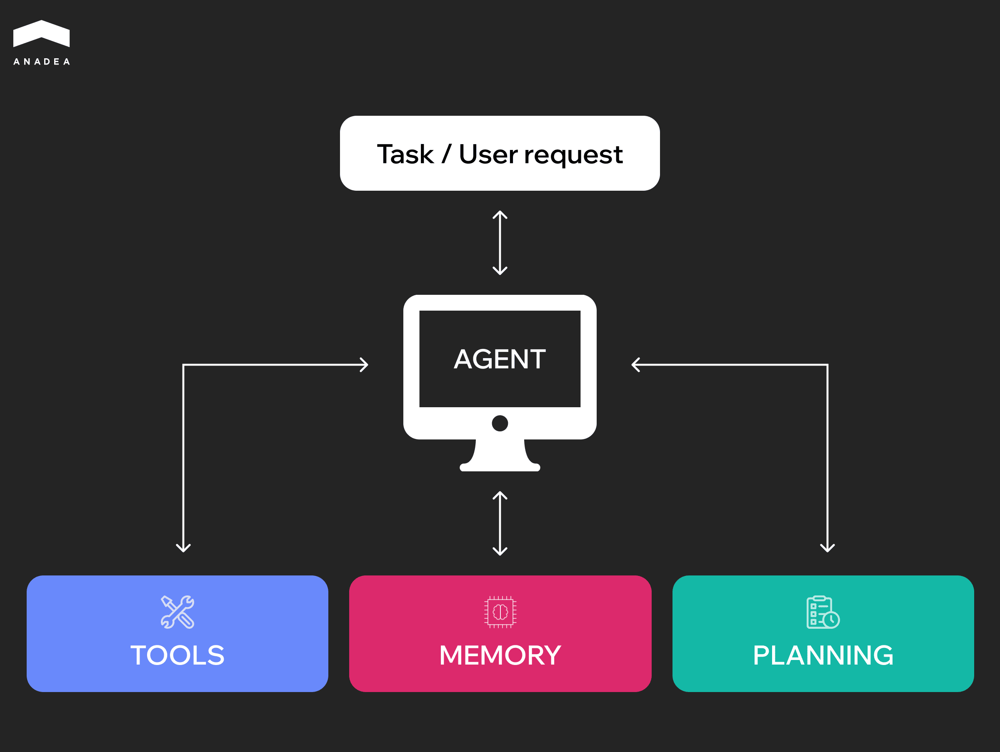

According to the [PwC survey](https://www.pwc.com/us/en/tech-effect/ai-analytics/ai-agent-survey.html), 75% of executives think that AI agents will change the workplace more significantly than the wide adoption of the internet did. Meanwhile, 88% of companies plan to increase their AI-related budgets in 2025 due to agentic AI. These statistics reflect a growing belief in the power of agentic AI to optimize and simplify the way we work and solve problems.

From customer support chatbots to data analysis tools, [AI agents](https://anadea.info/services/custom-ai-agent-development) can bring efficiency to many business processes and aspects, including customer support, data search, analytics, and many others. Moreover, they help significantly reduce the dependency on human input.

This guide offers a practical approach to building such solutions. Based on our solid expertise in [AI software development](https://anadea.info/services/ai-software-development), we will explain this topic in simple terms. That’s why, if you are just starting your journey with artificial intelligence, our article will help you better understand the basics.

## What Is an Agent in AI?

An AI agent is an autonomous or semi-autonomous software system that can perceive its environment, process data, make decisions, and take actions to achieve specific goals.

Such systems work based on a combination of inputs, including data received from users, sensors, or other systems, as well as algorithms and decision-making rules. Additionally, they are powered by an output mechanism that enables them to interact with users and the environment.

### How AI Agents Can Be Used

Already today, AI agents have found their use across industries. According to PwC’s AI Agent Survey, as of May 2025, 57% of companies have already implemented AI agents for customer support or are planning to do so within the next six months. Sales and marketing are the second most common applications of such solutions, while IT and cybersecurity are in third place.

#### Real-life Examples of AI Agents

Today, a lot of prominent companies have already successfully launched their AI agents.

* **Customer support**. [Zendesk AI agents](https://support.zendesk.com/hc/en-us/articles/6970583409690-About-AI-agents) are powered by natural language understanding and action capabilities. They can handle [80%+ of customer interactions](https://www.zendesk.com/service/ai/) without human participation. AI agents detect customer intent and sentiment to craft responses in a human-like manner. Some of the businesses that implemented Zendesk AI agents in their processes report significant outcomes, like a 66% automation rate, up to 50% reduction in ticket volumes, and multi-hundred-thousand-dollar savings per year.
* **Coding assistants**. [GitHub Copilot](https://github.com/features/copilot) provides real-time code completions, from single lines to entire functions or boilerplate. Additionally, it can offer review suggestions to improve your codebase. In a controlled experiment, developers using GitHub Copilot completed coding tasks [55% faster](https://github.blog/news-insights/research/research-quantifying-github-copilots-impact-on-developer-productivity-and-happiness/) than those without it. 87% of surveyed users said Copilot helped preserve mental energy during repetitive tasks. 73% noted Copilot helped them maintain focus and stay in the flow.
* **Data analysis and reporting**. Such agents can pull data, analyze trends, and generate reports. Power BI Copilot is one of the examples. Even non-technical users without specific knowledge can build reports, generate insights, and explore data through prompts in natural language. [Power BI Copilot](https://learn.microsoft.com/en-us/power-bi/create-reports/copilot-introduction) integrates smoothly with services like Azure Data Factory, Dynamics 365, and Microsoft Teams.

The data that comes from PwC’s survey shows that 66% of respondents cited increased productivity as the main advantage of using AI agents. Cost savings (57%), faster decision-making (55%), and improved customer experience (54%) are among other commonly mentioned benefits.



### AI Agent App vs Chatbot vs LLM Wrapper

Sometimes AI agents are compared to chatbots and LLM wrappers. All of them can understand and respond to natural language, as well as fulfill some of the tasks that previously couldn’t be performed without human participation.

Nevertheless, these are different types of solutions. While AI agents can demonstrate autonomous or semi-autonomous behavior, chatbots are just conversational interfaces that can simulate a natural dialogue. At the same time, LLM wrappers are apps that allow users to interact with large language models via a visual interface, but they can’t function independently.

You can find a more detailed comparison in the table below.

<table>

<thead>

<tr>

<th>

<strong>Aspect</strong>

</th>

<th>

<strong>AI Agents</strong>

</th>

<th>

<strong>Chatbots</strong>

</th>

<th>

<strong>LLM Wrappers</strong>

</th>

</tr>

</thead>

<tbody>

<tr>

<td>

Autonomy&nbsp;

</td>

<td>

High (can make decisions and act independently)

</td>

<td>

Low (can only respond to direct input)

</td>

<td>

Medium (can act in response to prompts)

</td>

</tr>

<tr>

<td>

Planning and reasoning

</td>

<td>

Can plan, reason, and organize a sequence of actions

</td>

<td>

Usually, just use predefined rules or scripts

</td>

<td>

Rely on LLM outputs

</td>

</tr>

<tr>

<td>

Goal orientation&nbsp;

</td>

<td>

Designed to achieve specific objectives

</td>

<td>

Follows static flows

</td>

<td>

Don&rsquo;t have a built-in goal orientation

</td>

</tr>

<tr>

<td>

Scope of tasks&nbsp;

</td>

<td>

Can take real-world actions (email sending, API calling, etc.)

</td>

<td>

Limited to message responses

</td>

<td>

No task execution by default (but can be coded)

</td>

</tr>

</tbody>

</table>

## Key Components of an AI Agent App

Before we proceed to our practical tips on how to build AI software, let’s take a closer look at the structure of an AI agent. Thanks to this, you will get a better understanding of how such solutions work.

* **Planner**. This element analyzes the goals of your agent, the current environment, and the available tools. Based on this, it can determine what should be the next step of your agent. When an objective is complex, the processes of achieving it can be broken down into smaller steps.
* **Memory**. This component enables an AI agent to remember decisions and results of previous interactions. Short-term memory stores the context within one session for task continuity. Meanwhile, long-term memory keeps knowledge across sessions. It stores historical data in vector databases for retrieval and future use. Such memory composition supports learning, iteration, and building on past work.
* **Tools**. AI agents can be integrated with such tools as APIs, databases, web search, file systems, calculators, etc. to perform a wide range of real-world tasks.

## How to Build an AI Agent: Design Principles for Effective Solutions

Thanks to the capabilities of AI agents, they can be entrusted with highly important tasks and processes. That’s why it’s crucial to approach the creation of such solutions with excellent knowledge of design principles.

### Goal Orientation

Your AI agents should not just respond to isolated inputs. They should have a clear understanding of the end goal.

It is necessary to design them with a roadmap in mind. Each action or decision that agents make should contribute toward a larger goal (like improving client communication, automating repetitive tasks, or providing data-driven insights). 

### Modularity and Reusability

With this approach to building your AI solution, your team should create a library of modular components (for example, for document summarization or data extraction). These components can be reused across different agents and projects.

As a result, it will be faster and cheaper to develop and debug new tools. Instead of developing everything from scratch, your team will be able to integrate ready-to-use components into new solutions.

### Safety and Alignment

When your AI agents are built to act autonomously, you should be ready that their behavior can be unpredictable. Nevertheless, misalignment with user goals or unsafe practices can result in real-world harm, such as exposing sensitive client data or generating misleading information. 

Implementing safety checks, strict access controls, and alignment testing during development are crucial for building trustworthy and safe AI tools.

### Feedback Loops and Continuous Learning

One of the most important advantages of AI agents is their ability to learn from their experience. Thanks to this, they can better adapt to the environment and demonstrate higher results over time.

Your team can integrate structured feedback loops of different types. For instance, users may have the possibility to rate outputs or flag errors. Over time, small gradual improvements can result in significantly better performance and higher accuracy of your AI models.

## Tool Stack Overview

To build an AI agent that will address your needs, you should also choose the right frameworks and infrastructure tools for it. Let's consider the most popular technologies used in AI software development.

### Frameworks

Frameworks define agent architecture and help you structure the elements of your solutions. Popular options are **LangChain** and **Semantic Kernel**. Some available frameworks offer specific possibilities. For instance, **AutoGen** and **CrewAI** allow developers to build multi-agent systems.

### Large Language Models (LLMs)

An LLM powers the reasoning and generation capabilities of your AI agent.

**GPT models** by OpenAI are suitable for general-purpose reasoning. **Claude** by Anthropic is good for following complex instructions with a long context. Meanwhile, **Mixtral** by Mistral is known as a high-performance model. There are also open-source LLMs like **Llama** by Meta or **Grok** by xAI that can offer great flexibility and customization. As a result, businesses can fine-tune such models on their own proprietary domain-specific data, deeply integrate them with internal systems and workflows, as well as deploy on private infrastructure.



### Vector Databases

Such databases are required for memory, context enrichment, and retrieval-augmented generation (RAG). **Weaviate**, **Pinecone**, **FAISS** are among the most commonly chosen options.

### Orchestration Tools

They are used to coordinate tasks, API calls, or background processes. For example, **Celery** helps organize job queues for heavy or async tasks.

Meanwhile, **LangGraph** ensures visual and code-based orchestration for LangChain agents.

### Other Utilities and Methods

There are also some other tools and techniques that can help you build advanced functionality for your AI agent.

* **OpenAI function (tool) calling** allows agents to call external systems and work with data that was not included in their training datasets.
* **ReAct (reason + act)** is a prompting pattern that will enable your agent to switch between reasoning and taking actions. As a result, they can think step-by-step and explain their decisions. Thanks to this, it is possible to reduce AI hallucinations and improve transparency.
* **The RAG method** combines LLMs with search-based grounding. Your agent will be able to get access to real knowledge, like your company docs or product manuals.



## Step-by-Step Guide: How to Create an AI Agent for Summarizing Business Emails

Now, when you know the key design principles and tools that can be used for building an AI agent app, it’s time to find out how to organize the development process. Of course, some steps can slightly differ depending on the exact type of your solution.

For gaining a general understanding of how to build AI tools, we invite you to consider the basic stages of the development of a simple AI agent. As an example, we have decided to take an agent for summarizing business emails.

### Step 1. Define Your Goal

First of all, you need to define what your agent is supposed to do. 

For greater clarity, we will use an example from our practice. Our customer on that project was a US-based law firm that turned to us with a request to build an AI agent. The agent was expected to automatically get the main points of an email and provide a readable summary.

Here, the first thing that we needed to understand was whether the agent should summarize single messages one by one or entire threads, as well as how the email summary would be delivered to users. Given the company’s workflows, it was decided to summarize single messages and the summaries would be added to the top of each incoming email.

### Step 2. Choose Your LLM and Framework

As we have highlighted in our article, today there is a rich choice of frameworks and large language models like GPT-4, Gemini, and Claude that can be used for building an AI solution. 

At this step, it will be necessary to choose the best-suited options for your projects. Here, you need to take into account the functionality of each option, as well as its integration capabilities and pricing.

For our AI agent for a law firm, we chose Claude. This model is known for its safety working in sensitive contexts. Moreover, it is good at summarization and understanding nuanced text.

### Step 3. Add Memory and Context Management

Empower your agent with the ability to remember relevant context. This is especially important if you expect it to summarize multi-email threads.

You can use a simple document memory or a retrieval system. In the case of a retrieval system, your agent will be able to find relevant information from external knowledge sources to improve the quality of its outputs. 

We also enriched our agent with retrieval capabilities to let it get the latest updates from the legal field.

### Step 4. Integrate Tool Use

You need to allow the agent to interact with external systems and work with their data.

As we are building an email summarizer, you may need an Outlook or Gmail API, so that your agent will get access to email content. 

Integrations with a CRM system and/or Calendar can be done via an AI agents plugin. This will provide your agent with additional context. 

Apart from the email system, our AI agent was also integrated with a case management system. This integration enables the agent to add summaries into case records and automatically link emails to specific cases.

### Step 5. Test with Realistic Scenarios

It’s essential to run real-world tests. For this, you can use actual or sample emails. When testing your agent, evaluate summary clarity and accuracy of key points.

We also recommend using edge cases. We also did it. We tested our agent on long threads and emails from multiple senders.

### Step 6: Improve via Feedback

When the first version of your agent is functional, you need to find out what users think about it. 

It’s necessary to allow users to rate the quality of the agent's work and share their feedback. Thanks to this, you will get valuable insights for further tool and logic updates.

For businesses, it can be pretty challenging to build AI tools, relying solely on their in-house teams. Quite often, they don’t have developers with relevant skills on board, while training or hiring can be expensive and time-consuming. That’s why working with AI software development companies like Anadea can become a good option for them. 

At Anadea, we have been successfully building AI solutions since 2019, helping companies across various industries gain a competitive edge. This allowed us to gain a deep understanding of the specificity of this technology and its value for different domains.



## How to Debug and Enhance Your AI Agent

Apart from knowing how to build AI software, it’s also crucial to know how to make it bring the highest value for your business. That’s why after performing 6 key development steps, you need to dive deeper into how to evaluate and strengthen the performance of your AI solution.

Our tips will help you.

* Set up structured logging for inputs, outputs, decisions, tool usage, and errors.
* Define clear success metrics for your agent and create checklists to automatically mark pass/fail on each completed task (for example, “Did the agent summarize the email correctly? Yes/No”).
* Measure how long your agent needs to respond and act. Log response times to flag slow behavior.
* Detect and reduce hallucinations. To do it, regularly test your agent on known inputs.
* Create a test suite with diverse inputs and periodically run automated evaluations.
* Replay and inspect failures to detect pain points.

## Common Pitfalls in AI Agent App Development and How to Avoid Them

When you are building a custom AI solution, you should think not only about the development approaches or tools to use, but also about the challenges that you may face. Based on our practical experience in the AI development domain, we’d like to share the most widely spread pitfalls and efficient ways to get over them.

<table>

<thead>

<tr>

<th>

<strong>Issue&nbsp;</strong>

</th>

<th>

<strong>Explanation</strong>

</th>

<th>

<strong>Solution</strong>

</th>

</tr>

</thead>

<tbody>

<tr>

<td>

Over-reliance on single prompts

</td>

<td>

AI agents are often built around static prompts. When tasks are complex or multi-step, this may lead to unreliable behavior.

</td>

<td>

Break tasks into multi-step prompt chains;

Introduce planning modules. They will enable the agent to reason about tasks and adjust its approach;

Validate outputs at each step.

</td>

</tr>

<tr>

<td>

Poor integration with the necessary tools

</td>

<td>

Your AI agent should be smoothly integrated with external tools (browsers, databases, and APIs). Otherwise, the agent may have difficulties in performing real-world tasks.

</td>

<td>

Remember about the required integrations at the architecture design stage;

Use structured APIs;

Thoroughly test integrations.

</td>

</tr>

<tr>

<td>

Lack of a user feedback mechanism

</td>

<td>

If AI agents can&rsquo;t get feedback from users, they can&rsquo;t learn from their experience and repeat mistakes.

</td>

<td>

Implement a feedback loop;

Use previous interactions for model fine-tuning;

Let users interrupt the agent&rsquo;s behavior when necessary.

</td>

</tr>

<tr>

<td>

Ignoring safety best practices

</td>

<td>

Without strong control, actions of AI agents can lead to leakage of sensitive information, loss of data, execution of malicious commands due to model hallucinations or prompt injections.

</td>

<td>

Introduce role-based permissions;

Restrict sensitive actions;

Monitor all inputs and outputs;

Use content filters to prevent unsafe behavior.

</td>

</tr>

</tbody>

</table>

## Final Word

With the right frameworks and best practices in place, your AI agent will be able to reason, autonomously make decisions, interact with tools, and adapt to real-world tasks. A well-designed solution of this type can become a powerful assistant that will save time and scale your capabilities.

Anadea can become your reliable tech partner on this journey. We can join your project at any step, from ideation to deployment and post-launch support. Even if you don’t have a clear plan and are just exploring the feasibility of implementing AI agents, [contact us](https://anadea.info/free-project-estimate), and our experts will find the best way to address your needs.
