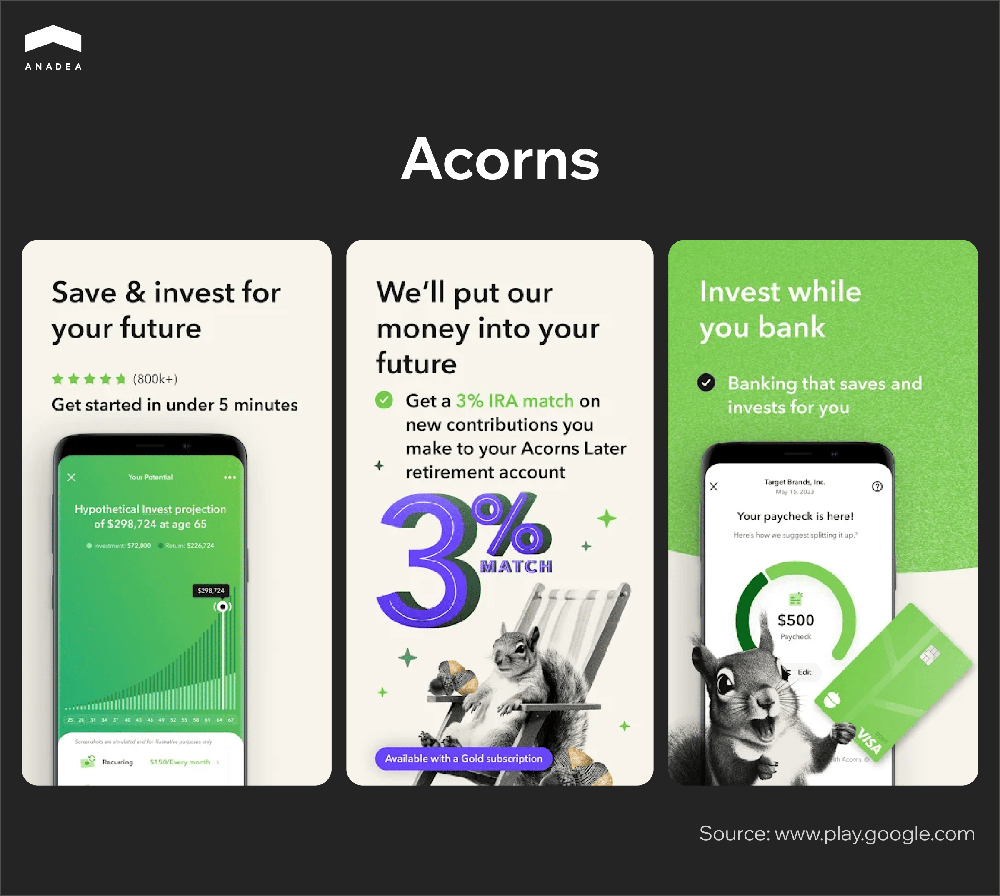

For many centuries, the financial industry used to be quite resistant to innovations. Nevertheless, today, in the era of digitalization, everything has changed. Traditional processes can’t always address the needs and meet the expectations of customers. This factor in combination with the growing competition from the side of [fintech](https://anadea.info/blog/fintech-mobile-app-development/) companies boosts the demand for [financial software development](https://anadea.info/solutions/financial-software-development). Today a lot of traditional banks have also already introduced their software solutions. However, the existing demand is not fully satisfied. This means that it is still a good time to enter the market with new digital financial tools. 

In this article, we are going to talk about one of their types and explain how to create an investment app that will rock the market.

## Online investment apps: Market overview

An investment application is a mobile, web, or desktop software solution that enables users to invest in various financial instruments, such as stocks, bonds, mutual funds, ETFs, cryptocurrencies, and others. 

These apps are designed to make investing more accessible, user-friendly, and often more affordable in comparison with traditional investment methods.

In 2024, the size of the global investment app market is [valued](https://www.cognitivemarketresearch.com/investment-apps-market-report?srsltid=AfmBOopciz5Ozy0tyiA-JwwSDFXFC3idE4ZA4wa3wHPo7557itHy3oRh) at $24.5 billion. Analysts expect that the market will grow at a rather high pace. According to the published research, by 2031, it will hit the mark of over $101.4 billion. This means that the projected CAGR for the period from 2024 to 2031 is 22.5%.

Mobile solutions represent the fastest-expanding category in the market.

What factors boost the industry's growth?

* Increased financial awareness (especially among Millennials and Gen Z);
* High smartphone penetration rate (The global rate of smartphone penetration [reached](https://www.statista.com/statistics/203734/global-smartphone-penetration-per-capita-since-2005/) 69% in 2023, while in 2022, it was at the level of 68%);
* Continuously growing mobile internet usage (it is [expected](https://www.statista.com/statistics/275587/mobile-phone-internet-user-penetration-us/) that in 2029, in the US, the mobile internet penetration will be over 89%);
* Overall [digitalization](https://anadea.info/blog/digital-transformation-in-banking/) in the finance and banking industry;
* Low-cost online stock/asset trading;
* Accessibility;
* Variety of available investment tools.

## The most popular types of online investment apps

Before finding out how to create an investing app, it’s very important to make up your mind on the type of solution that you will build. Here are some app types that boast high popularity today.

### Stock trading apps

They enable users to buy and sell stocks and ETFs (exchange trading funds). These apps are traditionally equipped with real-time market data, technical charts, and customizable watchlists. Such solutions may not be the best choice for beginners. They are mainly targeted at active traders and investors who are focused on self-directed investing.

### Robo-advisors

These tools help users automate the process of investing based on the indicated goals, risk tolerance, and timelines. Such solutions can be standalone applications or separate modules of a broader platform. They can also offer portfolio management and automatic rebalancing features. They are often chosen by beginners and passive investors who are looking for low-cost investment management.

### Cryptocurrency investment apps

These applications facilitate trading and holding of crypto assets like Bitcoin, Ethereum, XRP, and others. As a rule, they have integrated crypto wallets and such features as price tracking charts, staking, and earning rewards. Though there are a lot of critics of cryptocurrency in the world of traditional finance, the general sentiments are gradually changing. The demand for such apps, as well as crypto adoption, is continuously growing. 

### Micro investing apps

Such solutions allow users to invest small amounts of money, often by rounding up purchases. They are enriched with automatic savings and investing tools, fractional shares of stocks and ETFs, as well as educational materials for beginners.

### Retirement investing applications

These tools are intended for long-term retirement investing through tax-advantaged plans, like 401(k) in the US. They offer tax-efficient portfolios and tools for financial planning.

### Educational apps for investors

You can create an investment app that will provide tools and content for learning about investing and financial markets. New investors who want to learn the basics can benefit from simulated trading, gamified quizzes, and interactive courses.

### Social investing apps

The idea of these solutions is based on integrating social networking with investing. This concept makes it easier for users to discuss market trends, share strategies, and copy trades. Apps from these groups can also be highly valuable for beginners who want to get inspired by investing skills and knowledge of more experienced users. But also they are quite popular among those who prefer collaborative investing. These applications have community forums, copy-trading options, and leaderboards for top-performing investors.

## Perks of investment app development

For those who are considering the creation of an investment application, it is vital to understand whether this project will ensure any benefits.

Here are the advantages and new opportunities such a solution can bring to both businesses and users.

### Benefits of investment app development for businesses

* ***Entry to an actively growing market.*** The demand for digital financial tools is rapidly increasing. It is explained by the people’s desire to rely on modern technologies to manage their finances. It happens as younger, tech-savvy generations, including millennials and Gen Z, are starting to pay more attention to the investment market.
* ***The possibility to reach a wide audience.*** Investment apps look appealing to a broad group of potential users, from beginners to experienced investors. Beginners can benefit from robo-advisors and educational tools. At the same time, traders with solid experience can leverage advanced analytics and fast execution. Moreover, investment apps can also address the needs of niche markets. For instance, today a lot of applications of this kind are targeted at crypto enthusiasts.
* ***Multiple revenue streams.*** Investment apps can offer numerous monetization opportunities, like transaction fees or subscription plans. We will talk about these opportunities in more detail further in our article.
* ***Strengthened brand identity.*** With the launch of your own investment app, you can successfully position your company among leaders in financial services. Thanks to custom development, you can deliver innovative solutions that will successfully differentiate your brand.
* ***High ROI potential.*** The initial cost of app development can result in significant long-term returns. Today there are excellent examples of how financial startups managed to become multi-billion-dollar companies (like Robinhood).

### Benefits for users

* ***Democratization of investments.*** You can create an investment app that will break down barriers and make investing accessible to everyone. For instance, fractional shares can allow users to start their investment journey with as little as $1. If you want to target your app at beginners, you should take care of creating intuitive interfaces and helpful educational content. This will simplify investing.
* ***Promotion of financial literacy.*** Many users want to learn how to manage their money effectively. And such an application can become an excellent educational tool. You can include articles, videos, or simulators, as well as real-time insights into investment performance.
* ***Flexibility.*** Users can adjust their investments to suit changing goals or circumstances. For example, they can pause trading, withdraw, or reallocate funds without penalties.
* ***Convenience.*** Software products of this type can consolidate multiple financial services in one place. Very often, they can be enriched with integrated budgeting, saving, and investing tools. Just with one click, users can get access to their transactions, performance reports, and tax documents. As a result, the use of such an app can save users’ time and effort in managing their finances.
* ***Diverse investment options.*** Applications can offer access to a wide variety of investment opportunities. For example, stocks, ETFs, mutual funds, bonds, and cryptocurrencies are often available in one app. This allows users to easily diversify their portfolios and reduce risk.
* ***Cost efficiency.*** Users of digital investment tools can save money compared to traditional investment methods. This helps to make investing affordable, even for investors with limited budgets. For instance, some applications offer commission-free trades. At the same time, the use of robo-advisors is much cheaper than the services of human advisors.



## The most highly demanded features of investment apps

If you want to create an investment app that will be able to succeed, you need to attentively think through the functionality. We offer you to consider the list of features that you can build for your app.

* ***User registration and authentication.*** You should ensure an easy sign-up process with options like email, phone number, or social media accounts. It’s also highly recommended to include secure login with multi-factor authentication and KYC and AML verification processes.
* ***User dashboard.*** This section should display portfolio performance, balance, and recent activity. It should also provide quick access to key features like trading, deposits, and notifications.
* ***Investment options.*** Depending on the type of your app, you can offer the following assets in different combinations: stocks, ETFs, mutual funds, bonds, cryptocurrencies, and much more. You can also introduce filters to search for assets by type, sector, or performance.
* ***Transactions.*** For the convenience of users, you need to introduce real-time trading tools with minimal delays. You can also implement limit orders, stop-loss orders, and other advanced trading options.
* ***Market insights.*** This functionality should include real-time market data, stock quotes, and news updates. Apart from this, you can also offer users detailed analytics, expert recommendations, insights, and reports.
* ***Education and learning tools.*** This section traditionally contains articles, videos, and tutorials on investing basics and strategies. It is also possible to expand your app’s functionality with simulators or trading accounts for trading with virtual money.
* ***Social and community features.*** You can introduce such a feature as social trading. It will allow users to follow and replicate the strategies of experienced investors. Apart from this, you can enrich your app with forums or chats for sharing insights and ideas.
* ***Notifications.*** Real-time notifications for stock price changes or executed trades will positively influence user experience. Moreover, personalized reminders for deposits or investment updates will also have a huge importance.
* ***Payment integration.*** You will need to integrate payment gateways for deposits and withdrawals. We recommend you introduce multiple payment methods, including bank transfers, credit cards, and digital wallets. With this, you can be sure that every user will find a suitable option.
* ***AI-powered personalized recommendations.*** AI can continuously analyze user behavior, financial goals, and risk tolerance to recommend asset options and investment strategies.
* ***Predictive market insights.*** ML models can predict market trends using historical data, news, and macroeconomic indicators. Based on this, users can be informed about upcoming market volatility or bullish trends.

## Examples of the best online investment apps

To create your own excellent solution, it will be useful to analyze what the best online investment apps offer to their users.

### Robinhood

Robinhood Markets is a US financial services company founded in 2013. Today it offers an electronic trading platform accessible via a mobile app. The application has all the required functionality for commission-free trades of stocks, ETFs, and crypto assets.

Robinhood Markets’ revenue is generated from several sources. First of all, the company has introduced a transaction-based model. Secondly, it gets net interest income. And thirdly, it can leverage subscription fees.

The company has more than 24 million funded customers. The number of monthly active users is around 11 million. The amount of assets under custody is valued at $152 billion.

### Acorns

This investment app was built to promote passive investing and facilitate financial management-related tasks for a wide audience. The history of Acorns started in 2012. And since then, the company and its flagship application have been demonstrating excellent growth. The app enables users to round up their everyday purchases to the nearest dollar and invest the difference in exchange-traded funds created by experts.

Acorns automated and simplified the possibility of benefiting from passive investments. According to the info provided by the company, over 13 million Americans have already invested more than $22 billion with Acorns.

### eToro

eToro was established in 2007 and was initially launched under a different name. It was known as RetailFX. Today it is widely known as a social trading and multi-asset investment company. As of the beginning of 2024, it had 35.5 million registered users with more than 3 million funded accounts.

eToro’s platform opens access to thousands of stocks on 20 exchanges from all over the world. Just after creating an account, a new user gets $100,000 in a virtual portfolio. This amount can be used to test all features with zero risk.

Moreover, eToro is positioned as a platform to connect and share strategies with other investors. It offers its own copy trading technology to replicate the best traders’ actions automatically. 

## How to create an investment app: Brief step-by-step guide

The investment app development should be a well-structured process. Here are the main steps to include in it.

1. ***Ideation and market research.*** Identify the primary goal of the app and understand your audience. You also need to analyze the ongoing[ industry trends](https://anadea.info/blog/open-finance-vs-open-banking/), competitors, as well as identify gaps or unmet needs in the market. In other words, at this stage, you should have a clear understanding of the concept of our solution and its ability to address users’ needs.
2. ***Requirement preparation.*** You need to choose your app’s features, including those that will be built for the minimum viable product and those that will be added to the full version. Based on the desired functionality, you will be able to choose the required technologies and integrations. You can discuss the tech stack with your investment app development team.
3. ***Planning.*** Your project team should prepare a detailed roadmap with milestones and timelines. Of course, you should be ready for some flexibility. Nevertheless, the initial plan should be created to guide the team throughout the process.
4. ***Design and development.*** At this step, the team should design interfaces and build features for your app according to your requirements and the set plan. Approaches to the development can differ based on the chosen methodology.
5. ***App testing and launch.*** Before your app becomes available to users, it is vital to test its security and the correctness of its functionality. It can be done with the help of tests of different types. Some of them should be conducted in parallel with development. At the same time, it is also crucial to test the general performance of the solution after all bugs are fixed. You need to make sure that all the introduced changes haven’t caused any new issues.
6. ***Monitoring and updates.*** After the launch, your work on the app should still go on. It is very important to track its performance, timely detect and react to all possible vulnerabilities, as well as improve the existing features. We always recommend our customers attentively listen to users and try to enhance the apps based on their opinions.

   

## How to monetize your investment application

To achieve your goals, it’s vital to know not only how to create an investment app but also how to earn money on it. When it comes to solutions of this type, there are several monetization models that you can apply. You can choose only one of them or combine several at once. Everything depends on your key target audience and your business approach.

### Management fees

Very often online investment apps charge their users a percentage of their assets under management (AUM). For example, it can be an annual fee of the size from 0.25% to 0.50%.

### Subscription plans

You can offer tiered subscription plans that may include different sets of features. As a rule, a free tier provides only basic tools and limited functionality. At the same time, paid tiers can be equipped with various premium features, like advanced analytics, market insights, and personalized financial advice. If you choose this monetization model, please bear in mind that you need to have a very clear differentiation between free and paid tiers. Users should fully understand why it’s worth paying for upgrades.

### Transaction fees

This model presupposes that you will take a fee for each transaction made on your app. We recommend you keep transaction fees competitive and transparent to maintain user trust.

### Ads and sponsored content

You can offer brands to place ads on your application. In the case of investment platforms, it can be a good idea to cooperate mainly with financial companies that are interested in promoting their products among users of your app. If you have a section with financial advice, you can also publish sponsored posts. But regardless of the chosen approach, it is crucial to adjust ads to users’ needs and not to annoy users with excessive advertising. 

### Data monetization

As an operator of an investment application, you will get access to valuable insights into user behavior and preferences. This data can represent huge value for different third-party organizations. For example, financial institutions can use this data for market analysis or trend forecasting. However, if you want to sell this data, you should be very careful to avoid ethical or legal concerns. First of all, you need to obtain user consent for collecting any info about them. And secondly, given the existing legal norms, you can share only anonymized aggregated data.

## How much does it cost to create an investment app?

Questions about the investment app development costs are always among the most popular ones that we get from our customers. That’s absolutely natural. For businesses, it is crucial to plan their budgets beforehand. However, the issue is that it is impossible to provide an accurate answer just at once. To name realistic figures, a development team should analyze your project type, its complexity, and its peculiarities. 

Based on our experience, we can say that an MVP (minimum viable product) may cost around $20K-$30K. The cost of the development of a full-scale app usually starts at $40K. Nevertheless, the more sophisticated features your solution would include, the higher the price will be.

As a rule, to estimate project costs, development teams need to apply the following formula:

Required work hours * Hourly rate

The complexity of solutions has a direct impact on the time needed for their creation. Here’s why some apps can turn out to be significantly more expensive than others.

Other factors that influence the project costs are related to the team that you will hire. The size of the team, its compositions, the seniority of the team members, and the location where the team is based will also affect the final amount.

We strongly recommend you discuss the financial questions with developers before making the decision regarding cooperation with them. You should understand beforehand how to allocate your budget. 

At Anadea, you can get a quote for free. In order to get estimates from us, just [share your requirements](https://anadea.info/free-project-estimate) with us.

## How we can help you with investment app development

If you are looking for a reliable tech partner, we will always be ready to help you. We have been working in software development since 2000 and have accumulated exclusive expertise in various business domains. And financial software development in one of them. In our portfolio, you can find a range of successfully delivered [fintech projects](https://anadea.info/projects-b2b#fintech) that can demonstrate our skills in solving tasks of different complexity. We deeply understand the current market needs and know how to use the power of emerging technologies to address them.

We offer very flexible terms of cooperation and do our best to make the process of communication with our team as convenient as possible. Want to learn more about our services? Do not hesitate to [contact us](https://anadea.info/free-project-estimate) and ask any questions you may have.
