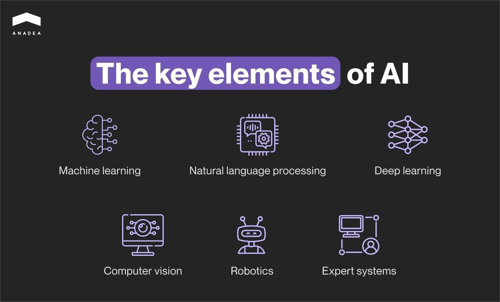
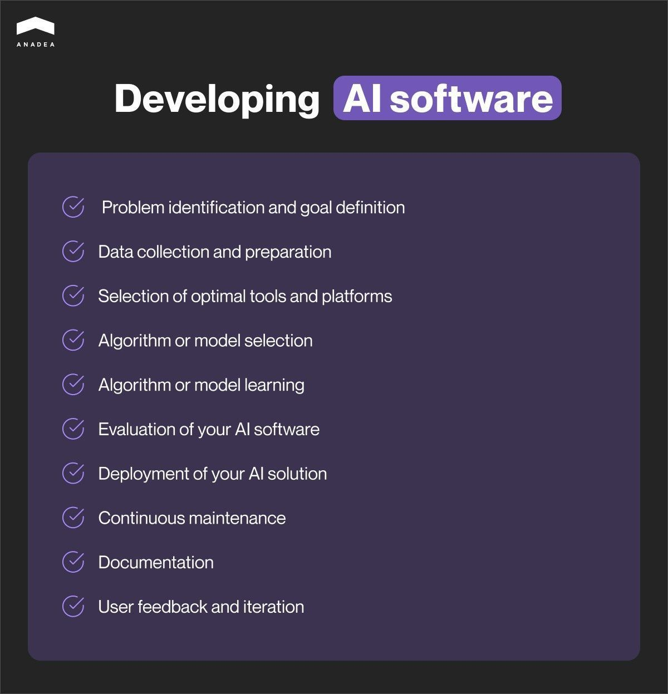

From streamlining operations to enhancing customer experiences, AI applications can level up your business in numerous ways. This article reveals how AI transforms industries and how to create AI software that can propel your company toward success.

Whether you're a startup striving for growth or a large enterprise seeking efficiency, this guide equips you with the knowledge and tools to harness the transformative power of AI.

## What is artificial intelligence?

Before diving into developing AI software, let’s first define what artificial Intelligence is.

AI is a technology that lets computers mimic human thinking and do actions that are traditionally performed by people. AI involves learning, reasoning, problem-solving, perception, and language use.

AI systems can analyze and interpret data, recognize patterns, make the right decisions, and even communicate with humans through natural language interfaces.

The subsets of AI include:

* **Machine learning** enables computers to learn from data and enhance their performance over time
* **Deep learning** teaches computers how to process data like the human brain.
* **Natural language processing** allows computers to interpret, understand, and generate human-like language
* **Computer vision** lets computers interpret and understand visual information extracted from images and videos.
* **Robotics** is a branch of AI used for creating robots - the programmed machines capable of performing physical tasks in the real world.
* **Expert systems** are computer programs that emulate the decision-making ability of humans to create solutions to complex problems.

These are just the [main elements of AI](https://medium.com/@a.sale/ai-what-are-the-different-domains-subsets-of-artificial-intelligence-4cfd5477584) that are now actively being developed and applied. As AI continues to evolve, the high chances are that new domains of AI will emerge soon.

## Why do businesses integrate AI?

Companies all across the globe now actively develop AI systems and integrate them into different processes. According to the [2024 Global AI Adoption Index – Enterprise Report by IBM](https://filecache.mediaroom.com/mr5mr_ibmspgi/179414/download/IBM%20Global%20AI%20Adoption%20Index%20Report%20Dec.%202023.pdf) \[PDF], about **42% of enterprise-scale companies actively deploy AI in their business**. An additional 40% are currently exploring or experimenting with AI.

What’s more, 59% of IT professionals at companies deploying or exploring AI report that their organization has already accelerated their investments in or rollout of AI during the past 24 months.

Creating an AI solution offers numerous advantages for businesses such as:

* **Enhancement of efficiency and productivity**. By leveraging AI-powered tools, companies can automate routine tasks and streamline processes, allowing employees to allocate more time to complex high-priority tasks.
* **Superior customer experiences.** AI-driven e-commerce platforms can offer personalized product recommendations on the basis of individual client preferences, purchase history, and browsing activity.
* **Accuracy and precision in data analysis**. Implementing AI solutions can lead to reduced errors and higher-quality outcomes. As a result, this will contribute to **cost savings** and a **competitive edge** by enabling businesses to offer high-quality products and services to their customers.

AI-powered chatbots and assistants can interact with customers in real time, answer their questions, provide necessary information about products or services, and facilitate transactions. By offering 24/7 support and individual assistance, chatbots can drive **more** **sales conversions and increase revenue.**

Considering all the benefits above, it’s no wonder that companies are actively creating AI software nowadays. The facts speak louder than words - according to [Forbes](https://www.forbes.com/sites/qai/2023/01/06/applications-of-artificial-intelligence/?sh=3940b6413be4), the AI market size is expected to reach **$**22.6 billion by 2025. In the long run, the AI market is predicted to show an **annual growth rate of 28.46%** (CAGR 2024-2030), resulting in a market volume of US$826.70 billion by 2030.

<a href="https://www.statista.com/outlook/tmo/artificial-intelligence/worldwide#market-size" target="_blank">Source: Statista</a>

## Industries that benefit from [AI development services](https://anadea.info/services/ai-software-development)

There are top sectors where applications powered by AI are [used the most](https://www.forbes.com/sites/qai/2023/01/06/applications-of-artificial-intelligence/?sh=3940b6413be4):

* [Fintech](https://anadea.info/solutions/financial-software-development)
* [eLearning](https://anadea.info/solutions/e-learning-software-development)
* Government
* [Healthcare](https://anadea.info/solutions/medical-app-development)
* Manufacturing
* Agriculture
* [Retail](https://anadea.info/solutions/retail-software-development) & [eCommerce](https://anadea.info/solutions/ecommerce-software-development)
* [Insurance](https://anadea.info/solutions/insurance-software-development).

### Fintech

AI helps detect fraudulent activities, automate manual processes like data entry and reconciliation, as well as predict market trends for better investment decisions. Also, chatbots in the finance industry assist customers in making transactions, managing their costs, and providing exclusive advice.

### Education

AI assists in personalized learning by adapting content to individual student needs, automating administrative tasks, providing virtual tutoring, and facilitating remote learning. AI-powered adaptive learning platforms can analyze student data and identify knowledge gaps, as well as provide personalized recommendations or 24/7 assistance to students.

### Government

AI helps to detect and prevent malicious actions, optimize resource allocation and planning, improve public safety through predictive analytics, and enhance citizen services through chatbots and virtual assistants.

### Healthcare

AI-powered applications in healthcare help with predictive analytics for early disease detection, personalized treatment recommendations, drug discovery, and patient care management. For instance, AI diagnostic software can analyze medical images to detect anomalies and assist healthcare providers in making super-accurate diagnoses.

### Manufacturing

AI in manufacturing optimizes production processes through predictive maintenance, inventory management, quality control, and supply chain optimization. Predictive maintenance systems, for instance, may use sensors to detect equipment failures, whereas AI-powered quality control systems can prevent defective goods from reaching the market. In addition, AI software enables the automation of repetitive tasks and enhances workplace safety.

### Retail & eCommerce

AI apps in the retail industry assist in demand forecasting, inventory management, personalized product recommendations, customer segmentation, pricing optimization, and customer service automation. AI-powered inventory management systems are able to analyze sales data to forecast product demand and optimize stock levels.

### Insurance

AI tools in insurance help companies with risk assessment and underwriting, customer service automation, personalized policy recommendations, and predictive analytics for pricing and risk management.



## How to build an AI tool: What is required?

Creating an effective AI system calls for several critical components. High-quality data is the basis of any AI solution. This data is then complemented by algorithms or models that process it effectively.

Moreover, sturdy infrastructure is imperative for both training and implementing your AI software. Whether you’re using on-premise servers or cloud platforms such as AWS or Google Cloud Platform, a reliable infrastructure is indispensable.

In addition, no AI solution can do without statistical analysis, machine learning, and the use of programming languages like Python, Java, or R.

A combo of these technologies coupled with effective coding skills can help you build an effective AI solution.

## How to develop artificial intelligence software: Step-by-step guide

Creating AI software from scratch is a rather daunting task, but if you break the whole process down into manageable steps, things can get much easier.

There are different views on how to build AI software and what steps the process should include, but we recommend you perform the following stages:

### 1. Problem identification and goal definition

Start with defining clear, measurable goals aligned with your business needs. these may be improving efficiency, enhancing accuracy, boosting customer experience, etc. At this step, remember to consider:

* **Feasibility**: can AI software effectively address my issue?
* **Impact**: what benefit will the AI app bring to my organization?
* **Data availability**: do I have quality data to address this problem?

### 2. Data collection and preparation

Gather relevant, high-quality datasets for training your AI model. Then, preprocess the data to handle missing values, inconsistencies, and outliers. Tools like Python's Pandas library can come in great handy at this step.

Also, make sure that the data adheres to privacy regulations and is relevant to your defined problem.

### 3. Selection of optimal tools and platforms

By carefully choosing tools, technologies, and platforms, you can ensure the efficiency of your AI development process. So, choose appropriate tools and platforms based on your scalability needs, cost-effectiveness factor, and software compatibility.

### 4. Algorithm or model selection

Develop AI algorithms or select preexisting models based on the complexity of your solution and its data volume. It’s better to balance factors like computational resources, accuracy vs. speed, and interpretability.

### 5. Algorithm or model learning

Train your AI model using a substantial dataset divided into training and validation sets. Ensure your data is clean and relevant, avoid overfitting or underfitting, and consider computational resources. Make sure you have enough hardware capabilities or use robust cloud-based solutions.

### 6. Evaluation of your AI software

Evaluate your AI system's performance and define whether it meets defined goals. If yes, to what extent? At this step, you can test the AI software under various conditions and use techniques like cross-validation, precision-recall, receiver operating characteristic curves, or confusion matrices.

Additionally, you need to address factors like overfitting/underfitting, model bias, and real-world applicability.

### 7. Deployment of your AI solution

Integrate your AI solution into existing systems or workflows. Ensure your AI solution can handle large volumes of data load. In addition, don’t forget to implement strong security measures to protect sensitive data and systems. Establishing mechanisms to track the performance of your app and timely spot bugs is also crucial.

### 8. Continuous maintenance

After the launch, monitor your AI system's performance 24/7 and make regular updates to maintain relevance and optimal performance.

### 9. Documentation

Document the AI software's design, development process, updates, and implementation details comprehensively. Provide transparent explanations of how the software works and its limitations.

### 10. User feedback and iteration

Collect feedback from users to improve your AI software iteratively. Incorporate user feedback into the development process to enhance usability and effectiveness.

Take note that each of these steps requires careful planning, technical proficiency, and consideration of ethical implications to ensure the successful creation and deployment of your AI app.

## How to make AI software: What programming languages, AI platforms, and libraries to choose?

When creating an AI app, choosing the right programming languages, platforms, and frameworks is crucial. **Python** stands out for its simplicity and powerful data analysis capabilities, making it ideal for AI solutions. **Java**'s popularity and multi-platform support make it more suitable for mobile app development, including AI-based applications. **C++** excels in speed and efficiency, which is crucial for complex AI applications.

For AI development, engineers commonly utilize third-party platforms like **Google TensorFlow**, **Microsoft Azure**, and **Amazon AWS**, offering advanced algorithms and flexible ML technology. Frameworks such as **Microsoft Cognitive Toolkit**, **AWS Machine Learning**, and **PyTorch** simplify complex system development with pre-trained models and scientific computing structures.

Additional tools like **Core ML, Create ML, Caffe2, Keras, and sci-kit-learn** enhance AI development, while APIs such as **Azure Text Analytics API** and **Google Vision API** accelerate software development.

Ultimately, the choice of technologies depends on the specific project requirements, with developers selecting an optimal set of tools to create efficient AI software.

## Tips on how to build an AI system

When implementing AI systems, we recommend you stick to the following recommendations to ensure security, privacy, and adherence to standards.

1. **Restrict data access.** Limit the data accessed by AI systems, especially sensitive information, to minimize potential security risks.
2. **Human oversight**. AI systems are smart but they still can’t compete with people in terms of decision-making. AI-generated code may contain security vulnerabilities, so experts should always validate and test AI-driven features.
3. **Protect intellectual property (IP).** Avoid disclosing IP or private information to public GPT engines during AI-assisted development to safeguard sensitive data from unauthorized access.
4. **Track AI supply chain.** Monitor the supply chain to ensure the integrity of third-party data sources and training data used in AI systems. Thus, you can reduce the risk of tampering.
5. **Ensure compliance with relevant laws.** Review state laws regarding the use of AI tools to avoid non-compliance issues and penalties. For example, if your company operates in the USA, you are obliged to follow President Biden’s [Blueprint for an AI Bill of Rights](https://www.whitehouse.gov/ostp/ai-bill-of-rights/) and [Executive Order on Safe, Secure, and Trustworthy Artificial Intelligence](https://www.whitehouse.gov/briefing-room/statements-releases/2023/10/30/fact-sheet-president-biden-issues-executive-order-on-safe-secure-and-trustworthy-artificial-intelligence/).

Hire AI developers

## Challenges of building AI apps

When considering how to create artificial intelligence software, you should take into account the various challenges you may face:

* **Overfitting/underfitting.** Finding the balance in model complexity to avoid overfitting or underfitting may be quite tricky. If you fail, it can affect the AI's performance.
* **Poor data quality.** Insufficient data can hinder the performance of your AI app.
* **Integration issues.** Integrating AI into your existing systems can be complex and disruptive.
* **Interpretability and explainability.** Ensuring that AI models can provide explanations for their decisions is important for understanding how AI systems come to their conclusions, which is particularly important in healthcare and finance. However, this is not always easy to achieve.
* **Expertise shortage**. The demand for skilled AI experts exceeds the available talent pool, making it challenging to find professionals who are able to create effective AI solutions.

## Hiring AI developers to create AI for your business

As you may already understand from this guide on how to develop AI software, building AI software requires expertise. However, creating and maintaining an in-house team of AI developers may be challenging, costly, and time-consuming. That’s why outsourcing an AI development team appears to be a very lucrative option. Outsourcing companies like Anadea offer access to a wider pool of tech talent, including seasoned professionals with diverse expertise in AI development.

Outsourcing also provides cost savings compared to maintaining an in-house team (you only pay for specific services without the overhead costs of full-time employees). Additionally, outsourcing offers flexibility and scalability to accommodate project demands. Therefore, outsourcing AI development can speed up the development and deployment of your AI solutions while mitigating the challenges and costs associated with assembling and maintaining an in-house team.

What we offer:

1. **Access to the latest technologies**. By partnering with Anadea, organizations gain access to the latest advancements in AI technology. Our team always stays up-to-date with the trends and best practices
2. **Cost-effectiveness.** Clients can benefit from our competitive pricing options, avoiding the overhead costs associated with the recruitment process and training of in-house teams.
3. **Flexibility and scalability**. Anadea’s services provide clients with the flexibility and scalability to keep up with their changing requirements.
4. **Efficient project management**. Our experienced project managers ensure smooth cooperation, coordination, and timely delivery of projects. They work closely with clients to understand their goals, provide regular updates, and address any concerns throughout the development process.
5. **Quality assurance.** Our team maintains strict quality assurance standards to ensure the reliability, performance, and security of your AI solution. Through comprehensive testing and validation processes, we deliver high-quality products that meet your expectations.

## Final words

Overall, creating an effective AI solution is a quite comprehensive process that requires deep expertise. How do you create AI apps? It all depends on your needs, financial resources, the complexity of your solution, and some other factors. Outsourcing AI development to Anadea can take the hassle away by offering access to superior tech talent, cost-effectiveness, flexibility, and efficient project management.

We can help you create an efficient, resource-saving, and customer-centric AI solution from scratch within the minimum timeframe, without compromising on quality.

Ready to revolutionize your business? Contact us to get professional help on how to make an AI program tailored to your needs and turn your vision into reality!

Get in touch
