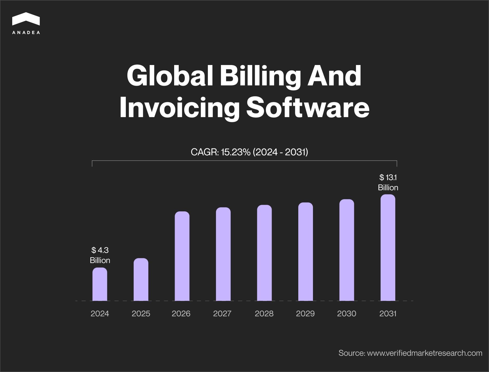

If you want your business to flourish, you should take care of the customer experience at all stages, including such steps as billing and invoicing. These are quite time-consuming and challenging processes that can take hours or even days. But only if they are performed manually or with the help of some obsolete and inappropriate systems. Well-thought-out custom billing software can fully change the game for you, your partners, and your clients.

In general, the popularity of [fintech software development services](https://anadea.info/solutions/fintech-software-development) is growing. And this trend has quite a simple explanation. Businesses fully realize the importance of financial management for their reputation and customer loyalty. Even the smallest mistakes or delays can have a too serious cost. In this article, you can learn how to create billing software that will help you fully control the invoicing process and make it as smooth as possible.

## Billing software: What is it?

In the beginning, it will be quite logical to provide a general definition of this notion. It can be explained as a digital solution that is used by businesses to manage their billing processes. Among the most important tasks of such tools, we should name the automation of payment processing, invoicing, and financial record-keeping.

The main goal of the implementation of this software is to facilitate and streamline all billing-related processes and increase their accuracy and efficiency. These systems usually have ready-to-use templates. This allows them to generate invoices for the sold goods and services with the relevant prices practically instantly. As a result, businesses can save a lot of valuable time and resources.

The size of the billing and invoicing software market is stably [growing](https://www.verifiedmarketresearch.com/product/billing-invoicing-software-market/). In 2024, it has reached the mark of around $4.3 billion. By 2031, it is expected to hit the level of $13.1 billion. Such figures mean that the projected CAGR for the period from 2024 to 2031 will be over 15%.

Today there are quite a lot of prominent billing software examples that are known practically all over the world. They are FreshBooks, Zoho Billing, QuickBooks, Blinksale, Dynamics 365, and others. These solutions are used by numerous companies and enterprises across various domains. Yet many businesses still prefer to rely only on custom products. And there are some weighty reasons for that.

## Benefits of custom billing software

Even though some off-the-shelf solutions have excellent reputations and reviews, only custom products can fully address your specific business needs. Let’s take a closer look at the advantages of such software.

* **Personalization**. Your product will be built by your business- and industry-specific requirements. It means that there won’t be any features that will be useless for you. At the same time, it will have all the tools that you will ask for. This will ensure smooth functioning and the best user experience. Moreover, your custom billing software design can reflect your business identity.
* **Seamless integration**. Quite often when you rely on a ready-made app, it may be difficult to use it together with all your other solutions and organize an adequate data exchange between them. Your custom product will be easily integrated with your inner systems and any third-party solutions that you use.
* **Flexibility and scalability**. A good billing software developer will always be able to ensure the required scalability of your solution. Your product will be designed to support your business growth and the increasing volumes of transactions. As a rule, it is easier to add new features to customs solutions than to any off-the-shelf ones.
* **Data security**. In general, [security](https://anadea.info/blog/fintech-security-challenges) remains to be one of the most serious concerns regarding fintech products. Solutions provided by vendors to a wide audience can be vulnerable to various security threats. With custom billing software development, such risks can be successfully avoided. It is possible to introduce the most powerful security measures such as encryption, access management, and security protocols that will correspond to your business requirements.
* **Cost-efficiency**. Of course, your software development project will require financial investments. Nevertheless, do not forget that you will still need to pay for off-the-shelf software solutions (usually on a monthly or annual basis in accordance with the subscription model). As a result, you will be able to leverage long-term cost savings compared to ongoing subscription fees of generic billing software.



## Key features of billing software

When you are thinking of building such a solution or have plans to customize billing software and enrich it with new tools, you should consider the most highly demanded features of such products.

* **Invoice generation.** This software should create invoices based on company branding, itemized charges, and payment terms.
* **Invoice delivery.** Modern systems of this kind can send prepared invoices automatically. Your customers or vendors can receive them via email, SMS, or any other indicated method.
* **Customer management**. It can maintain a database of customer information. For example, it can accumulate such info as contact details, billing history, and payment status.
* **Payment processing**. It is necessary to integrate such systems with payment gateways to facilitate online payments via different methods like credit cards and bank transfers.
* **Recurring billing.** With the help of such digital products, you can automate billing for subscription-based services with recurring payment schedules.
* **Expense tracking**. Your custom billing software can record and categorize all business expenses. This info can be further used for invoicing and financial reporting.
* **Tax calculation.** You can enrich your solution with a tool that will automatically calculate applicable taxes based on your jurisdiction and tax regulations.
* **Reporting and analytics.** Your software can provide detailed reports on sales, invoices, payment histories, and the overall financial performance of your company.
* **Product and service management.** Thanks to this functionality, you can ensure higher accuracy in billing. It will provide a simple inclusion of the relevant items in your invoices.
* **Notifications**. Your app should send notifications about sending invoices or payment dates. This will greatly enhance user experience.

Request a free quote

## How to create billing software: Step-by-step guide

Good planning is very important for your software development project realization. That’s why you should have a very clear understanding of how to organize the work of the development team in the right way.

1. **Goal definition**. First of all, you should set the right goals for your project. To do that, you need to define the tasks that your solution should perform and the needs that it should address. It is also very important to think about it in the context of your [business model](https://anadea.info/blog/fintech-business-model).
2. **Market research.** It will be also highly important to analyze what other solutions are offered in the market today. This is applicable even if you are not going to provide your software to a wide audience and it will be used only by your employees. By analyzing the existing solutions, you can find fresh ideas on how to improve your own product. It will be helpful even to read publicly available reviews. Users may highlight very important nuances that will help you avoid some issues in the future.
3. **Discussion of requirements and expectations with the development team.** When you already have a clear idea, you can start working with developers. At the beginning of this cooperation, it will be necessary to share with them all the ideas that you have. They will carefully study your requirements, ask for clarifications, and conduct their own preparations. Based on the results of their research, they will provide you with project estimates, offer the approach to its realization, help you choose the right tech stack, etc.
4. **Design and development.** When requirements are ready, the team will start working on them. Designers will offer prototypes and wireframes, while developers will elaborate the architecture and build features of your software. As a rule, we recommend you create an MVP of your custom billing software. This initial version of your solution with basic features will let you test the viability of your idea without huge investments. End users will start their interaction with this product and share their feedback. And you will have the possibility to introduce changes to your projects based on their opinions.
5. **Testing and QA**. As this software deals with financial management, it will be vital to carefully test it and fix all bugs. At Anadea, we always pay a lot of attention to this step as a correctly functioning solution can ensure higher customer satisfaction and trust.
6. **Deployment**. When everything is ready, the solution will be implemented. If you work with a good development team, specialists will always make sure that your software performs well in real-life conditions and interacts with your other systems in the right way.
7. **Performance monitoring and updates**. We always recommend continuously monitoring the performance of billing software and timely reacting to any detected vulnerabilities. You need to be confident that your sensitive business data is secure and that your cash flows are controlled only by authorized persons. Moreover, from time to time, your solution will require updates. And it is important not to miss these moments.

## Custom billing software: How much does it cost?

Naturally, businesses want to know the cost of their projects from the very beginning. Nevertheless, it is difficult to make any estimations without studying the requirements for your product.

There are numerous factors that your development team should take into account while calculating the costs:

* The type of your software and goals of your project;
* The complexity of the future tools and the required features;
* The number of expected integrations;
* Your requirements for scalability and flexibility;
* The tech stack;
* Specific timelines (if any);
* The desired development team composition;
* Other individual requirements.

If we take the average rate of a billing software developer ($50/hour) and the approximate time that will be required (500-900 hours) for building a basic solution, we will get an amount of around **$25,000-$45,000**. However, for more complex software products with expanded functionality, development costs can be significantly higher.

That’s why when you are planning such a project, it’s necessary to have a consultation with a development team. This will allow you to get estimates and better understand whether you are ready to invest in this project right now. Smart budget allocation will help you avoid situations when you have no other choice but to freeze your project when it is half-finished.

At Anadea, you can get estimates for free. For this, you just need to share your requirements with us.

Ask the price

## Billing software development trends to watch out for

When it comes to software development, it is highly important to bear in mind all the latest trends. Otherwise, you will risk delivering a solution that won’t meet customer expectations and market standards.

### Artificial intelligence and machine learning

AI and ML can be applied in a wide range of ways. For example, you can use AI to analyze billing data and detect patterns in it. This can provide valuable insights and help to make more precise forecasts.

ML is often used for invoice processing automation. Moreover, ML features are efficient for fraud prevention.

If you want to learn more about how AI helps to transform solutions for the financial industry, please follow this [link](https://anadea.info/blog/ai-in-fintech).

### Blockchain

Blockchain technology can be used for recording and verifying transactions in a secure and decentralized manner. Thanks to it, you can ensure better transparency of all your operations.

Moreover, blockchain-based self-executing smart contracts can help to automate payments or other actions like sending an invoice to a customer when certain conditions are met.

### Mobile optimization

Today people need to have flexible business apps that will allow them to solve various tasks on the go. By the end of 2023, almost 70% of people in the world used smartphones. And this number is continuously growing. That’s why it is important to offer users a mobile-friendly billing solution. This will facilitate payments and invoicing at any time and from everywhere.

## Best practices for billing and invoice software development

Based on our experience in building financial software, we have prepared a list of practical tips.

1. Make sure that your software is compliant with financial reporting requirements and regulations. Already at the stage of planning your future product, you should attentively study the existing rules in your jurisdiction.
2. Implement strong protective measures. Apart from introducing security protocols, encryption, and multi-factor authentication, you should also carefully control who has access to your solution.
3. Ensure user-friendly billing software design. Your solution should have intuitively clear navigation and interfaces.
4. Carefully implement the invoicing logic. It is crucial to ensure that none of the steps in the invoicing logic are omitted. You should specify pricing structures, tax rates, and discounts for each service or product. Implement automatic recurring payments and invoicing if needed.
5. Always test your software with real-world scenarios. It is required to ensure its reliability.
6. Prepare high-quality user documentation. You should provide clear and comprehensive user manuals and help guides.

## Final word

Custom billing software can become a powerful financial tool for your business. Today it is widely used by a variety of companies, including small to medium-sized enterprises, and large corporations. Such digital products help them streamline their financial operations and improve accuracy in their billing processes.

If you are thinking about launching your own project, the right choice of development team is one of the most significant factors in your future success. It’s important to find specialists with the relevant expertise and a deep understanding of this [domain](https://anadea.info/projects#fintech).

At Anadea, we have everything that is required: the best developers, a rich tech stack, and solid experience in building digital solutions for the financial industry. Want to learn more? Do not hesitate to contact us!

Get in touch
