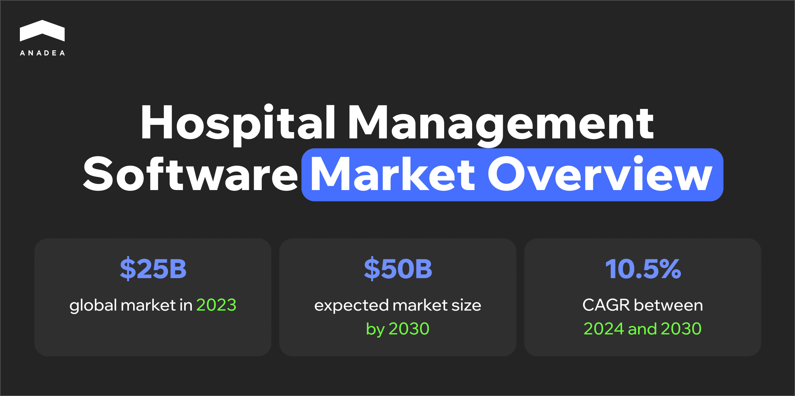

Business digital transformation is much more than a modern trend. Today, in many domains, it has already become a necessity. Software solutions change the processes by optimizing them and increasing their efficiency. Naturally, the implementation of digital tools across the healthcare industry is gaining traction.

In this article, we are going to talk about one specific category of healthcare solutions. We will focus on software products for hospital management, exploring their types, benefits, and specific features. Furthermore, we will advise on how to create hospital management software and provide practical tips on how to achieve success with your custom product.

## Hospital management software: What is it?

This category of software includes digital platforms and tools designed to streamline the operations and administrative tasks at hospitals, clinics, and other healthcare facilities. Hospital management software features usually cover various aspects of hospital administration, clinical activities, and patient care. As all these aspects are united in one system, it becomes easier for healthcare professionals and administrators to organize their workflows more efficiently.

In 2023, the global market of hospital management software [reached](https://virtuemarketresearch.com/report/hospital-management-software-market) a volume of $25 billion. Analysts predict that if it continues growing following their expectations, it will be valued at approximately $50 billion by 2030. The projected CAGR for the period from 2024 to 2030 is 10.5%.

The market expansion is driven by a range of important trends and factors that we can observe in the industry today.

### Growing adoption of EHRs

Electronic health records are already considered to be an irreplaceable element of modern healthcare systems. Their adoption by healthcare institutions is not just a competitive advantage but a real necessity. Hospitals all over the world are looking for efficient ways to increase the quality of patient care and data management. Namely, such intentions boost the demand for EHR-integrated hospital management software. Plus, in some countries, such as the US, there are government programs aimed at the promotion of EHRs and related systems.

### Need for optimized and streamlined hospital operations

Medical institutions are continuously striving for optimization of their costs and processes. The implementation of hospital management software can become an excellent solution to achieve this. Specialized software allows for minimizing human errors, reducing paperwork, and facilitating a lot of tasks for medical and non-medical staff.

### Development of healthcare IT infrastructure

The advancements made in the implementation of modern IT infrastructure in healthcare make it easier to introduce [new approaches to care coordination](https://anadea.info/blog/digital-healthcare-a-new-approach-to-care-coordination/). Cutting-edge technologies like AI and ML, as well as cloud-based solutions, IoT apps, and wearable devices, have greatly changed traditional processes. With their help, hospitals can seamlessly deal with huge volumes of data and get real-time access to patient information. Today, governments, healthcare providers, startups, and medical companies are heavily investing in the modernization of hospital IT infrastructure and the development of digital solutions. Amid all these trends, it is sensible to presuppose that the demand for [hospital management software development](https://anadea.info/solutions/medical-app-development/hospital-management-development) will continue rising.

## The most common types of hospital management software

If you are planning to address the growing demand and create hospital management software, it will be helpful for you to understand what types of such systems exist. There can be a bit different approaches to this classification. Nevertheless, we prefer the purpose-based approach. Let’s take a closer look at the most widely adopted hospital management software types.

### General hospital management systems

These are comprehensive, all-in-one solutions. They can integrate multiple aspects of hospital operations, such as patient, billing, inventory, and staff management. This software type can be a good option for large hospitals that need a reliable system to handle all their day-to-day operations.

### EHR software

Such systems focus specifically on digitizing and managing patient medical records. Doctors, nurses, and medical staff can use this software to securely store, view, and update patient information. Such solutions can be highly helpful when patients communicate with different professionals and all of them should get a comprehensive vision of the disease and treatment history.

### Patient management software

Solutions of this type are intended for managing patient information and their interactions with the hospital. They can deal with all the steps of the patient journey, from registration to discharge.

### Pharmacy management software

This software is typically designed to help hospitals in managing their pharmacy. It can cover such tasks and processes as inventory management of drugs, prescription handling, and restocking.

### Laboratory information management software

Software from this category is built to manage laboratory operations within a hospital. The range of the included operations may extend from sample tracking and test result monitoring to lab equipment usage.

### Radiology information management software

These platforms are used in hospitals to manage radiology departments. They can offer tools for scheduling radiological tests, storing data, and viewing medical images. They are often integrated with diagnostic systems.

### Appointment management software

Such solutions can be built as standalone systems or can be a part of general hospital management software. As it can be clear from the name of this category, the provided tools help hospital staff manage patient appointments, cancellations, and rescheduling. This software ensures efficient utilization of doctors' time and minimizes scheduling conflicts and human mistakes.

### Staff management software

Systems of this type are used not only at healthcare institutions but also across many other domains. They focus on managing staff, including scheduling shifts, payroll, attendance, and performance tracking. This software is crucial for ensuring proper staffing levels at any time of the day, especially in the context of a 24/7 hospital environment.

### Compliance management software

The healthcare industry is strictly regulated. That’s why for hospitals, it is essential to adhere to all local, national, and international regulations and standards such as [HIPAA](https://www.hhs.gov/hipaa/index.html) that are in force in their region. This software can help hospitals automate all major compliance tasks. Such solutions can continuously monitor and define all regulatory changes. As a result, medical facilities can always stay up-to-date on industry requirements.

### Billing and financial management software

It can deal with all the financial aspects of hospital management. The range of the covered aspects usually includes billing, managing insurance claims, processing payments, and handling financial reporting.

## 8 key perks of using hospital management software

Hospital management software development can become a time-proven investment for healthcare providers. It is explained by the multiple benefits that such systems can ensure.

1. **Improved efficiency through automation.** Such systems traditionally have all the required features to automate administrative processes like patient registration, appointment scheduling, and billing. This helps to reduce the manual workload and minimize human errors.
2. **Enhanced coordination and streamlined operations.** Hospital management software can ensure seamless information flow between all the departments. This not only eliminates delays in different processes and patient care but also improves the overall coordination within a hospital.
3. **Reduced paperwork.** Software of this type ensures digitalization of medical records, patient information, billing, and inventory management. As a result, the reliance on paper documentation is significantly reduced. This makes a lot of processes much more efficient and also leads to more eco-friendly activities.
4. **Real-time data access**. Patient information, inventory levels, and financial data are updated in real time. This means that healthcare professionals and administrators can make more informed decisions instantly.
5. **Better patient experience**. Thanks to streamlining appointment scheduling and registration, patients will spend less time waiting for services. This has a huge positive impact on their experience and general impression. Moreover, with such software solutions, it is possible to provide various self-service options. Hospitals can equip their management systems with patient portals or mobile apps. Through these tools, patients can manage their appointments, view test results, and communicate with their healthcare provider.
6. **Operating cost optimization**. The introduction of hospital management software can lead to great cost savings. How is it possible? One of the main things that should be taken into account is the fact that hospitals can significantly reduce administrative overheads and allocate their resources more wisely.
7. **Reduced risks of medical errors**. Hospital management systems provide doctors and medical staff with the most relevant up-to-date patient data. Thanks to this, the risk of misdiagnosis or the choice of incorrect treatment will become much lower.
8. **Advanced data analytics and reporting.** Hospital management software can generate detailed reports on various aspects of hospital operations. These insights help hospital administrators make data-driven decisions. Moreover, a lot of modern systems today rely on analytics to predict trends (for example, patient admission rates or inventory shortages). This allows hospitals to organize more efficient planning.



## Top 10 hospital management software features

When starting hospital management software development, you should define the set of features that your system will include. Your choice should be based on such factors as your precise goals, business needs, specifics of your hospital operations, and tech [trends](https://anadea.info/blog/the-future-of-health-innovative-trends-in-medical-software-development-2019/). Below, you can find the most highly demanded features traditionally built for general hospital management systems.

1. **Patient registration.** This feature collects and stores patient demographic details, medical history, and contact information for quick access.
2. **Appointment scheduling**. Such tools let patients book, modify, or cancel their appointments online. To reduce no-shows, it’s also possible to send automated reminders.
3. **Patient queue management.** You can enrich your system with a tool that will manage patient flow and reduce waiting times. It can automatically organize patient queues based on appointments or the severity of the condition.
4. **Comprehensive patient data**. Modern management systems with EHR modules can store medical history, diagnoses, treatments, prescriptions, lab results, and other data in a centralized database.
5. **Staff scheduling and task assignment.** With this feature, you can automate the scheduling of doctors, nurses, and administrative staff. Moreover, via such a system, it will be simple to assign tasks to staff members and track completion.
6. **Automated billing**. This feature can generate and process invoices for paid services and medications.
7. **Insurance claims management**. If your hospital works with insurance policies, this feature can streamline the process of filing insurance claims and tracking claim status. To introduce this functionality, it will be necessary to integrate databases provided by insurance companies.
8. **Payment processing.** It is recommended to let patients choose from multiple payment methods, including credit cards, bank transfers, and insurance. Your hospital management software can also keep records of all transactions.
9. **Financial reporting tools**. These tools can provide insights into hospital revenue, expenses, and financial performance through automatically generated reports.
10. **Customizable reports and data visualization**. Hospital management software can be equipped with the functionality to prepare reports on hospital performance, patient outcomes, revenue, and resource utilization. Moreover, it can use charts and graphs to visualize data trends and patterns. This will make complex information easier to interpret.

## Efficient hospital management software: What’s it like?

The functionality and goals of hospital management systems can vary. However, some common requirements should be met if you want to achieve success with the implementation of your solution.

### Clear navigation and user-friendly interface

Though such systems can be rather complex, it should be simple to interact with them. Doctors, nurses, and administrative staff may have different technical skills, and they shouldn’t waste a lot of time trying to find the required features.

### Regulatory compliance

Make sure that your hospital management software development team understands how to make your system compliant with all the relevant regulations.

### Security and data protection

Your software will deal with a lot of highly sensitive information. That’s why you need to take care of its security. End-to-end encryption and multi-factor authentication are among the most popular protection measures. Moreover, we recommend you introduce role-based access to the features of your software. Only authorized users will be able to view sensitive data.

### Scalability

You need to be ready for the expansion of your system without sacrificing the quality of its performance. Your development team should design flexible architecture to enable smooth scaling.

### Inclusivity and accessibility for everyone

This requirement is especially important if some of your software modules will be used by patients. Your software should work seamlessly on various devices, including personal computers, tablets, and mobile phones. Also, it is highly recommended to ensure compatibility with screen readers, voice commands, and various assistive devices for users with disabilities, such as visual or motor impairments.

## Hospital management software development: Tech stack

The tech stack for your project should be chosen depending on several factors. Your development team should take into account the type of your solution, the existing solutions that should be integrated, as well as your individual requirements and budget. Quite often the following technologies and tools are used:

* Frontend development: HTML, JavaScript, React, Vue, Angular
* Backend development: Ruby on Rails, Python, PHP, Java, Laravel, Node.js
* Database: MySQL, PostgreSQL, MongoDB, Oracle
* Cloud platform: AWS, Microsoft Azure, Google Cloud
* Analytics: IBM, Apache Spark
* Payments: Stripe, PayPal

## How to create hospital management software: Major steps

Every development project consists of multiple steps and stages. Their duration and complexity may differ. Nevertheless, their role in the overall project's success can’t be underestimated.

* **Goal setting**. First of all, you need to define the issues that you want to address with your new hospital management software. You can speak to stakeholders, including doctors, nurses, administrators, and IT staff to understand their specific requirements. This will help you formulate the main objectives of your project.
* **Planning**. When you already understand the goals of your project, it will be possible to think about its concept. You need to prepare a list of features and desired integrations. Based on it, your development team will be able to create a project roadmap.
* **System design**. Developers will opt for the most appropriate type of software architecture and define how patient data, staff information, medical records, and billing data will be stored. Meanwhile, designers will work on the creation of user-friendly interfaces with intuitive navigation.
* **Healthcare management software development**. This step traditionally involves a lot of coding. Based on your requirements, the development team will create features and unite them in one system. The hired team should be aware of possible [technology challenges](https://anadea.info/blog/technology-challenges-in-healthcare/) typical for the healthcare domain and be ready to efficiently address them with a new solution.
* **Testing**. This stage should include different types of tests, like unit, integration, performance, security, and user acceptance testing. It is necessary to check whether all components and functions work and interact with each other as expected.
* **Implementation**. We always recommend deploying the software in stages. For example, you can start with a pilot in one department before rolling it out across the hospital. It will be important to allocate time and budget for staff training. Employees should know how to use the system effectively.
* **Support and maintenance**. It is necessary to continuously monitor the software performance and release updates based on user feedback, bug reports, and compliance changes. As the hospital grows, it will be important to make sure that the system scales properly.

## How much does cost to create a hospital management system?

A hospital management software cost is influenced by many factors, such as:

* Desired features and their complexity;
* Technology stack;
* Team composition;
* Third-party integrations;
* Hosting (on-premise or cloud).

The final cost can be in the range between $35K and $350K. In some cases, the required investment into most complex custom solutions with advanced features can be higher.

To better understand the size of the investment, we suggest you [request a quote](https://anadea.info/contacts) from your development team. At Anadea, we provide project estimates for free. If you want to start planning your budget, you can share your requirements with us and we will calculate the cost of your product.

## Our expertise in hospital management software development

Our team successfully works with clients from various industries. We deeply understand the needs of different markets and can offer efficient solutions for their pains. One of the domains in which we have broad expertise is healthcare. This can be proven by our [software development portfolio](https://anadea.info/projects-b2b#healthcare).

One of the projects we put our hand in was a multi-tenant software solution for therapists dubbed Gogoof. This cloud-based solution is intended to help medical specialists in scheduling appointments with their patients. Moreover, Gogoof facilitates the process of tracking real-time patient data.

The system functions the following way. With its help, therapists can create custom plans that include tasks and key questions for meetings with their patients. Moreover, professionals can estimate the progress and the efficiency of the therapy. In their turn, patients can also use this SaaS product to get connected with therapists and view their treatment plans. To learn more about this project, please, [follow the link](https://anadea.info/projects/gogoof).

Another example that can demonstrate our experience in this domain is the [OnTrac](https://anadea.info/projects/on-trac) electronic health record system. The solution was built to address the needs of Skilled Nursing Facilities (SNFs) and Assisted Living Facilities (ALFs). It automates multiple processes and facilitates the sharing of medical data. It includes such valuable features as a patient and resident census, care plans, an EHR module, report generation, admin and owner dashboards, billing, an accounting module, and others.

Have a plan to create hospital management software? At Anadea, we will be always ready to help you. With our deep knowledge in this sphere and outstanding practical skills, we will be able to transform any of your ideas into real products. We offer flexible terms of cooperation and can make the process of working with us comfortable for everyone. Want to learn more? Do not hesitate to contact us.

Get in touch
