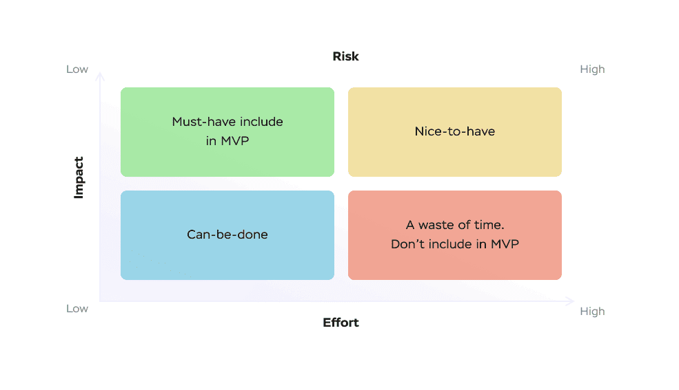

Today the growing popularity of SaaS solutions is quite obvious The interest of companies from different spheres in launching solutions of this kind is well explicable given the fact that remote work has become a real trend and the need for mobility is growing as well. But when you want to launch a SaaS product and contact a development company, there is a high chance that developers will offer you SaaS MVP development services at first. Is it really a feasible idea? Do you need to invest your money in a SaaS MVP before proceeding to the development of a full-scale solution?

To answer these questions, it is necessary to analyze the peculiarities of SaaS MVP projects, their goals, and SaaS MVP development cost. That’s exactly what will be the focus of our attention in this text. If it seems interesting to you, just continue reading this article to find answers to your questions.

## What is a SaaS MVP?

To begin with, it is important to make sure that you clearly understand what an MVP is. This term is an abbreviation of the word combination “minimum viable product”. It can be explained as a version of a solution that has a limited set of features that can be provided to early users for getting their first feedback to make a decision on the further development of a product.

In other words, a SaaS MVP is a simplified version of your future solution that can help end-users to understand whether your product can be helpful for them. If an MVP launch was successful and you get valuable comments on how your solution can be improved to fully satisfy the needs of your target audience and meet the expectations of potential users, you can plan the development of a product with a full range of features and allocate your budget for <a href="https://anadea.info/services/saas-development" target="_blank">SaaS development services</a>.

In those cases, when you see that an MVP didn’t manage to get positive feedback from the first users and that it didn’t satisfy their needs, it’s better to consider an option to stop this project and think of a new idea that can better solve the set tasks.

## Benefits of SaaS MVP development

As you can see, SaaS MVP development can help you to check the feasibility of your idea without investing huge amounts of money in it as well as prevent your development team from performing time-consuming but unnecessary tasks related to the creation of a full-scale product. Now let’s summarize the advantages that your business can enjoy if you decide to start the creation of your SaaS solution with the development of a minimum viable product.

### It’s a good way to validate your idea

Of course, when an idea for a future product comes to your mind, you can be fully captured by it. That’s why it is crucial to get an objective opinion about the project before investing in it. And an MVP is exactly what you need. It will show whether your product fits the market, whether its functionality can solve the tasks properly, and whether end-users really need your solution.

### It is a cost-efficient approach

In this article, we will talk about the costs of a SaaS MVP a little bit later. But already now, we can say that it costs significantly less than the development of a full-scale SaaS product. If you want to know how much money you need to have to build a SaaS platform, we recommend you read one of our previously published posts where we explained how the final amount is calculated and what factors have an influence on it.

See also: <a href="https://anadea.info/blog/saas-development-cost" target="_blank">How to Plan SaaS Development Cost to Save Money</a>

### You can get valuable feedback from the first group of early users

Real feedback is one of the most important things for analyzing the quality of your idea and its potential to win the hearts of the target audience. The launch of an MVP is the best method to get this feedback. By carefully analyzing the words of users, you will be able to have a good understanding of what users expect to get and whether your product corresponds to their requirements.

### The speed of MVP development is rather high

One of the most important things that you need to know about SaaS MVP development is that the entire process usually takes only around a couple of weeks or months. It is possible thanks to the fact that developers need to build only the core functionality and there are no complex tasks related to design, third-party service integrations, etc.

### It can help you to raise funds from investors

If you are looking for investors' funding, you need to be able to present your idea in the most attractive way. If you hope to prove the feasibility of your project only with the help of marketing materials, unfortunately, we will have to disappoint you now by saying that it will be quite difficult to do it. Assumptions and theoretical figures won’t be enough to convince investors but a functional model is a very different story. When you already have an MVP, it will be significantly easier to talk to investors about your project.

Request MVP development

## How to create a SaaS MVP: Key steps

If an idea to launch an MVP before building a product with a full set of features looks quite attractive to you, you need to find out how the entire process is organized and what steps or stages it should include.

### Step 1. Market research

As well as in the case of building a software product of any type, it is recommended to start with careful market research. You should analyze what your competitors offer and how they solve the tasks that you want to deal with. This step should help you to realize whether your idea is feasible at all and whether you should continue working on it.

Of course, it is possible that somebody has launched practically the same product. It will mean that you will have to focus more on the unique features of your future product. You will need to think about something that will make your solution special and that will encourage users to choose your solution instead of products offered by somebody else.

In general, the <a href="https://anadea.info/blog/saas-market-overview" target="_blank">SaaS market</a> is actively growing today, as well as the demand for such products. And it can be a very good time to enter the game with a new solution right now. But good market research is an obligatory step.

### Step 2. Analysis of the needs and pains of potential users

When you already have a general idea for your future product and you believe in its feasibility, you need to clearly define the users' problems that your SaaS product will solve.

To better understand how your product can help people, it is crucial to fully realize who your users will be. You can create a user’s profile (so-called customer persona) to see the needs of this person, the issues that he or she has, and the tools that are required for solving these problems.

### Step 3. Selection of the monetization strategy

When you are starting to work on a project, you should decide how it will bring money to you in the future. In other words, the monetization strategy should be defined. For example, you can offer paid premium versions of your solution. You can offer additional paid features or earn money on advertising.

### Step 4. Identification of the core features

When you are building a SaaS MVP, there is absolutely no need to build all the features that you are planning to create for your final product. Even if these features are really cool, you do not need to include them all in the first version of your solution.

Your MVP should contain only the most important features that will provide users with a general understanding of the product idea and it will be enough.

### Step 5. Product roadmap development

This step is quite clear to everyone who has ever dealt with software development. In a roadmap, you should indicate all the major milestones of the development process. This document will help the development team to see the time frames and the steps of their work. The roadmap can be also used as a reference for tracking the development progress.

### Step 6. Beginning of the SaaS MVP development process

Now, when a team has a general understanding of how to create a SaaS MVP and what tasks should be fulfilled for reaching the final goal, it is time to start this process. Actually, here it is important to build the defined features, to make sure that they work as they are supposed to, and to launch this version of this product as soon as possible (in other words, it should be done before any new competitors enter the market).

### Step 7. Accumulating users’ feedback

If you think that after the launch of your MVP, you can fully breathe out with relief, it is not so. Actually, the key work begins only after the MVP creation. Now, you need to understand what users think about your solution, what they want to improve, which features are good, and which of them are useless.

There are different methods of gathering feedback from users. Among the most popular ways, we should mention customer interviews, surveys, social media questionnaires, email contact forms, usability tests, and analytic metrics.

To get the most comprehensive overview, we can advise you to combine different methods of gathering feedback. Such an approach will help you to reach the widest audience possible and will allow users to choose the most comfortable way for them to share their opinions with you.

## Feature prioritization for your MVP

As we’ve already mentioned above, when you are planning to build a minimum viable product, you need to define the features that you will create and offer to early users. To facilitate this task for you, we’ve prepared some short descriptions of the most popular approaches to feature prioritization.

### Feature priority matrix

This approach is based on creating a matrix that will include three factors Effort (resources required for feature development), Risk (possible challenges), and Impact (feature's value to the business).

It is obligatory to include must-have features in your MVP as they will solve user issues and will demonstrate the real potential of your product.

Can-be-done features have a lower value compared to the first category but you can implement them in an MVP, maybe not in the first version but in the later ones. Before introducing them, a team should understand whether the product itself is worth the investment and time.

Nice-to-have features will make your product unique but you shouldn’t spend your time and resources on them when you are working on your MVP.

### Feature buckets

It is one more widely applied method used for feature prioritization. In this case, you should create three categories of features:

* Metric movers. These are the features that have a positive influence on the KPIs of the product (and they can be built in an MVP).
* Delights. These are the most entertaining features.
* Customer requests. These are those features that make the interaction with a solution more convenient.

### The Kano model

This classification presupposes uniting features into groups based on their chances to satisfy users.

* Basic features (fundamental functionality)
* Excitement features (the most delightful ones)
* Performance features (those that bring additional value to the product)

### MoSCow prioritization

* Must-haves are essential features that should be built for an MVP. These features ensure basic value to users.
* Should-haves are important features, they have great value but they are not so crucially important for an MVP as must-haves.
* Could-haves are features that can be added but they are not critical for the key functionality.
* Will-not-haves are a group of features that can be eliminated not only in an MVP but also in later versions as well.

## SaaS MVP development cost

When you are planning the development of any software product, it is absolutely obvious that the cost of the future project is an important factor that will influence your decision regarding the time of the project realization and its general feasibility.

If you ask us about a precise SaaS MVP development cost, we won’t be able to answer this question. The price range starts at around $15,000. But the final price of MVP development can be higher and can reach **$50,000-$70,000**. Why is it so? There are a lot of factors that have a direct impact on the project cost (actually, it works exactly the same way when we are talking about the development of any other software product).

Let’s have a closer look at the factors that matter in this case.

* **Development team composition.** For calculating the costs, it is necessary to know how many people will work on your project. It is also crucial to take into account the seniority of specialists and the skills that are required. The more experienced specialists are needed, the higher their rates are. And consequently, the higher the project cost will be.  
* **Location of your team.** When you are looking for a development team, it is necessary to bear in mind that the rates of developers depend not only on their skills and experience but also on the region where they are based. For example, in the United States and Canada, rates are traditionally higher than in Europe or India. At Anadea, we are trying to do our best to ensure the most reasonable price-quality ratio. The rate of our developers is $50 per hour which is far not the highest one in the market but at the same time, we can guarantee absolute reliability and outstanding quality of our software products.  
* **Tech stack.** The principle here is very similar to the situation with the team's seniority. If you want to use very complicated and rare tools and technologies, you should be ready to pay a higher price for them. For MVP development, it is recommended to choose the most popular and easy-to-use technologies, like Python and Ruby.  
* **Complexity and size of your project.** Here everything depends on the features that will be included if you want to build a SaaS MVP. The more complex features you want to get, the more time developers will need for the realization of your idea. As a result, the cost of their services will grow.



## Successful SaaS MVPs

If you think that it is quite useless to create MVPs, especially when you are quite confident that your project idea is awesome, of course, it’s up to you to decide but we offer you to have a look at some examples.

### Airbnb

Today Airbnb is a SaaS marketplace for short-term homestays and experiences that is known all over the world. But initially, the project didn’t look very promising.

The founders of Airbnb just wanted to offer their apartment as an accommodation for visitors of a big conference in San Fransisco. They built a webpage where they published photos of their apartment, and added descriptions and the price per night. Of course, that page was a very simplified version of what we have now. It didn’t have online payments or maps, or options to choose from. But we already can consider it to be an MVP as it showed its founders that the idea was worth working on.

Further, the founders built a real MVP of their final solution. Initially, it was available only in San Fransisco but then the area was expanded. And later, the founders launched a full-scale version of their app. In 2022, in the US only, the app had more than 45 million users.

### Dropbox

This file hosting service also started its history as an MVP. However, we should admit that the founders had a very specific approach to their MVP. Yes, they developed it but they demonstrated it to users only as a video. It was a 3-minute-long video showing Dropbox in its first version. But the popularity of the film was enormous and exceeded all the expectations of the team. The waiting list for the beta version increased from 5000 to 75,000. And it happened in one night.

In the first half of 2022, the number of paying Dropbox users was at the mark of 17.37 million.

Of course, these are just the most famous examples. In reality. the list of successful SaaS MVPs is much much longer.

## Closing word

As you can see, MVP SaaS development can be a very beneficial step that will help you to check the feasibility of your project and to save time and money in comparison to the launch of a full-scale product. When you launch an MVP and see that the reaction of users is not the one that you hoped for, you can try to add new features or to change something in your product with comparatively small financial and time losses.

If you have any questions about the creation of SaaS MVP products, you can always contact our team. Our experts will be always ready to help you.

Contact us
