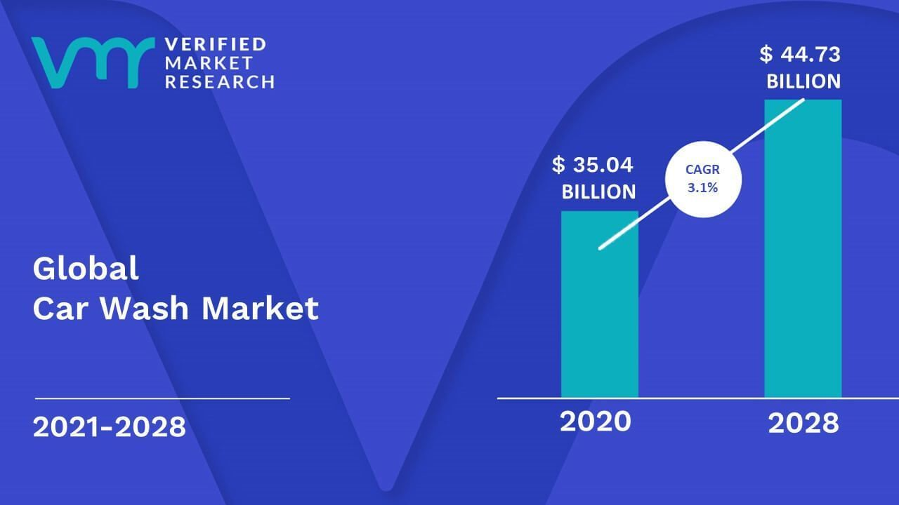
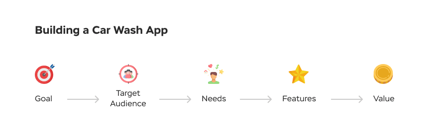
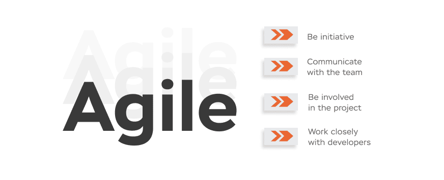

## IT startup
Nowadays IT startups are probably the most popular topic for people who would like to build their business. The road to success looks pretty clear: first of all, you need to get a nice business idea that can really help to fix some of neverendless human problems, find a couple of bucks for hiring a few smart guys who will create a simple prototype, сonvince a big investor to throw a big wad of money at you, wait for a while before a bigger team of smarter and more expensive guys will develop an MVP, promote it somehow, get first users and that’s it. Now you are rich and successful!

However, many people find real life a bit different. In this article, we will take an existing business idea and break the whole process of building a project down.

## Business idea of car wash app
A good business idea assumes that people will get a real benefit from using an online software. The best way to prove that the idea is good is to use business analysis techniques. In the perfect world, a healthy business project is started from a business analysis stage. To explain what it is and how it is supposed to work let's take an existing idea and go through the whole process.

Let’s take something simple like a car wash appointment booking system. A car wash startup is suitable for our purposes - this type of service looks pretty stable and Google says that the car washing market has been rising for the last 10 years. Last year, its size reached more than $35 billion and it is expected to reach more than $40 billion in the near future.

The idea is clear: people have cars and they need to make their cars clean from time to time. There are a lot of different service providers who would love to wash people’s cars for reward. Sо, we need to help both parties somehow to speed up processes stemming from their relations. To understand what we can do here, we need to identify what brings real pain to customers and which conditions will help service providers to compete in the market.

It is safe to say that if I could avoid standing in long lines I would go through the car washing procedure much more often. It would be helpful for car owners to have a car wash app that allows comparing services of different service providers and getting updates about discounts and additional benefits. As a provider, I would be happy to keep the service supplying process more predictable and stable.

One way or another, let’s imagine a standard car wash appointment app and analyze it as a business analyst from an IT company would do.

## The Goal
First of all, we need to define the main goal of the project. It should be clear and simple. For a car wash scheduling app it can be something like:

“Create a service (a mobile wash app) which lets car washing service providers present their services and customers to schedule an appointment and book a car wash.”

This example assumes that we are going to build a __collaboration platform__ - some space where people can find one another and build mutually beneficial relationships. If you are a service supplier and you want to create a __dedicated app__ just for your purposes then the goal will be different - but anyway, it should contain an understandable idea showing the benefit for assumed participants. It can be something like:

“Create a service (a car wash management app) which provides its customers with the possibility to schedule an appointment and book a car wash.”

Next few points that we need to go through are __Target Audience__, __Needs__, __Features__, and __Value__.

## Target Audience
Target Audience should be described as detailed as possible. Here we need to think about next things:
* __Users' nature__ - are they big companies or small teams or both on the service providers' side? Who are the customers? Are they ordinary people with cars or professional drivers having non-obvious but important requirements?

* __Market details__ - is there a special market demand which we can satisfy and get a competitive advantage? Are there any details that may influence our strategy such as age or gender?

* __Location__ - where are people who need a car wash located - for example, is it just Dubai or the whole country?

## The Needs
Talking about the needs of users, we need to identify a problem that our service is supposed to solve. We already thought about it when we tried to come up with our business idea. Now, based on our previous analysis, we can describe the needs of our potential customers more closely. It can be something like:

“To wash their cars, drivers spend a lot of time standing in long lines and it reduces the quality of service extremely. As a result, the car washing services lose their potential benefit and have unpredictable and unstable business processes. They need a car wash booking app that allows companies to provide drivers with all information about their services and allows drivers to book an appointment and wash their cars at a suitable time with best conditions.”

## The Value
Next point should simply and unambiguously describe the value of our product. It can be something like: “Our app makes getting the car wash services accessible, simple and enjoyable.” It looks obvious but probably this point is the most important among all of them. The business will be successful only in case the value is relevant to customer needs.

## How does IT work?
Talking about a car wash mobile app, now we get to the point when we have to think about its development.

Did you think about how IT works? This question is complex and it is pretty hard to find a definite answer.

Once we had a hot discussion about what exactly our company delivers to our customers. The conversation was going on for around three hours. Someone said that our main goal was to make customers happy by providing them a possibility to make money. A more experienced colleague expressed a hope that we could simply try to make the world a better place. Finally, the whole team was satisfied by the answer that we automated business processes.

There are a lot of different mutually beneficial relations between people with a lot of different business processes. IT technologies are designed to make these processes faster, easier and more resultative for their participants.

For building a business you need to find the business idea and come up with a way how processes based on this idea will be automated. By doing that, you will be able to define roles for your users and come up with a unique list of features.

## User roles and other specifics
We already described two types of users:
* __Service Providers__ - any company providing car washing service.
* __Customers__ - any drivers.

Other specifics are:

* __Market__ - any age, any gender.
* __Location__ - Dubai.

At this stage, it is appropriate to make an analysis of the related market area to get a general view of its state and existing competitor apps. Google says that there are six big quality car wash apps:

* WashOS,
* Qweekx,
* Wype,
* DinoWash,
* Spiffy,
* Washify.

Your homework is to figure out their special aspects, their business models, service details, etc.

## Core feature list
Now we are moving to collecting our core features list. Features naturally appear from our previous speculations and depending on our needs can be unique or standard. For better illustration, I decided to give a list of standard features for a mobile car wash software:

### For service providers
* Possibility to present the company.
* Possibility to share a list of services.
* Possibility to specify service location.
* Possibility to process car wash requests.
* Possibility to get payment.

### For drivers
* Possibility to select preferred car wash service in a needed location.
* Possibility to make a car wash request.
* Possibility to customize the price.
* Possibility to book an appointment.
* Possibility to make a payment.
* Possibility to get notifications.

At this stage, we need to describe only the most important features which make our app exactly what it is supposed to be. Other features - such as leaving a review or selecting additional services - can be specified at later stages.

## Monetization model
Another aspect to think about is a monetization model. There is a huge list of different models with a lot of different advantages and limitations. It can be: a monthly subscription, a one-time commission from each order, a paid platform access fee for service providers or even advertisement and selling of products used for car washing, etc. Your business idea and your technical abilities will define the best possible option.

## The first step towards app development
Well, looks like we've made our first step in the right direction. Now we have high-level logic of our future product and the understanding of its basic components. Generally, you are ready to start looking for a car wash app development company. For sure, they will be happy to get such a simple, logical and clearly articulated vision of an upcoming product from you.

One small warning before we go to the development process breakdown. Often people apply to our company with hundreds of pages of documentation describing their product as closely as possible. Usually, it goes straight to the imaginary bin because the modern approach to development assumes something completely different.

## Agile
So you have a plan with a basic business analysis and you want to contact the best car wash app development company. Many customers think that once they have negotiated the project with a company that has a great reputation and acceptable costs, their part of work is mostly done. And that there are two things that customers have to do - provide developers with requirements and control the process from time to time.

That's not right. You might have heard about Agile - this is a commonly used approach to software development and management assuming an iterative manner of a developing process. Agile is a big topic requiring a separate large article, but what you need to know is that you should become part of a business camp, work closely with your developers, and be involved in all processes as part of the team. Among other things, it means that you have to communicate with the development camp day by day and be a source of initiative for them.

## What is MVP?
The basic idea of the agile approach is to develop something simple and not so expensive but still useful and valuable. In the professional language, it is called Minimum Viable Product or MVP. It is supposed to have basic core features and a possibility for the first users to get experience of interacting with your app. The idea is to launch the project quickly, get feedback from real users, and adjust functionality accordingly. In a healthy situation, an MVP for a mobile app can be developed within two to three months.

Based on this, after you get hourly costs you can determine the budget. The good thing is that according to Agile, the whole process will be split into short iterations and you will get the first tangible results within a few weeks.

## Team design
Before you start looking for a good software development company, you may want to figure out the desired team configuration. For our purpose, we need to develop a mobile app. A desktop version can also be considered as a possible option, but at first stages we don’t need it at all.

You will be looking for iOS or Android developers and designers for your development camp, but I suggest also including people responsible for managing processes, documenting existing business logic, providing complete business analysis and making changes according to the market behavior, testing, etc. So, a basic team can look like this:

* Project manager - 1 person.
* Business analyst - 1 person.
* iOS/Android developer - 2 people.
* Frontend/Backend developer - 2 people.
* UX/UI designer - 1 person.
* Quality assurance engineer - 1 person.

There are options and possibilities to reduce the team and save your budget. For example, in our <a href="https://anadea.info/services/mobile-development" target="_blank">mobile application development company</a>, we have no project managers - their responsibilities are taken by business analysts and team leads. But in general, the team design for developing a standard mobile app is like the list above.

## How much does it cost?
The costs are different around the world and the approximate range is $20-$150 for one hour. Maybe the cost of $45-50 is what you can look for. This rate is average in the IT industry, but it gives a good chance to find experienced and skillful software developers matching these conditions.

## Summary
In summary, in this article, we went over fundamentals of building an IT startup project such as a mobile car wash app, briefly went through the main stages of its business analysis including core features, got acquainted with the Agile approach and talked a little about costs and budget. I believe that now you are pretty ready for starting your successful business startup. Good luck!

Request estimate
