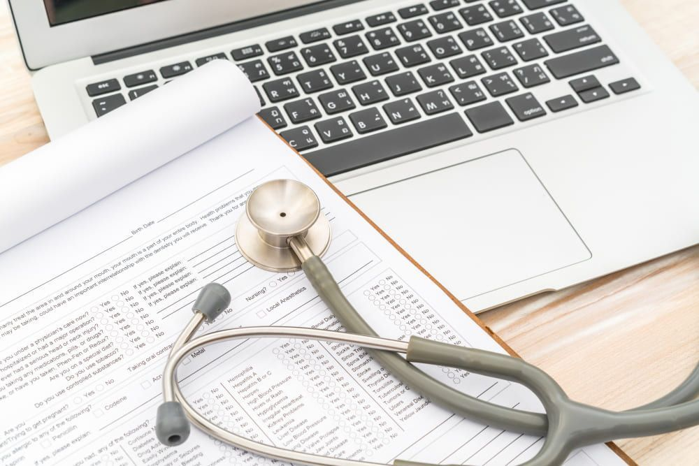

Healthcare giants like Pfizer Inc, Aetna and McKesson Corporation know how digital technologies can transform medicine and they have already entered the mobile app industry with their solutions for early disease detection, providing access for doctors to up to date agendas, getting better medical outcomes, and much more. Undoubtedly, technology-driven medicine has provided many beneficial opportunities for healthcare professionals. A <a href="https://anadea.info/solutions/medical-app-development" target="_blank">healthcare software development company</a>, we know how popular medical apps for doctors are.

In 2020, mobile health industry market size was valued at over $45 billion, however COVID-19 outbreak triggered a drastic surge in market size, which is now predicted to reach $100 billion by the end of 2021, which is a fivefold increase since 2016. According to <a href="https://www.physicianspractice.com/view/2018-mobile-health-survey-results" target="_blank">Physicians Practice 2018 Mobile Health Survey</a> 69% of physicians use mobile phones in their practices. There will be over 3.7 billion mobile medical app downloads worldwide in the coming years.

The information suggests that there is a demand on apps for medical practitioners. If you know what doctors need in such apps and thought about building your own app for the medical practice, go for it. This article will clear up the big mystery of how to create a successful mobile app for healthcare professionals. Let's get started.

## Important issues of healthcare app development

First of all, let's find out the essential elements of a mobile app for doctors that set apart such apps from any other to help you figure out what medical apps development looks like.

Our team believes that the most important characteristic that distinguishes a medical app for doctors and physicians from others is a requirement for security. If your app will be used by <a href="https://www.hhs.gov/hipaa/index.html" target="_blank">HIPAA</a> covered entities or will store the patient's private data, you have to make sure that the data will be stored within a protected environment. At Anadea, we are sticking to HIPAA standards and best practices from Apple and Google to maintain the high level of security as well as encrypt personal data by means of modern and reliable technologies in medical app development.

> The healthcare industry is very unique since it deals with very sensitive data. It is related not only to the danger of exposure but also to the information itself, which should be collected and presented in a very polite form. The potential patients should not be scared off by the requested data and they should not be misled by the presented results. 

— Vladimir Galaiko, Project Manager and Business Analyst at Anadea

Another thing to consider while developing a mobile product for the medical industry is the regulations. Many procedures are regulated by law, thereby one should always think of how to implement the workflows designed decades ago for manual processing within the modern technological capabilities.

## Types of mobile apps for doctors

To facilitate and speed up practically every side of work, doctors can adopt one of these tools or one combining the features of a number of them, along with examples of apps that are actually used by doctors.

### Time management apps for doctors

Sometimes, or, more precisely, very often work at healthcare facilities resembles chaos. That’s because the routine of a doctor is not limited to patient treatment; it involves paperwork, planning, and other less obvious activities. Apps for time management for doctors are designed to help them put in order everything that pops up throughout the day. Tools that assist with this are:

* Calendar to schedule staff meetings and appointments;
* Taking notes (in writing and through dictation);
* Audio recording;
* Taking and categorizing photos (of wounds, skin condition, etc.).

### Apps for EHR access

Many modern hospitals have their patients’ medical records digitized and migrated to an electronic database. Apps for EHR access are the next step: they allow doctors to find and see the target record in seconds, look through patients’ history and attachments to it (X-rays, etc.), as well as see and manage prescriptions.

### Telemedicine apps

Software for remote medical consultations, or telemedicine apps, serve to reduce the need to visit medical facilities on all occasions and only do it when a physical examination is needed. Using telemedicine apps still has certain limitations (such as an uninterruptible network and quiet surroundings), but these are nothing compared to the amount of time such apps save both doctors and their patients. Among the key features of remote medical consultancy apps that ensure positive outcomes are:

* Video chat;
* Voice calls;
* Sending texts and multimedia messages.

To learn more about telehealth, its challenges and advancements, please visit <a href="https://anadea.info/blog/telehealth-solutions-paving-new-ways-for-medical-communication" target="_blank">our article</a> on the topic.

### Apps for reference

These are basically knowledge bases doctors use to get and verify information same as they would use an encyclopedia. Medical reference apps are sources of information in the first place, so they should be equipped with the extended search feature to make navigation through the base seamless and give doctors instant access to:

* Instructions for use of medications;
* Medical journals;
* The most recent disease classification;
* Scientific news and findings.

**Example:** <a href="https://apps.apple.com/us/app/uptodate/id334265345?platform=iphone" target="_blank" rel="nofollow">UpToDate</a>, the app used by millions of clinicians, answers their questions on any subject. Offers individual or institutional subscriptions to be used by the whole staff.

### Patient monitoring apps

The aim of the tools for patient management is to save doctors time and effort for ongoing and follow-up patient care, which is ensured by their access to patients' electronic health records and connection with patients through the internet without the need for hospital visits. Thus, with tools for patient monitoring, healthcare practitioners can:

* Communicate with patients about their condition remotely;
* Collect clinically meaningful data;
* Set up on-premise visits.

### Apps for clinical decision-making

To make an informed decision about changing the course of treatment, if it’s necessary, doctors need to make allowance for all of the possible factors that may affect the overall clinical picture and outcomes of their decisions. Given this, apps aimed at helping doctors with decision-making are in essence the fullest possible sources of information about patients.

What distinguishes this kind of software from apps for medical reference is the fact that apps for clinical decision-making not only give doctors information but also provide ways to apply it, for example, in calculations and formulas. That’s why apps from this group are expected to offer doctors such tools as medical calculators and laboratory test orders.

**Examples:** <a href="https://apps.apple.com/us/app/uspstf-prevention-taskforce/id311852560" target="_blank" rel="nofollow">USPSTF Prevention TaskForce</a>, an app developed by US experts in evidence-based medicine that includes both an exhaustive database of research findings and patient data that can be easily searched and viewed on mobile and tablet.

<a href="https://apps.apple.com/us/app/mdcalc-medical-calculator/id1001640662" target="_blank" rel="nofollow">MDCalc Medical Calculator</a>, an app that includes over 500 tools to support decision-making like risk scores, equations, formulas, dosing calculations, and much more.

### Educational apps for healthcare

Solutions for the education of medical workers are at the intersection of two industries: MedTech and eLearning. This combination has proven successful and efficient for:

* Advanced staff training;
* Studying anatomy;
* Surgery simulation;
* Exam preparation.

The latter deserves special mention since we developed two platforms to help future doctors pass the science test to get enrolled in medical universities. <a href="https://anadea.info/projects/ham-nat-coach" target="_blank">Ham-Nat Coach</a> by Anadea incorporates best training practices, such as practice mode, exam simulation mode, and live statistics. The platform helps thousands of German students enter universities and is continually improving and expanding its content.

## 5 steps to build your medical app

### Step 1. Identify your audience

Before starting to develop an app, it is important to get to know your potential users. Their needs and context of app use are the drivers of each decision you are going to make. Just answer a few questions:

* What will the user be doing? Standing or sitting? Will they have both hands free?
* How much time will they have for interaction? Will it be sufficient for interaction or a fast glance?
* Will they be facing patients while using an app?

Afterward, consider what kind of a platform you will use: Android or iOS? Smartphones or tablets? Define what kind of app you are going to develop: is it for medical staff, hospitals, or patients? What’s its purpose? It may be a diagnosis, remote monitoring either networking app for medical staff, or billing and inventory management application for the hospital, or fitness & wellness, habit growing, or mental health app for patients. The options are limitless.

### Step 2. Prototyping

Creating a clickable prototype allows you to save financial resources, as well as test it on users with A/B testing and double-check whether all features are feasible. Despite being very important in the process of medical app development, UX and UI work counts only for a fraction of the total cost.
Prototyping is like building a healthcare app, while not at the same time because users can’t download a product or perform any non-hardwired action in the prototype.

### Step 3. Important things to consider when developing a medical app

#### Security & compliance

Depending on the kind and functions of the medical app, you need to become familiar with the following regulations:

* Apple’s Human Interface Guidelines for CareKit and HealthKit
* Android.os.health documentation
* IEC 62304, ISO27001, SOC2 Type 2, and a couple of other standards
* MFi Program
* HITECH Act, GDPR, and other regulations

Patient’s data should always travel from and to an app in an encrypted format through a safe connection.

#### APIs and integrations

The lure for modern users is that your app will integrate with other services. That is how you will make the most of location data, vitals suggested through HealthKit, and much more. Double-check whether relevant APIs are available for commercial use and whether you are expected to open source your code after using them.

#### Agile and continuous delivery

It is important to practice Agile methodology since moving on by short one-week sprints will bring you to the final result faster and with fewer iterations. Continuous delivery is worth paying attention to. The team responsible for developing your healthcare app must set up an environment that gives QA engineers and you the possibility to test completed features without intervention in the development of new features.

### Step 4. What is next after an app is developed?

After an app is released to the App Store, Google Play, you start to think about future changes. There are a few options:

#### Data-driven improvements

If you collaborated with professionals on your app, chances are that your product already integrates with analytics that collects usage metrics. After reading and interpreting data you might want to prolong the amount of time an average user spends on the product, help users to achieve their aim faster, or raise the amount of finances they spend.

#### Request user’s feedback openly

A customer feedback system can be easily integrated, allowing users to express their opinion about an app. It is also useful to monitor and deal with user reviews, left in the app store.

#### Follow major operating system updates

A timely update is necessary if you want to avoid accumulating technical debt and leverage the latest operating system updates.

### Step 5. Developing an ecosystem around your healthcare application

 It is time for a big picture view: are there opportunities to give more value to users by extending an app to more platforms? Is there a specific platform that would let us benefit from integration? At a certain point, you will start taking note of those opportunities and expanding your app into an entire ecosystem.

## How the main functionality of apps for medical professionals is formed

Medical apps provide various opportunities. Some of them assist in finding the diagnosis, others serve as reference tools for physicians.

**The key features of medical apps for doctors may be as followed:**

* Providing medical reference information
* Informing on important medical news or conferences
* Remote monitoring of patients
* Medical appointment scheduling
* Various medical calculators
* File sharing between doctors and doctors, between doctors and patients
* Placing laboratory orders
* Reviewing diagnostic records via the app, and many others.

Thus, the goal of the app influences what the set of features is going to be and therefore the [cost of developing a medical app](https://anadea.info/blog/how-much-does-it-cost-to-develop-an-app-for-healthcare).

### Things to pay special attention to in medical app development

Now that we have found out the distinctive characteristics and the key features of mobile apps for medical staff, let's touch upon important things to focus on in the development of such apps. In our experience, the following issues should be properly designed when you create a mobile medical app for doctors.

#### Access to the data

Mobile applications for doctors have raised new concerns about medical confidentiality. For example, sometimes a doctor may need a comment by a colleague on some rare case. Medical apps in this way allow sharing such experiences with a large number of physicians without violating medical confidentiality by blocking the images of a person and deleting identifying information. You need to focus on who can access which data in the Dr's app and how to prevent unauthorized access even by accident.

#### Data security

Medical data relating to health is one of the most personal categories of information, the disclosure of which may lead to negative results for the person. In late May 2017 a hacking group calling themselves "<a href="https://www.theguardian.com/technology/2017/may/31/hackers-publish-private-photos-cosmetic-surgery-clinic-bitcoin-ransom-payments" target="_blank">Tsar Team</a>" published on the Web more than 25 thousand photos and personal information of patients of the Lithuanian clinic of plastic surgery. Hackers demanded a ransom of 50 to 2 thousand pounds sterling in bitcoin from patients.

Therefore, always remember that after hacking a smartphone, a personal data of users could become the prey of attackers. There should be no way to receive patients' sensitive data by breaking into the system or by hijacking the data flows. Our healthcare app developers insist that the data security is very important for medical mobile and web applications for doctors and physicians and follow international standards for the coding and exchange of medical information such as <a href="https://en.wikipedia.org/wiki/Health_Level_7" target="_blank">HL7</a>, <a href="https://en.wikipedia.org/wiki/Fast_Healthcare_Interoperability_Resources" target="_blank">FHIR</a>, <a href="https://en.wikipedia.org/wiki/LOINC" target="_blank">LOINC</a>, and others.

#### Regulations

The Internet knows no boundaries and the users of your app may be from anywhere in the world. Make sure your app does not violate any existing laws in the medical field in the country where your app will be used. It is always worth to doublecheck it with respective lawyers. For example, in the European Union all medical mobile apps fall under the jurisdiction of <a href="https://ec.europa.eu/info/law/law-topic/data-protection_en" target="_blank">Directive2002/58/EC on Privacy and Electronic Communications</a> - and in the USA of <a href="https://www.fda.gov/medical-devices/digital-health-center-excellence/device-software-functions-including-mobile-medical-applications" target="_blank">the US Food and Drug Association</a>.

#### It could be used as a medical device

Keep in mind that your app might be considered as a medical device if it in addition to collecting and displaying data is engaged in their interpretation, which brings the app to the absolutely new level of regulations. Before starting the development, make sure to check which are the characteristics of a medical device and <a href="https://www.fda.gov/medical-devices/device-software-functions-including-mobile-medical-applications/examples-mobile-apps-are-not-medical-devices" target="_blank">which are not</a>, and think if you want your app to be one. If not, consider changing requirements.

If there is no way to avoid creating features that would turn your app into the medical device, consider splitting the application into two separate apps. The first one should be quite small and strictly medical and the second one should contain all the additional features (like social part or any purchase/booking functionality). That would allow you to cut the amount of documentation created and would also help you to keep your app for doctors and healthcare offices clean and within all the regulations.

#### Architecture

At the beginning of your product implementation, you have to create reliable but at the same time scalable and flexible architecture that allows you to ensure smooth data flow in the system. Keep in mind that if your medical app uses patients data, the architecture should be based on <a href="https://www.hhs.gov/hipaa/for-professionals/special-topics/health-apps/index.html" target="_blank">HIPAA requirements</a>.

The app should solve the tasks, i.e. help doctors in their practice, and perform its functions well. This includes reliability, safety, performance and the ability to cope with increasing loads. Be prepared for the changes if you are going to integrate third-party services or integrate with the existing infrastructure of a clinic/hospital/data center.

#### User Experience

Having developed architecture, you will start to create user experience, but having a strict requirement for the security within the mobile app for medical specialists can make UX an odd and not user-friendly for an end user. So within this process, you have to find a compromise between security and user friendliness.

#### Audience

Make sure you know the audience. If there will be patients using your app, make sure you know the symptoms of the disease your app is used for, maybe there are people with fine motor skills issues or those who cannot see well. You need to make sure you consider that when creating the design.

### Innovations in apps for healthcare practitioners

You may wonder why you need innovations in your medical app. Let's imagine we need an accountant and we opted for 2 applicants with the same level of qualifications. Both applicants assure us that our accounts are in good hands and one applicant takes out abacus and tones of dark brown paper file folders, another person - just a laptop. Of course, 99% of modern people will choose the second person, and we are no different.

The same thing with your medical app. Having narrowed the choice of a needed app down to two, a user will choose the one with innovations like artificial intelligence, chatbots, augmented reality, blockchain even just for the sake of curiosity. Here are some of the <a href="https://anadea.info/blog/the-future-of-health-innovative-trends-in-medical-software-development-2019" target="_blank">innovations in medical mobile applications</a> that are currently used:

* **Augmented reality.** This technology is already used not only for training medical students, it also finds the implementation in mobile healthcare app development. <a href="https://itunes.apple.com/us/app/veinseek-pro/id1174536386?mt=8" rel="nofollow" target="_blank">VeinSeek Pro</a> is a real-life example of an augmented reality app for health care practitioners that helps to see veins.
* **Artificial Intelligence.** Today AI is a computer science that makes doctors' lives better and easier. AI, like a person, learns on data, and the more data is needed to recognize, the more accurate and clear the results become. And there is a lot of data in medicine. <a href="https://play.google.com/store/apps/details?id=com.meditimes.doctor" rel="nofollow" target="_blank">MediTimes For Doctors - MIND</a> helps to modernize the practice of any physician by using [machine learning and AI tools](https://anadea.info/solutions/machine-learning-software-development).



However, in the IT world innovations frequently become obsolete within a short period of time. So the advice that we can give you is to put your healthcare app for doctors on the market as soon as possible. Do not wait until you create the perfect and flawless app because this time may never come. Being the first on the market will give you the most valuable thing, it is feedback from users. The idea in the developer's head may differ from an end-user perception of the app, so having their feedback on a frequent basis will give you leverage on the market. Create a medical app not for yourself but for users.

### The future of mobile apps for healthcare professionals

We think it is the <a href="https://anadea.info/blog/healthcare-future-integrating-medical-devices-with-health-apps" target="_blank">healthcare future</a> that already came. All advanced countries are trying to shift data from paper processing to digital one. The issue that these countries face is legislation limitations.

> There is a thin line between granting quick access to your health records and a patient's interpretation of provided data that may harm people. This line is the one that developers are afraid of but it is just a matter of time to create correct wording of the Terms of use and build the trust for end users. 

— Andrey Dovbysh, Project Manager at Anadea

The same process happened when people created apps for banking. At the beginning of the process, it took time to persuade people to use the app because they were afraid that their money would be stolen. Nowadays, people do their financial operations online instead of going to a bank which is really convenient.

So, the same thing will happen with the healthcare domain, it is just a matter of time.

## Healthcare app development company you trust to develop your project

A positive experience of medical app development depends on the right choice of a technology provider. Web and mobile medical apps developed by Anadea solve business problems, and not create them. We are ready to understand your business logic, we are open to new challenges, we can help you to become the next Steve Jobs in medical apps. And these are prized qualities when you create a medical startup. Our extensive experience in the field of healthcare app development is always [at your service](https://anadea.info/contacts).
