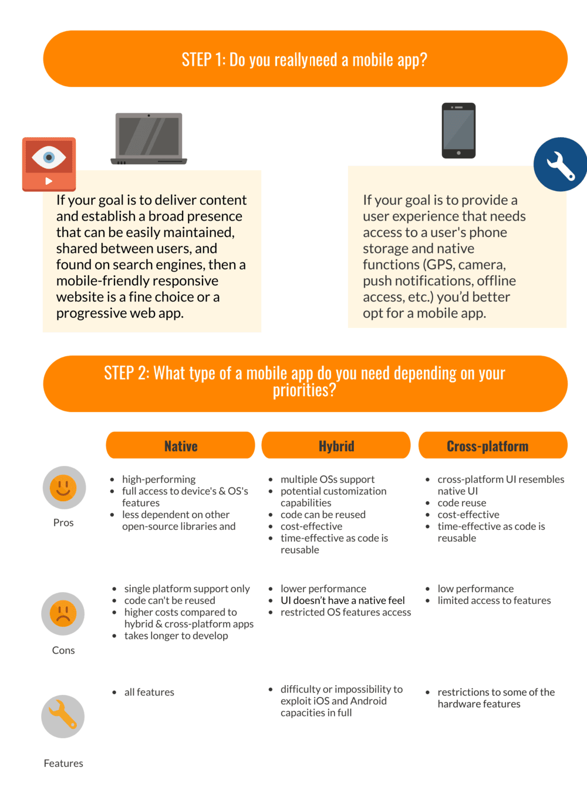
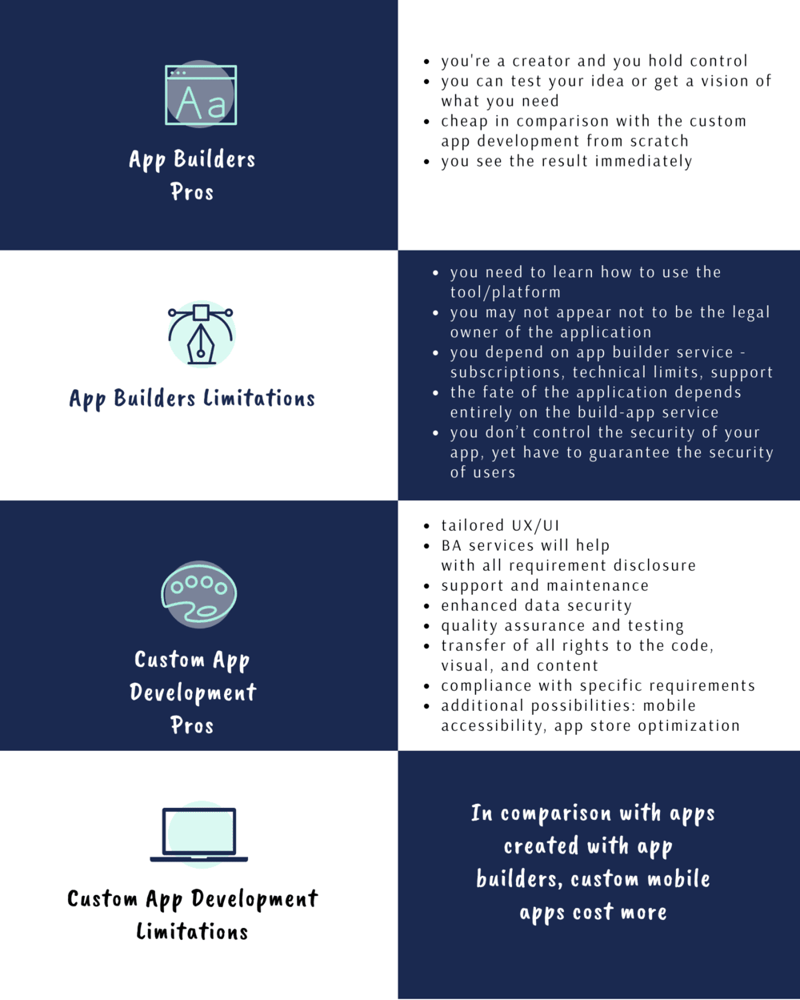

## Sports app industry overview and types of sports apps

The Sports Category preserves significant positive growth by revenue. Let’s take a look at the Market Revenue Forecast for the Sports Category for the App Store and Google Play (net revenue growth through 2023). According to SensorTower, Sports app revenue on *Google Play* is expected to have practically the same CAGR (compound annual growth rate) as the *App Store* at 22 percent to $151 million by 2023.

Sports app revenue on App Store is forecast to reach $520M.

Types of sports apps can be limited only by the imagination. There are hundreds of them, so enumerating them all is hardly possible. Still, we’d try to provide some popular and frequent apps:

* Live Sports Streaming
* Sports betting apps
* Scoring apps
* Tickets
* Rulebooks
* Sports League Management Apps
* Maps, GPS tracking
* Fantasy sports
* Coaching and personal training
* Sports equipment and facilities booking
* Apps for engaging fans
* Sports news, and much more.

To understand the possibilities in the field of creating applications for different sports, just try scrolling to the end of the <a href="https://www.topendsports.com/sport/list/index.htm" rel="nofollow" target="_blank">list with the names of sports</a>, have some fun.

It must be noted that the Sports app category hasn't been included in the list of the most downloaded categories. According to <a href="https://www.statista.com/statistics/279286/google-play-android-app-categories/#:~:text=As%20of%20the%20fourth%20quarter,with%20a%209.45%20percent%20share" rel="nofollow" target="_blank">Statista</a>, the undoubted leaders on Google Play app categories as of 4th quarter 2020, **by share of available apps** became Games and Educational apps. The SensorTower reports that Q1 2021 was a dynamic quarter for finance apps if estimated **by the number of downloads**. Top Categories by Downloads in Q1 2021 include Games, Photo & Video, Utilities, Entertainment, and Social Networking.

Nevertheless, the Sports Category preserves significant positive growth by revenue as it was noted before.

## How to describe your sports app idea

To make a sports app is not such a big deal as you may think as you sit down to research the topic. Everything starts with your idea and the value you’d like to provide to your users. Express your idea in writing - a doc or a presentation - and include these essential elements:
* A project name
* Who is in charge of the project and one’s areas of responsibility
* Prerequisites (description of your business if you have one, project’s background, or trends, market overview or predictions, benchmarking, expert opinions, competitive analysis, SWOT and PEST, etc.)
* Users. Define who your app users are. What value they get from it. If there are several types of users, describe them separately
* Measurable project goals
* Functional areas (what features your app must possess to attain the expected results) and expected results
Project milestones (if you need to set the timeframes for each milestone. This is the time you expect each vital project stage to be completed)
* Budget. Think of what amount of money you’ve got on the project start, if you expect the possibility of additional money injections during the project run, what amount you can afford if you are exceeding the budget, what are the options for additional financing and who can be interested in funding your app. This information will be helpful to decide on the contract type - Time and Materials, Fixed Price or Cost Reimbursable Contract - and set in all the details in your contract terms and will save you from interrupting the project due to an early budget run-out.
* Success metrics. Think of how you’ll measure that you reached your project goals
* App quality criteria

## Decide on what app type you need
First of all, ask yourself do you really need a mobile app or your business will be ok with a website or a progressive web app?

You should decide on the app type. All of them have got pros and cons, and you’ll have to find the right balance between the richness of features, types of materials you want to put in the app, promotion possibilities, the reach of your users, and much more. All these technical aspects as well as the amount of information may be complicated for perception and to decide for sure it can be helpful to <a href="https://anadea.info/free-project-estimate" target="_blank">consult the app development company</a>.

## How to go about building a sports app?

In case you have no desire to decide on all these things, we can assure you that if you come to a <a href="https://anadea.info/solutions/sports-app-development" target="_blank"> **sports app development company**</a>, you’ll define the core things together with your contractor. Otherwise, in case you decided to build it on your own, for instance with the help of an **app builder**, you can skip describing some of the formal points, but just keep them in mind.

Anyway, before you started it’s a good idea to understand the STRENGTHS AND LIMITATIONS of these 2 options.

## What are the features the sports app must have?

As you’ve already found out, there are no “must-have” features, but there are common features that are standard or frequent, so they are:
* Registration and User Account
* Payment Gateway
* Push notifications
* Social Media Networking Capabilities
* Communication features - audio, video, text
* User-friendly UI/UX, seamless performance, availability, offline mode, data security, and more.

Sports App’s killer features, the ones that build up the core of your app, reflecting its purpose and the way they will be implemented largely determine whether it will be successful. Try to pay more attention to the user-engaging features, tune their experience well, give an easy way to do what they came for, and constantly optimize.

<a href="https://www.torrens.edu.au/blog/why-sports-industry-is-booming-in-2020-which-key-players-driving-growth#.YJtvl7UzZPZ" rel="nofollow" target="_blank"> Currently</a>, North America is the largest market for the sports industry, accounting for around 30% of the global market. <a href="https://anadea.info/solutions/sports-app-development/fantasy-sports-app-development" target="_blank">Fantasy sports app development services</a> are especially popular here. In terms of market share, the USA is followed by Western Europe, the Asia-Pacific, and then other regions.

According to <a href="https://appfollow.io/rankings/iphone/us/sports#" rel="nofollow" target="_blank">Appfollow</a>, in demand today are such features as GPS tracking, live sports streaming, features for fans activities, and a bunch of others, just take a look.

The variability of sports apps gives huge possibilities for business dealing in the sports industry. On the one hand, sports apps lie in the digital plane (fantasy sports, sports news apps, betting, etc.) on the other hand, they serve the sports real sector, which influences a sports apps vertical dramatically. The most essential part is to find your niche and provide your users with better services and user experience than your competitors. Among other success-driving factors, app store optimization can be mentioned.



