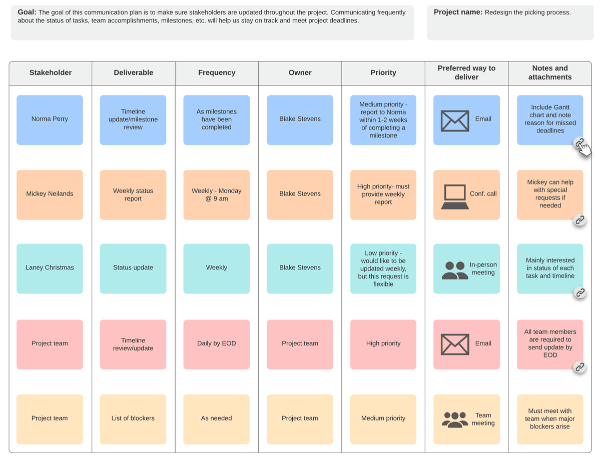

Software development is a complex process. The success of the whole IT project depends on the efforts of each team member and, of course, the mutual understanding between you and the team. This connection is difficult to ensure, particularly when you and your development team are located in different parts of the world.

No matter how accurately the timelines are estimated, a violation of the deadline may occur. And the problem is not necessarily on the developers’ side. Many reasons can influence IT project schedules, and some of them are beyond the control of software engineers. Let's see what you can do to help your software developers meet the deadline.

<h2>Table of Contents</h2>
<ul>
<li><a href="#tips">Tips on Collaborating With the Team Efficiently</a>
<ul>
<li><a href="#goals">Set Clear Goals</a></li>
<li><a href="#responsibilities">Allocate Responsibilities</a></li>
<li><a href="#asap">‘ASAP’ Won’t Work: Prioritize</a></li>
<li><a href="#changes">Avoid Frequent Changes in Tasks</a></li>
<li><a href="#communicate">Participate & Communicate</a></li>
<li><a href="#recognize">Recognize, Reward, and Celebrate Collaboration</a></li>
</ul>
</li>
<li><a href="#fin">Bottom Line</a></li>
</ul>

## Tips on Collaborating With the Team Efficiently

### Set Clear Goals
The basics of how to meet deadlines all boil down to understanding the expected [results and the means of achieving them](https://anadea.info/blog/how-to-create-a-solid-business-plan-for-a-mobile-app-startup).

To plan a project, it’s not enough to set tasks. At the early stages of planning, chances are that your Project Manager will prepare __a project roadmap__ for you. A project roadmap is a graphical high-level overview of goals and needs on a timeline, where important milestones, deliverables, and resources are indicated.

_
Source: <a href="https://www.officetimeline.com/pro" rel="nofollow" target="_blank">officetimeline.com</a>
_

For maximum transparency and comprehension, be very attentive to definitions you and the Project Manager use. Are you sure you understand the same thing under them? We mean it: _are you sure?_

Check the time allocated to each feature and don’t be shy to share your considerations with the Project Manager. If the PM thinks 2 weeks is enough to develop a certain feature but you find this period too short, feel free to figure out why they decided so.

In other words, it’s always best to ask twice.

### Allocate Responsibilities
Each piece of work should be done by a specific professional - that’s why we have so many participants in our projects. If everyone is responsible for everything, it comes out that nobody has responsibilities at all. Building a __RACI matrix__ including the project stakeholders from your side can simplify the workload and provide specialists with a more clear vision for their contribution. According to the RACI principle, for each task on the project, four roles can be assigned: that of Responsible, Accountable, Consulted, and Informed parties.

For this method to work, look beneath the surface. Say you want to appoint a specific team member as a Consulted side. You suggest they have the relevant expertise, but is it really true? Are they competent enough to assist developers at a crucial point? Before distributing team members in the RACI matrix, ask them directly whether they’re competent enough to take responsibility you’d want them to.

Thus, to streamline the project lifecycle and eliminate confusion, make good use of all the available means.

### ‘ASAP’ Won’t Work: Prioritize
It’s hard to set a single deadline for a massive project appropriately. Many employers use 'ASAP deadlines' frequently. However, if the term 'ASAP' is used too much, it eventually loses its sense of urgency. Undefined deadlines result in unfavorable results.

What’s the problem with the ‘ASAP’ method? It ignores prioritization: we can’t do it all at once. Developers should know __the priority of each task__. How do they know it?

Well, first, Business Analyst breaks down the entire project into chunks of tasks and sets a deadline for each. Each of such chunks is called __a sprint__ - an iteration during which a team has to achieve a certain milestone. Most projects have 2 week-long sprints.

What’s good to have is __sprint pre-planning__ - a session during which the goals for a subsequent iteration are set. What you need to do during this session is to __highlight the high-priority tasks__. That’s what will allow developers to look two steps ahead and distribute their workload wisely.

### Avoid Frequent Changes in Tasks
It’s great when entrepreneurs are in the permanent search for improvements and fresh solutions. And it’s also fine if you want to implement the [latest trends](https://anadea.info/blog/mobile-app-trends-where-the-industry-is-heading) in the industry into your solution. However, frequent changes in requirements result in delays, as even an innocent little thing, like adding social media share buttons, might take 5-6 hours to develop and as many hours to test. Although the Agile methodology allows for making changes to the technical requirements at any stage of development, always keep in mind its consequences in the face of shifted deadlines.

Also, mind the difference between __feature elaboration__ and __a change request__. While feature elaboration means determining the details of one particular feature, i.e. adding complexity to it, a change request means that some implemented requirement should be replaced with another requirement. It’s always easier to overbuild something rather than rebuild it from the ground up. Keep it in mind when coming up with some killer new idea.

### Participate & Communicate
Again, we’d like to emphasize the importance of your participation in the development process. Your team needs continuous input from your side. Review updates, give your feedback, take part in sprint pre-planning meetings, and make decisions if some issues arise.

The best thing you can do together with Business Analyst and Project Manager is to make up a schedule of team meetings. Also, notify team members of your __preferable channels of communication__ and let others do the same. For example, you’d like to receive notifications of project updates exclusively in Slack. If other, non-specified channels (Email, personal messengers, etc.) are used, notifications might get lost and you might miss something important.

A communication plan is what allows keep information on communication activities in one place. Below you can see an example of a communication plan on a project.

_
Source: <a href="https://www.lucidchart.com/blog/project-management-communication-plan" rel="nofollow" target="_blank">lucidchart.com</a>
_

One more thing: when the entire team gathers for a conference call, don’t make it too long. You need meetings to stay on the same page with your team and address problems quickly, so keep them short and to the point.

### Recognize, Reward, and Celebrate Collaboration
Just like legendary athletic teams, successful IT firms are built with collaborative efforts - the efforts of your outsourced team included. Don't let anyone's efforts go unrecognized. Show gratitude and announce the achievements of each team member. Let your team members know that no matter where they are located, they are still the success drivers of your business.

Feedback is the most valuable and sincere motivator for any specialist, including us - those working on your IT project. We’re at our best when we know your thoughts on our work. For us, there’s no better reward than your __open and honest feedback__ after demos and the project release.

## Bottom Line
Being on time with your software initiatives shows your professional attitude towards your customers, contributes to your business reputation, and conduces to your project's success. Missed deadlines have ominous consequences and can create a domino effect. Thus, both parties - business owners and software developers - should work together. Follow these tips to help your development team deliver your software on time!
