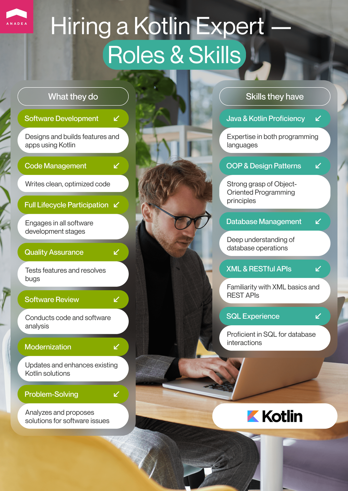
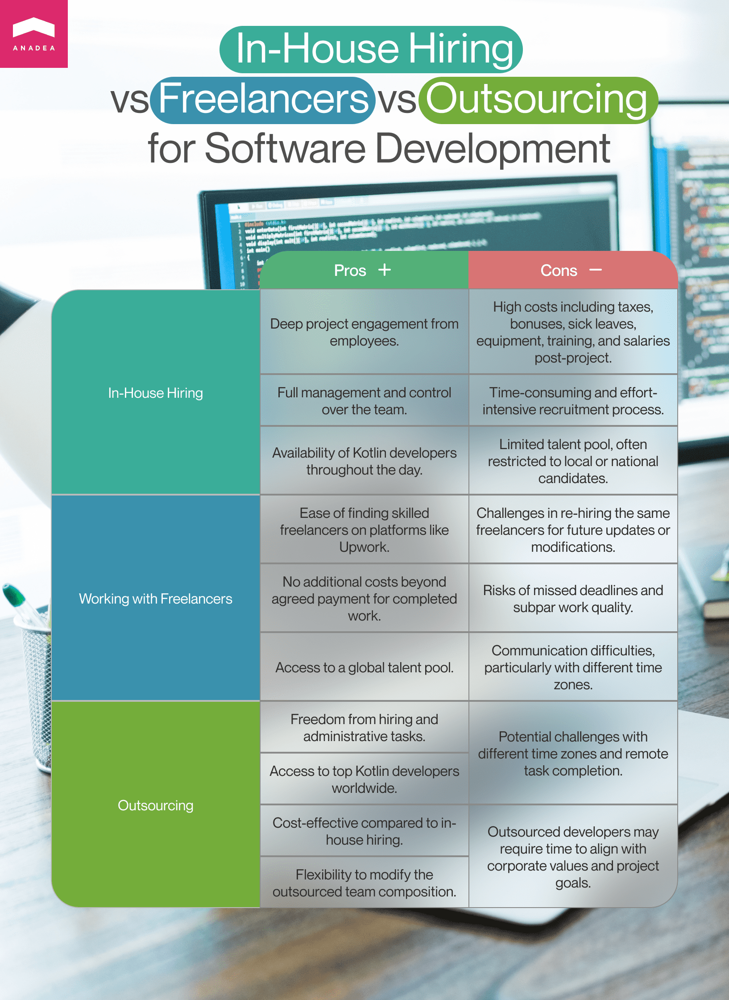
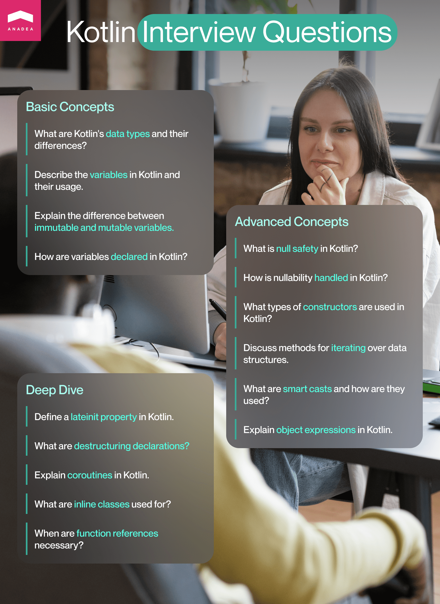

The popularity of Kotlin as a programming language used for full-stack web and mobile development is growing. Of course, today on the [list](https://www.statista.com/statistics/793628/worldwide-developer-survey-most-used-languages/) of the most widely used languages, it is still rather far away from such giants as Java or Python but it is gradually climbing higher. According to the Tiobe Programming Community index that was published in October 2023, Kotlin [occupied](https://www.tiobe.com/tiobe-index/) the 18th position. For Kotlin, it is an important milestone as it is the first time it has won such a high position. Just compare, in September 2023, it was in the 20th position, and in October 2022 - in the 28th.

This programming language was invented as a more easy-to-use Java alternative and today it can really cope with the set tasks. Given all the benefits that it offers, it is quite natural that a lot of businesses want to hire Kotlin developers who will work on their projects. Each time you are interested in hiring a specialist with any particular skills and knowledge, it is obvious that you want to find the best professional. But the main question is how to do it. In this article, we'd like to share valuable insights based on our experience. They will help you to find the best Kotlin experts based on your needs.

## Kotlin developers: Facts and figures

When you want to hire Kotlin programmer, you should know that you will have the possibility of choosing among a row of candidates. A lot of specialists admit that they prefer Kotlin to Java for Android development because it helps them demonstrate higher productivity. More than 50% of programmers who build Android apps rely on Kotlin as their primary tool. Moreover, this programming language has already proven its efficiency for web development.

According to the [data](https://blog.jetbrains.com/kotlin/2021/09/the-actual-number-of-kotlin-developers-or-who-our-active-users-are/#:~:text=In%20the%20last%2012%20months,in%20at%20least%20one%20month.&text=The%20average%20number%20of%20active%20developers%20per%20month%20in%202021%20is%20373%2C000.) provided by JetBrains, in 2021, the number of Kotlin developers was around 4.86 million globally. And amid the increasing popularity of the language, it is sensible to presuppose that today the number of Kotlin experts is already bigger.

Are there a lot of companies that want to hire Kotlin developer now? Let's consider the available jobs for developers with Kotlin skills. The approximate figures on LinkedIn are as follows:

- 1000 jobs in Canada;
- 1200 jobs in the US;
- 1870 jobs in Germany;
- 2400 jobs in Poland;
- 1100 jobs in India.

The demand is rather high which explains why a lot of programmers want to expand their knowledge and study Kotlin. But what other skills are required if a person plans to work with this programming language?

## Skillset for Kotlin app development

If you plan to hire Kotlin app developer, we strongly recommend you deeply study the requirements that companies usually have for such specialists. Of course, there can be some project-specific requests based on the planned functionality and integrations. Nevertheless, let's consider this question in general.

When you hire Kotlin expert, you can expect them to:

- Plan, design, and build separate software features and full-scale apps with the help of Kotlin;
- Write readable code and optimize it when it is necessary;
- Participate in all the stages of the software development process;
- Test features and fix bugs;
- Conduct software review;
- Update and modernize existing solutions built with Kotlin;
- Analyze and offer different approaches to solving an existing issue.

To fulfill the set tasks a specialist needs to:

- Have expert knowledge in both Java and Kotlin;
- Know OOP (Object-Oriented Programming) principles and design patterns;
- Deeply understand the principles of working with databases;
- Be familiar with XML basics and RESTful APIs
- Have experience in working with SQL.

Depending on the exact project that you hire Kotkin developers for, you may require knowledge of web development approaches and frameworks or expertise in working with Android SDK and Android libraries.

It is always a good idea to hire Kotlin programmer who understands the peculiarities of your business domain and has already worked on similar projects. However, in many cases, instead of wasting time while looking for developers with niche expertise, companies prefer to work with specialists who have excellent analytical skills and are open to new knowledge.

Among other popular requirements, we should mention familiarity with the Agile development methodology, as well as problem-solving and communicative skills.

In accordance with the seniority level that developers have you can also expect from them different speeds of performing tasks and different abilities in addressing issues without external help and guidance.



Speak to Kotlin experts

## Where can you hire Kotlin developers?

It doesn't matter whether you are looking for Kotlin programmers or developers with other skills, mainly, you have three key approaches to hiring:

- In-house hiring;
- Working with freelancers;
- Establishing cooperation with an outsourcing software development company.

If you asked us which option is the best one, we wouldn't be able to provide a single answer as everything drastically depends on a row of factors, including your business goals and requirements. Let's consider them all one by one.

### In-house hiring

If you already have an IT department and you are sure that you will be able to provide the required load for all your employees in the long term, it can be a good option for you. When you have your own employees, you always know that during a working day, they are fully at your disposal, they deeply understand your corporate culture and know your values and needs.

But the issue is that quite often, it is not feasible at all to expand your staff with new team members if you know that the services of Kotlin experts will be required only during the realization of one project.

#### Pros of in-house hiring

- Your employees are deeply engaged in your project.
- You can fully manage and control the work of your team.
- Kotlin developers will be available throughout the day.

#### Cons of in-house hiring

- It is a rather expensive model if compared with other options (You will need to cover all the costs, including taxes, bonuses, and sick leaves, and invest in equipment and professional training, as well as pay salaries even when an active phase of the project is over).
- The recruiting process can be very time- and effort-consuming.
- In the majority of cases, you will be looking for specialists in your city (or country) which means that your choice will be rather limited.

### Cooperation with freelancers

This option looks quite appealing to many companies as it allows them to reduce budgets on the labor force. The rates of freelancers are often lower than the rates that in-house employees expect to get. It usually doesn't take long to establish cooperation with freelancers which means that you can opt for this model when you urgently need to get some work done.

However, you should understand that freelancers are interested in performing your tasks as soon as possible to get the possibility to take on the next project. It means that sometimes speed becomes the main value for them. Moreover, you can't be sure that they will be fully concentrated on your project.

Nevertheless, for some small tasks, it can be a very good variant.

#### Pros of working with freelancers

- It is usually rather simple to find a freelancer with the required skills as there are a lot of relevant platforms like Upwork.
- You do not need to cover any additional costs, you agree to pay a particular amount and you will pay it for the work done.
- You have access to a global talent pool.

#### Cons of working with freelancers

- It may be difficult to hire the same freelancers if you need to modernize your product in the future.
- Not all freelancers are honest and responsible. Missed deadlines and low quality of work are not rare.
- It is not always simple to regularly communicate with freelancers, especially if they are based in another time zone.

### Outsourcing

This model unites the benefits of the two mentioned above and has its own specificity. If you hire a reliable outsourcing company, you will be fully protected from all the risks associated with cooperation with freelancers. All the terms of your cooperation will be indicated in the contract and all the responsibilities and tasks will be discussed.

Based on the exact engagement model that you will choose, your participation in the development processes, as well as the level of the project coordination from your side will depend. Nevertheless, you can choose the format that will be the most suitable for your case. If you choose Anadea as your software development partner, we will always help you to make the right choice that will bring the highest value to your business.

When you hire an outsourcing company, you need to share your project requirements and the skills that you want software developers, including Kotlin experts, to have. Your partner will find the best candidates and after you approve a team composition (or choose a developer, if you need the help of only one specialist), the work on your project will start.

#### Pros of outsourcing

- You do not have to deal with hiring and administrative responsibilities.
- You can work with the best Kotlin developers from all over the world.
- In comparison, with in-house hiring, it is a highly feasible option.
- It is easy to change the composition of the hired team.

#### Cons of outsourcing

- There can be issues caused by different time zones. Moreover, it is not always easy to solve all the tasks in a remote format.
- Developers may not fully understand your corporate values and may need some time to understand your project goals.

Without any doubt, when you need to hire Kotlin programmer, you should consider different models to make the right decision. From our side, we can guarantee that if you turn to us, we will ensure absolute transparency, fair rates, and no hidden costs. We have a rich talent pool and will be able to find developers even with the required niche expertise.

Hire Kotlin developers

## Rates of Kotlin developers

As you know rates and salaries may drastically differ due to many factors. In the case of software developers, these factors are experience (level of seniority) and region of hiring. For example, rates in India or Eastern Europe are lower than rates in the USA or Canada which explains the popularity of offshore outsourcing.

On average, if we take the data from different countries, we will see that Kotlin developer hourly rates are somewhere in between $35 and $150 with a median of around $50.

Here is also some data on Kotlin developer average salaries in different countries.

- **Germany**: $70,000 per annum / $5800 per month
- **Switzerland**: $116,000 per annum / $9600 per month
- **The United Kingdom**: $92,000 per annum / $7600 per month
- **Poland**: $49,000 per annum / $4000 per month
- **India**: $11,000 per annum / $915 per month
- **The United States of America**: $130,000 per annum / $10,833 per month

## Interview questions for Kotlin developers

Different companies may have their own approaches to organizing their recruiting processes. However, direct communication with the candidates who were chosen after the analysis of their CVs is an integral part of any hiring approach.

As a rule, apart from an interview with an HR manager or recruiter, companies organize tech interviews that are conducted by team leads and tech experts (when we are talking about companies that offer outsourcing and outstaffing services, customers can also take part in them).

We've prepared a list of questions that you can ask when you want to check the knowledge of your candidate.

1. What data types are used in Kotlin? What is the difference between them?
2. What variables are available in Kotlin? How are they used?
3. Immutable and mutable variables: what is the difference between them?
4. How to declare variables in Kotlin?
5. What is null safety in Kotlin?
6. How to handle nullability in Kotlin?
7. What constructor types are applied in Kotlin?
8. What methods can be used to iterate over any data structure in Kotlin?
9. What can you do with smart casts in Kotlin?
10. How can you explain the concept of object expressions in Kotlin?
11. Explain what a lateinit property in Kotlin is.
12. What are destructuring declarations in Kotlin?
13. What are coroutines in Kotlin?
14. What are inline classes used for?
15. When do we need to use function references?

Of course, it is only an approximate list of questions. You may not need to ask them all. Moreover, you may think about your own questions that will be related to your project and the required skills.

## How to make sure that you have chosen a good Kotlin developer?

Based on our experience, we can say that when we hire Kotlin experts we always pay attention to their **professional backgrounds**. Usually, we ask them to tell us about their previous projects and mention the most challenging tasks and the ways they managed to cope with them. It is always very important to understand whether a person is good at using theoretical knowledge in practice.

We also recommend you analyze the **portfolios** of candidates if they can share them with you. Reviews and endorsements provided by previous customers or employers also can be of great use. However, they are not always available.

Though there is an opinion that hard skills are more important than soft skills, we want our programmers to have both. For us, it is crucial to have developers who can efficiently cooperate with others, who are ready to share their thoughts and discuss them, who are not against listening to feedback, and who can protect their position.

It is also vital to see that a person is not afraid of taking responsibility.

We try to pay attention to all these skills while making a decision regarding our cooperation with a developer.

## Final word

We strongly believe that when you plan to hire Kotlin developers, the first and most important thing is to decide on the model of cooperation with programmers. Depending on this decision, you will be able to understand what you should do next.

If you need the help of an IT outsourcing partner, our team is always at your disposal. We will deeply analyze your requirements, and help to hire Kotlin app developer (or developers) whose skills will fully correspond to your expectations. Contact us to learn more!

Request a free quote

## Frequently Asked Questions

### Where can I find Kotlin developers?

Everything depends on whether you want to hire in-house employees or work with an outsourcing agency or freelancers. In the first case, you can use LinkedIn or online job boards that are popular in your region. For hiring freelancers, we recommend you use such platforms as Fiverr or Upwork while for looking for a software development company, you can rely on repositories like Clutch or GoodFirms.

### What do Kotlin developers do?

The main responsibilities of such experts typically include participating in different stages of the development process, planning and creating apps using Kotlin, fixing bugs, updating and modernizing apps. In general, all the tasks of Kotlin developers are aimed at building relevant software functionality that will help to achieve the set goals.

