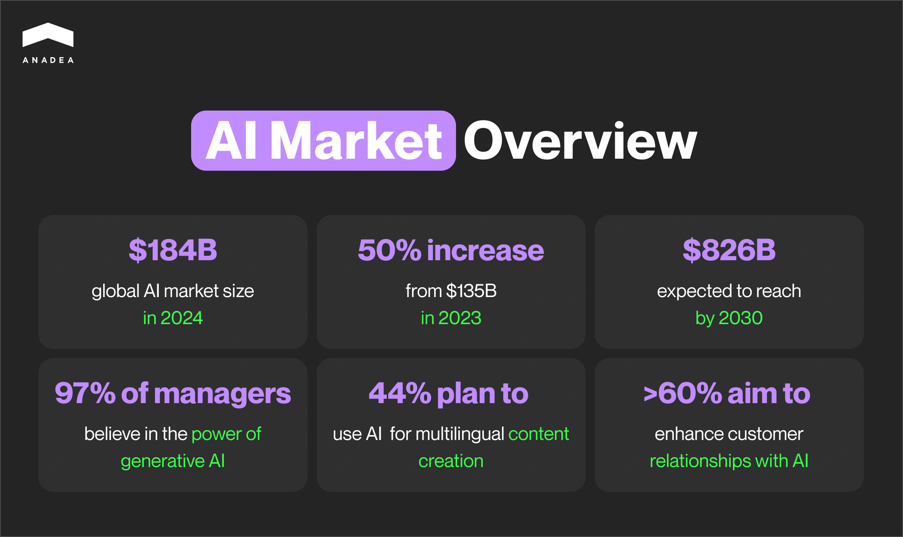
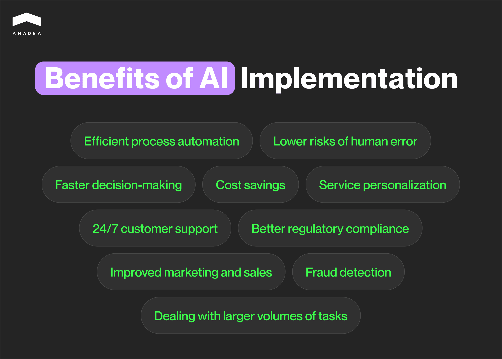
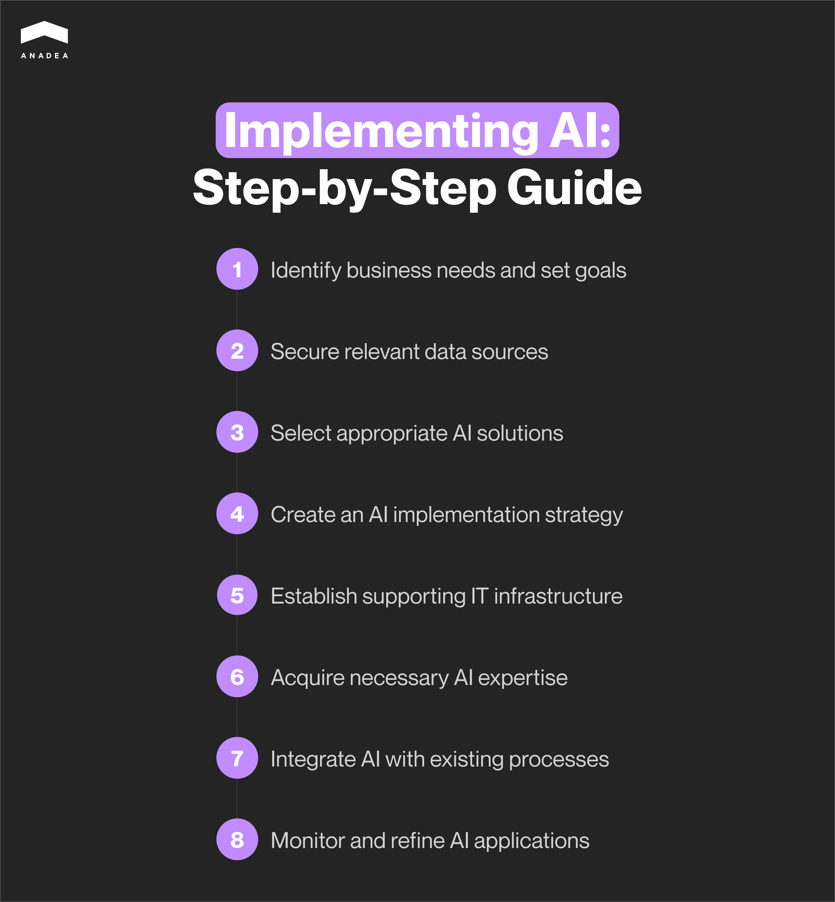

The global AI market size has [achieved](https://www.statista.com/forecasts/1474143/global-ai-market-size) the level of $184 billion in 2024. This figure illustrates an impressive jump of around 50% from $135 billion in 2023. The forecasts for the future are even more optimistic. In 2030, the market volume is expected to surpass $826 billion. Such growth proves heavy investments and the growing demand for AI-powered solutions from the side of businesses in different domains. But what are the factors behind these trends? How to implement AI in business? And would you really need to do it? You can find answers to these questions in our blog post.

## What is AI implementation? Basic definition

Artificial intelligence implementation can be defined as the process of integrating AI technologies and tools into real-world business applications and operations.

This term unites the whole set of steps and efforts. Their range includes the design, [development](https://anadea.info/services/ai-software-development), and deployment of AI models. Introducing such solutions aims to address specific problems, enhance decision-making, and automate tasks in different industries.

According to the statistics [published](https://www.forbes.com/advisor/business/ai-statistics/) by Forbes, 64% of businesses suppose that thanks to AI implementation they can ensure higher productivity. This percentage is good proof of the fact that the majority of business owners believe in the feasibility of investing in AI and related technologies.

It is also interesting to take a look at different approaches to implementing AI in business and, consequently, the areas of its application. For example, an absolute majority of managers and executives strongly believe in the power of generative AI and, namely ChatGPT. 97% of business owners who participated in the Forbes Advisor survey said that ChatGPT can help their businesses. 44% of them plan to use this solution to create content in different languages. At the same time, nearly one-third of respondents see the key value of ChatGPT in website content generation.

If you want to learn more about the use of GPT models in business, you can read about it in one of our <a href="https://anadea.info/blog/gpt-4-use-cases/">blog posts</a>.

Speaking about their AI implementation strategy, more than 60% of business owners admitted that they are going to rely on this technology to enhance customer relationships. At the same time, 64% said that AI could increase business productivity, and nearly 40% of respondents see its potential in streamlining processes.

## Real-life examples of artificial intelligence implementation

Today AI is being successfully applied across multiple domains.

Here’s a couple of examples:

* **Healthcare**. AI models can help in diagnosing diseases, analyzing medical images, and creating personalized treatment plans.
* **Finance**. AI is often applied for powering fraud detection, risk management, and automated trading solutions.
* **Manufacturing**. Artificial intelligence can optimize supply chain operations, predict equipment failures, as well as successfully automate production processes.
* **eCommerce.** In this industry, artificial intelligence is used in recommendation engines, customer service chatbots, and analytics tools.
* **Oil and gas**. AI-powered tools are used to enhance exploration and drilling, optimize production, increase safety, and improve asset management. More details can be found [here](https://anadea.info/blog/artificial-intelligence-in-oil-and-gas/).
* **Fitness**. Thanks to AI implementation, fitness lovers can get highly efficient training programs and menus developed based on their individual needs.

## Benefits of AI implementation in business

Apart from thinking about how to implement AI in your business, you should also get a clear understanding of what it is worth doing. It doesn’t make sense to invest in any solutions powered by artificial intelligence just because everyone around you is talking about this. AI has become a buzzword and a fashionable trend today. Nevertheless, the fact of AI implementation itself won’t bring you any advantages.

However, its conscious application following your business needs can fully change the game for you. Here’s what you can get with the correctly chosen AI implementation strategy.

* **Efficient process automation.** AI can automate routine and repetitive tasks. As a result, your employees will have more time for more complex, strategic work.
* **Lower risks of human error.** AI models are trained to follow precise instructions. This helps to reduce the likelihood of mistakes that are quite natural for people.
* **Faster decision-makin**g. Artificial intelligence can quickly analyze large datasets and provide valuable insights. With AI tools at their disposal, managers make faster and more informed decisions.
* **Cost savings.** First of all, automation reduces the need for manual labor, which allows companies to cut down operational costs. Secondly, AI-powered systems can optimize supply chains and resource management. This helps to avoid extra expenses related to business processes.
* **Service personalization**. AI can analyze customer behavior and preferences of different client groups. Based on this analysis, such solutions can offer personalized recommendations and services to people. This approach can greatly enhance the overall customer experience.
* **24/7 customer support.** AI-driven chatbots and virtual assistants can offer customer service around the clock. Moreover, they can instantly process customer inquiries and provide rapid responses much faster than human agents.
* **Fraud detection**. AI systems can monitor various activities across your systems, like financial transactions, detect anomalies, and flag potential fraud in real time.
* **Better regulatory compliance.** With the help of artificial intelligence, you can be always sure that all your business processes fully comply with legal requirements. It is possible thanks to the capacity of AI to continuously track regulatory changes.
* **Improved marketing and sales**. Thanks to AI implementation in business, you can launch more effective ad campaigns, better predict consumer demand, and develop more relevant sales strategies. Apart from this, you can rely on tools powered by artificial intelligence to identify and qualify sales leads with higher accuracy.
* **Dealing with larger volumes of tasks**. AI systems can easily scale to manage increased workloads. It means that even without hiring new team members, you can expand your activities. And it won’t lead to significant cost increase.

Of course, the above-mentioned list contains only the key benefits that you can leverage thanks to implementing AI in business. In reality, there are much more other opportunities that will be opened to you. Moreover, some of them are industry- or domain-specific. If you still have doubts regarding the benefits of such efforts for your business, you can always get a [professional consultation](https://anadea.info/services/consulting-and-audit) with experts.

For example, at Anadea we can offer such services. We will deeply study your needs and your current IT infrastructure to find the best answers to the questions on how to incorporate AI into your business and whether you should do it at all.



## How to implement AI in your business: 8 essential steps

Every company is unique. This means that the one-size-fits-all approach won’t be the best choice. Each case should be viewed individually. Nevertheless, some key steps can become the basis of your AI implementation plan.

That’s why if you are considering different options on how to implement AI in business, we strongly recommend you review the following to-do list.

### Step 1. Identify your business needs and goals

You should start by identifying the pain areas where AI can be used to address key challenges or inefficiencies. Just a small hint from us. Very often such areas are customer service, marketing, operations, and supply chain management.

When you have found the problems that should be solved in the first turn, you need to set clear objectives. You need to answer the following question “What should AI do for me?”. The possible goals include such points as cost reduction, revenue increase, or customer experience enhancement.

At this step of artificial intelligence implementation, you also need to find out how AI will impact your processes, activities, and teams in general.

### Step 2. Find the most relevant data sources and/or collect your own data

AI models rely on data. When you already have an understanding of the types of solutions that you will need to introduce, you should assess if your business has sufficient quality data to train models. If not, you should focus on building a data collection first. For your solutions, you may need to use data from your CRM systems or financial data, or it may be sensible to include external sources as well. For example, you can utilize data from social media or news feeds.

Make sure that you have proper systems in place to collect, store, and organize data. In the framework of artificial intelligence implementation, it will be also necessary to invest in databases. Many businesses also choose cloud storage for these purposes.

It’s also critical to regularly clean and refine your data. High-quality, structured, and relevant data is a key to the efficient work of AI models.

### Step 3. Choose the right AI solutions that will fully meet your requirements

Here, you have two options to choose from. You can either rely on off-the-shelf products (like CRM AI tools or chatbots) or you can build your own custom system. Though the first variant usually requires smaller investments, it has a row of limitations, when it comes to scalability, integrations, and customization.

Custom development offers much more freedom and flexibility. You can equip your system with any tools and technologies. It means that it will be fully tailored to the specificity of your business. In one of our previously published blog posts, we described the process of [AI software development](https://anadea.info/blog/how-to-create-ai-software). If you want to learn more about it or need help from professional developers, at Anadea, we will be always ready to help you.

### Step 4. Develop an effective strategy for artificial intelligence implementation

Strategic planning is a must. It should contain the main answers to all the questions on how to incorporate AI into your business.

You need to have a clear AI implementation roadmap. It should outline key milestones, timelines, and expected outcomes.

We also always recommend our customers break down the process into manageable phases and start with small pilot projects before full deployment. This will facilitate all the tasks for you and let avoid a lot of serious financial risks.

### Step 5. Build the required IT infrastructure

Make sure that your existing infrastructure, including servers, cloud platforms, and databases can support AI workloads and is ready for artificial intelligence implementation.

This point is especially relevant for solutions-powered ML models or large datasets.

### Step 6. Make sure that you have relevant AI expertise

Your “How to implement AI in business” plan should include not only efforts aimed at choosing and introducing tech solutions but also at upskilling your team.

If your employees have never worked with artificial intelligence before, they may have a lot of worries and concerns. It will be a good idea to provide AI and data literacy training to your staff. It will help your team members to effectively collaborate with AI systems.

It can be also sensible to hire AI experts, such as data scientists, AI engineers, or machine learning developers.

### Step 7. Integrate AI into your processes

AI should be seamlessly connected with your existing software, workflows, and systems. AI implementation should be organized in such a way that this technology will augment rather than disrupt current processes.

You may need to redesign certain business processes to accommodate new solutions, especially if these solutions are supposed to optimize or automate parts of them.

### Step 8. Continuously monitor, evaluate, and enhance your solutions

To understand whether you are on the right way, use key performance indicators. KPIs will help to measure such parameters as productivity, costs, or customer satisfaction. Based on the results of the evaluation, you can make decisions on the necessity to change something in your solutions.

AI systems need regular monitoring and updates. Algorithms might need retraining, especially when you get new data. You also should refine AI models based on performance and feedback.

## AI cost estimation: What to take into account?

While considering AI implementation, you also should think about the cost of such a project. It is very important to make estimates as precise as possible. Otherwise, the risk of running out of budget will be too high.

Unfortunately, it is not possible to name any accurate figure for your AI implementation initiative without studying your requirements, needs, and expectations. Such projects can be too different for different companies. This explains why you can’t take somebody else’s estimates as a benchmark.

Costs of the basic model developments can start at $5,000. At the same time, for the creation of some advanced systems with complex functionality, an investment of $80,000 and more may be required. Such figures do not look very helpful, right?

That’s why it will be more sensible to consider the range of factors and parameters that will influence the cost of AI implementation at your organization.

### Factors that impact the costs of artificial intelligence implementation

* Necessary hardware (like GPUs and ASICs);
* Data-related costs, including costs of data collection, preparation and cleaning (here, it is very important to bear in mind that a type of data will have a huge impact. For example, those models that operate with images will be much more expensive than those that provide only textual outputs);
* Software development costs or licensing fees;
* Labor costs (training for existing staff and new hiring);
* Cybersecurity measures;
* AI integration costs;
* Compliance measures.

## Final word

As you can see AI implementation projects can require rather significant investments. Nevertheless, with a clear strategy, high-quality data, and the right expertise, such initiatives can bring a lot of new opportunities and benefits to businesses.

Nevertheless, to enjoy all the possible advantages, you need to make sure that your team has the knowledge and skills required to introduce AI to your business processes.

At Anadea, we will be always ready to help you with AI implementation to maximize long-term benefits for your organization. Just send your requirements and we will provide the project estimates for free.

Request estimate
