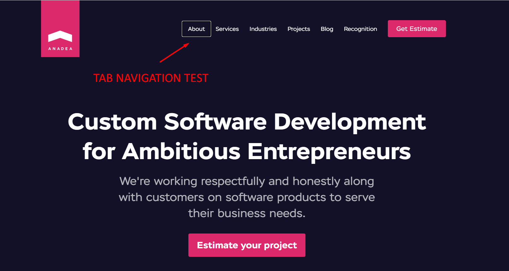
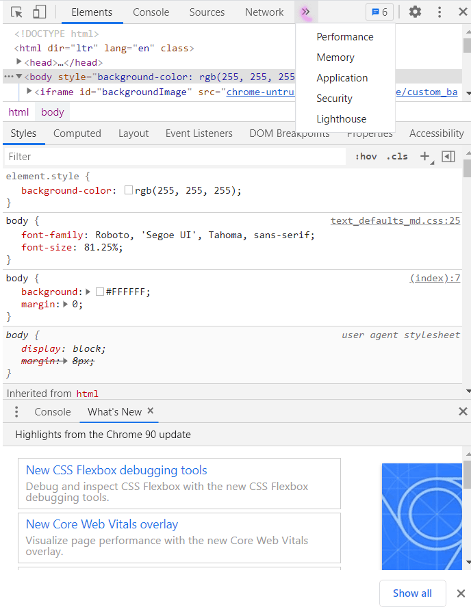
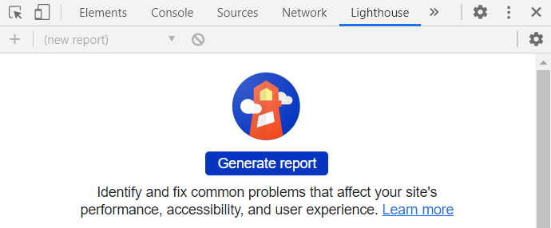
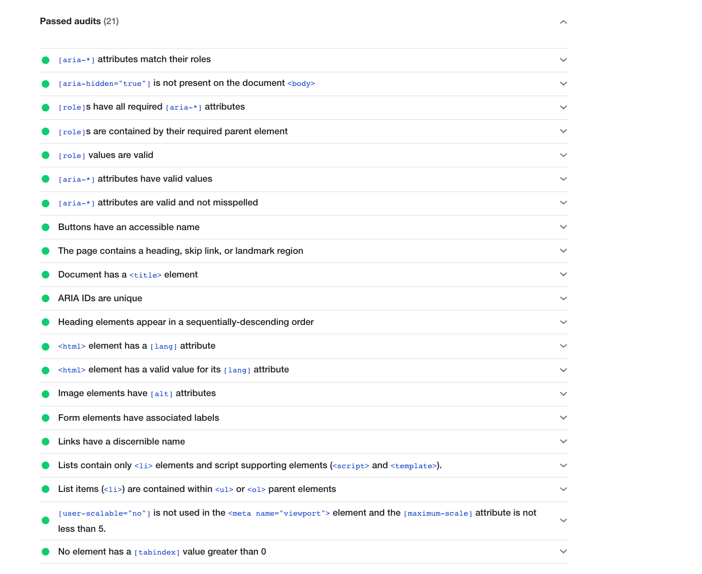
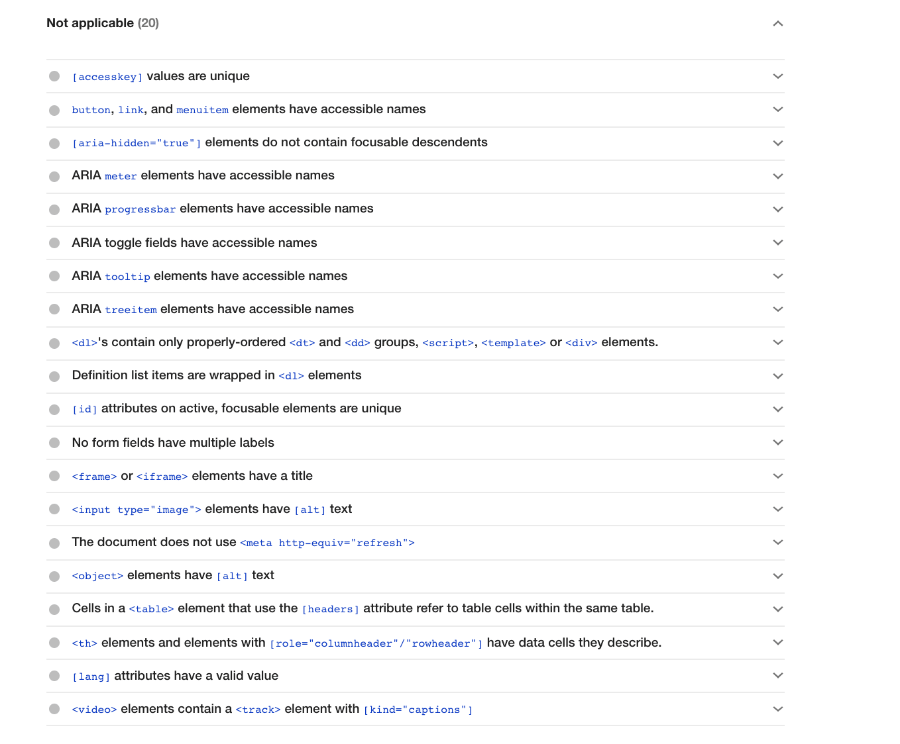
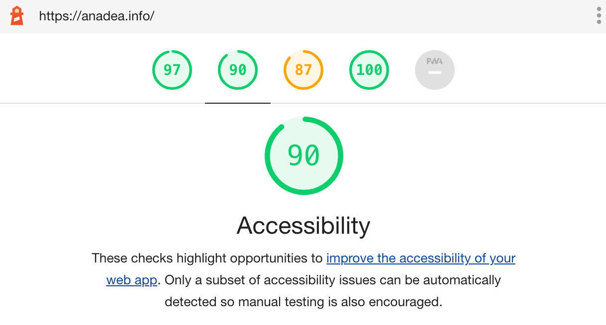

<h2>Contents</h2>
<ol>
 <li><a href="#accessibility_today">Accessibility today - accessibility as a trend, what is web accessibility, regulations.</a></li>
 <li><a href="#importance">Why is accessibility important for your business?</a></li>
 <li><a href="#quick_tests">How to detect poor/good accessibility? - quick, free and elementary tests for websites on accessibility</a></li>
 <li><a href="#specialists">Who can help you with accessibility? - specialists you need to improve accessibility</a></li>
 <li><a href="#mistakes_and_tips">Common mistakes and recommendations to avoid them - Anadea’s experience and tips</a></li>
 <li><a href="#conclusions">Conclusions - expert’s thoughts on accessibility as a trend</a></li>

</ol>

## Accessibility today

The notion of accessibility began to form in the USA in the 90s and inscribed in the context of social and legislative changes. In 1990, (ADA) Americans With Disabilities Act entered into force thus improving the lives of Americans with disabilities providing equal opportunities in public space, transportation, housing, education, work, and more.

Accessibility has gone a long way since that time and spread to digital space as well, and a number of laws in the USA, Canada, Europe and other countries regulate web accessibility for people with disabilities. It’s main goal is to provide equal access to the information as other people and the possibility to use special devices (for example, keyboards with larger or more visible keys, screen readers, etc.) to make navigation and access to information handy to them.

Unfortunately, the present situation is far from ideal. The vast majority of websites and mobile apps still do not comply with the accessibility requirements. However, the rise of the demand in development and remaking web solutions and apps compliant with accessibility regulations can be observed in the job market.

## Why is accessibility important for your business?

The reasons to care about accessibility may be different:
* understanding the need for social change and social responsibility;
* aspiration to get rid of the risks of lawsuits;
* desire to expand the consumer market and a range of others;
* correlation of good accessibility and high Google SERP results through improved user experience and much more.

> Related article: [Core Web Vitals: What They Are & How to Improve Them](https://anadea.info/guides/core-web-vitals)

Nevertheless, regardless of the reasons and goals, to comply with regulations the development must be with accessibility in mind. As a recommendation, web sources should strain after AA (mid-range) accessibility level by <a href="https://www.w3.org/TR/WCAG20/" rel="nofollow" target="_blank"> WCAG 2.0 guidelines</a>. Most companies prefer to pay no attention to accessibility as the development cost raises, as they think, with no paying back, which is not always true, as proved above. Still, the remake after the release may exceed 50% of the cost of the whole project, not counting the penalties from the court, if they take place. Moreover, accessibility regulations violations may cause damage to reputation and monetary losses.

## How to detect poor/good accessibility?

There’s a super-express test to check the state of your website’s accessibility:

Go to your website and press the “Tab” key to navigate the page.

In case you see the highlighted navigation elements, and see on the screen where you are during navigation, if you are able to reach the bottom of the site, then, there’s a probability that developers were thinking about accessibility during the development and you can go to other tests.

 If not, then you’ve got much to consider.

One more quick test is fulfilled with the help of the Lighthouse tool. In Google Chrome go to your website, open ' Developer tools' (CTRL+SHIFT+I), find Lighthouse and click the ' Generate report' button.

This is a list of accessibility items that are checked automatically by the tool:

But still there are a number of those that must be checked manually:

The good result of the test is reaching the “green zone”.

## Who can help you with accessibility?

There are 2 possible situations when you need help with your accessibility:

* with an existing web project;
* with a new web project.

If this is a new web product under development, then the order should be: designer -> frontend developer -> tester, and if an existing one, then the order is: tester - simultaneously working designer and front-end developer.

At Anadea, we take <a href="https://anadea.info/services/accessibility">accessibility testing services</a> into account and we’ve got experience of re-making huge web projects so that they comply with the regulations. For instance, one of our key customers has a need to improve accessibility in short time. The scope of work is significant:

* a designer works through the elements of the page, changing their size, fonts, colors, adding contrast to elements, and making them harmonious with other structural elements, appealing to users, compliant with branding, etc.;
* developers make semantic HTML. Semantic HTML elements are those that clearly describe their meaning in a human- and machine-readable way. They are essential for those who use screen readers, and TAB for navigation;
* solve complex tasks of navigating multilevel lists;
* add the ability to use the calendar and other complex page elements, such as a calculator;
* adding possibility for screen readers to read buttons if they are images;
* making all ‘alt’ attributes meaningful. An alternate text for an area, if the image cannot be displayed to provide information on what is on an image if a user uses a screen reader;
* making headings meaningful for the same reason;
* rebuilding charts so that they become adapted to accessibility, and so much more.

Leading a website to a ‘green zone’ is a long way. Anadea’s experts gathered the most common mistakes of accessibility and recommendations to avoid them to make your way shorter.

## Common mistakes and recommendations to avoid them

### Common accessibility violations:

* image-buttons with no alt text describing them;
* no focus on interactive elements;
* sections without headers;
* images in html with meaningless ‘alt’;
* unavailable libraries;
* lists are not built with ‘ul’ , ‘li’, which results in impossibility for screen readers to voice their contents;
* absence of other semantic tags on the page, which results in poor navigation and impossibility for screen readers to voice elements and their contents;
* links with text like ‘learn more’, without information about where it directs the user.

### Recommendations from our experts:

* consider law regulations, requirements for accessibility of the region of your business and your audience;
* don’t focus on reaching the ‘green zone’ too much. It’s better to focus on the users’ experience. Think of how people with disabilities will use your website, think of their convenience first. For instance, don’t write meaningless alt text, just to pass the tests;
* it’s a good tip for a designer to think over the focus on elements.

## Conclusions

Gradually, accessibility becomes a widely known standard in website development, and owners of websites, as well as developers begin to adapt to the new realities. Anadea, as a custom software development company, supports this trend. Our experts are gaining practical experience, following the news; we try to convey to our customers and clients all the necessary information and help them make their web products accessible. For instance, it’s becoming evident that good accessibility is a necessary part of good user experience, which influences in its turn SERP results and [improves your website’s positions](https://anadea.info/services/seo-service) in Google.

The current state of affairs in this area is still far from ideal from the developers’ point of view. Technical sources to implement are limited - HTML, CSS, web browsers are not perfect yet to provide good user experience for disabled people. Also, design tendencies stay far from accessibility, focusing on appealing visual components that are vital for brand or product identity. Still, this is a very live issue for society and we hope that with time web accessibility will become ubiquitous.

