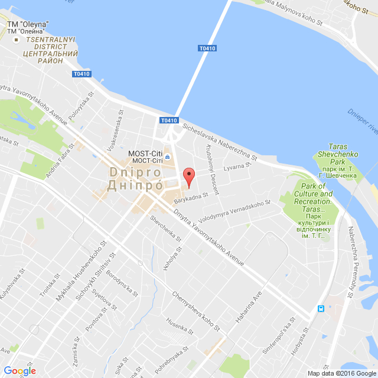
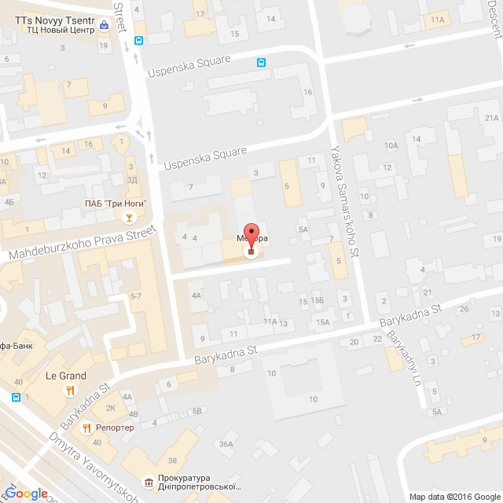
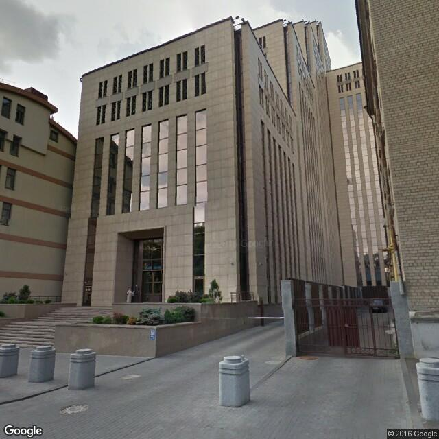

Google Maps service is an incredible tool that offers fast, reliable, and highly customizable features. It is also freemium, making it an ideal option for startups, with a daily limit of 2500 requests that should be more than enough for most. When I began my web development career, I was tasked with integrating an interactive map into an application. Like many others, I often forgot that "there is nothing new under the sun." Thus, I spent some time exploring guides instead of looking for pre-built solutions.

However, I don't regret the time spent learning how to integrate Google Maps API. It turned out to be an easy process. Now, I would like to share my experience of integrating Google Maps into a [Rails development](/services/web-development/ruby-on-rails-development) project.

## Geocoding

Before getting to the Google Maps integration itself, it's worth mentioning Geocoding.

According to the Google Maps guides, Geocoding is the process of converting addresses (like "1600 Amphitheatre Parkway, Mountain View, CA") into geographic coordinates (like latitude 37.423021 and longitude -122.083739).

These coordinates can be used to place markers or position the map.

There is a great gem for Rails - [Geocoder](https://github.com/alexreisner/geocoder), which can handle all the geocoding related tasks. It's quite simple to set it up. What you have to do is to add two fields - `latitude:float` and `longitude:float` - to the table that contains addresses, specify in the model:

```ruby
geocoded_by :address
after_validation :geocode
```
and voila! – the coordinates will be updated each time when the record is saved.

Geocoder also has other interesting geo features, like searching for specific objects in a local area or in the neighbourhood of the specified location.

## Static maps

Google provides two kinds of maps – static maps and dynamic maps.

It may seem that there is no field of use for static maps at all, since dynamic ones are much more functional and attractive. However there are two pros of using static Google Maps:
* firstly, they are much more easy-to-integrate;
* secondly and most importantly, they can be easily added to any generated static document like a PDF-file.

Static API is quite simple – an HTTP query to Google Maps API returns a solid image. Done. You can do anything with the received image. Surely, you should not crop Google copyright info or do anything of that kind.

In the following example you can see a place familiar to most of our employees - the office of Anadea in Dnipro:



Here is the same place, but with a deeper zoom:



And once again, the same place, but this time as a panoramic view (made by a related Google Maps service called Street View):



The list of available parameters can be found [here](https://developers.google.com/maps/documentation/maps-static/overview).

It is obvious that the first iteration of static Google Map integration includes just writing a single method of a single helper, something like:

```ruby
def google_map(center)
 "https://maps.googleapis.com/maps/api/staticmap?center=#{center}&size=300x300&zoom=17"
end
```

where as a `center` parameter you can pass a street address or a pair of coordinates.

Then from the view it can be accessed by calling:

```ruby
image_tag google_map(center: location.address)
```

or

```ruby
image_tag google_map(center: [ location.latitude, location.longitude ].join(','))
```

It's clear that in real apps the parameters should not be a kind of "magic numbers". They can be either explicitly passed to the helper method or stored in the setting file.

That is all as for the static maps integration.

## Embedded maps

Google Maps Embed API is quite similar to the static API.

With a single HTTP request you can easily add an interactive map to your app. It can be embedded by adding an iframe and specifying the Google Maps Embed API URL as the `src` attribute:

```ruby
<iframe width="300" height="300" frameborder="0" style="border:0"
 src="https://www.google.com/maps/embed/v1/place?key=YOUR_API_KEY&q=ADDRESS_OR_COORDINATES"
 allowfullscreen>
</iframe>
```

This allows you to get the basic Google Maps functionality extremely quickly and easily.

Surely, in a real application this code should be moved to the helper, slightly polished and improved but the integration still remains very simple.

More information on Google Embed API can be found [here](https://developers.google.com/maps/documentation/embed/get-started).

## Dynamic maps (JS)

It is still easy!

The first thing you have to do is to append Google Maps Scripts with the `<script>` tag:

```ruby
<script src="https://maps.googleapis.com/maps/api/js?key=YOUR_API_KEY async defer></script>
```

Secondly, you need to add a `div` with a specific id (i.e `map`) to a page. JS scripts will use this id to identify where the map should be drawn.

Thirdly, you can start studying the Google Maps guide and adding new abilities to your interactive map.

An example: let's assume that there are several tabs in our app and each tab contains a map of the same area but with a different set of markers. By clicking on any marker the map should be centered on it and zoomed in.

Below you can find a CoffeeScript code for implementation of the required functionality.

```ruby
class GoogleMap
 # defaults
 zoom =
  initialView: 15
  closeView: 18
 markers = []
 map = undefined

 constructor: (home) ->
  # set map center and view options
  lat = home["lat"]
  lon = home["lon"]
  myLatlng = new google.maps.LatLng(lat, lon)
  mapOptions =
   zoom: zoom.initialView
   center: myLatlng

  # create map
  map = new google.maps.Map(document.getElementById("map"), mapOptions)

 addMarker: (location, title) ->
  # create marker and add it to the array of markers
  marker = new google.maps.Marker(
   position: location,
   title: title,
   map: map
  )
  markers.push marker

  # add event listener - change zoom and center position on marker click
  google.maps.event.addListener marker, "click", ->
   map.setZoom zoom.closeView
   map.setCenter marker.getPosition()

 addMarkers: (markerList) ->
  # add all markers
  _.each markerList, (marker) =>
   position = new google.maps.LatLng marker["lat"], marker["lon"]
   title = "#{marker['full_address']}"
   @addMarker position, title

 drawMarkers: (map) ->
  # draw markers
  _.each markers, (marker) ->
   marker.setMap map
   # IMPORTANT: calling setMap method on marker will draw this marker, calling setMap with null parameter will erase it

 showMarkers: ->
  @setAllMap map

 hideMarkers: ->
  @setAllMap null

 removeListeners: ->
  _.each markers, (marker) ->
   google.maps.event.clearInstanceListeners(marker)

 deleteMarkers: ->
  @hideMarkers()
  @removeListeners()
  markers = []

app.google or= { classes: {} }
app.google.classes.GoogleMap = GoogleMap
```

This class then can be used in the code as follows:

```ruby
$ ->
 { GoogleMap } = app.google.classes

 googleMap = new GoogleMap($('[data-map]:eq(0)').data('home'))
 googleMap.placeMarkers($("[data-map]:eq(0)").data("markers-list"))

 $(document).on 'click', '[data-tab]', ->
  googleMap.deleteMarkers()
  googleMap.placeMarkers($("[data-map]:eq($(@).index())").data("markers-list"))
```

It is not so easy anymore, but still readable, isn't it?

## Rails gems and JS plugins

Naturally, one of the most burning questions asked by RoR developers when they want to integrate Google Maps is if they can use all cool Google Maps features without writing JavaScript code at all.

Well, there is a couple of gems that attempt to help you to do this.

The first and the most well-known one is the [Google-Maps-for-Rails](https://github.com/apneadiving/Google-Maps-for-Rails) gem. Frankly speaking, this gem strongly reminds me of an old folk story about [Stone Soup](https://en.wikipedia.org/wiki/Stone_Soup). The gem itself is playing the role of the stone and all the JS code pieces, which you need to add to customize your map, are playing the roles of carrots, potatoes, meat, seasonings and other ingredients.

Another thing is the [GoogleMaps](https://github.com/9peso/google_maps) gem, which tries hard to make all this in the [Rails](https://anadea.info/blog/the-ruby-on-rails-development-company-you-want-to-work-with) way and adds all basic JS scripts by itself. However, integrating google maps with this gem is not without flaws either.

Things are getting worse, when you need to add some interactions with the map. You can not handle it without adding JS scripts and this significantly reduces the value of all the attempts to build up such functionality as gems.

So, after all, the answer is no, you can not add a fully-functional dynamic map without JS coding.

As for the JS plugins – most of them are just the code copy/pasted from Google Maps, sometimes slightly reorganised.

Here is the list of the most attractive plugins:

* [gmap3](https://gmap3.net/),
* [gmaps.js](https://hpneo.dev/gmaps/).

So, I haven't found any pros of using gems. The only benefit of using plugins is that all scripts are already applied, so you can start working with the map immediately and don't need additional time to implement basic functionality.

An argument against both gems and plugins is the fact that you have to build the application logic on the basis of their syntax and you should learn this syntax beforehand. Moreover, if Google changes the Google Maps API, you will have to wait until an updated version of the gem or plugin is released or integrate the maps manually, which was exactly what you tried to avoid.

## To summarize

Creating a method for integrating static and embedded maps is a straightforward task, and there is no need to look for pre-made solutions.

Dynamic maps integration may be more complex, but it should not discourage you from attempting to integrate them from scratch, for the following reasons:
* this will help you to deeply understand their API and capabilities, which will certainly come in handy in the future;
* this will not take more time than the integration through turnkey solutions;
* this will release you from spending time looking for a better solution;
* this will free you from studying (potentially awkward) syntax created by someone else;
* this will improve your front-end skills;
* and finally, it is interesting.

And yes, the code you wrote can be easily used in a new project or even become the basis for you own plugins. So, who knows, maybe someday an article about your own turnkey solution will appear!
