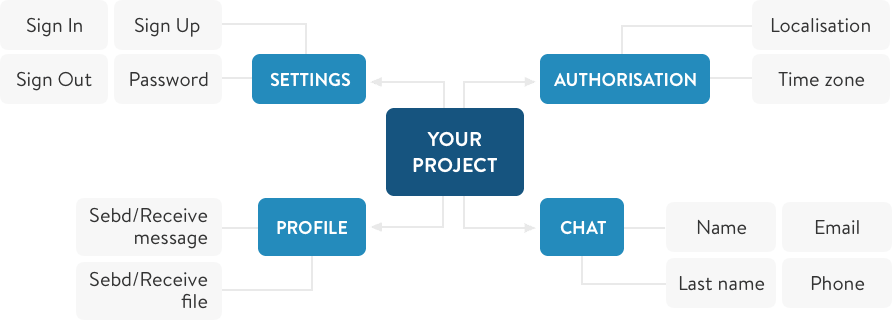
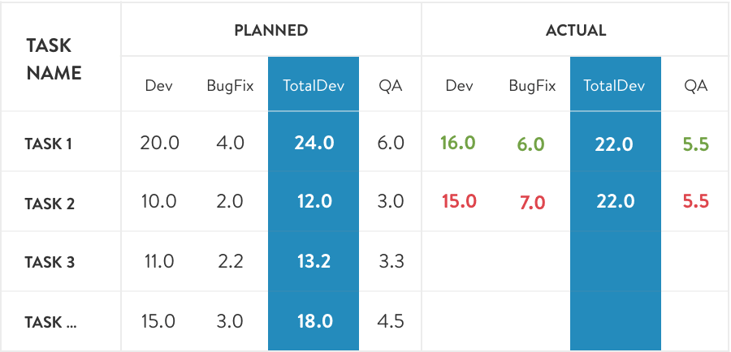

Being the project manager at a [custom software development company](https://anadea.info/services/custom-software-development), I often have to deal with the requests like "I want to do this app for a fixed price, can you do it?" or "Could you tell me a precise cost of my project?". Moreover, clients asking these questions may have just a brief idea of what they want to implement and they may not be sure about all the details of their project, however, they need the answer.

The only way to handle such situations is to introduce a clear process which lets us deliver a software product that meets technical requirements and at the same time achieve desired time / cost outcomes. Basically, this brings us to the necessity to find the right balance between the constraints faced in every IT project: scope, schedule and cost. This is also known as the Triple Constraint or the Project Management Triangle.

> In order to manage, you have to measure it

In this article, we will show you how to properly manage all three project constraints and [maintain transparency](https://anadea.info/blog/transparency-as-a-clue-to-successful-partnership) throughout the software development lifecycle.

Let's review each constraint in detail.

## Scope

Scope is the set of features and functionality required to complete the project. There are certain steps and activities needed to clearly define the scope and deliver it on time and within schedule and budget.

The first step is to create a specification document where we:

1. Break functionality into Epics and User Stories.
2. Write down scenarios for user stories.
3. Specify acceptance criteria for user stories.

The purpose of creating this document is to outline the requirements for all the features and make it clear where each feature starts and where it ends.

The second step is to create a design for the system (features). At this stage, all pages, screens, features and modules are accurately drawn so that all project participants can clearly understand how it will look like in the future.

Based on outcomes of these two steps, project manager creates a Work breakdown structure which records all features that need to be implemented. Now, the project has the list of items that can be estimated by a development team and this is the next step of the process.

Estimation of every feature includes the following activities:

### 1. Development of the feature
At this stage, a developer writes code based on specification document and design.

### 2. Feature testing
[QA testing services](https://anadea.info/services/quality-assurance) ensure that the feature meets specified requirements and do not cause any negative impact on other parts of the system. If any issues are detected, quality engineer documents the issue (called 'bug') and addresses it to the development camp.

### 3. Bugfixing
Based on QA specialist's recommendations, developer fixes bugs or implements improvements initiated by QA.

In order to track progress on the development phase, project manager compares planned estimate with actual one so that there is a clear understanding if the project is on schedule or not.

## Schedule

Once we have the Work breakdown structure with estimations, we can understand how long it will take us to implement the project given the allocated development team.

A tool which is used for this purpose is a Gantt chart. This chart makes it easy to visualize project management timelines by transforming task names, start dates, durations, and end dates into cascading horizontal bar charts.

We usually organize our work based on Agile (Scrum) framework and break project into iterations (Sprints). Duration of each Sprint is 2 weeks and it includes such activities as:

1. Sprint planning to plan the scope of work for a sprint.
2. Implementation of the scope (development and testing).
3. Daily standups to get the team synced on the sprint progress.
4. Demo meeting to show results of the sprint work.
5. Retrospective meeting to summarize the sprint results.

So, using Gantt chart allows all participants to know when feature development starts and when it ends.

## Cost

The 3rd side of the project triangle is cost - the funds which should be paid for the Scope implementation within the planned Schedule. Cost is usually calculated by the following formula:

<b>Service Hours (h) * Rate per hour ($) = Cost ($)</b>

Project costs is a very sensitive aspect and should be tracked very carefully. For the budget tracking, we use a Burndown chart, a graphical representation of how project budget is spent versus planned funds baseline. Funds are shown on the vertical axis, with sprints on the horizontal one. This chart shows if we are staying within the budget scope or there is a risk to exceed it.

Change requests, e.g. adding new features or modifying UX flow, may significantly affect the budget. The Burndown chart will help to keep finger on the budget pulse and control budget throughout the project lifecycle.

## Conclusion

Project management involves juggling several constraints - scope, schedule, and cost - to ensure that a project is delivered successfully. However, managing these constraints can be a daunting task, especially for complex projects. That's where tools like the Work Breakdown Structure (WBS), Gantt chart, and Burndown chart come in.

The WBS helps break down a project into smaller, manageable pieces, making it easier to assign tasks to team members and track progress. The Gantt chart, on the other hand, is a timeline-based tool that helps visualize the project schedule and monitor progress against it. This allows project managers to identify potential delays and make adjustments to the schedule to keep the project on track. In its turn, the Burndown chart is a graphical representation of the remaining work in a project and the time required to complete it. This helps project managers to track the project's progress against the schedule and adjust resources and timelines accordingly.

Regardless of the size of a project, managing the project management triangle of scope, schedule, and cost is crucial to ensure its success. By effectively managing these constraints, a project can become a triangle of success for a business venture, allowing it to be completed on time, within budget, and to the desired scope.
