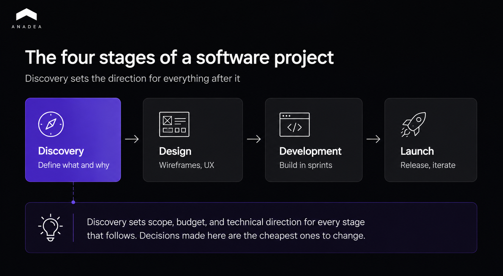

Running a project discovery phase before development is how teams avoid building the wrong product and burning the budget on rework. This guide walks through what discovery is, the three stages it runs in, who owns each part of the work, and the deliverables you end up with. By the end you will know how to structure a discovery phase that keeps a software project on scope and on target.

A team that skips discovery and starts coding on a hunch usually finds out it built the wrong thing only after the budget is gone. The pattern repeats across the industry. According to McKinsey and the University of Oxford, who studied more than 5,400 large IT projects, the average one runs [45% over budget and delivers 56% less value](https://www.mckinsey.com/business-functions/mckinsey-digital/our-insights/delivering-large-scale-it-projects-on-time-on-budget-and-on-value) than predicted. Deloitte points to the same root cause, noting that poor requirements management is a major source of delayed, costly, or failed software projects.

The fix is not faster coding. It is a structured project discovery phase that defines what you are building and why before anyone writes a line of production code. Discovery is the protection against the 45% overrun, not an extra step bolted onto the front of it.

This article is a practical walkthrough of how to run one, from the first stakeholder interview to the final set of deliverables you hand to investors or an internal board.

## What Is the Discovery Phase in Software Development?

The discovery phase is the structured work done before development starts to define what you are building, for whom, and why. It is typically three to six weeks of collaborative work where the team and the client align on goals, requirements, and technical approach before any code is written.

A real project discovery effort pulls in several roles at once. Business analysts run the requirements work, a product manager owns priorities and scope, UX designers turn needs into wireframes, and a lead architect validates the technical approach. None of it works without active input from the client side, because the people who understand the business problem are the stakeholders, not the vendor.

It helps to be clear about what discovery is not. It is not a rough estimate scribbled after a sales call, and it is not a single formal specification document handed over and forgotten. Many teams assume a kickoff call covers this ground. It does not. A kickoff aligns calendars and introductions. Discovery aligns on the actual product.

The diagram above shows where discovery sits relative to design, development, and launch. The decisions made in that first block set the scope, budget, and direction for everything after it, which is why they are also the cheapest decisions to change.

## How Do You Run a Project Discovery Phase Step by Step?

You run a discovery phase in three grouped stages, moving from understanding the problem, to validating a solution, to committing to a plan. Each stage has a clear owner and produces a concrete output that feeds the next one. The table below maps the full sequence before we walk through each stage.

<table>

<thead>

<tr>

<th>

<strong>Stage</strong>

</th>

<th>

<strong>Main activities</strong>

</th>

<th>

<strong>Who leads</strong>

</th>

<th>

<strong>Output</strong>

</th>

</tr>

</thead>

<tbody>

<tr>

<td>

1. Research and requirements

</td>

<td>

Stakeholder interviews, user research, requirement gathering

</td>

<td>

Business analyst, product manager

</td>

<td>

Goals document, prioritized backlog

</td>

</tr>

<tr>

<td>

2. Architecture and prototyping

</td>

<td>

Tech stack decisions, system design, wireframes

</td>

<td>

Lead architect, UX designers

</td>

<td>

Technical spec, UI wireframes

</td>

</tr>

<tr>

<td>

3. Roadmap and estimation

</td>

<td>

Delivery planning, sprint structure, cost estimate

</td>

<td>

Product manager

</td>

<td>

Roadmap, estimate, full deliverables set

</td>

</tr>

</tbody>

</table>

### Phase 1: Stakeholder Interviews, User Research, and Requirements

The first phase surfaces what everyone actually wants before those wants quietly contradict each other. The business analyst and product manager run structured interviews with all key stakeholders, not just the product owner, because conflicting priorities are cheapest to resolve when they are caught early. Practitioners learn this the hard way. In one widely shared Reddit account, a technical founder described [spending six months and roughly $40,000 building features nobody wanted](https://www.thevccorner.com/p/40k-startup-mistake-product-market-fit), after assuming that user complaints equaled real demand instead of talking to users directly. The same dynamic plays out inside companies when a CTO and a CMO turn out to hold incompatible visions for the same product, and nobody notices until the build is underway.

In parallel with stakeholder work, the team defines who will actually use the product and what problems they are solving. This is where market-need risk gets caught. CB Insights found that [42% of startups fail ](https://www.cbinsights.com/research/startup-failure-reasons-top/)because there was no market need for what they built, which makes user research the single highest-leverage activity in the entire phase. The business analyst documents requirements, separates the must-haves from the nice-to-haves, and flags technical ambiguities before they reach an estimate.

The output of this phase is a shared goals document and a prioritized backlog of user stories. These are the first formal discovery phase deliverables, and they matter more than they look. Without the backlog, any estimate is guesswork and scope creep is close to inevitable, because there is no agreed baseline to measure new requests against.

### Phase 2: Technical Architecture and UX Prototyping

The second phase locks the technical and visual foundations while they are still cheap to change. The lead architect proposes the stack, the system architecture, and the integration approach. These core decisions have to be settled before sprint one, since ambiguity here is what causes the expensive mid-project pivots that blow up timelines.

UX designers work in parallel, translating requirements into wireframes or a clickable prototype. Serious usability problems surface at this stage, when fixing them costs hours rather than the weeks it would take once the same flow is built in code. The output of this phase is a technical specification paired with a set of UI wireframes the client has actually seen and reacted to.



## What Are the Key Discovery Phase Steps and Who Owns Them?

The key discovery phase steps break down by role, and naming the owner for each one is what keeps the phase from stalling. Discovery phase project management works best when every activity has a single accountable owner rather than a committee. The breakdown below shows who drives what.

<table>

<thead>

<tr>

<th>

<strong>Role</strong>

</th>

<th>

<strong>Owns</strong>

</th>

<th>

<strong>Key contribution</strong>

</th>

</tr>

</thead>

<tbody>

<tr>

<td>

Business analyst

</td>

<td>

Requirements and documentation

</td>

<td>

Interviews, backlog, must-have vs nice-to-have split

</td>

</tr>

<tr>

<td>

Product manager

</td>

<td>

Scope, priorities, roadmap

</td>

<td>

Delivery plan, milestones, estimate

</td>

</tr>

<tr>

<td>

UX designer

</td>

<td>

User experience

</td>

<td>

Wireframes, clickable prototype, usability checks

</td>

</tr>

<tr>

<td>

Lead architect

</td>

<td>

Technical foundation

</td>

<td>

Stack, system architecture, integration approach

</td>

</tr>

<tr>

<td>

Client stakeholders

</td>

<td>

Business context

</td>

<td>

Goals, constraints, decision authority

</td>

</tr>

</tbody>

</table>

This division of labor scales down for smaller teams. On a lean startup engagement, one person may wear two hats, with a single senior consultant covering both business analysis and product management. The roles still need to be distinct even when the headcount is not, because the work each one does is different. In a discovery phase agile setup, these same activities run as short, time-boxed iterations rather than one long upfront block, which suits teams that want to validate assumptions in tighter loops.

## What Does a Product Discovery Phase Deliver in the End?

A product discovery phase delivers a documented, validated plan that replaces guesswork with evidence. The concrete artifacts are the requirements specification, user personas, architecture document, wireframes, and roadmap covered above. The less visible deliverable is the one that matters most to a budget holder, namely a shared source of truth that every later decision can be checked against.

That source of truth is what protects the project once development starts. When a disagreement comes up in month three, the team does not argue from memory or opinion. It checks the documented scope. This is the mechanism behind the McKinsey finding that the projects which succeed are the ones that nail clarity at the start, and it is why discovery reads as risk management rather than paperwork. Teams that want a structured assessment of requirements and feasibility before committing often bring in dedicated [business analysis](https://anadea.info/services/business-analysis) support to run it.

## Summary

A project discovery phase is the cheapest insurance a software project can buy, because it catches the wrong-product and wrong-scope risks while they still cost hours instead of quarters. The work runs in three stages, from research and requirements, through architecture and prototyping, to roadmap and estimation, and each stage produces an artifact the next one depends on. The data is consistent on why this matters, with large projects running 45% over budget on average and 42% of startups failing to build something nobody needed. Discovery is how teams stay out of both statistics.

If you are weighing whether to invest in discovery before committing to a full build, that decision is exactly the kind of thing a short, structured engagement can de-risk. [Talk to our team](https://anadea.info/services/product-discovery) about running a discovery phase for your project.
