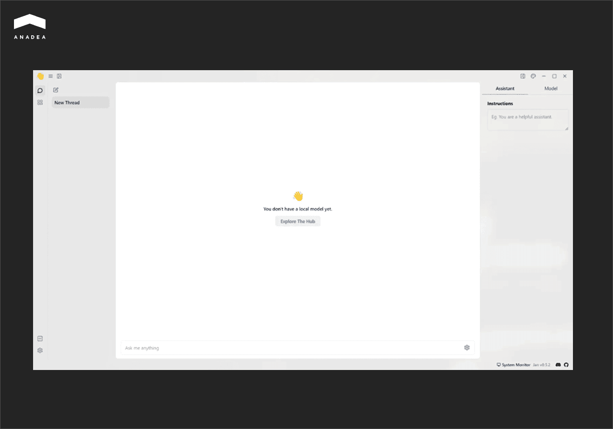
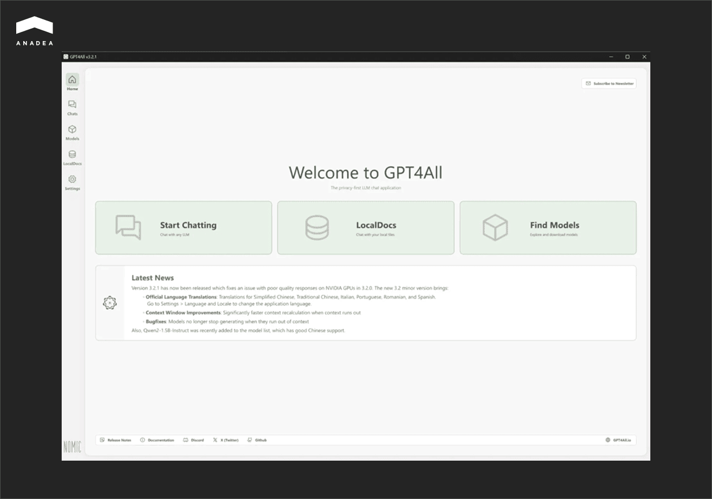

After ChatGPT’s launch in November 2022, LLM usage skyrocketed across diverse sectors. According to the statistics published by[ Industry Research](https://www.industryresearch.biz/market-reports/large-language-model-llm-market-102241), in 2024, nearly 68% of enterprises worldwide relied on LLM-powered tools in at least one business workflow. In 2025, it is estimated that over 71% of healthcare, industrial, and financial organizations have deployed LLMs for decision-making. Meanwhile, 67% of enterprises revealed that LLM implementation has positively influenced their productivity. And 54% of businesses report that LLM-driven automation ensures higher operational efficiency.

But to extract maximum value from such solutions, it is important to understand how to properly implement and manage LLMs. This is what we will discuss in our article. 

We will explain the benefits of running a local LLM and share our practical recommendations on how to do it in the most efficient way.

## What Is a Local LLM?

Before we proceed to the questions about how to run local LLMs, we need to draw your attention to the peculiarities of such models and clarify why they can be a good choice for your business.

A wide audience usually relies on cloud-based models. They are accessed via APIs or web apps. Local LLMs are often viewed in contrast to cloud-based solutions and offer a strong response to their shortcomings,

Local LLMs are large language models that are deployed and operated directly on a user’s computer, mobile device, or within a private on-premises server environment. It means that they don't need to get remote access to a cloud-hosted service.

### Benefits of Local LLMs

* **Data privacy**. Your prompts and outputs will never leave your system.
* **Offline availability**. Your local LLM can work even without internet access.
* **Full control**. You have great freedom in fine-tuning and customizing your model. Moreover, you can deeply integrate it with your other digital tools.
* **Lower long-term cost**. You will need to invest in the initial setup. But as its usage doesn’t depend on API calls, it will be cheaper for your business than the introduction of cloud-based solutions.

### Trade-offs of Local LLMs

* **Hardware constraints**. Local LLMs usually require strong hardware. Running large models requires substantial memory (RAM/VRAM) and powerful GPUs, often with cluster support.
* **Maintenance burden**. You need to manage updates, security, and scaling on your own.
* **Performance limitations**. Smaller models may be less capable than top-tier cloud LLMs.

Cloud-based and local LLMs represent the two most contrasting and popular paradigms of deployment in terms of control, cost, security, and usability.

The table below demonstrates the key differences between them.

<table>

<tbody>

<tr>

<td>

<strong>Parameters for Comparison</strong>

</td>

<td>

<strong>Local LLMs</strong>

</td>

<td>

<strong>Cloud-based LLMs</strong>

</td>

</tr>

<tr>

<td>

Privacy

</td>

<td>

High (data stays local)

</td>

<td>

Lower (data leaves the system and is sent to remote servers)

</td>

</tr>

<tr>

<td>

Performance

</td>

<td>

Limited due to hardware constraints

</td>

<td>

Access to the most advanced and powerful models

</td>

</tr>

<tr>

<td>

Cost&nbsp;

</td>

<td>

Upfront investments in setup and hardware

</td>

<td>

Ongoing fees (payments for tokens or subscriptions)

</td>

</tr>

<tr>

<td>

Customization

</td>

<td>

High

</td>

<td>

Provider-contolled

</td>

</tr>

<tr>

<td>

Offline mode

</td>

<td>

Available

</td>

<td>

Not available

</td>

</tr>

<tr>

<td>

Scalability

</td>

<td>

Additional hardware resources required

</td>

<td>

Auto-scaling

</td>

</tr>

<tr>

<td>

Ease of use

</td>

<td>

Technical setup required

</td>

<td>

Plug-and-play

</td>

</tr>

</tbody>

</table>

## Local LLM or Cloud-Based Model: How to Choose the Right Approach

Local and cloud-based models have their strengths and weaknesses. That’s why when you need to make up your mind, you need to identify your priorities for LLM integration. You should clearly define the key tasks for your model, and based on them, you will be able to understand what aspects are crucial and what potential issues you are ready to tolerate.

At Anadea, we have been closely working with AI-powered solutions for more than 6 years and have deep knowledge of how to make the right choice depending on your goals. 

To facilitate your decision-making process, we have prepared a questionnaire.



As both approaches to running LLMs have their pluses and minuses, a lot of organizations today adopt a hybrid strategy:

* Smaller local LLMs are used for sensitive or internal tasks.
* Cloud-based models are used for general-purpose tasks that often may require a larger context window or creativity.

### Model Families to Consider for Local Deployment

Today, there are a great number of LLMs designed to solve different tasks. Let us mention a few that are often chosen for local deployment.

* **LLaMA 3 (by Meta)**. These models are available in 8B and 70B parameter sizes and demonstrate strong general-purpose performance. They are good for chat, summarization, and reasoning tasks. For non-commercial and research use, these models are free. Commercial use is allowed under the Community License Agreement. Attribution is required under the license.
* **Mistral**. This family includes Mistral 7B and Mixtral 8x7B (8 models in one). The models have an efficient architecture, which ensures a great ratio between speed and accuracy. Mistral can be used for free with a Mistral Research Licence. For commercial purposes, a commercial license is applied.
* **Qwen (by Alibaba)**. Models of this family are good at reasoning and instruction-following. They demonstrate excellent multilingual capabilities and are often chosen to power AI agents. Moreover, they can seamlessly scale up to a large number of parameters. Commercial use is permitted under the license; attribution is required.
* **Phi-3 (by Microsoft)**. This is a family of small language models that are suitable for edge devices and local inference with limited hardware. Despite their size, they demonstrate excellent performance. Microsoft allows the use of Phi models under the MIT License, which is one of the most permissive licenses. The models can be freely used, modified, and redistributed. The only real requirement is the inclusion of the original license text and a copyright notice attributing to Microsoft.
* **Gemma (by Google DeepMind)**. These are lightweight models that are good at instruction-following. The use of the model is governed under the Gemma license. Google has the right to restrict particular use cases after consideration. Under the license terms, attribution is required.



## Local LLM Setup Guide

When you are planning to run a local LLM, you should make sure that you are ready for it. Here are the most basic things that you should keep in mind.

* Define clear use cases (coding, summarization, automation, etc.) and the required resources. Smaller models are faster and good for lightweight tasks. Larger models are better at reasoning and writing. That’s why they need more VRAM/RAM.
* Free up enough memory resources. You should have at least 8-16 GB RAM for a smooth experience. As for VRAM, at least 8 GB should be available for smaller models and at least 16 GB for larger ones. For storage, allocate 10-30 GB per model.
* It is also recommended to use a PC or laptop with a dedicated graphics card. This will allow your LLM to take advantage of a GPU for higher processing speed.
* If you don't use a custom LLM, you need to visit the tool’s official website, download the installer for your system, and open it. Inside the app, you will need to choose and install the best-suited model, following the instructions that you will see on your screen.

Once the model is installed, you need to find a tool to run it. Your choice should be based on the LLM that you want to use and the tasks that you want to solve with it.

Let’s take a closer look at some of the most popular options.

### Ollama

Ollama is a user-friendly command-line tool for running LLMs locally. It is compatible with all the major operating systems, which makes it widely available. With just a few commands, users can download, manage, and test different open-source models.

It’s especially helpful for developers and self-hosting enthusiasts who want a simple AI backend for experiments or applications. Those users who want to interact with a graphical interface can pair Ollama with OpenWebUI.

### LM Studio

This tool offers a lot of freedom for experimenting with LLMs locally. It provides functionality for fine-tuning and customization that allows developers and researchers to tailor AI models to their exact needs. As a result, this tool is well-suited for task-specific optimization. 

Nevertheless, LM Studio is not the best choice for beginners. It has a rather steep learning curve. Moreover, fine-tuning with LM Studio can be very resource-consuming.

### Jan

The next tool on our list, Jan, can be used for working not only with local models, but also cloud-based ones. This privacy-focused tool stands out for server flexibility. Users can run it on its own server or integrate it with LM Studio and Ollama, which can act as more powerful remote servers.

### GTP4All

The main peculiarity of this option is the possibility to work with LLMs via a chat-based interface.

Though it can be a very convenient way to run a local LLM, GPT4All provides rather limited possibilities for model fine-tuning and customization. That’s why, if you have any specific requirements for adjusting LLMs to your needs, it will be sensible to consider another tool.

### NextChat

NextChat differs from other tools on this list. While others are focused on open-source models, this one seamlessly integrates with closed-source LLMs (like Gemini or ChatGPT) as well. NextChat is often used to deliver conversational AI-driven experiences.

## How to Train a Local LLM

Building or deploying a local LLM is only a small part of the work to be done. It is also important to train it correctly in order to get the desired outcomes.

Start by choosing the right training approaches that differ based on cost and requirements.

* **Pretraining**. In this case, you need to train a model from scratch on a vast dataset that should include hundreds of billions of tokens. This approach requires supercomputers and significant investments. For example, as it was reported by [Forbes](https://www.forbes.com/sites/katharinabuchholz/2024/08/23/the-extreme-cost-of-training-ai-models/), the estimated cost of training Gemini ranged from $30 million to $191 million. This amount doesn’t include staff salaries, which can add 29-49% to the total. ChatGPT‑4’s training cost is estimated at $41-78 million.
* **Fine-tuning**. This method helps adjust models in accordance with your data. It is rather expensive and requires large GPUs.
* **Instruction-tuning**. This approach is aimed at training models on instruction–response pairs. As a result, a model can better work with specific prompts.
* **Prompt-tuning**. It is a good option for lightweight models as it just adds small trainable adapters. It is a cheaper approach as it can also be applied on consumer GPUs.

Prompt-tuning is a recommended path for the majority of companies. As a rule, businesses rely on such fine-tuning methods as LoRA and QLoRA.

* LoRA (low-rank adaptation) doesn't include retraining all the billions of parameters in a large model. Instead, it inserts small “adapter” layers into the network and only trains them.
* QLoRA (quantized LoRA) is an optimized version of LoRA. It is designed to run on consumer GPUs with limited VRAM (even large models can be trained on a single 24GB GPU). However, its setup is more challenging than in the case of using the original LoRA.

### How to prepare data for model training?  

The quality of data is one of the key conditions for efficient model functioning. [Some researchers claim](https://nonint.com/2023/06/10/the-it-in-ai-models-is-the-dataset/) that only a dataset (not an architecture or hyperparameters) determines model behavior. And one of the major concerns is related to the fact that the increasing costs of training data can be a reason for the centralization of AI development.

According to the data revealed by [TechCrunch](https://techcrunch.com/2024/06/01/ai-training-data-has-a-price-tag-that-only-big-tech-can-afford/), OpenAI has invested hundreds of millions of dollars in licensing content from various sources to train its AI models. Meanwhile, as [Reuters](https://www.reuters.com/technology/inside-big-techs-underground-race-buy-ai-training-data-2024-04-05/) reported, tech companies are ready to pay $0.05-1 per photo and more than $1 per video that can be used for GenAI model training. When it comes to licensing a content library that includes 13 billion items, the amount looks very impressive.

With such rates for training data, a lot of businesses prefer to work with their own datasets.

If you are going to use your data, you should prepare it in a proper way before model training:

* You don’t need millions of examples. 1k–5k high-quality samples can be much better than 100k messy ones.
* Focus on examples that reflect your real use case. Avoid using irrelevant general-purpose data.
* Include a mix of simple and complex examples.
* Use terminology and style that match your organization.
* Use JSONL (JSON Lines) format (one line should represent one example).
* Remove duplicate entries and standardize formatting.
* Keep nearly 10% of your dataset for validation (don’t train on it). Check model responses for accuracy, style, and hallucinations on this data.

### What tools to use?

For training your local LLM, you can use one of the commonly applied toolsets.

* **LLaMA Factory**. It is a user-friendly toolkit with a web UI. It is mainly focused on fine-tuning LLaMA-family models. It is good for beginners as it is easy to set up. It supports multiple model architectures. But compared to other tools, it is less flexible.
* **Axolotl**. It is an open-source tool designed for model post-training. It is highly flexible and customizable, it supports many training methods, and has a mature ecosystem. However, it is not beginner-friendly and has a steep learning curve.
* **Unsloth**. This fine-tuning library helps to train large models on consumer GPUs. It is suitable for quick prototyping or resource-limited setups. However, it is less feature-rich and has less documentation than Axolotl.

## Local LLMs: How to Address the Most Common Errors

Apart from knowing how to run a local LLM and how to train it, you also need to know how to solve problems if they occur.

Based on our practical experience in working with large language models, we have prepared a list of the most common errors and efficient ways to address them.

<table>

<tbody>

<tr>

<td>

<strong>Error</strong>

</td>

<td>

<strong>Solution</strong>

</td>

</tr>

<tr>

<td>

Out of memory

</td>

<td>

Try smaller quantization, reduce the context window, or selectively enable GPU offload.

</td>

</tr>

<tr>

<td>

CUDA/ROCm issues

</td>

<td>

Make sure your drivers match the framework requirements, check your PATH/LD_LIBRARY_PATH.

</td>

</tr>

<tr>

<td>

Poor-quality, incorrect, or repetitive outputs

</td>

<td>

Change generation parameters or experiment with a different model.

</td>

</tr>

<tr>

<td>

Server not reachable

</td>

<td>

Check for port conflicts, firewall or antivirus blocks, and admin privileges on Windows.

</td>

</tr>

<tr>

<td>

Model not loading

</td>

<td>

Try to delete the cache and pull the model again.

</td>

</tr>

</tbody>

</table>

## Secure Usage of Local LLMs

Running a local LLM gives you the possibility to control its performance. But apart from managing your model, you need to ensure a sufficient level of privacy and security for the sensitive data it relies on. 

Here are the main practical tips that will help you.

* Run the model offline every time it is possible. This will ensure that your sensitive data doesn't leave your system.
* Protect sensitive data using local storage encryption.
* If your local LLM agent interacts with any external files, enforce strict file system permissions and network access to prevent unwanted behavior.
* When you use a vendor’s LLM, always check the model’s license. You need to know whether it can be applied for commercial purposes and whether attribution is required.

## Wrapping Up

Running a local LLM gives businesses privacy and independence. However, this flexibility comes with new responsibilities for your team. The success of your local LLM starts with the preparation of hardware and allocating memory resources. Apart from this, you will need to take care of training your model, experimenting with prompts, and maintaining the high performance of your solution over time. When everything is done correctly, the use of a local LLM can open a lot of new possibilities for your business.

However, there is no one-size-fits-all approach. Some workflows require local control. But others will benefit from cloud AI. The key thing here is to find your unique strategy tailored to your processes and needs.

Looking for professional help with LLMs? [Contact our team](https://anadea.info/free-project-estimate)! We will find the best solution for your business tasks.
