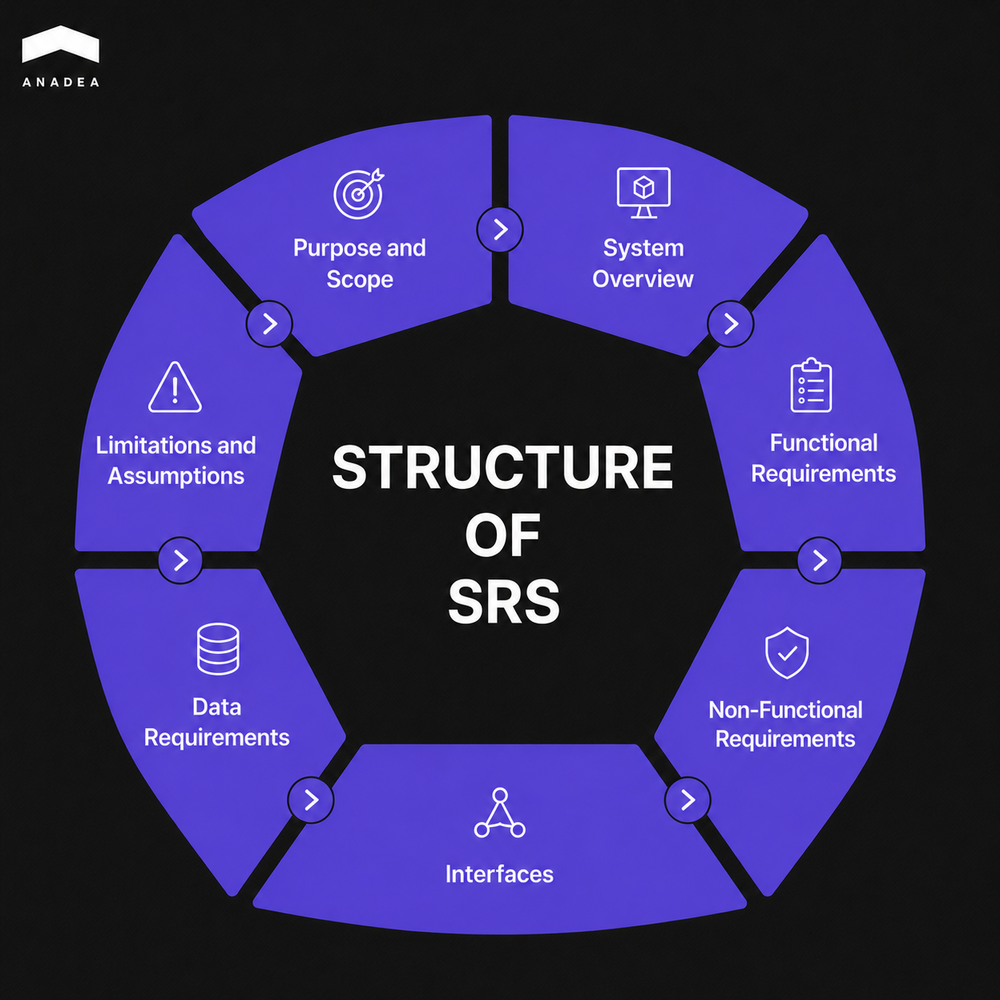
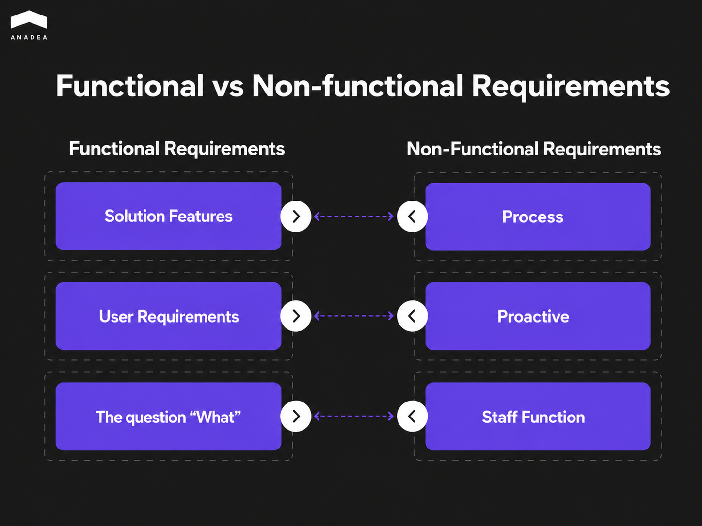

A Software Requirements Specification (SRS) is a formal document that defines the functional and non-functional requirements of a software system under development. It captures the system's expected behavior, performance characteristics, constraints, and acceptance criteria, serving as a binding agreement between the client and the development team. The SRS is a foundational artifact of requirements engineering and provides the basis for architectural design, effort estimation, and subsequent product testing.

Building software on assumptions is an expensive way to debug a business model. According to a widely cited industry benchmark from [IAG Consulting](https://www.iag.biz/resource/assessing-the-impact-of-poor-requirements-on-companies-quantifying-the-cost-of-poor-requirements/), poor requirements practices can result in a time and cost premium of up to 60% in software development projects.

A common trap for founders is believing that developers will simply figure out the technical details during active sprints, which is not true. Vague requirements may trigger massive code rework and applications that fail your users at launch. 

In this article, we are going to explain how allocating time to writing software requirements will help you save time and money and demonstrate the key differences between poorly and well-written specifications.

## What Are Software Requirements in Development Projects? 

A software requirements specification connects what the business needs with how the system will be built. It establishes a documented agreement between the stakeholder and the development team. For instance, your specification should clearly state what the system must execute. Moreover, it should also cover a row of other parameters and aspects, including the target user base and the operational constraints of the project.

[Software requirements](https://anadea.info/blog/when-business-analysts-run-into-problems-with-project-requirements-this-is-what-they-do/) help to avoid situations where developers write code based on unvalidated assumptions. 

The specification is divided into two layers: functional and non functional requirements.

* **Functional requirements** define the core system behavior, including the explicit workflows, as well as inputs and data outputs. Among functional requirements examples, we can mention: "The platform must generate a PDF invoice and dispatch it via Webhook within 60 seconds of payment confirmation."
* **Non-functional requirements** dictate the performance guardrails. They indicate how the system must handle stress and what security compliance standards it must meet. For example: "The database must encrypt all stored user data at rest using AES-256 standards."

Ambiguity within these parameters forces engineering teams to guess, which generates high-interest technical debt. When requirements lack precision, engineers optimize for the wrong metrics. As a result, the team needs to correct errors during production. And in this case, code refactoring costs increase tenfold.

The difference between a predictable deployment and a failed build depends entirely on how these expectations are quantified before the first sprint. The table below demonstrates the difference between vague and well-written software requirements specification examples.

<table>

<thead>

<tr>

<th>

<strong>Vague Requirements (Open to Interpretation)</strong>

</th>

<th>

<strong>Well-Written Requirements (Actionable Specification)</strong>

</th>

</tr>

</thead>

<tbody>

<tr>

<td>

The system should be fast.

</td>

<td>

The page must load in under 2 seconds for up to 5,000 concurrent users.

</td>

</tr>

<tr>

<td>

The application needs to be secure.

</td>

<td>

The authentication layer must enforce MFA and lock accounts after 3 failed login attempts within 15 minutes.

</td>

</tr>

<tr>

<td>

The database needs to handle a lot of data.

</td>

<td>

The database architecture must support up to 50,000 write operations per second with a maximum read/write latency threshold of 50ms.

</td>

</tr>

<tr>

<td>

Users should be able to download reports easily.

</td>

<td>

The reporting module must generate and export CSV datasets of up to 100,000 rows within 8 seconds without blocking the main UI thread.

</td>

</tr>

<tr>

<td>

The platform must be highly available.

</td>

<td>

The infrastructure must maintain a 99.99% uptime SLA, utilizing multi-region AWS deployments and automated failover routing via Amazon Route 53.

</td>

</tr>

</tbody>

</table>

## Why Do Bad Requirements Cause Software Project Failure?

Imprecise software requirements specification examples are among the most common reasons for project failure. As one of the Reddit users [stated](https://www.reddit.com/r/YouShouldKnow/comments/1szsavf/ysk_starting_development_before_requirements_are/), “a common mistake is treating unclear requirements as a small issue that can be fixed later.”

Based on our experience in software development, we can define four failure patterns that arise due to poor software requirements.

### Scope Creep

Vague requirements create an interpretive freedom. Every stakeholder fills in the blanks differently. This is a result of a lack of explicit boundaries for feature specifications.

These conflicting expectations often surface mid-sprint, which leads to emergency change requests. Due to this, development velocity stalls and deadlines slip.

### Non-Linear Budget Overruns

Even a single missing sentence in your initial scope can have a direct impact on your budget. When your team discovers a structural failure in production, it will be a trigger for a chain reaction of emergency hotfixes, database schema rewrites, live data migration, and pausing feature velocity.

Every hour developers spend on emergency refactoring is an hour borrowed from your product roadmap. And what is very important here is that the cost of fixes is [growing x10](https://www.researchgate.net/publication/337343379_Rule_of_Ten) at every new stage of the development lifecycle. 

### Misaligned Product Delivery

Development teams build exactly what is described. In those cases when business logic is poorly explained, engineers may write a functional codebase that fails to solve the actual business problem.

The introduction of fixes at later stages of the development cycle is usually very time-consuming and challenging. Given this, it’s quite natural that professional developers highly value comprehensive software specifications from day one. One of the users on Reddit [admitted](https://www.reddit.com/r/ProductManagement/comments/1icxcyp/unclear_requirements_how_granular_do_we_really/) to “getting a lot of pushback from dev teams and blame for unclear requirements”. 

### Double-Spend Pitfall

If you hire developers and don’t provide them with clear requirements, they may build a product that doesn’t work as you expected. In this case, you will be forced to spend an equivalent or greater amount with a new development team that will audit and completely rewrite the existing code.



## How to Write Software Requirements that Developers Can Actually Build

Your project specifications shouldn’t rely on subjective adjectives. Apply these five structural principles to create a good software requirements document example. It will prevent rework and guide development teams efficiently.

### Think from the User’s Perspective

Shift focus from backend mechanics to explicit user behavior. You can include the standard user story framework in your software requirements template:

As a \[user], I want to \[action] so that \[benefit]

This approach ensures features remain testable and prevents engineers from building unmapped functionality that serves no commercial purpose.

### Define Quantifiable Metrics

Every operational threshold must be explicitly measurable. 

A phrase like "the search function should be fast" won’t provide developers with an understanding of what you expect from them. We recommend reformulating this requirement in the following way: "The search query must return indexed results within 400ms". Thanks to this, your development team will have a definitive optimization target.

### Attentively Consider Non Functional Requirements Examples

Very often, businesses are too focused on the functionality of their future software. Meanwhile, uptime, security protocols, API latency, and browser compatibility are treated as secondary IT tasks. 

Nevertheless, the absence of these metrics can quickly impact user trust and regulatory compliance. Early definition of encryption standards and uptime expectations ensures the system will be able to scale in accordance with your needs. 

### Provide Acceptance Criteria

Every position in a good software requirements example must include an objective definition of done. Acceptance criteria establish the specific parameters a feature must satisfy to pass quality assurance. 

Developers should be able to validate each requirement with a binary pass-or-fail test script. 

### Execute Pre-Sign-Off Developer Reviews

Run a dedicated review session with your lead developers before final sign-off. This diagnostic step will help you define hidden technical dependencies and API limitations early.



## How does Anadea work with software requirements? 

We approach scope definition as structural risk mitigation. Our [discovery workflow protects ](https://anadea.info/guides/project-discovery-phase)your budget and is aimed at creating a clear technical blueprint that leaves zero room for developer misinterpretation.

### Phase 1. Architecture Workshops

We run structured scoping sessions with your team to isolate operational constraints and edge cases. Thanks to this, we can eliminate conflicting feature expectations before they disrupt active sprints.

### Phase 2. User Persona Definition

At Anadea, we prefer grounding documentation in verified user behavior. 

What do we pay attention to at this step?

* Role-based access control (RBAC) mapping;
* workflow bottlenecks;
* data lifecycle verification;
* validation of assumed behaviors.

### Phase 3. Functional Decomposition

We break the platform down into independent technical components. Each part is assigned clear ownership and strict acceptance criteria.

### Phase 4. Non-Functional Audit

We proactively audit the architecture for:

* Missing performance thresholds;
* data integrity risks;
* security compliance, 
* third-party API bottlenecks;
* technical debt injection points.

### What do you receive?

As a result of our conducted audit, you get the architectural foundation for your project:

* Software requirements specification (SRS);
* Functional decomposition tree with all system components and their dependencies;
* System wireframes that will help you validate UI logic and user journeys;
* Development roadmap with clear cost and velocity projections.

Even a good SRS template can’t replace direct input from the stakeholder who defines the product vision. 

That’s why at this stage, our [business analysts](https://anadea.info/guides/business-analyst-role) require 3 to 5 hours per week of direct engagement from your primary stakeholder. We need your direct insights into the existing workflows and bottlenecks. This active collaboration ensures that the final blueprint reflects your operational demands. 

## Final Word: Are Good Software Requirements Worth the Effort?

Rushing into coding without a software requirements specification is an expensive way to burn your engineering runway. Any fixes that you will make post-release cost significantly more than documenting your requirements beforehand.

Developers can’t work with subjective descriptions. You should provide explicit data schemas and payload latency thresholds to maintain sprint velocity.

A thorough discovery phase and business analysis ensure predictable product launches. And at Anadea, we can help you with these tasks. Our expert can analyze your needs to provide the exact architectural blueprint and functional decomposition to guide development teams efficiently. [Contact us](https://anadea.info/contacts) to discuss your project!
