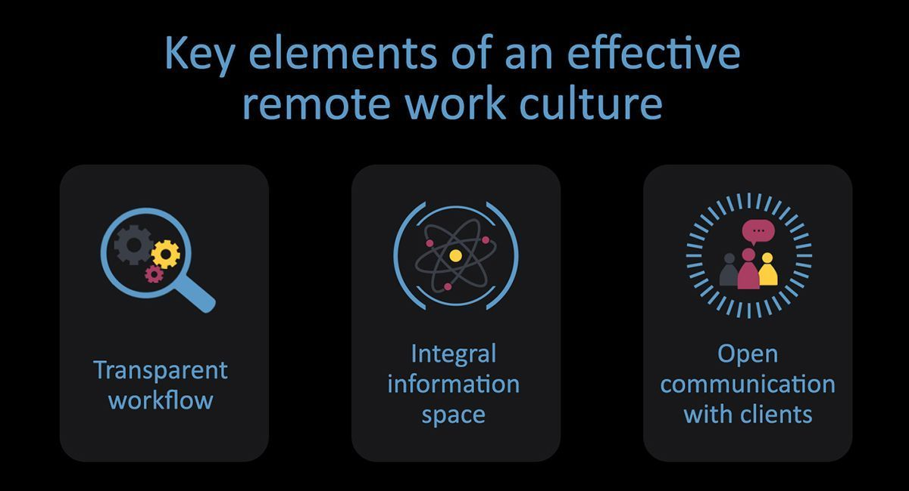

One of the basic responses to an unforeseen life-threatening situation is to freeze. Most of us having faced a possibility to catch COVID-19 will feel helpless and lost, and, as a result, may lack confidence about the future. It is all about losing control over the situation.

When such a situation arises, everyone is free to pick their own way to tackle anxiety. Someone may opt for downsizing their projects and slowing down but there are also those who will find the way to use the situation as a chance to become stronger and to demonstrate their best qualities.

[Our company](https://anadea.info/) chose the second path. We firmly believe that everyone – our employees, clients and partners – need support in such a situation. That is why under quarantine we keep working remotely to deliver high quality and sustainable efficiency, doing our utmost to make sure that, once the crisis is over, our clients will enter the market with new products.

## Basic principles that guide our work

* **Transparent workflow.** An inner system that we designed enables us to track the work done as well as to monitor our work schedules at any given time and to manage our workflows efficiently.
* **Integral information space.** Teams go into details of their projects during regular on-line meetings. They also continue their education and communicate informally to support each other.
* **Open communication with clients.** We regularly do product demos and retrospectives which, coupled with daily reports, ensures transparency of a project and provides us with instant feedback. This in turn gives us an opportunity to continually enhance our processes. Involvement of our clients in demo sessions advances our understanding of business context of projects and allows stakeholders to communicate with teams directly.

Our teams have long worked together and are made up of mature, conscious, highly professional specialists which is the key to our successful team work.

Moreover, оur company has taken all the precautions, the employees work remotely due to national-scale quarantine. This is not a new mode of operation for the team here as we all had everything set up for remote work for a long time and there were already many situations when at least part of the team did all the work from home.

## Bottom line

The darkest days have always been followed by the finest hours, and we believe that humanity will fight this disease and it will definitely bring new opportunities. History offers no examples of things happening other way. Many of those who are reading this right now have lived through way more challenging situations, when one thought the dawn will never come. Together, by supporting each other, we can overcome any hardship and become stronger!

Take care of yourself and your loved ones!
