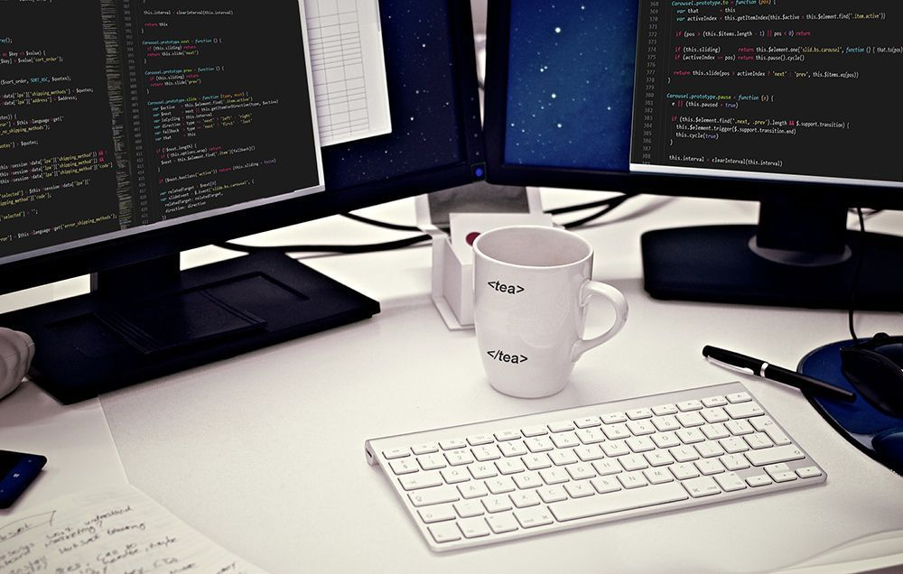

Christmas is a favorite holiday for both children and adults. The pre-holiday fuss is always accompanied by the search for suitable gifts for relatives, friends and colleagues. People always want to choose something original and at the same time useful and pleasant. It's easy enough to please a little boy with a toy car or Lego building blocks. And that is another story to make an adult happier with a gift, especially when he or she interests in the stuff you don't know much about.

The profession of a programmer is special - sometimes you don't understand what he talks or thinks about, as software developers have their own language, peculiar interests and humor. Choosing gifts for engineers is fun. There are a lot of fun gadgets and unusual solutions like engineering toys for adults that programmers would sincerely appreciate. After several years in a team of IT people, I accumulated some experience in a matter of choosing gifts for them and I would like to share that experience with you. In this article you'll find great ideas of gifts for geeks and IT professionals everything from useful to entertaining. It also can fill out your own wish list. Here we go!

## Cool gift ideas for software engineers

In this part you find geek tech and gadgets that will help programming and will always come in handy. It doesn't matter whether a programmer is a professional or an amateur, he spends a lot of time at a monitor. Most programmers might need **a second monitor** for efficient coding. Oriented in a portrait fashion they have much less dead space out to the side. There are tons of screen sizes, brands, types and resolutions to choose from.

Ergonomic and silent keyboards and mice are also great.

* __Smart home devices such as Amazon Echo or Google Home:__ Voice-activated smart speakers can help geeks and IT engineers control their home devices, set reminders, play music, and get the news without having to stop their work.

* __High-quality noise-canceling headphones:__ These headphones can help block out ambient noise and distractions, allowing them to focus on their work without interruption.

* __Smartwatch:__ A smartwatch can help them stay organized and manage notifications, keeping them up-to-date without having to constantly check their phone.

* __High-end mechanical keyboard:__ A mechanical keyboard is designed to last longer and provide a more tactile typing experience, making it ideal for programmers who spend a lot of time typing.

* __Latest version of their favorite programming language book:__ A book on their favorite programming language can help them learn new techniques and stay up-to-date with the latest trends.

* __Subscription to a tech magazine or online course:__ A subscription to a tech magazine or online course on a new programming language or technology can help them stay informed about the latest developments in their field.

* __A Raspberry Pi kit:__ A Raspberry Pi kit is a small computer that can be used to build and experiment with new projects, making it ideal for geeks and IT engineers who love to tinker.

* __Latest version of their favorite software development tool:__ The latest version of their favorite software development tool can help them work more efficiently and stay on top of their projects.

* __A robotic vacuum cleaner:__ A robotic vacuum cleaner can help them save time cleaning their workspace, allowing them to focus on their work.

* __Multi-port USB hub:__ A multi-port USB hub can help them charge all their devices in one place, reducing clutter and making it easier to stay organized.

* __High-end graphics card or CPU:__ A high-end graphics card or CPU can help them work faster and more efficiently, making it easier to complete their projects on time.

* __Virtual reality headset:__ A virtual reality headset can be used for gaming or to explore new virtual environments, making it a fun gift for geeks and IT engineers.

* __High-quality monitor:__ A high-quality monitor with adjustable height, swivel, and tilt features can help create a more ergonomic workspace, reducing the risk of eyestrain and other health issues.

* __Online gift card:__ An online gift card to their favorite online retailer for tech gear or gadgets allows them to choose the gift that they want or need.

## Other cool geek stuff for Christmas stockings

IT people are living, well, in two worlds - in the real world and on the other side of the screen. Nevertheless, like everyone else, they like holidays and gifts, especially with the true meaning of Christmas. Are you ready to sustain another avalanche of ideas?

* You can find awesome programmers **T-shirts** and **mugs** at almost any geek store. Believe me, even if they already have hundreds of t-shirts, they will be delighted with another cool one.
* Give them the experience of playing with robots. Holy Stone HS170 Predator Mini RC Helicopter Drone, Parrot Mini Drone Jumping Sumo, as well as Hexbugs battlebots and other **robotics** creatures are great engineering gifts for programmers.
* Wood Trick **3D puzzles,** **nanodots** and other **brain teasers** are terrific. You say, these are for kids? Almost all programmers are children in their hearts.
* **Hobby gifts.** Any programmer is a human, isn't he? In addition to ones and zeros, he still likes something else. Maybe he dreams of riding? Or he likes reading or traveling, or video gaming. Xmas gift for software developer does not necessarily have to be related to programming.

At the time of presenting the gifts for engineers, some mystery is needed. So do not neglect the Christmas packaging, which will make your gifts look especially attractive. Good luck in finding the best Christmas gifts for your IT friends and co-workers!
