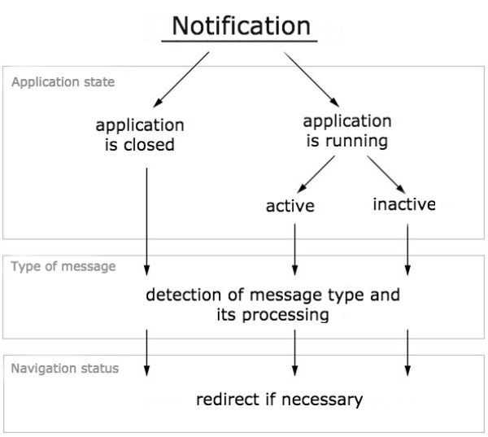

## Navigation

The right choice of navigation is a basis of designing applications on React Native. It largely defines the project structure and the performance. At the moment, there are two types of navigation:

### 1. Native

It is implemented using native elements on both iOS and Android and there are two libraries that do this:

* <a href="http://airbnb.io/native-navigation/" rel="nofollow" target="_blank">Native navigation</a> by Airbnb
* <a href="https://wix.github.io/react-native-navigation/#/" rel="nofollow" target="_blank">React Native Navigation</a> by Wix

The advantages of these navigation libraries are fast performance and ability to display platform-specific navigation elements.

### 2. JavaScript-based solution

You can get lost in numerous options here and even write your own version with the help of redux. However, the most popular and frequently used is still <a href="https://reactnavigation.org/" rel="nofollow" target="_blank">React Navigation</a>.

It is quite easy to use and provides the basic set of navigation elements: Stack, Tabs and Drawer, as well as the opportunity to create nested navigators. Among its drawbacks - all animations are rendered using JavaScript, and memory leaks can occur if the application is not designed correctly. So, for example, if you use a complex navigation, then transition via the navigator from one thread through the parent to another thread is performed by creating a new component for the screen, rather than redrawing the old one. It is necessary to avoid such transitions and always monitor the state of the route structure.

## Running the application offline

Just like the "Mobile first" principle works well for the web, the "Offline first" principle dominates in [mobile application development](https://anadea.info/services/mobile-development).

There are several ways to make your app offline-friendly with React Native:

### 1. Set the initial state of the application

In React, you can easily implement it in the reducers by specifying the initial state. Besides, you need to define what the user sees if there is no any data.

### 2. Use a local storage

In React Native, it is AsyncStorage. Here you can store the data that should be available in offline mode, for example, the auth token, so that there is no need to re-login when the user returns to the app next time. You can either set up an access to the repository yourself, or use the <a href="https://github.com/rt2zz/redux-persist" rel="nofollow" target="_blank">Redux Persist</a> library.

### 3. Track the connection status using NetInfo

In this case, it is important to decide on how the application should behave when there is no network connection:

* the easiest way to notify the user is to show him an alert: <a href="https://github.com/testshallpass/react-native-dropdownalert" rel="nofollow" target="_blank">react-native-dropdownalert</a> - a plugin that implements an alert for displaying various kinds of notifications: not only about the connection loss, but also about new chat messages, notifications about any successfully or unsuccessfully completed actions.
* <a href="https://github.com/rauliyohmc/react-native-offline" rel="nofollow" target="_blank">react-native-offline</a> - a universal utility for dealing with the application in online/offline mode. Its major features: ability to check Internet access by pinging a specified site at a specified frequency (unlike NetInfo, which detects only network connectivity and doesn't care if Internet access is still available), ability to use this verification in the renderer for choosing the component, ability to add network status to the state, ability to block requests when there is no network in redux or sagas, ability to build and manage the requests queue when the connection is lost. In general, well, this is a library with a very rich functionality.

Related read: [React Native: the Journey of a Beginner](https://anadea.info/blog/react-native-the-journey-of-a-beginner)

It is important to understand whether you need to process the user's requests to the server and put them in the queue, which will be dispatched to the server when connection is restored, or ignore all actions and block all requests. The second option is simpler. For the first one, you need to think how to organize the action queue, what to do if there are two similar requests, and how to process these requests on the server in case of conflicts with the current state.

## Push notification

Deciding how an application should respond to notifications can be a challenging task. Depending on the application's status, there are three different ways of processing notifications:

1. __The application is closed:__ When the application is closed, all processes are usually stopped, making it easy to process notifications only when the user clicks on them. In this case, the application can only respond to the notification if the user interacts with it, while other notifications are ignored.
2. __The application is in the tray/minimized/inactive:__ In this scenario, the application can process all incoming notifications without sending a request to the server. For instance, the application can update the counter of new incoming notifications without interrupting the user's current task.
3. __The application is open:__ When the application is open, the screen that the user is currently seeing needs to be taken into account. For example, if the application is notifying the user about a new chat message, the application must determine if the user is currently on the chat page or another page. If the user is on the chat page, the application can simply add the new message to the chat. However, if the user is on another page, the application must update the counter of unread messages.

Since the notifications are created on the server, it is always possible to decide what data we need for a particular kind of notification. So, depending on the type of the received notification, you can process it differently: split into system and user notifications.
