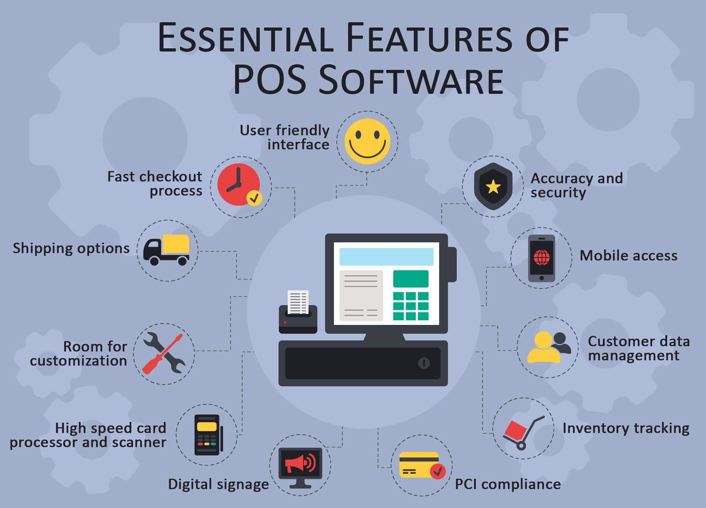

A Point of sale (POS) system is a very <a href="https://www.entrepreneur.com/encyclopedia/point-of-sale-pos-system" target="_blank">important component in a business</a> but it may not be useful if it is out-of-date. How do you know that it is time to upgrade or acquire a new POS system? The first thing you will notice is that your system will become slow or it may even become unresponsive to commands. You may also find that the system has an outdated payment processing, outdated hardware, and limited integration capabilities. Apart from that, it may become inaccurate and unreliable.

An old POS system may not allow you to do email marketing campaigns and may not have social media integrations. In addition, it may not allow you to create a loyalty program for your customers. If your POS has any of those characteristics, then it is time to build or purchase a new POS system.

## Essential POS features

If you are an entrepreneur and you have been planning to build a new POS system, you must ensure that it has the following features.

### 1. Fast transactions

When building a new <a href="https://toppossystem.com/" target="_blank">POS software</a>, you must ensure that the payment process is simplified. It should ensure that it does not take a lot of time for your sales team to complete transactions.

### 2. User friendly
You do not need to build a very complicated software which your employees are not able to use. Ensure that it has an easy to understand interface. If possible, you can even add tutorials on how it works to guide new employees.

### 3. Accurate

You should build a system that is highly accurate and dependable. It should also work smoothly with the necessary hardware. Apart from that, ensure that it is able to store your data safely. It should have an automatic data backup which is reliable in case the system crashes.

### 4. Mobile compatibility

If you want to get the best experience from a POS system, ensure that it is mobile enabled. You should also create an app which allows you to access they system through your phone. A POS system that is easily accessible is great because it allows you to operate your business wherever you are.

Related read: [Retail Business Goes Mobile: How to Create a Good Retail App?](https://anadea.info/blog/retail-business-goes-mobile-how-to-create-a-good-retail-app)

### 5. Customer's information

Ensure that the POS allows you to keep records of your customers. From the customers details you can easily check the products which are on demand. As a result, you are able to re-stock on time. These details will also help you when launching a loyalty program.

### 6. Tracking of inventory

One of the advantages of a POS system is that it allows you to manage your inventory in a convenient manner. Ensure that the system you are building is able to keep track of all the important details including the sales and accounting records. A good inventory will enable you to monitor sales easily.

### 7. PCI agreement

If you want to build trust with your customer, Payment Card Industry is one of the most important features your POS system should have. This feature protects your customer's credit card details from being accessed by a third party.

### 8. Digital signage

This feature create additional revenue through sale of advertisements to suppliers or vendors. It also promotes cross-sale of products and impulse merchandise. Additionally, it delivers messages to your target audience in specific locations. It also allows you to create advertisements on full size LCD display, pin pads and LCD pole displays.

### 9. High speed card processor and scanner

Ensure that the barcode scanner, card reader and receipt printer are very fast to improve the checkout process for the customers. This will ensure that your customers do not waste time in lines when waiting to be served.

### 10. Easy to customize

A good POS should allow you to add or remove features according to your business needs. Such a system is very economical because you don't need to purchase a new system when you require some extra features. It also allows you to manage your business conveniently.

### 11. Shipping options

When building a new POS, ensure that it allows you to deliver products to your customers. Ensure that you have put the right measures to ensure that customers get their orders on time. The system should also provide details of customer's receipts and payment details.

## The bottom line

If you really want to succeed in your business, you must ensure that you have an updated POS system. When upgrading, you need to ensure that the POS system of your choice contains all the features we have mentioned in this article. Such a system will boost the performance of your business and it may also lead to increased sales.

Apart from that, it will bring efficiency and accuracy to your business. This is because you will be in a position to track the activities of every employee. On the other hand, the employees will be able to determine the areas that require some improvement. Additionally, it will be easier for you to determine the type of products your customers are interested in. Those are the important features you should add to your new POS system.
