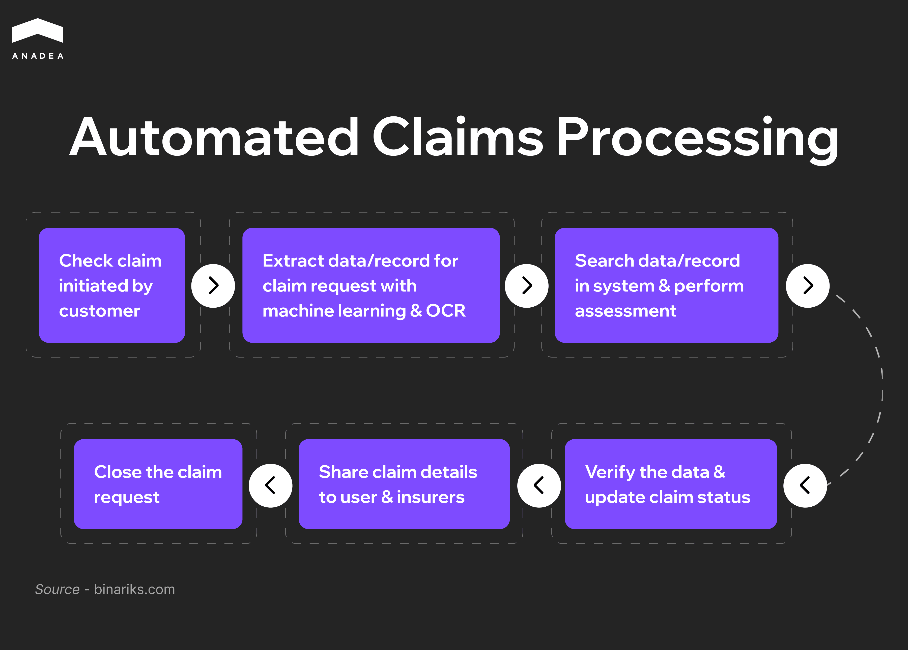

According to estimates, [$170 billion](https://newsroom.accenture.com/news/2022/poor-claims-experiences-could-put-up-to-170b-of-global-insurance-premiums-at-risk-by-2027-according-to-new-accenture-research) of insurance premiums could be at risk by 2027 due to poor claims-handling experiences? Traditional claims processing is often time-consuming and paper-heavy. A huge number of manual steps involved can frustrate customers and strain insurers. In today’s dynamic world, such outdated workflows can’t satisfy modern market demands, which encourages companies to look for alternatives and turn to [insurance software development](https://anadea.info/solutions/insurance-software-development). Insurtech solutions can transform claims management through automation and help agencies deliver a seamless customer experience.

In this article, we invite you to explore the benefits of digital transformation in insurance and the technologies that power such changes.

## Rise of Insurance Automation: New Chapter in Claims Management

Insurtech refers to the use of technology in insurance to improve and speed up numerous processes in the industry, from underwriting, policy distribution, and customer service to claims management.

Automated insurance claims processing systems are gaining traction today among insurance companies of different sizes. Smaller insurers rely on insurance automation in order to compete with larger market players without spending extra resources on staff expansion. At the same time, big firms use technology in insurance processes to handle high claim volumes and improve consistency across all their teams.

### Key Benefits of Automated Insurance Claims

* **Faster settlements**. Automation tools allow companies to eliminate the manual repetitive tasks, like validation or data entry. As a result, they can ensure quicker approvals and payouts.
* **Optimized operational costs**. As many tasks can be performed automatically, insurance businesses can cut down on administrative overhead and reduce overall claim processing costs.
* **Paperless processes**. Automated systems rely on digital documents, and the minimal use of paper makes the claim management process more eco-friendly and secure.
* **Scalability**. With automation, insurance firms can process increased claim volumes without expanding staff. Therefore, even during peak periods, they can easily cope with the growing volumes of work. 
* **Higher accuracy**. Digital tools enable insurers to avoid a lot of errors in data entry, policy validation, and fraud detection caused by human factors. It means that they can achieve more reliable and consistent claim outcomes.
* **Better customer experience**. Chatbots, virtual assistants, and self-service portals make customer interactions faster, smoother, and more efficient. Clients can leverage 24/7 support and real-time updates, while human agents have more time to handle complex queries.
* **Advanced fraud detection**. AI and ML algorithms can be applied to identify suspicious patterns or anomalies in claims. Such tools can do it with higher precision and speed than humans. 
* **Data-driven insights**. Insurance automation solutions are often equipped with analytics tools. They help insurers detect ongoing market trends, optimize workflows, and make valuable strategic decisions.

### How Automated Claims Processing Works

1. The process begins when a customer submits a claim via an online platform or app.
2. Advanced technologies like machine learning and optical character recognition (OCR) automatically extract and digitize relevant data from the submitted documents.
3. The system searches internal databases and performs an initial assessment of the claim based on the policy rules and historical data.
4. The system verifies the extracted data for accuracy and updates the claim’s progress.
5. Claim details are shared with users and insurers, ensuring transparency and consistency.
6. Once all steps are complete, the system automatically closes the claim. It can initiate a payout or issue a rejection.

## Automated Insurance Claims Management: Technologies Behind It

Claim management software is traditionally powered by a blend of cutting-edge technologies that can streamline processes and improve accuracy. Let’s take a closer look at them.

### Artificial Intelligence and Machine Learning

According to industry research, nearly [20% of claims ](https://www.forbes.com/advisor/insurance/fraud-statistics/)are fraudulent, resulting in billion-dollar losses every year. [AI and ML tools](https://anadea.info/services/machine-learning-software-development) are real game changers in this field.

They accurately detect fraudulent claims by analyzing patterns and anomalies, which can significantly reduce losses. 

For example, Shift Technology offers a solution for insurance fraud detection. The solution is powered by mathematical modeling, and helps insurers make intelligent decisions faster and more efficiently. 

Apart from this, AI also enables personalized claim assessments. With its help, decisions can be made based on individual policyholder profiles and claim history. Insurers can speed up approvals and improve fairness.

### Robotic Process Automation (RPA)

RPA automates various rule-based tasks. For instance, you can rely on it in such repetitive processes as data entry and claims triage. 

Today, many insurance companies implement such tools as UiPath or Blue Prism to process large volumes of claims quickly and with minimal human intervention. As a result, they can free their employees to focus on complex cases and direct interactions with customers.

### Blockchain

Blockchain technology ensures transparency, traceability, and security in claims processing. This is possible thanks to the use of tamper-proof records and the automation of actions through smart contracts. 

For example, AXA’s Fizzy platform uses blockchain to issue flight delay insurance. They pay out automatically when specific conditions are met. As a result, the need for customer intervention or manual validation is eliminated. This approach greatly reduces processing time and builds customer trust with higher auditability.

### IoT

With the Internet of Things, insurance companies have continuous access to real-time data, which helps enhance risk assessment and claims accuracy.

For instance, Progressive’s Snapshot program is aimed at adjusting car insurance rates based on actual driving skills. It means that attentive and careful drivers will pay less. Meanwhile, high-risk driving can increase rates. To participate in the program, drivers should use either a plug-in device or a mobile application.

Another good example is John Hancock’s Vitality program. It relies on Apple Watch and Fitbit data to provide discounts for life insurance policies to those clients who try to stay active in their daily lives and meet their fitness goals. 

### Cloud Platforms and Big Data

Cloud solutions have already won the competition with traditional on-premises systems. They offer significant flexibility, cost-efficiency, and real-time access to data. With them, insurers can deploy updates faster and easily collaborate across teams globally.

Apart from this, the [development of scalable software](https://anadea.info/blog/building-scalable-web-applications-2025/) has become a must for many businesses. And cloud platforms provide the required infrastructure for modern claims systems to store and process huge volumes of data. Big data analytics helps insurance firms uncover patterns, predict high-risk policyholders, and detect potential fraud. 

### Natural Language Processing and Computer Vision

The integration of these emerging technologies into claims management software and other insurtech solutions brings a lot of benefits.

NLP is applied to automate the extraction of key details from various documents submitted by clients. This allows faster triage and resolution. NLP algorithms can be used to categorize claims by detecting sentiment and prioritizing urgent cases. 

At the same time, computer vision is helpful for processing photos or video evidence (like property or vehicle damage). This assessment is vital to estimate repair costs.

AI insurance tools of this type are already being used. For example, Tractable relies on computer vision and AI algorithms to provide near-instant vehicle damage evaluations.

### API Integrations

Such integrations can ensure interoperability between various digital platforms that are included in the claims ecosystem. By connecting claims management software with CRM systems, policy databases, and payment gateways, insurance agencies can build smooth workflows.

For instance, when a claim is verified, payment APIs can automatically trigger instant disbursements. At the same time, the integration of a CRM system allows customers to receive timely updates. Such transparency lets insurers deliver better experiences for policyholders.



## Insurance Automation Across Different Domains

Claims automation is transforming how insurers serve customers across various sectors. Such automation tools are particularly valuable in industries with high volumes of repetitive claims. Let’s consider some of them.

### Auto Insurance

In this domain, automation is applied for damage assessment, claims triage, and fast payouts.

#### Key Perks

* Significant reduction of claim cycle times;
* Minimized human intervention;
* Increased customer satisfaction with faster service.

Lemonade is one of the leading insurance companies that leverages artificial intelligence to expedite claims processing. The AI-driven system and the chatbot known as AI Jim have set records for rapid claim settlements.

According to the company’s report, its system manages to process a stolen bike claim and make a payment in just two seconds. The customer provided all necessary details and video evidence, which allowed AI to assess and approve the claim almost instantaneously.

### Health Insurance

Health insurers need to handle complex documentation, strict compliance requirements, and high risks of fraudulent claims. Emerging technologies, including AI in health insurance, are used to extract data from documents, apply business rules, and verify claims.

#### Key Perks

* Faster claim resolutions;
* More accurate fraud recognition;
* Decreased administrative costs.

A good case of using AI in health insurance is Anthem. It utilizes ML-powered [Amazon Textract service](https://aws.amazon.com/solutions/case-studies/anthem/) to automatically extract printed text, handwriting, and other data from scanned documents. Additionally, Anthem has implemented a real-time fraud prevention framework that combines AI and NLP to monitor claims. Within 6 months after the implementation of this tool, Anthem achieved a 25% reduction in fraudulent payouts.

### Property Insurance

Insurance automation in this domain focuses on verifying damage claims remotely. This is possible thanks to IoT devices and AI-powered imagery tools.

#### Key Perks

* Real-time claims processing;
* Great scalability (this is highly important during natural disasters);
* Fewer errors and less subjective assessments.

Hippo Insurance integrates smart home technology into its homeowners’ policies to proactively mitigate risks. New customers receive devices like water leak detectors, smoke alarms, and motion sensors. They provide real-time alerts to both homeowners and Hippo, enabling early detection of potential issues such as water leaks or fires. Additionally, customers can get discounts on their premiums for maintaining active smart home systems.

## How to Implement Claims Management Automation: Step-by-Step Guide

At Anadea, we have solid expertise in [AI development](https://anadea.info/services/ai-software-development) and integration. The accumulated experience allowed us to create an[ implementation plan ](https://anadea.info/blog/how-to-implement-ai-in-business/)for those insurance companies that want to make automation part of their processes.

### Step 1. Assess Your Current Claims Processing Workflows

We recommend you start by mapping out your existing claims handling processes. This will help you identify inefficiencies and bottlenecks. Based on the results of such analysis, you will understand where automation can deliver the most value.

### Step 2. Define the Right Tech Stack

It’s crucial to opt for those technologies that correspond to your business goals. It will be sensible to begin digital transformation in insurance with some basic tools like RPA for repetitive tasks. Then you will have a good foundation for integrating more advanced AI, ML, and NLP features. 

To be on the safe side and make the right choice, you can rely on a professional [custom software development](https://anadea.info/blog/custom-software-development-trends-2025/) partner like Anadea. We will analyze your pain points and offer the most feasible approach to addressing them.

### Step 3. Integrate Your Automation Tools Gradually

You shouldn’t hurry to introduce full automation as soon as possible. It is always recommended to start small. At first steps, you can automate simple tasks like data entry and then proceed to advanced analytics, fraud detection, and customer interactions.

### Step 4. Connect Automation Tools with Your Existing Software

To make sure that the integration of automation won’t break your processes, instead of strengthening and optimizing them, you need to connect new tools with your ERP, CRM, and other systems. To do it, developers usually use APIs.

### Step 5. Conduct Pilot Tests

It is necessary to test your automation setup, and it is better to do it in controlled environments first. Based on the outcomes of such tests, you will need to fine-tune processes and then release your new tool.

## Closing Word

The use of AI in insurance has become a present-day force reshaping the industry landscape. Digital tools have proven their efficiency in many processes, from claims management to personalization of customer experiences.

Insurers are increasingly turning to automation. This is vital not only to reduce operational costs but also to deliver faster services that meet modern customer expectations. While digital transformation in insurance is gaining momentum, automation tools are gradually becoming an integral part of business processes.

If you have an idea for your own AI insurance solution and need professional help with development, at Anadea, we are always open to cooperation. Share your requirements with us to get[ project estimates for free](https://anadea.info/free-project-estimate)!
