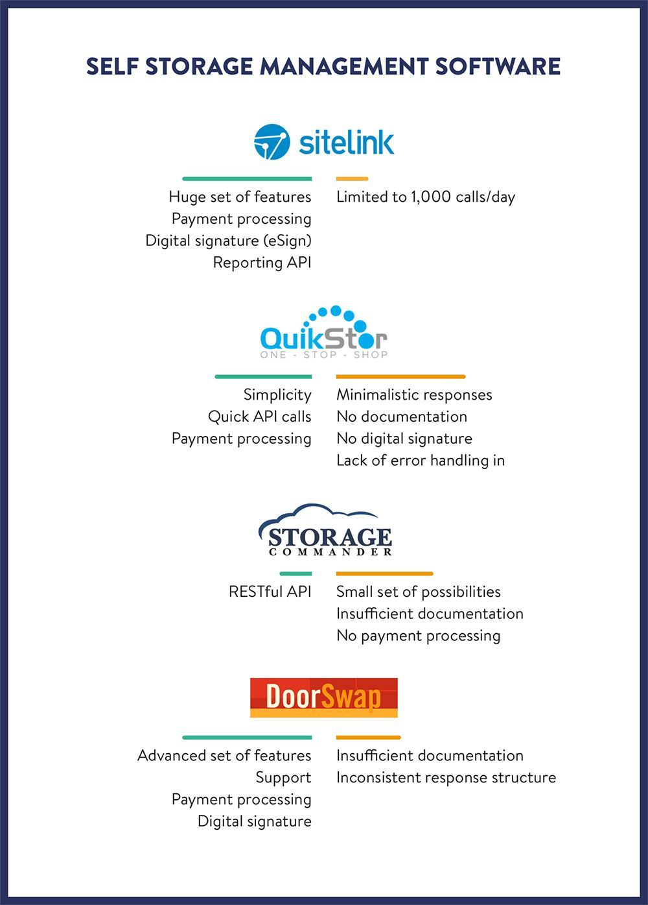

Self-storage companies lease storage space, such as lockers, containers, and garages, and often have multiple locations with hundreds of units. Managing this business requires specialized management software to keep track of all the units.

Typically, self-storage management systems include features for managing the status of each unit (available, rented, reserved, or disabled), customer accounts and reporting. Some management software may also include additional features such as point of sale, customer notes, digital signature, insurance, payment processing, and accounting.

While a typical self-storage software has enough features to cover the basic needs of the business, it may not have user-friendly features. <a href="https://anadea.info/services/custom-software-development" target="_blank">Custom software development</a> can address this issue by creating a solution that is tailored to the specific needs of the business.

## Client application

Self-storage companies have many real-life problems they cannot solve by their management systems. They have to provide their clients with up-to-date information about available units, discounts and promotions. They need to attract customers. They would like to encourage advance payments and auto-billing. They might want to notify their customers about overdue payments.

All these features are user-oriented, so internal management software cannot solve these problems even though it has the information that might help. The good thing is that this software usually has an API that can be used by custom apps which, in their turn, can have user-friendly interface and implement workflow targeted at unit owners or potential facility clients.

This way, owners of self-storage locations can get very nice projects - either websites or mobile apps. My experience shows that they can even go further and create SaaS projects that allow one to create white-label websites or personalized applications for different self-storage companies.

This is possible because most of such companies use the same management software providers - hence they can define a user workflow common to all self-storage locations and create a client-friendly application with the same set of features.

Here is a brief overview of the best self-storage software that have APIs and allow to build a custom user flow - a flow that does not repeat functionality of the original management software - around those APIs.

## SiteLink

<a href="https://www.sitelink.com/" rel="nofollow" target="_blank">SiteLink</a> is a leader of the industry. They have been in the market for a long time, so their API has the richest set of features compared to the other providers. They have all kinds of price lists, accounting, payment processing, unit reservation, insurances, promotions, digital signature (called eSign), notes and scheduled events - all available via the API. In addition to that they have a "reporting API" that returns big data sets structured in a very specific way.

Since they have the biggest number of companies on board, their API has limitations. It allows for no more than 1,000 location-specific calls per day. Also, there are API methods that are limited to just a few calls per day. The reporting API allows to get one report of each type per day.

The API is designed in a way that requires the developer to “synchronize” (pull) the data from SiteLink into the custom software. Small chunks of data such as recent sales can be synchronized every 15 minutes. This approach presupposes a certain application architecture. A developer cannot build an app that would be just a layer between SiteLink and user interface. The data should be stored in a custom database and the developer should assure its consistency with the third-party.

## QuikStor

<a href="http://quikstor.com/" rel="nofollow" target="_blank">QuikStor</a> is an example of API that implements a completely different approach. It is designed to be used on the fly. To illustrate that, it returns available units and occupied units separately from each other - and both data sets have different structure. The same is valid for unit types, prices, insurances, and so on.

The API is built to be fast and simple. The information it returns is concise - it rarely has large lists of properties. If a developer wants to synchronize the local database with QuikStor like he would do with SiteLink, they have to put significant effort in gathering all pieces of information together because the data are not kept in one place - these are distributed among multiple calls that return minimalistic pieces of information. But if the developer wants to know something very specific - like information about user balance or units rented by a certain customer - he will need much less API requests than SiteLink would require.

It is worth mentioning that QuikStor API does not implement digital signature and does not store custom documents. Also, it is not documented well (if documented at all). But even with a limited set of methods and minimalistic data structures, QuikStor API allows to implement unique user flows that can make renter’s life easier.

## Storage Commander

While SiteLink and QuikStor have SOAP APIs, <a href="http://www.storagecommander.com/" rel="nofollow" target="_blank">Storage Commander</a> is WADL-based. So, its API is RESTful, it follows the best patterns strictly, which may be very heartwarming for developers.

However, it is not that helpful for self-storage property management. The API is missing key features such as payment processing. The flow it has covers move-ins and reservations, so it is targeted at new users rather than at existing unit owners. This way, the API is quite limited at this stage.

On the other hand, Storage Commander is a fresh face in the self-storage market, so their API does not have heavy legacy that is often found in the older providers. It is expected that Storage Commander API will evolve over time.

## DoorSwap

<a href="http://www.doorswap.com/" rel="nofollow" target="_blank">DoorSwap</a> is a very promising self-storage management software. It implements SOAP API just like SiteLink and QuikStor. At the same time DoorSwap has web-based backend, so there is no need to install a desktop application to manage facilities.

DoorSwap API has many features that are not visible at first sight. The vendor has a documentation which covers basic user flows. For those developers who want to go farther and implement sophisticated features for existing unit owners, DoorSwap has calls and approaches that are not documented.

But the good thing is that they have a great support - perhaps the best support I could ever get from an API provider. A couple of times they made changes in their API and even created a new method specially for me even though I did not ask for such a favor.

While working with DoorSwap API, I noticed that some flows required more API calls than I would need in other systems. However, it is safe to say that it has a set of features that is close to what SiteLink has yet without any limitations on the API usage.

## Conclusion

Self-storage location owners may want to know that they can get more out of their management software. If it has a web-based API - which is usually the case - the API allows one to build client-friendly websites and apps - and sometimes SaaS projects. The apps, in their turn, can implement user flow that helps to streamline payments and new rents.

There are some other self-storage providers that deserve to (and probably will) be included in the list. The market is in high demand and self-storage businesses sometimes move from one software to another, which is not easy to do, but much easier than in other areas of business. So, the self-storage software companies will have to compete and keep their services in good shape.
