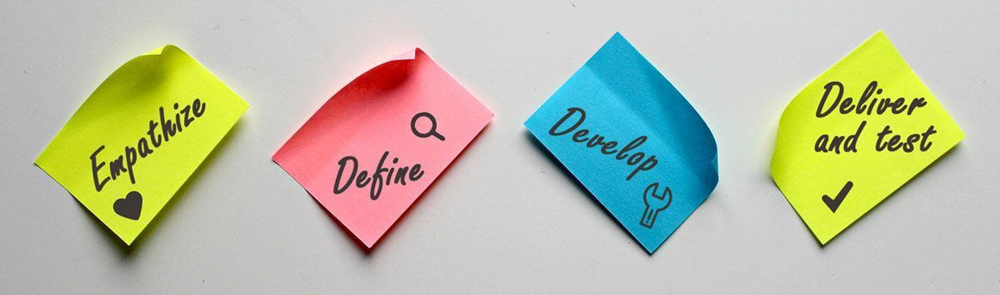
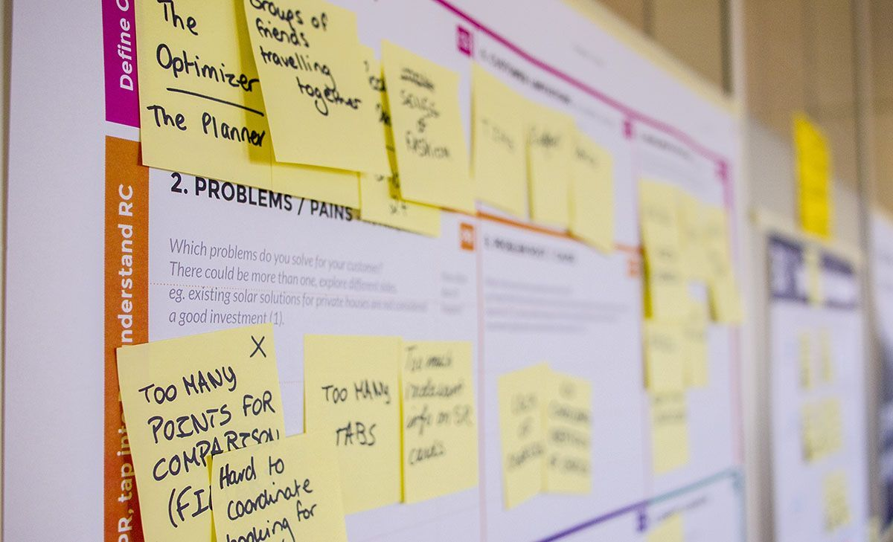

Design thinking is more than just a buzzword; it's a powerful problem-solving methodology that has transformed the way businesses, organizations, and individuals approach innovation and creativity. At its core, design thinking is about empathy, collaboration, and experimentation, and it has the potential to revolutionize the way we solve complex challenges in today's fast-paced and rapidly changing world. Whether you're a business leader looking to <a href="https://anadea.info/services/custom-software-development" target="_blank">build custom software for your business</a>, an educator seeking to inspire creativity in your students, or simply someone who wants to learn more about this exciting approach to problem-solving, this article will provide valuable insights and practical tips to help you harness the power of design thinking!

## What is design thinking?

In its most basic description, design thinking is a decision-making method that seeks to understand the user, challenge assumptions, and redefine different issues in the effort to think of alternative solutions that might not be easily visible with our initial level of reasoning.

### What a cute definition it was, wasn't it? Now let's see a practical example.

Take a look at the <a href="https://www.fastcompany.com/3060197/how-two-industrial-design-titans-are-helping-brands-simplify-tech" target="_blank">Smart Brush</a> developed by Braun and Oral B. When attempting to design a smart toothbrush, the designers faced an interesting requirement by the target audience: they wanted the brush to play music and track their brushing performance. Before that point, the main issues that toothbrush designers faced were the replacement head and charging options. Now, they had to redefine the whole concept and offer an alternative solution that hasn't been seen before. And that's exactly what they did.

### So how do we relate design thinking with liberal arts? There is some level of analogy

<a href="https://www.topuniversities.com/blog/what-liberal-arts-education" target="_blank">Liberal arts education</a> encompasses classical subjects or skills that have been considered to be essential for a free person (hence the term liberal) since ancient times. Today, liberal arts encompass literature, social and physical sciences, mathematics, and philosophy. No matter what type of education you choose, you'll eventually encounter these disciplines, since they are considered to be essential for a person's common knowledge.

Design thinking, as a concept, is mostly related to the work of product inventors. However, it's an essential skill that helps with the decision-making process in all areas of life. It can help leaders to become more effective, and it will help any person come up with better solutions.

So yes, design thinking is the new liberal arts. It's for everyone! It's about time for all of us to understand what it is and start implementing it in our daily problem-solving situations. In software development, in particular, design thinking can make a huge difference.

## The 4 critical principles of design thinking

Design thinking is important because during this process, you consider all risks associated with an idea, and you get to a solution that minimizes those risks. The process helps you find solutions that are not only relevant, but innovative, too.

You can implement design thinking strategies when starting a business, planning a trip, designing a website, or simply writing an essay. These are the four key principles to consider:

* Empathize
* Define
* Develop
* Deliver and test

We'll take a simple example: app development, so we'll show how design thinking skills can be implemented in all aspects of life.

### 1. Empathize

During this stage, you're aiming towards an empathic understanding of the problem you're trying to solve. You must find out more about it, and understand what your target audience expects from the solution you deliver. In other words, you should come up with insights into the problem, and you need as many of them as possible.

How does this translate to our app development process?

* You'll analyze few popular apps, so you'll understand what the audience expects from you.
* You'll empathize with the issue you're trying to solve with the app. That means you'll be doing your research. You'll dig through several academic and scientific resources, as well as through online publications and journals. A survey among the target audience is a very useful addition to this pre-development step.

During this stage, you must set aside your assumptions about the issue, so you'll gain deeper understanding and an objective point of view. If, for example, you're developing a period tracking app, you'll try to research and understand the problems that women face with their periods and with apps of this type. You won't assume anything; you'll search for facts.

### 2. Define

During the initial stage, you gathered some information. Now, you'll put those details together. You'll analyze your observations and bring them together in order to define the issue you're about to solve.

No, you're not going to define what a period tracking app means. You're going to define what this challenge means for you. Here's an example: "Women expect me to develop an app that will track their cycle to perfection and deliver accurate information that helps them know their bodies better. It's a challenging project that will take at least five months of development. I need to come up with a unique approach that will make my app different from anything else currently available on the market."

When you understand the issue in all its gravity, you'll be on your way towards a relevant solution.

### 3. Develop

Many design thinkers separate this stage in two steps:

* Ideate
* Prototype

So first, you generate ideas.

Now that you understand what you're supposed to do and you gathered relevant information to get a starting point, you have the needed background to start thinking outside the box. When we say "think outside the box," it means that you have to develop an entirely unique app that will provide better and more relevant solutions for the target audience. Without this concept, you'd still develop an app, but it wouldn't be a product of design thinking. It would simply be an app that's too similar to what's already there in the App Store.

When you think outside the box, you generate great ideas through brainstorming and you opt for the one that solves the problem in the most effective way.

Once you pick your best idea, you'll start designing the prototype. Design teams share and test prototypes within the team. They approach this stage of the process with the intention to experiment. Even if you're working on the app all by yourself, you'll still do the same think. You'll experiment with different solutions until you find the perfect version that works.

### 4. Deliver and test

Finally, you'll add the finishing touches to the prototype and you'll make the app available for the audience. For most projects that don't implement design thinking, this is where the process ends. For a design thinker, it continues with testing.

Design thinkers wait for the results of their solutions. The testing phase often launches more problems to consider and new solutions to find, so the team goes back to a previous stage of the process, with the intention to find a better solution.

Related article: [Emotionally Intelligent Design: Why You Need It in Your Mobile App](https://anadea.info/blog/emotionally-intelligent-design-why-you-need-it-in-your-mobile-app)

Maybe your audience gives you hints that you didn't empathize well enough. In that case, you'll go back to the very first stage of development. Maybe they will point out some mistakes in the design, so you'll get back to the proper step of prototype design and testing.

The feedback of your audience shows what you could improve. That's exactly why app development is a continuous process. Each new update should add to the value of the app and make it even more relevant to the needs of your audience.

## Design thinking is more applicable than we assume

For designers in any industry, the process of design thinking is the foundation of their success. However, the technique is also applicable in various situations in life when we're faced with the need to find solutions. You'll be surprised to see how your analytical thinking and decision making skills will improve once you start implementing this method in practice.

Design thinking is the new liberal arts! We should all get more skilled in it, and we must start practicing ASAP.
