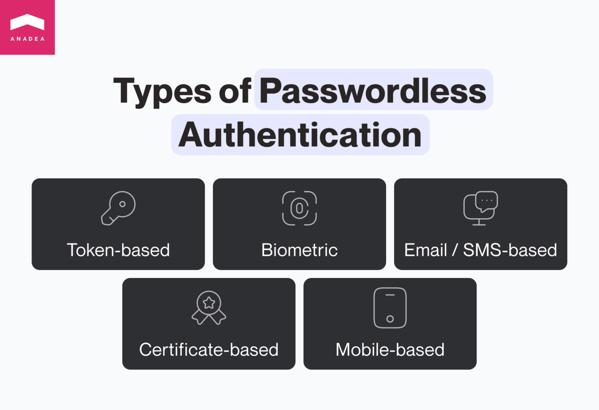
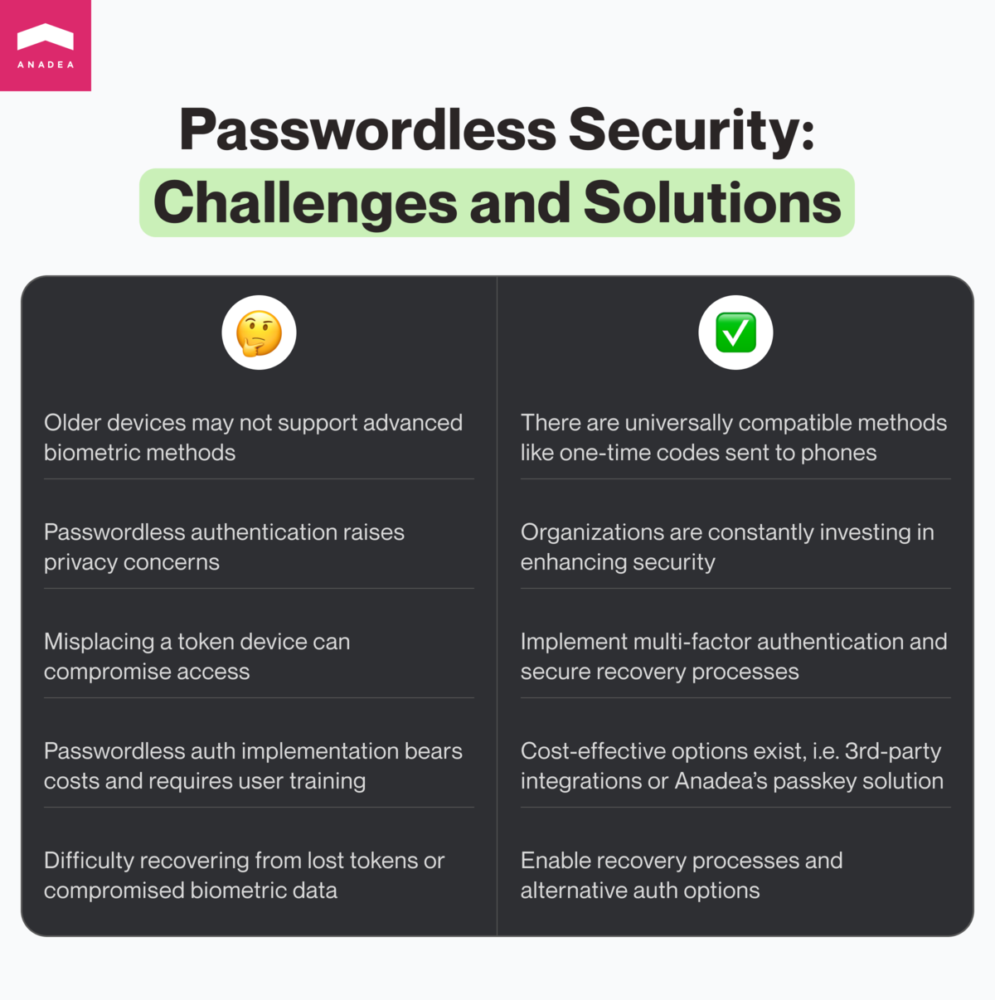

The security of tech solutions and data protection are among the most serious concerns regarding the development and launch of software products. And security-related fears are not groundless. The tools and methods used by hackers are becoming more sophisticated. This leads to situations when traditional security measures are just not powerful enough to protect users and their data. According to the recently published <a href="https://www.esentire.com/resources/library/2023-official-cybercrime-report" target="_blank">report</a>, the global annual cost of cybercrime can hit an alarming amount of $9.5 trillion in 2024. In 2025, this figure is expected to reach the level of $10.5 trillion.

Cybercriminals use different approaches to get access to users’ data, including but not limited to ransomware, malware, and phishing attacks. The range of methods that are applied by them is really wide and they regularly introduce new ones. But password attacks, which rely on stealing or guessing passwords, are still among the most common. However, these days, there is an excellent solution to eliminate password-related risks. It is passwordless security. And that’s exactly what we are going to talk about in this article.

## How does passwordless authentication work?

To begin with, let’s define this concept. As its name indicates, this authentication doesn’t presuppose the use of traditional passwords that are known to every software user today. Instead of them, it relies on alternative methods of user identity verification. But what can it be if not a combination of unique characters provided by a person? It should be a unique identifier that is impossible (or very difficult) to replicate. For example, such methods may include identity verification via digital certificates or fingerprints.

Let’s have a closer look at <a href="https://anadea.info/services/passkey">passwordless authentication</a> types. There can be different approaches to their classification but we prefer the following one.

- **Token-based authentication.** This method presupposes the necessity to use a physical device to confirm the identity of users. For example, a USB key or a smart card can be utilized for this purpose. A person needs to insert this device into a smartphone, tablet, PC, or laptop to verify his or her rights to get access to a particular program or data.
- **Biometric authentication.** This passwordless authentication type is already widely known and applied. It relied on unique physical characteristics of users, like facial recognition, fingerprints, or iris scans. A service can save such biometric data of people and then users will utilize them for confirming their identities.
- **Certificate-based authentication**. In this case, users need to obtain digital certificates to verify their identities. Such certificates are provided by particular authorities who have the relevant rights.
- **Mobile-based authentification**. If the software utilizes this method, the authentication process involves using a smartphone or tablet. There are several options to prove a user’s identity: either via a one-time code generated in a mobile application or through biometric authentication on a mobile device.
- **Email-based or SMS-based authentication.** When a user wants to sign in, a service can send a magic link to the indicated email or a one-time code to the user’s phone number or email address. Such links and codes will be sent each time when a person wants to log in.

Go passwordless

## Is passwordless more secure than password authentication?

There is a whole range of reasons that prove that passwordless authentication can ensure a higher level of protection than commonly used passwords.

1. **Users do not need to create and then safely keep passwords.** One of the worst things about passwords is that people have to remember them. But the “stronger” the password is, the more complicated it looks. And it is really difficult to memorize a random combination of characters of different types. Users are afraid of forgetting such passwords and that’s why they often make not the best decision. They start to use the same password for all their apps and services, or write them down and keep them in publicly accessible places (for example, on their desks), or create really simple passwords that can be easily guessed.  The research <a href="https://www.securitymagazine.com/articles/87787-hackers-attack-every-39-seconds" target="_blank">demonstrated</a> that the most popular password-guessing ploy (43%) is just to re-enter the username. The second most widely tried option is the username followed by the combination 123. Among other popular options are "123456" and "password”. And unfortunately, quite often such attempts turn out to be successful.  With passwordless methods, the risk that somebody can guess or steal your password is fully eliminated.
2. **Passwordless methods are stronger than passwords.** It is very challenging to fake cryptographic keys, hardware tokens, or biometrics, making it a great advantage of such methods.
3. **The risk of phishing attacks is lower.** Phishing attacks are often aimed at stealing passwords. In other words, cybercriminals try to use their tricks to make people reveal their passwords. With passwordless security methods, such risks don’t exist.
4. **Passwordless auth is an excellent choice for businesses**, especially for big organizations. When a company has a lot of systems and employees, password management can become a very difficult task. And the introduction of passwordless alternatives will be a good way to address such issues.

Implement passwordless auth

## Passwordless security: Risks and drawbacks to consider

When our customers turn to us with the question “Is passwordless authentication safe?”, we always say “Yes”. When they ask us whether there are any pitfalls that they should be aware of before implementing such methods, we also have to provide a positive answer.

- **Limitations related to devices**. Passwordless security methods can be incompatible with your device. It happens so if it, for example, doesn’t support biometric authentication, especially when it comes to fingerprint scanning and facial recognition.
- **Privacy**. Some people may have prejudices regarding relying on biometric data for identity verification since this authentication method can be used for collecting personal data. As for token-based passwordless auth, in this case, hardware devices can be lost or can become a target for criminals.
- **Implementation costs and complexity**. Some passwordless authentication methods (like biometric-based auth) are related to the necessity to introduce new hardware and software. As a result, it may be rather challenging for organizations to implement them. Moreover, the deployment of this authentication system will also require additional investments.
- **Single point of failure.** In the case of using passwords, when a person forgets it, as a rule, there is a possibility of resetting a password and getting access to the account. With passwordless auth, there can be much more difficulties, if a person’s biometric data is compromised or something happens to a token device.

## Passkeys: Are they a viable option for your company?

One of the ways to get rid of passwords is to introduce passkeys instead of them. Passkeys are also a passwordless authentication method.

Passkeys are passwordless FIDO credentials. How do they work? When a user creates an account, a passkey will be generated. The method presupposes the use of a public key that will be stored by a service provider and a private key that will be kept on your device. When a person needs to sign in, they will be required to verify his/her identity via unlocking a device, where the private key is stored, with the help of a pattern, PIN code, or biometric data.

If you want to access your account on another device (not the one that keeps your private key), you can do it. But you need to have the device with a key nearby so that you can confirm your identity on it.

Is passkey safe? **Definitely yes, at least it is much safer than a password.** It is so because the concept of passkeys involves the use of two-factor authentication. It helps to enhance the protection level but it is often ignored by users of those apps and websites that have traditional passwords. If you want to learn more about this authentication method, you can read about it in our article on <a href="https://anadea.info/blog/passkey-vs-password">passkey vs password</a> comparison.

## Final word

Today, there is already a row of websites and applications, including such giants as PayPal and Google, that protect access to accounts with passkeys. Given all the new opportunities that this authentication method offers, it may be a very good idea for your business to introduce it to your new and existing solutions.

Its implementation in your app or website will require changes at frontend, backend, and database layers. It means that it will be sensible to entrust this task to professionals with relevant experience. If you do not have specialists with such skills among your in-house employees, that’s not a problem. At Anadea, we are always ready to help you.

Our experts are continuously expanding and deepening their knowledge in cybersecurity which allows them to deliver highly safe solutions of different types. We can help you with projects that involve the development of software from scratch as well as the enhancement of already existing products.

Do not hesitate to contact us and learn more about our offers!

Get in touch
