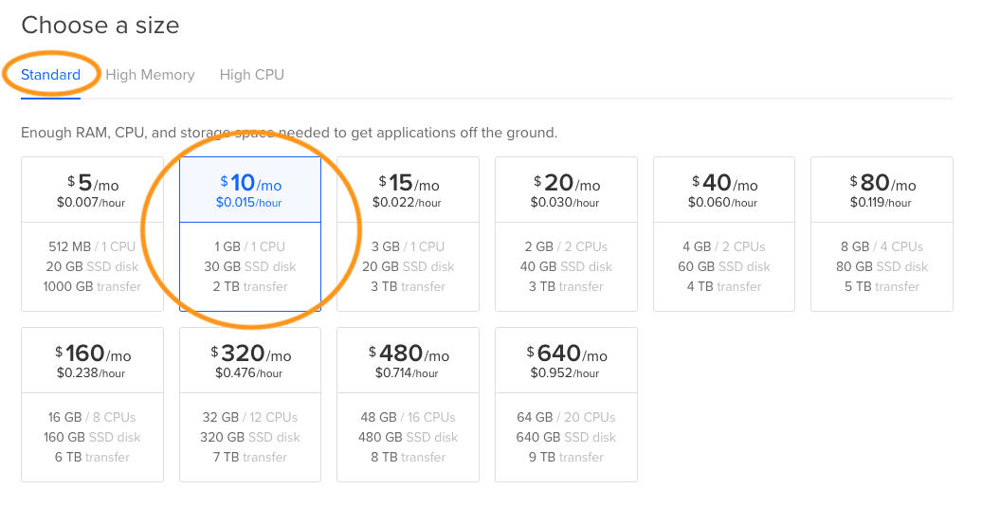

In the first article of the series, we recalled the rules of the game and the technical characteristics of the game engine. Now, let's describe how to use DigitalOcean and Dokku to allow players to write a bot in multiple languages, while having guaranteed equal resources in runtime and a pleasant deploy procedure.

The key to the solution is <a href="https://www.docker.com/" target="_blank">Docker</a>. The coolness of this tool can hardly be overestimated, as after its release the learning curve for DevOps has declined significantly. Since then, a regular developer swiftly sets up the environment for any needs, easily and naturally updates the system dependencies and has never heard of conflicts of dependencies…

Well, as for the swift setup... Despite all the simplicity and elegance of the tool, programming *docker-compose* files and deploying scripts for non-trivial projects constitutes quite a serious DevOps task. For instance, one day I had to embed a legacy Ruby on Rails project into a someone else's continuous integration system, tailored exclusively to PHP. Build the Docker image, run the tests in a disposable container, with luck - deploy the image to host machines via the docker registry. It seemed to be a simple task at first glance, however it turned into a real battle and I even felt like I was starting to win it! .. Just one thought did bother me - "It is too difficult! In fact, I am now writing my yet another <a href="https://github.com/heroku/heroku-buildpack-ruby" target="_blank">heroku buildpack for ruby</a>. " In the end, everything began to operate like clockwork with the help of …

<a href="https://dokku.com/" target="_blank">Dokku</a>! A faithful comrade-in-arms, Dokku is a high-level wrapper on top of Docker and Nginx:

* Deploying Heroku-ready applications via *git push* - Dokku will determine which <a href="https://devcenter.heroku.com/articles/buildpacks" target="_blank">buildpack</a> is right for your application (ruby, clojure, php etc), build the docker image, make it ready to run and launch the container with Zero Downtime. This is a natural magic that causes awe of the developers being new to it;
* Support for plugins and access to them from the outside via SSH;
* Flexibility at the level of buildpacks, as well as at the level of a <a href="https://dokku.com/docs/advanced-usage/deployment-tasks/#appjson-and-scriptsdokku" target="_blank">particular project</a>:
* In general, the only true ideology is "Down with Job Security! The creation process must be easy and enjoyable!"

Finally, the icing on the cake is <a href="https://www.digitalocean.com/" rel="nofollow" target="_blank">DigitalOcean</a>, an awesome cloud service that provides the Dokku machine as a one-click application. We will need a fixed number of droplets for the game sandboxes, and an unpredictable number of droplets for players, one droplet per team. We will deploy players' droplets during the teams registration from a prepared image, using the <a href="https://developers.digitalocean.com/" rel="nofollow" target="_blank">DigitalOcean API</a>.

## Setting up a master SSH key

At the time of the event, we will often interact with remote machines - the game sandboxes will place SSH keys in the player's droplets for deployment possibility, the players will deploy new bot releases, tech support will access the player's droplets to eliminate possible problems. To ensure the connections security, we will always use the SSH protocol and RSA key pairs.

Let's set up a single master SSH key for admin needs:

```bash
$ ssh-keygen -q -t rsa -f ~/.ssh/fourcolor -N '' -C fourcolor
```

We get a pair of keys - the public part will be put into the players' droplets for `root` and `dokku` users; the private part will be used by sandboxes for secure connections with the players' droplets, as well as by tech support of the tournament.

When creating DigitalOcean droplets from a prepared image, it should be taken into account that root users from the source image will be lost. So, during the droplets creation, it is necessary to specify the root users each time. To facilitate this procedure, we will add the public master key to the DigitalOcean account.


## Creating a droplet image for bots

Purchase the $10/month droplet on DigitalOcean with a pre-installed dokku and root master user.





In 10-20 seconds we get the IP address of the created droplet.


Open the IP droplet in the browser and finalize the Dokku installation by adding the master key to the dokku user.


Login into the droplet via SSH and prepare the droplet for the bots deployment.

```
# login into the droplet as the root user
$ ssh root@DROPLET_IP

# turn on swap file
$ fallocate -l 1G /swapfile
$ chmod 600 /swapfile
$ mkswap /swapfile
$ echo "/swapfile        none   swap  defaults    0 0" >> /etc/fstab
$ swapon -a

# create Dokku application
$ dokku apps:create app

# install PostgreSQL plugin, create a database, link it to the application
$ dokku plugin:install https://github.com/dokku/dokku-postgres
$ dokku postgres:create app_db
$ dokku postgres:link app_db app

# install Redis plug-in, create a database, link it to the application
$ dokku plugin:install https://github.com/dokku/dokku-redis
$ dokku redis:create app_redis
$ dokku redis:link app_redis app

# install Memcached plug-in, create a database, link it to the application
$ dokku plugin:install https://github.com/dokku/dokku-memcached
$ dokku memcached:create app_memcached
$ dokku memcached:link app_memcached app

# Install and configure NotifyCURL plugin to inform game servers about new releases
$ dokku plugin:install https://github.com/Anadea/dokku-notify-curl
$ dokku config:set --global DOKKU_NOTIFY_URL=https://internal.it-duel2017.anadea.info/releases/manage

# Disable VHOST, so that the application responds just by IP
$ dokku domains:disable app

# Set 80 port for the application, otherwise it will respond at random one
$ dokku config:set --no-restart app DOKKU_NGINX_PORT=80

# Stop the droplet. It is better to do this from the console and not through the DigitalOcean interface, which is like pulling the cord out of the socket
$ poweroff
```

Take the droplet image from the DigitalOcean panel. It is from this image that droplets will be created for teams - each team gets a $10 droplet with 1Gb of memory and 1 CPU.


Delete the droplet, it is no longer needed. Droplets for teams will be created from the prepared image programmatically, using the DigitalOcean API.


As a result of these modest efforts, all bots have identical (and quite redundant) computing power, all bots are isolated from each other and all bots are in equal conditions.

## Setting up the game servers

For the game sandboxes, we order DiginalOcean droplets with a pre-installed Dokku, this time $40 for each - for the sake of multithreading.

Configuring the droplets for sandboxes is generally similar to setting up droplets for players, however there are some differences:

```
# login into the droplet as the root user
$ ssh root@DROPLET_IP

# turn on swap file
$ fallocate -l 2G /swapfile
$ chmod 600 /swapfile
$ mkswap /swapfile
$ echo "/swapfile        none   swap  defaults    0 0" >> /etc/fstab
$ swapon -a

# create Dokku application
$ dokku apps:create app

# For Rails application, PostgreSQL is needed - install the plugin, create a database, link it to the application
$ dokku plugin:install https://github.com/dokku/dokku-postgres
$ dokku postgres:create app_db
$ dokku postgres:link app_db app

# For Sidekiq delayed tasks, Redis is needed - install the plugin, create a database, link it to the application
$ dokku plugin:install https://github.com/dokku/dokku-redis
$ dokku redis:create app_redis
$ dokku redis:link app_redis app

# Add the host name to the application, at the same time specify the corresponding A record in the DNS registrar panel
$ dokku domains:add app internal.it-duel2017.anadea.info

# Install and configure LetsEncrypt plugin to generate free SSL certificates
$ dokku plugin:install https://github.com/dokku/dokku-letsencrypt
$ dokku config:set --no-restart app DOKKU_LETSENCRYPT_EMAIL=xxxxxxxx@anadea.info
# After the application first deploy, it will be enough to run two commands for obtaining a certificate and periodic auto renewal
# No manual actions required for setting up nginx and crontab, everything will work by itself
# $ dokku letsencrypt app
# $ dokku letsencrypt:cron-job --add

# For closed alpha testing, we will use Basic HTTP Auth - install the plugin
$ dokku plugin:install https://github.com/dokku/dokku-http-auth
# Now it's enough to run the following commands to enable and disable HTTP Auth
# No manual actions required for setting up nginx, everything will work by itself
# $ dokku http-auth:on app test_user super_password
# $ dokku http-auth:off app

# Put the master SSH key in future containers, so that the game sandbox could call SSH commands in the players' droplets
$ dokku plugin:install https://github.com/cedricziel/dokku-deployment-keys
$ dokku deploymentkeys:create app
$ echo "PRIVATE_KEY" > > /home/dokku/.deployment-keys/app/.ssh/id_rsa
$ echo "PUBLIC_KEY" > > /home/dokku/.deployment-keys/app/.ssh/id_rsa.pub

# Stop the droplet
$ poweroff
```

Stop the droplet, make an image and, based on the image, deploy 5 sandboxes - Final, Grodno, Dnepr, Minsk and Internal. Since the sandboxes will run on the specific subdomains, do not forget to set up a domain name for each sandbox by using the `dokku domains:add` command, configure A records in the DNS registrar panel, and install the SSL certificate with the `dokku letsencrypt` command.

## Creating the bot templates

Despite all the simplicity of the Dokku deploy, when writing an application it is necessary to consider some nuances - stateless ideology, application configuration through environment variables, etc. Players should focus on the game logic, not on infrastructure - we will help them with this! Everything is simple here - on every target language and in the shortest way, we write an application that meets the following requirements:

* heroku-ready;
* correct responses to all requests of the game server;
* an attempt to make always the same game move;
* output to STDOUT of all incoming parameters.

Templates are <a href="https://github.com/Anadea/hexogon-templates" target="_blank">ready</a>!

It is worth emphasizing that, among other things, I take the tournament as a competition between languages. That's why the templates were written in the shortest way, without any specific settings or code. Moreover, being a Ruby evangelist, I deliberately deprived Ruby template of the automatic DB migration, and left as it is a serious and quite non-obvious problem with StrongParameters (I will describe it in the next article) - fair and square.

A couple of words about multithreading - all teams have 1 CPU available, you can't really get far at all desire/skill - you just need to train your bot to quickly respond to requests :)

In the next article read about [programming the game engine](https://anadea.info/blog/it-duel-2017-implementation-part3-the-engine).
