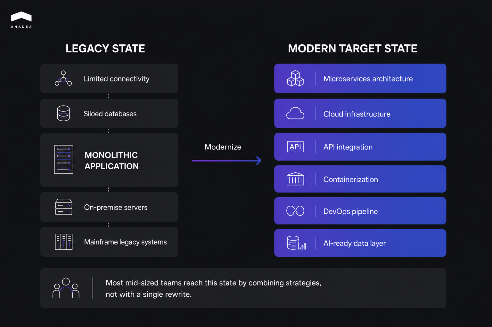

This guide explains how mid-sized businesses can modernize aging systems without halting day-to-day operations. It covers how to tell when a system has truly become legacy, the four core modernization strategies and when each one fits, a phased execution approach that keeps the business running, and the mistakes that most often derail these projects. A short FAQ at the end answers the questions teams ask most.

A legacy system is any software that has started to block the business rather than serve it, regardless of how old the code is. It slows your engineers, resists integration with newer tools, and quietly widens your security exposure with every unpatched month. The age of the codebase matters far less than the friction it creates.

Mid-sized companies face a harder version of this problem than enterprises do. A large organization can fund a multi-year rewrite and absorb the disruption across hundreds of engineers. A 40-person company with a 12-person engineering team has neither the budget for a full rebuild nor the headcount to freeze feature work for eighteen months while one happens. That constraint is real, and it shapes every decision that follows.

## When Is a System Actually Legacy?

A system is legacy when the business symptoms show up, not when the technology hits a certain age. Four warning signs tell you more than any version number.

1. The first is fear. When your engineers hesitate before touching a particular module, when a one-line change turns into a week of careful work because nobody is sure what else it will break, that hesitation is a measurable cost. It shows up as slower delivery, padded estimates, and bugs that surface in places that seem unrelated to the change.
2. The second is concentration of knowledge. If only one or two people understand how a system works, the organization is exposed the day either of them takes a vacation, let alone leaves. Institutional knowledge that lives in someone's head rather than in documentation or tests is a liability that compounds with every staff change.
3. The third is integration friction. Connecting a healthy system to a new tool should take days. With a legacy system it takes months, and often it cannot be done cleanly at all. Teams end up building workarounds such as shared spreadsheets, nightly export scripts, and manual data copies between systems, and each workaround becomes a new point where data can quietly diverge.
4. The fourth is abandoned support. When the vendor stops shipping patches, or the framework reaches end of life, security stops being something you manage and becomes something you hope about. Vulnerabilities that emerge after end-of-life are difficult and sometimes impossible to address.

As of 2025, a [survey of more than 500 U.S. IT professionals](https://www.saritasa.com/insights/legacy-software-modernization-in-2025-survey-of-500-u-s-it-pros) found that 62% of organizations still rely on legacy software systems, and 43% pointed to security vulnerabilities as a major concern. The cost side is just as heavy. Research cited in that report notes that the majority of IT budgets go toward maintaining legacy systems rather than investing in new technology. This is why legacy modernization keeps climbing the priority list, since the maintenance burden grows until it crowds out new work. Recognizing which of your systems have crossed this line is the first real step in any legacy software modernization effort, because it determines which of the strategies below you actually need.

## What Are the Main Legacy Application Modernization Strategies?

There are four legacy application modernization strategies, and the right one depends on how sound the code is versus how much the infrastructure is holding you back. They range from fast and shallow to slow and deep, and most projects end up using more than one. The diagram below shows the typical starting point, a monolithic application boxed in by legacy constraints, and the modern target state these strategies move you toward.

Rehosting, often called lift and shift migration, moves an application to new infrastructure, usually the cloud, with no changes to the code itself. It fits stable applications running on end-of-life hardware, where speed of migration matters more than optimization and the software itself is not the problem. This is the simplest form of legacy system migration, since the application logic stays untouched and only its environment changes.

Replatforming goes one step further, making minor code changes so the application can run on a modern platform, such as containerizing it with Docker or moving it onto a managed PaaS. This is the right call when the codebase is still fundamentally sound but the infrastructure around it has become the bottleneck.

Refactoring, or re-architecting, restructures the internal code and breaks a monolith into services incrementally, typically using the strangler fig pattern, where new components gradually take over from the old system piece by piece. It suits systems that are architecturally fragile but still deliver genuine business value, which describes most of the legacy estate at a mid-sized company. Because the decision between refactoring and replacing carries real cost either way, it is worth grounding in evidence. A [technical health assessment](https://anadea.info/blog/what-is-code-audit/) shows you what the code is actually worth before you commit, and [independent IT consulting](https://anadea.info/services/consulting-and-audit) can pressure-test the plan against your budget and timeline. Rebuilding or replacing, meaning a full rewrite or swapping in a commercial product, is the last option on the list for a reason. It becomes the answer only after the other three have been ruled out, and [custom software development](https://anadea.info/services/custom-software-development) on that scale should be a deliberate choice rather than a default reaction to messy code.

The table below maps each application modernization strategy to the situation it fits, so you can match a system to an approach at a glance.

<table>

<thead>

<tr>

<th>

<strong>Strategy</strong>

</th>

<th>

<strong>What changes</strong>

</th>

<th>

<strong>Best when</strong>

</th>

<th>

<strong>Speed</strong>

</th>

<th>

<strong>Risk</strong>

</th>

</tr>

</thead>

<tbody>

<tr>

<td>

Rehost (lift and shift)

</td>

<td>

Infrastructure only, no code change

</td>

<td>

Stable app on end-of-life hardware

</td>

<td>

Fast

</td>

<td>

Low

</td>

</tr>

<tr>

<td>

Replatform

</td>

<td>

Minor code changes for a modern platform

</td>

<td>

Sound codebase, outdated infrastructure

</td>

<td>

Medium

</td>

<td>

Low to medium

</td>

</tr>

<tr>

<td>

Refactor / re-architect

</td>

<td>

Internal structure, monolith split into services

</td>

<td>

Fragile architecture, real business value

</td>

<td>

Slow

</td>

<td>

Medium

</td>

</tr>

<tr>

<td>

Rebuild / replace

</td>

<td>

Full rewrite or commercial product

</td>

<td>

Other three ruled out

</td>

<td>

Slowest

</td>

<td>

High

</td>

</tr>

</tbody>

</table>

Most mid-sized businesses end up combining these approaches, rehosting the stable parts quickly to get them off failing hardware while refactoring the fragile core slowly over time.

## How Do You Modernize a Legacy System Without Disrupting the Business?

You modernize without disruption by phasing the work, running old and new in parallel, building tests before you change anything, and defining what success means before you start. Each principle exists to remove a specific category of risk.

* Phase the work instead of attempting a single cutover. Start with the highest-risk, lowest-effort changes, the ones that build team confidence and show return on investment before you commit to deeper re-architecture. For a mid-sized team, a full rewrite delivered in one big release is almost always the wrong call, and the industry has the scar tissue to prove it. The lesson developers keep relearning is that a working system encodes years of hard-won fixes for edge cases nobody remembers anymore, and a clean rewrite throws all of it away on the first day.
* Run the old and new systems in parallel through the transition window. Keeping both live at once is what lets you catch unexpected behavior before full cutover, and it is not optional for anything touching payments, compliance, or customer data. When the new path produces a different result than the old one, you want to discover that while the old system is still there to fall back on.
* Build automated test coverage around the current behavior before you make any structural change. Those tests become the regression net that makes refactoring safe, telling you the moment a change alters behavior that customers depend on. Skipping this step is how teams turn a refactor into an outage.
* Define success metrics before the first commit. Reducing monthly downtime from 12 hours to 1 hour is a success metric. Improving performance is not, because nobody can tell you afterward whether you hit it. Teams that skip this step have no way to tell stakeholders whether the modernization actually worked, which makes the next investment far harder to justify.

A concrete example pulls these together. Consider a mid-sized financial services firm running a ten-year-old invoicing and payments system on a deprecated framework. Rather than gambling on a full rebuild, the team started with a [code audit](https://anadea.info/blog/what-is-code-audit/) to assess the real condition of the system, then chose a combination of replatforming and incremental refactoring. They kept the old and new systems running in parallel for 60 days, and measured the result against two specific KPIs, transaction processing time and error rate. The legacy system integration points, meaning the connections to banking partners and the accounting backend, were migrated last, once the core was stable, because those were the riskiest seams to disturb. That sequencing, fragile core first and integrations last, is what kept the business running while the system underneath it changed.



## What Are the Most Common Legacy Modernization Mistakes?

The most common legacy modernization mistakes are organizational, not technical. The code is rarely the hardest part. The hardest part is sequencing, expectation-setting, and knowing when to stop. Five mistakes account for most failed projects.

Choosing a full rewrite by default tops the list. A rewrite feels clean, but it restarts years of accumulated bug fixes and business logic from zero, and the competition keeps moving while you rebuild. Treating the legacy system as a black box during that rewrite makes it worse, because the team copies a specification without understanding the edge cases the old code quietly handled.

Skipping the discovery step is the second. Without mapping what the system actually does, which parts talk to which, and where the riskiest coupling lives, the modernization plan is mostly guesswork. Teams underestimate the blast radius and discover late that a simple replacement also affects reporting, billing, or an integration nobody documented.

Modernizing without success metrics is the third. A program without metrics is a list of opinions. If you cannot show that downtime dropped or that processing time improved, you cannot prove the work was worth it, and the next phase loses its budget.

Letting the migration stall halfway is the fourth, and it is the specific failure mode of the otherwise-safe incremental approach. The strangler fig pattern only works with discipline. Lose focus, and you are left running two partially modernized systems at once, paying to maintain both.

Ignoring the human side is the fifth. Legacy systems become rigid because the organizational habits that produced them stay in place. Modernize the code without changing how the team plans, tests, and deploys, and the new system drifts toward the same mess within a few years.

The table below pairs each mistake with the practice that prevents it.

<table>

<thead>

<tr>

<th>

<strong>Common mistake</strong>

</th>

<th>

<strong>What to do instead</strong>

</th>

</tr>

</thead>

<tbody>

<tr>

<td>

Full rewrite by default

</td>

<td>

Match the system to the lightest strategy that solves its problem

</td>

</tr>

<tr>

<td>

Skipping discovery

</td>

<td>

Run a code audit and dependency map before planning

</td>

</tr>

<tr>

<td>

No success metrics

</td>

<td>

Define measurable KPIs before the first commit

</td>

</tr>

<tr>

<td>

Migration stalls halfway

</td>

<td>

Track progress against a retirement plan for the old system

</td>

</tr>

<tr>

<td>

Ignoring the human side

</td>

<td>

Update team practices alongside the code

</td>

</tr>

</tbody>

</table>

## How to Modernize Legacy Systems: A Practical Sequence

The practical sequence for how to modernize legacy systems runs in five steps, from assessment to measurement. It turns the principles above into an order of operations a mid-sized team can actually follow.

1. Assess and prioritize. Run a technical health assessment on each candidate system and score business criticality against technical conditions. This tells you what to touch first and what to leave alone.
2. Choose a strategy per system. Match each system to one of the four strategies. Stable apps on dead hardware get rehosted, sound apps with bad infrastructure get replatformed, fragile-but-valuable systems get refactored, and only the genuinely beyond-repair get rebuilt.
3. Build the safety net. Add automated test coverage around current behavior, and set up the ability to run old and new in parallel before you change anything structural.
4. Execute in phases. Start with high-value, lower-risk changes. Migrate the riskiest integration points last, once the core is stable.
5. Measure against KPIs. Track the specific metrics you defined at the start, and use them to decide whether to proceed, adjust, or roll back.

This sequence scales down well, which matters for a mid-sized team. You can apply it to a single system this quarter and the next system after that, spreading both cost and risk across budget cycles rather than concentrating them in one high-stakes program. That incremental rhythm is what turns legacy system transformation from a gamble into a managed process.

## Conclusion

Legacy system modernization is a sequencing problem before it is a technology problem. The question of how to modernize legacy systems without breaking the business comes down to three habits, diagnosing honestly which systems have crossed into legacy territory, matching each system to the lightest strategy that solves its actual problem, and phasing the work so that every step earns confidence for the next one. A full rewrite is rarely the answer for a mid-sized team, and the data on legacy maintenance costs makes the price of doing nothing just as clear. Approached this way, legacy system transformation becomes a series of contained, measurable moves rather than one high-stakes gamble.

If you are weighing a modernization effort and want an outside read on which systems to touch first and how to sequence the work, a technical assessment is the cheapest insurance you can buy before committing to a real budget. [Talk to our team](https://anadea.info/contacts) about where to start.
