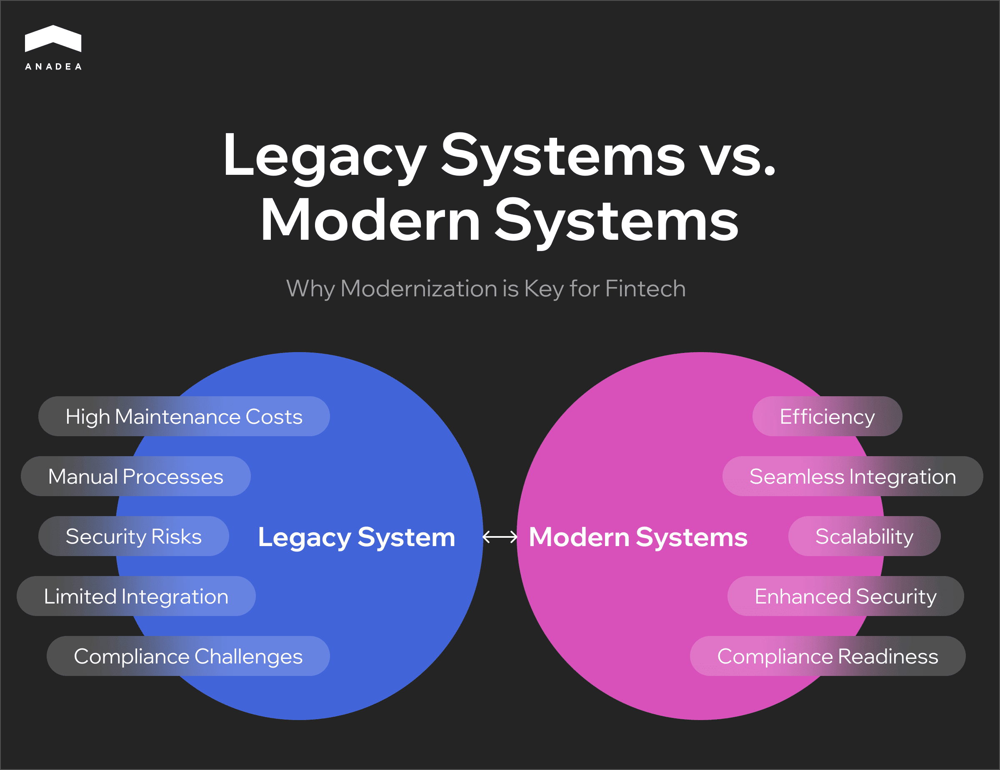
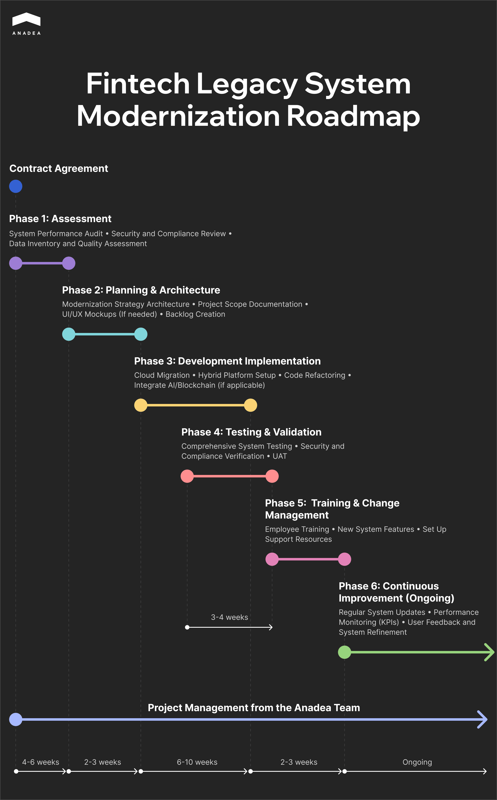

## Why Legacy System Modernization is Critical for Fintech

Legacy systems can hinder growth, innovation, and security in the fast-paced fintech industry. In this section, we’ll explore why modernizing these outdated systems is essential for staying competitive, meeting regulatory requirements, and delivering better customer experiences.

### The Growing Need for Change in Fintech

In today’s rapidly evolving financial technology landscape, companies face an urgent need to modernize their operations. One of the biggest obstacles to growth and innovation is the reliance on outdated legacy systems – technologies that, although foundational in the past, now hold businesses back. These old systems are often expensive to maintain, difficult to integrate with modern solutions, and open to security risks. For fintech companies striving to remain competitive, modernizing these legacy systems is not just an option – it’s a necessity.

Research shows that nearly two-thirds of organizations spend over [$2 million on maintaining and updating legacy systems](https://www.ciodive.com/news/legacy-technology-technical-debt-costs-enterprise-data-AI/721885/#:~:text=Legacy%20tech%20upgrades%20cost%20the%20average%20business%20%242.9%20million%20in,to%20the%20report%20published%20Thursday.). These funds could be redirected toward implementing new technologies and enhancing the customer experience. In this article, we will explore why modernizing legacy systems is essential, the challenges it addresses, and the tangible benefits it brings to the [fintech industry](https://anadea.info/solutions/fintech-software-development).

### The Hidden Costs of Sticking to Legacy Systems

While legacy systems may seem functional, their hidden costs are often staggering. The key challenges of sticking to outdated systems include:

* **High maintenance costs:** Maintaining legacy systems [can consume a large portion of IT resources](https://www.ibm.com/think/topics/legacy-application-modernization?mhsrc=ibmsearch_a&mhq=Legacy%20Modernization#:~:text=and%20increasing%20competitiveness.-,Benefits%20of%20modernizing%20legacy%20systems,maintenance%20costs%20and%20improve%20employee%20productivity%20by%20speeding%20up%20the%20process,-.%C2%A0), hindering investments in innovation.
* **Inefficiency:** These systems are typically slower, harder to update, and incapable of supporting the automation and innovation required in today’s fintech landscape.
* **Security vulnerabilities:** Older systems lack modern security features, making them susceptible to cyberattacks and data breaches, which can damage reputation and incur financial losses.
* **Scalability limitations:** Legacy systems struggle to handle increasing transaction volumes or adapt to new services, limiting business growth and innovation.
* **Compliance risks:** As regulations evolve, outdated systems often fail to meet modern compliance standards, putting organizations at risk of legal penalties and reputational harm.

Below, the diagram highlights the key differences between legacy and modern systems, showcasing the challenges of outdated technology and the advantages of modernization for fintech companies.

In summary, legacy systems hinder growth, innovation, and security, making modernization a necessity for fintech companies to thrive in a competitive landscape.

## The Risks of Ignoring Legacy Systems

Fintech companies relying on outdated systems face a range of significant risks that go beyond inefficiencies. These risks threaten their ability to compete, innovate, and protect sensitive data. Below are the key challenges:

### Increasing Operational Costs and Inefficiency

Legacy systems require constant maintenance, consuming significant IT resources and budgets. These outdated infrastructures slow down processes, making operations less efficient and reducing the ability to invest in innovation.

### Security Vulnerabilities

Old systems lack modern security features, making them more vulnerable to cyberattacks. In an industry that processes sensitive financial data, these vulnerabilities pose a significant threat to trust, reputation, and compliance.

### Compliance Challenges

Strict regulatory frameworks, such as GDPR or CCPA, require businesses to maintain high data security and privacy standards. Legacy systems often fail to meet these requirements, leading to compliance risks, legal penalties, and damaged reputations.

### Limited Scalability and Innovation

Legacy systems are not designed to scale with growing customer bases or transaction volumes. They create operational bottlenecks, limiting the ability to introduce new services or adapt to changing market demands, which is crucial for staying competitive.

### Missed Data Opportunities

Modern fintech systems rely on real-time data analysis to improve customer experiences, optimize operations, and enhance decision-making. Legacy systems often lack the infrastructure to fully utilize data, resulting in missed opportunities for growth and innovation.

The risks of ignoring legacy systems extend far beyond inefficiency. Security vulnerabilities, compliance challenges, and limitations in scalability and data utilization hinder growth and innovation. For fintech companies, modernizing these systems is critical to ensuring long-term competitiveness and resilience in a fast-evolving industry.

Learn more: <a href="https://anadea.info/blog/digital-transformation-in-banking/">Digital Transformation in Banking: Practical Recommendations
</a>


## Key Strategies for Legacy System Modernization

Modernizing legacy systems is crucial for fintech companies to stay competitive and adaptable. In the following sections, we will outline four key strategies for successful modernization, supported by practical examples and visual aids to provide clarity and actionable insights.

### Re-hosting: Moving Systems to Modern Infrastructure

Re-hosting involves moving existing systems to a modern infrastructure (e.g., cloud) without changing their core functionalities. It’s a relatively quick, low-risk solution for companies looking to modernize while minimizing disruption.

**How re-hosting works:**

<table border="1" cellpadding="5" cellspacing="0">
  <thead>
    <tr>
      <th>Legacy System</th>
      <th>Cloud-Based Infrastructure</th>
    </tr>
  </thead>
  <tbody>
    <tr>
      <td>On-premises server with high maintenance costs</td>
      <td>Cloud platform offering scalability and flexibility</td>
    </tr>
    <tr>
      <td>High reliance on manual processes</td>
      <td>Automated scaling, real-time monitoring, lower costs</td>
    </tr>
  </tbody>
</table>

**Benefits of re-hosting:**

* **Quick migration:** No need to re-engineer the entire system.
* **Improved scalability:** Systems can easily scale up or down as business demands change.

### Re-factoring:Optimizing Legacy Code for Better Performance

Re-factoring focuses on improving the internal structure of legacy system code without changing how the system works externally. This approach is ideal for optimizing performance and extending the system’s lifespan.

Before & after re-factoring:

<table border="1" cellpadding="5" cellspacing="0">
  <thead>
    <tr>
      <th>Before Refactoring</th>
      <th>After Refactoring</th>
    </tr>
  </thead>
  <tbody>
    <tr>
      <td>Messy, inefficient code</td>
      <td>Simplified, optimized code</td>
    </tr>
    <tr>
      <td>High maintenance costs</td>
      <td>Lower maintenance costs</td>
    </tr>
    <tr>
      <td>Slow performance</td>
      <td>Improved performance and scalability</td>
    </tr>
  </tbody>
</table>

Below is a diagram illustrating the code refactoring process:

**Key Benefits:**

* **Optimized codebase:** Simplifies the code, making the system easier to maintain.
* **Future-ready:** Lays the foundation for future enhancements, such as AI integration.

### Re-platforming: Migrating to Cloud or Hybrid Platforms

Re-platforming involves moving applications to a cloud or hybrid platform, modifying code to benefit from cloud-native features such as serverless computing and auto-scaling. This process provides long-term flexibility and performance improvements.

**Why Re-platforming?**

* **Increased flexibility:** Better integration with modern technologies like AI and blockchain.
* **Cost efficiency:** Cloud environments help reduce infrastructure costs.

Example: <a href="https://anadea.info/projects/flexidea">Flexidea Case Study
</a>


As Flexidea sought to scale its invoice financing platform, Anadea applied a combination of re-platforming and refactoring strategies. By migrating core components to a cloud-based platform and integrating AI-powered invoice recognition, Flexidea achieved near-instant payment processing. This hybrid approach improved performance and supported the platform's long-term growth strategy.

### Replacing the System: Building New Systems from Scratch

In some cases, legacy systems are so outdated that the most effective solution is to develop a completely new system from scratch. This approach allows fintech companies to create an infrastructure tailored to modern demands, incorporating cutting-edge technologies such as AI, blockchain, and cloud computing.

* **Custom-built solutions:** A newly developed system can be fully tailored to meet current business needs while being scalable for future growth.
* **Future-ready flexibility:** Starting fresh ensures the system is designed to seamlessly integrate with emerging technologies, offering long-term adaptability and innovation potential.

In conclusion, modernizing legacy systems requires a strategic approach tailored to a company's specific needs and goals. Whether through re-hosting, re-factoring, re-platforming, or building a new system from scratch, each method offers unique benefits to enhance performance, scalability, and adaptability. By choosing the right strategy, fintech companies can ensure long-term success, optimize operations, and stay ahead in an ever-evolving industry.



## Challenges of Legacy System Modernization

While modernization brings significant benefits, it also poses challenges, especially in a sector as sensitive as fintech. Here are some of the primary challenges that fintech companies face in legacy system modernization and how Anadea approaches these effectively.

### Financial Investment and Resource Allocation

While modernization offers significant advantages, it also comes with challenges, particularly in a sensitive and fast-paced sector like fintech. Below, we outline the primary obstacles fintech companies face during legacy system modernization and how Anadea addresses them effectively.

### Financial Investment and Resource Allocation

Modernization demands a significant financial commitment, covering not only new technologies but also training, testing, and implementation.

* **Strategic budgeting:** Effective modernization requires careful budgeting that accounts for both upfront costs and long-term savings. Anadea’s approach balances short-term investments with future benefits, such as reduced maintenance expenses and enhanced security.
* **Clear ROI demonstration:** Stakeholder buy-in is critical, and a well-defined return on investment can make the case for modernization. Modernized systems typically lead to lower operational costs, improved efficiency, and stronger long-term profitability.

### Downtime Risks During System Transition

Switching to modern systems involves risks of downtime, which can disrupt operations – an unacceptable outcome for fintech companies that rely on uninterrupted services.

* **Phased implementation:** Anadea employs a phased rollout approach, ensuring critical functions remain operational while updates are introduced incrementally.
* **Rigorous testing and backups:** Each stage undergoes comprehensive testing to ensure compatibility and minimize risks. Backup systems are also implemented to safeguard data and maintain service continuity during the transition.

### Employee Resistance and Training Needs

Adopting new technologies often encounters resistance from employees accustomed to legacy systems. Without proper guidance, this resistance can slow the transition.

* **Ongoing training:** Anadea provides tailored training programs designed for specific user roles, ensuring employees feel confident and competent in using the new system.
* **Change management strategies:** Clear communication about the benefits of modernization helps build employee trust and acceptance, fostering a smoother transition.

While modernization challenges can seem daunting, a strategic approach can turn them into opportunities for growth. By addressing financial planning, minimizing downtime, and supporting employees through change, fintech companies can successfully modernize their systems and unlock long-term value.

## Creating a Roadmap for Successful Modernization

A successful legacy system modernization project requires a strategic, phased roadmap. This roadmap enables fintech companies to structure their approach, from initial assessment to continuous improvement, ensuring each step supports long-term goals and minimizes disruption.

### Phase 1: Assessment

The first step is to conduct a comprehensive evaluation of the existing legacy system, identifying pain points, performance issues, and inefficiencies.

* **System performance audit:** Identify system bottlenecks and underperforming components that hinder efficiency.
* **Security and compliance audit:** Evaluate vulnerabilities and ensure compliance with regulatory standards.
* **Data inventory and quality assessment:** Catalog relevant data, assess its quality, and determine migration and clean-up requirements.

**Objective:** Gain a thorough understanding of the system’s limitations and prepare for a smooth modernization process by identifying critical areas for improvement.

### Phase 2: Planning & Architecture

In this phase, the architecture and foundational components are designed, informed by stakeholder feedback and business goals.

* **System architecture:** Develop a scalable, flexible architecture tailored for modernization needs.
* **[UI/UX development](https://anadea.info/services/ui-ux-design):** Design user-friendly interfaces to enhance usability.
* **Backlog creation:** List prioritized features and improvements.
* **Stakeholder feedback and business goal alignment:** Gather feedback to align architecture with strategic business objectives.

**Objective:** Lay a solid foundation for the modernization process, ensuring that design choices align with business goals and enhance user experience.

### Phase 3: Development Implementation

With a clear understanding of system needs, fintech firms can select the most suitable modernization strategy, whether it’s re-hosting, refactoring, re-platforming, or replacing the system entirely.

* **Strategy selection:** Choose a strategy based on the system’s goals – quick wins with re-hosting, or more transformative changes with re-platforming or replacement.
* **Technology stack evaluation:** Select a tech stack that supports future needs, such as cloud-native platforms, AI, or blockchain capabilities.

**Objective:** Implement a modernization approach at [web development](https://anadea.info/services/web-development) that balances immediate results with long-term scalability and adaptability.

Related article: <a href=""https://anadea.info/blog/fintech-mobile-app-development/">Fintech Mobile App Development: Practical Tips
</a>


### Phase 4: Testing & Validation

Before full deployment, [quality assurance services ](https://anadea.info/services/quality-assurance)ensure system stability, security, and compliance.

* **Comprehensive system testing:** Test system functionality to verify that each part performs as expected.
* **Security and compliance verification:** Conduct security audits and confirm compliance with regulatory standards.
* **User acceptance testing:** Engage end-users to validate the system’s usability and performance.

**Objective:** Ensure a stable, secure, and user-friendly system ready for deployment.

### Phase 5: Training & Change Management

This phase focuses on preparing employees for the new system and ensuring a smooth transition through comprehensive training and support.

* **Employee training:** Train staff on new features and workflows to facilitate adoption.
* **System feature familiarization:** Provide resources for employees to understand the updated system.
* **Support resources:** Set up ongoing support and troubleshooting resources.

**Objective:** Foster a positive adoption experience and minimize resistance to the new system through well-prepared training and support.

### Phase 6: Continuous Improvement

Modernization is an ongoing process. Regular updates and a feedback loop are essential to maintaining system functionality and keeping pace with industry changes.

* **Scheduled updates:** Plan for regular patches and updates to maintain security and performance.
* **Performance monitoring:** Track KPIs, such as system uptime and transaction processing speed.
* **User feedback loop:** Collect user feedback to continuously refine and optimize the system.

**Objective:** Maintain a proactive improvement plan that keeps the system aligned with business goals and adapts to technological advancements.

### Modernization Roadmap Example

Below is a roadmap illustration showing each phase of the modernization process with specific tasks and timelines. This structured, phased approach ensures minimal disruption, clear milestones, and alignment with strategic goals.

## Summary

The fintech industry is evolving rapidly, making legacy system modernization a strategic imperative for companies aiming to stay competitive. Modernizing outdated systems not only ensures compliance and enhances security but also enables the adoption of cutting-edge technologies like AI and blockchain, allowing businesses to scale and adapt with ease.

At Anadea, we understand the unique challenges of fintech modernization. With extensive experience in the industry and a deep technology stack, we ensure a seamless transition from legacy systems to modern, future-proof solutions. Our tailored approach minimizes disruption, optimizes processes, and equips your business with the tools needed to thrive in an ever-changing market. Let us help you turn your legacy system into a powerful asset for long-term growth and success.

The fintech landscape won’t wait – modernize your systems now to stay ahead. Partner with Anadea for a seamless, expert-led transition that delivers real results. [Contact us](https://anadea.info/contacts) today to start building a future-ready solution tailored to your business needs!
