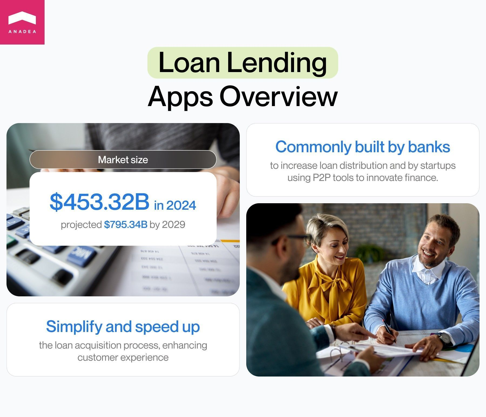
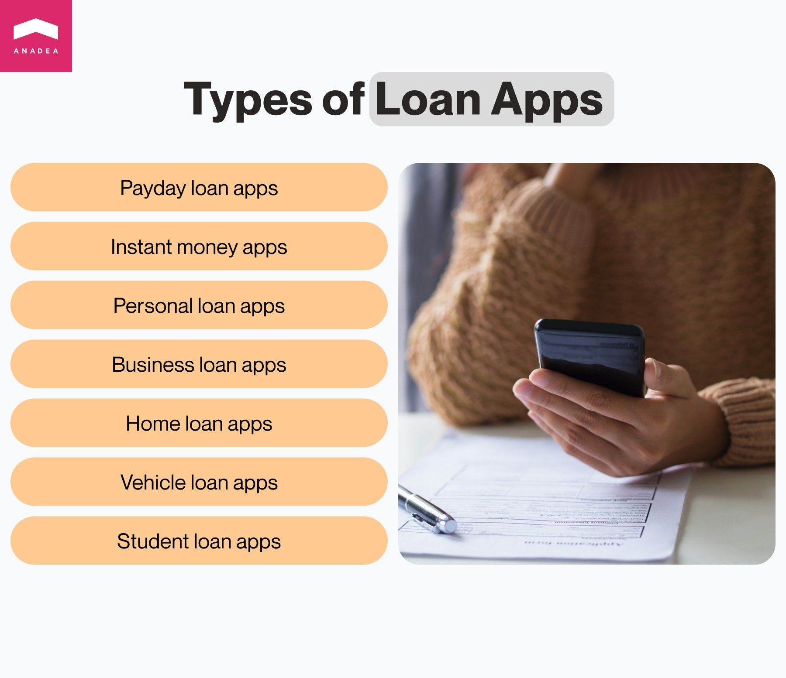
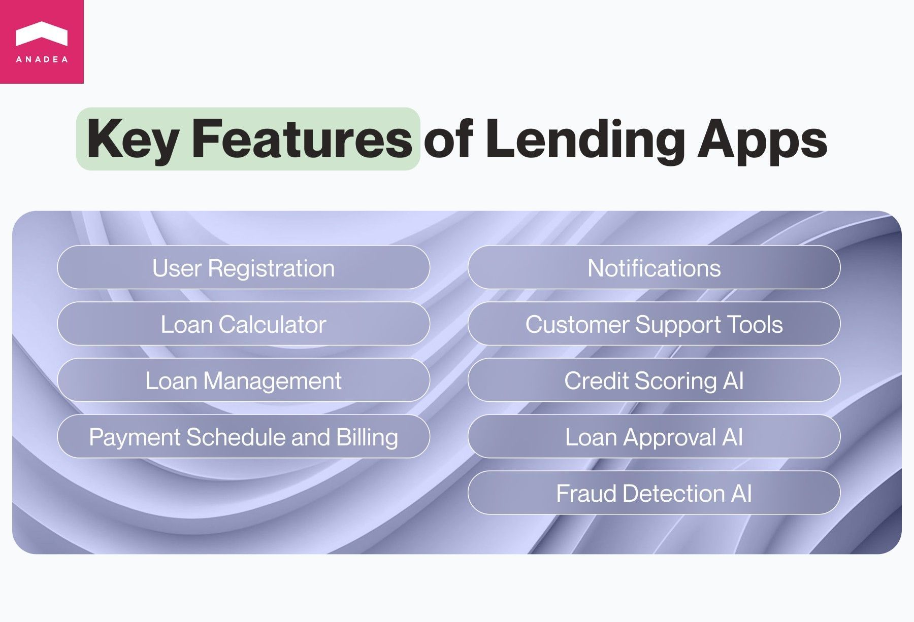
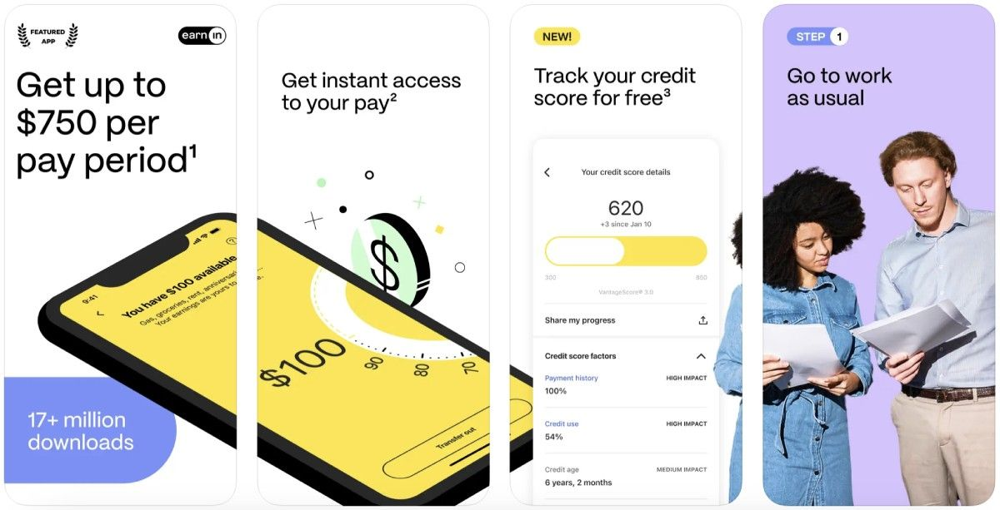
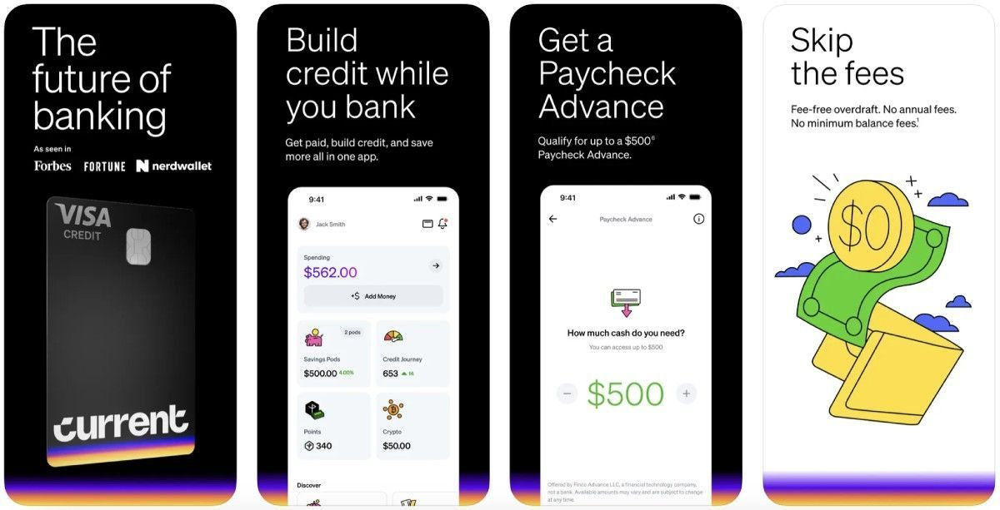
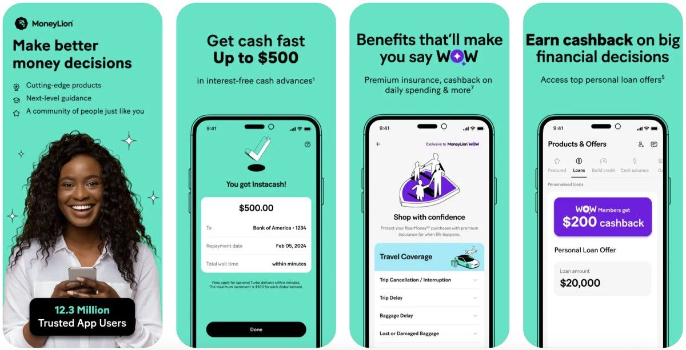
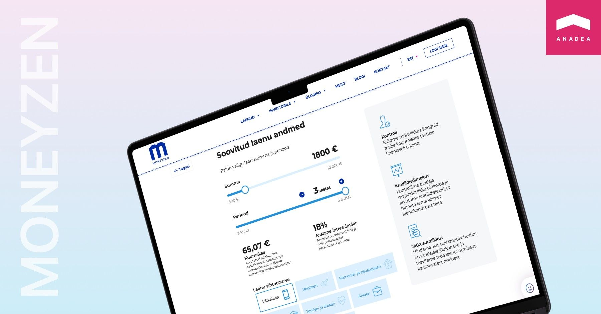

The world of finance is gradually changing under the strong influence of modern technologies. While the tech complexity of [financial software solutions](https://anadea.info/solutions/financial-software-development) is growing, the interaction with various banking and other money-related services is becoming more straightforward and convenient for users. That’s exactly what developers of such products want to achieve.

In one of our previously published blog posts, we talked about the development of [fintech apps](https://anadea.info/blog/fintech-mobile-app-development) in general. In this article, we’d like to focus on one particular category of financial software and share our insights into loan app development.

## Overview of the loan lending app market

To begin with, let’s concentrate on the concept of loan giving apps. What are they?

These applications are software products that let users borrow money or take out loans on demand practically in no time. In other words, these digital solutions act as a bridge between borrowers and lenders and provide them with a convenient platform for organizing their interaction.

The key goal of loan lending app development is to automate and streamline the processes of getting loans for customers and, consequently, enhance their experiences. Quite often money lending applications are built by banks that are interested in increasing the number of loans. But today it is also a very often case when such solutions are introduced by alternative startups that are trying to revolutionize the traditional world of finance with innovative peer-to-peer (P2P) tools.

According to the data provided by [researchers](https://www.mordorintelligence.com/industry-reports/digital-lending-market), in 2024, the digital lending market size is around $453.32 billion. The forecasts for the market are quite optimistic as by 2029, it is expected to achieve the level of $795.34 billion.

If you also have plans to create a loan app, first of all, you will need to decide on the exact type of solution that you will deliver to users.

## Types of loan lending apps

There are several approaches to categorizing these applications.

For example, it is possible to create groups based on the lender who will provide loans to users. There are:

* bank-launched apps;
* applications managed by credit unions;
* P2P apps.

But also, we can name different types of loan giving apps as per the model that lies in their foundation, as well as their purposes.

* **Payday loan apps**. These applications allow borrowers to take small amounts of money from their paychecks (wages) before receiving them. Such apps are helpful when users need to get money urgently and do not want to deal with time- and effort-consuming procedures that are typical for lending operations at traditional institutions.
* **Instant money apps.** With the help of these apps, users can get the desired amount very quickly with an obligation to repay within a short period of time. Though such applications usually do not charge extra fees for repaying in advance, they can charge users for speedy funds delivery.
* **Personal loan apps**. Such apps enable users to apply for a loan without the need to visit a bank office. Very often people take such loans to have the possibility of making a large purchase or paying huge bills.
* **Business loan apps**. These solutions are targeted mainly at startups and small businesses that need financial support for their development.
* **Home loan apps**. With these, people can apply for mortgages and further manage them.
* **Vehicle loan apps**. Such solutions are focused on the needs of those who want to buy vehicles. For providing cash to individuals, organizations behind such apps can charge an interest.
* **Student loan apps**. The target audience of such apps is people who need extra cash to cover their educational expenses.

Let's talk about your idea

## Latest trends in loan lending mobile app development

As well as any other digital solutions, loan lending apps are changed under the influence of the tech trends.

Here are a couple of trends that have the strongest impact on this kind of software today.

* **AI**. Artificial Intelligence is a promising technology that is revolutionizing a lot of domains and online lending is one of them. AI, together with Machine Learning (ML) and Natural Language Processing (NLP), can help to adjust offers to the needs of users, make interaction with them much more personalized, as well as greatly automate a lot of routine processes. Moreover, the role of AI in increasing the security of all financial procedures shouldn’t be underestimated.
* **Virtual assistants and chatbots.** These tools are aimed at providing users with practically instant assistance on loan apps in a 24/7 format. Chatbots can fully cover such tasks as answering FAQs, providing basic information about loans, comparing different options, etc. As a result, customer support managers can focus on complex questions and concerns that can’t be addressed by a chatbot. If you are eager to learn more on the topic, check out our article on [different types of chatbots](https://anadea.info/blog/different-types-of-chatbots).
* **Blockchain**. This technology is widely applied in the financial sector today as it greatly contributes to the enhancement of its security. Thanks to documenting every transaction in a unique block, it helps to avoid manipulations and data alterations after a transaction is conducted.
* **Smart contracts.** They run on blockchain and execute when certain conditions are met. With their help, it is possible to exclude the participation of intermediaries in the processes of executing agreements between parties.
* **Open banking**. This trend presupposes sharing data between various banking and financial organizations via standardized APIs. This helps lenders to better know their potential borrowers, get more accurate data for credit scoring, make better-informed lending decisions, and provide more personalized offers to customers.

## How to create a loan app: Different approaches

When it comes to loan lending mobile app development, you always have several options. You can either rely on a lending app builder or make a solution fully from scratch with the help of professional developers.

Today the market offers a wide choice of app builders that allow users to create their solutions even without coding.

On one hand, it may seem to be a great approach. On the other hand, it has a lot of pitfalls. For example, customization opportunities are quite limited as well as the scope of features and integrations that you can provide to users. There are also a lot of concerns regarding the scalability of such solutions.

That’s why if you are thinking about how to start a loan app that will evolve and expand and that will support your business growth, we recommend you opt for custom development. Even if you do not have in-house programmers with relevant skills, you can establish cooperation with an outsourcing company like Anadea that provides full-cycle development services.

Though the creation of an app from scratch will require more time and investments, it will ensure better flexibility and scalability. It means that you will be able to launch an app that will perfectly address the ongoing market needs and will meet the highest security standards.

In this case, the project realization will look the following way:

1. Market analysis and ideation;
2. Establishing cooperation with a development team;
3. Requirement gathering and planning;
4. MVP development and feedback analysis;
5. Design and development of a full-scale product;
6. QA and testing;
7. Launch;
8. Post-launch maintenance and support.

We also have an article on [how to develop a personal finance app](https://anadea.info/guides/how-to-build-a-personal-finance-app) – make sure to read it if you haven’t yet.

Contact lending app developers

## How to create a money lending app: Key features

As we always tell our customers, the set of features that will be developed for your app should depend on the tasks that your app will fulfill. Your app should be unique which means that you may need to think about some non-standard functionality for it. Nevertheless, before proceeding to loan app development, it will be helpful to analyze the most common features built for such apps.

* **User registration**. You need to ensure smooth sign-up experiences but at the same time, you need to gather the accurate data required to eliminate security risks. A straightforward registration process should be fully compliant with AML and KYC rules that are in force in your region.
* **Loan calculator.** This feature should help borrowers quickly analyze what offers are available to them in order to make the right decision.
* **Loan management.** Such tools are important for both lenders and borrowers as they help users monitor loan details, manage payment schedules, generate reports, etc.
* **Payment schedule and billing.** That’s a standard feature that will help borrowers view all the upcoming payments and plan their budgets.
* **Notifications**. This feature will allow you to maintain interaction with users and inform them not only about upcoming, due, and past installments but also about new discounts and offers on your app. Nevertheless, it is vital to make these notifications customizable so that users can choose the most comfortable format for them.
* **Customer support tools.** Online chat with a support team and/or an AI-powered chatbot will help users get all the required information about your services.

## Loan lending apps and AI

As we’ve already mentioned the use of Artificial Intelligence in loan lending app development is one of the most important trends that we can observe today. Let’s have a closer look at how this space can be transformed with the power of AI.

* **Credit scoring.** To get a credit score, it is necessary to analyze huge volumes of data, including but not limited to borrowers’ income, employment, lending history, etc. To process all this info manually is a very time-consuming task. And still, there are risks of inaccurate results. ML-powered credit scoring models can also analyze additional metrics to measure users’ creditworthiness, like further employment opportunities, potential to earn, etc. As a result, such models can boost financial inclusion and make loans available to a wider group of people.
* **Loan approval.** As well as in the case of credit scoring, all manual loan-approval tasks are highly resource-consuming. Loan officers need to collect a lot of documents and manually verify all the key information. With AI-powered tools, the authenticity of documents can be and data processing will take place automatically.
* **Fraud detection.** AI is extremely good at analyzing patterns and detecting any suspicious deviations that can be signs of illegal activities on your app. Moreover, ML and NLP can analyze such data about users as their risk parameters, fraud accidents, and previously made transactions to calculate a fraud score.

We’ve named just a couple of the most common areas of AI application. Learn more on the topic in our article on [AI in fintech market](https://anadea.info/blog/ai-in-fintech).



## Security and compliance of loan giving apps

As such solutions deal with money and sensitive personal data, it is necessary to pay special attention to their protection. If you are currently looking for answers to the question of how to create a money lending mobile app, it’s also necessary to think about such security measures as:

* Two-factor authentication;
* Data encryption;
* Secure data storage;
* Privacy policy;
* Regular updates and vulnerability monitoring.

It is also vital to analyze all the laws and regulations, including KYC and AML rules, that are applied in the finance market in the chosen jurisdictions. We strongly recommend you consider all these things in advance to take them into account already at the stages of planning and development.

## How much does it cost to build money lending applications?

One of the most important things that businesses need to consider before investing in loan lending app development is the cost of such a project. Nevertheless, it's important to understand that without knowing the details and peculiarities of your future solution, developers can name only approximate figures. On average, costs vary in the range between $40K and $100K. Nevertheless, if you plan to launch an app with a lot of complex features powered by the most innovative technologies, this amount will be higher.

There are a lot of factors that should be analyzed to make estimates:

1. The type of your app and its functionality;
2. Tech stack;
3. The number and type of desired integrations;
4. The structure of the team that will work on your project;
5. Other requirements.

If you already have some ideas for your future app, you can share them with us and you will get estimates for free.

Request estimate

## How to promote your lending app

How to build a loan app is a very important question. But even when you have a really cool solution it won’t allow you to achieve the desired results without relevant marketing efforts from your side.

First of all, you need to clearly formulate the unique selling points and benefits of your services that you will promote. Secondly, you need to understand your target groups, their interests, and preferences. This information is important to choose the right channels of promotion. For example, if you have a business loan app, probably TikTok won’t be a good choice for you but for a student loan app, it can work.

When you have formulated the key message that you want to broadcast and the possible channels for reaching your target audience, you have a high chance of attracting the attention of users to your app.

Key approaches to promoting a loan app:

* Social media marketing;
* Cooperation with influencers;
* Context ads;
* Email campaigns;
* Content marketing (blog posts on your own website, expert posts on external platforms, interviews).

## The most well-known loan lending apps

Though the market of digital lending solutions is still actively developing and growing, already now, it has some strong players that have successfully won the attention of users. Among the most popular loan lending apps, Forbes [names](https://www.forbes.com/advisor/personal-loans/best-loan-apps/) EarnIn, Current, and MoneyLion.

### EarnIn

This app allows users to get access to their earned money without the necessity to wait for a paycheck. It is possible to receive up to $100/day and up to $750/paycheck to cover various unexpected day-to-day costs. The app can send notifications when users’ bank balances run low so that they can stay on budget.

To access their pay in advance, users need just to connect their bank accounts to the app. EarnIn works with Bank of America, Wells Fargo, Chase, and other major banks. Thanks to Lightning Speed transfers, people can get money just in minutes.

### Current

This app allows users to spend, save, and manage their money in a smarter way than they are used to. It offers a Build Card which helps people safely build their credits. Credit history and checks are not required. Moreover, users can leverage such opportunities as a paycheck advance of up to $500 and a fee-free overdraft.

### MoneyLion

MoneyLion is a fintech company that provides lending, financial advisory, and investment services. The MoneyLion app functions as a hub for managing personal finances. Among the available options, we should mention low-interest loans without strict credit checks, tools for building and enhancing credit, automated investments, educational content, etc. The size of loans provided by MoneyLion can be in the range between $20 and $1,000, while annual interest rates start at 5.99%.

## Anadea’s expertise in loan app development

Our developers are experienced in building solutions for different domains, including fintech. One of the projects that we worked on was [MONEYZEN](https://anadea.info/projects/moneyzen). It is an Estonian web P2P loan and investment platform based on the principles of responsible lending. The solution is targeted at investors who can lend loans under their own conditions and borrowers who want to get money.

When the client turned to us, they already had a legacy backend and wanted to create a modern user-friendly design that would ensure straightforward interaction with their financial platform. The project at that time had issues with the lack of borrowers due to a very complicated and time-consuming registration process.

Our team had a task to solve this problem by means of simplifying the existing procedures. Our developers managed to successfully integrate the legacy software product with Estonian governmental services to automate registration for users. As a result, now borrowers need to indicate only their national ID numbers, while all other data will be added automatically.

Multiple integrations of the platform with governmental services presuppose the necessity of keeping the solution compliant with Estonian legislation. That’s why our team is continuously working on making sure that MONEYZEN fully meets the relevant regulations. Moreover, our team redesigned the investors’ interface and introduced updates to the display of statistics in the admin panel.

With all these changes, the solution became much more user-friendly and comprehensive to everyone. As a result, the client has noticed a positive impact of the work done on the growing base of investors and borrowers joining the platform.

Do you also have a plan for launching a digital loan lending solution? At Anadea, we are always ready to help you with your project realization! Just share your ideas with us and we will find the best approach to solving the set tasks!

Get in touch
