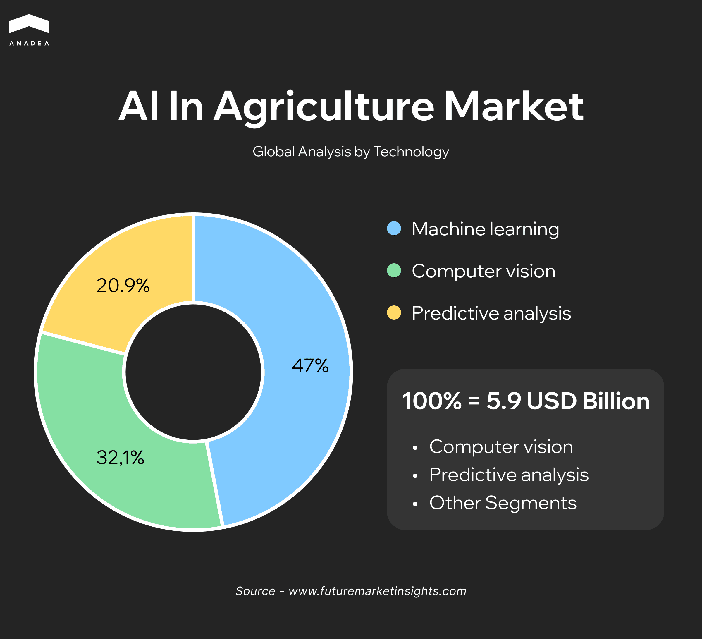
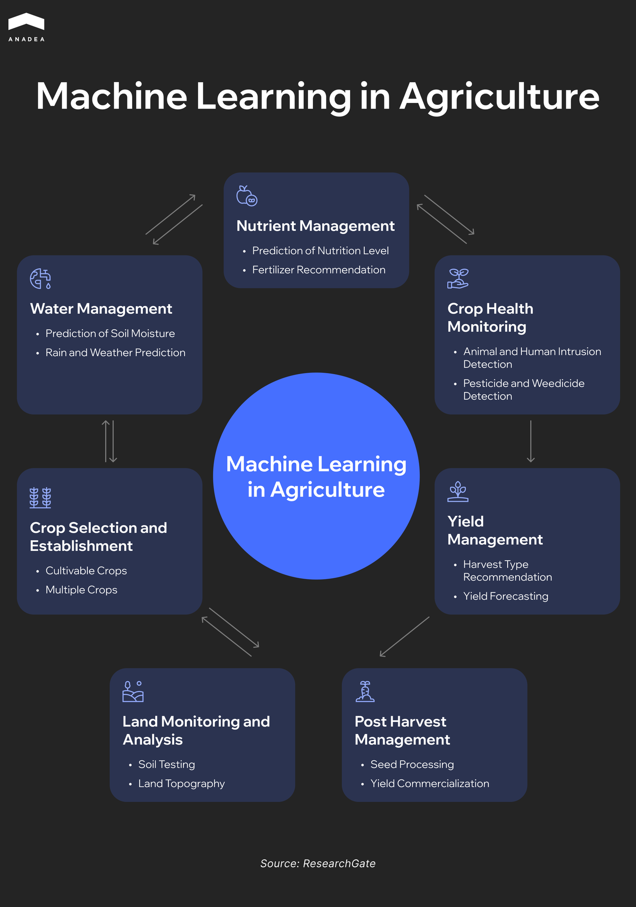
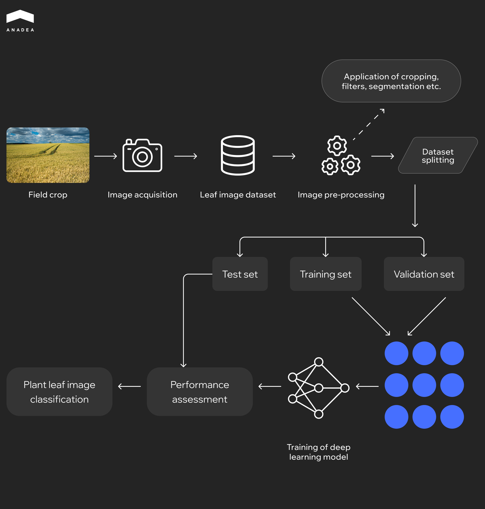

Agriculture today faces climate variability, pest outbreaks, and soil degradation. On top of that, farmers deal with labor shortages, rising input costs, and market volatility. Traditional approaches to farming have proven to be less effective in modern conditions, particularly amid growing demands for higher yields and sustainable practices.

In this context, the application of machine learning (ML) is emerging as a transformative tool, as it enables farmers to make data-driven decisions and enhances productivity. According to Farmonaut, [more than 60% of large farms](https://farmonaut.com/precision-farming/ai-agriculture-adoption-statistics-2025-key-insights) are expected to adopt AI-powered precision agriculture technologies by 2025.

In this article, we will talk about the benefits of machine learning in agriculture and explain how you can use this technology to ensure the highest results.

## The Role of Machine Learning and Precision Farming in Agriculture Today

The adoption of machine learning in agriculture is closely tied to the introduction of precision farming, which includes using data and analytics to make farming more efficient and sustainable.

Precision farming techniques that rely on ML-driven decision support and IoT sensors demonstrate strong benefits in yield gains, cost savings, and environmental impact.

The data revealed by Farmonaut shows that farmers using precision agriculture report yield [increases of 10-30% compared to conventional methods](https://farmonaut.com/precision-farming/how-does-precision-agriculture-improve-crop-yields), depending on crop and location.

Moreover, according to the estimates made by the European Parliament, precision spraying can reduce [pesticide use by up to 20-30%](https://www.europarl.europa.eu/RegData/etudes/STUD/2016/581892/EPRS_STU(2016)581892_EN.pdf).

This impact explains the growing adoption of ML systems within the agricultural sector.

As per the report by Future Market Insights Inc, the AI in agriculture market will grow from [$5.9 billion in 2025 to $61.3 billion by 2035](https://www.futuremarketinsights.com/reports/ai-in-agriculture-market). And ML is the leading segment of this market. Its share is 47%, which means that it accounts for nearly $2.77 billion in 2025.

ML techniques such as supervised and unsupervised learning drive multiple use cases, including yield estimation, crop disease recognition, and weed detection. In addition, ML enhances agricultural robotics and enables machines to perform automated weeding and harvesting. This significantly cuts labor demands and boosts productivity.

The image below shows the use cases of ML in different stages of crop cultivation. We will further take a closer look at the most popular of them.

Machine learning is reshaping the way organizations operate. It enables smarter decisions, process automation, and the discovery of new growth opportunities. Our comprehensive guide dives into practical applications and shows how businesses can leverage ML to stay competitive. To find out how your organization can benefit, you can read this guide on our blog.

## Use Cases of Machine Learning in Agriculture

One of the key benefits of machine learning in agriculture is its ability to transform farming practices by turning raw data into actionable insights. Here is how such insights can be applied in agriculture today.

### Yield Prediction Models 

These models forecast crop yields ahead of harvest. This data helps farmers plan inputs, labor, storage, and sales.

To make such predictions, ML needs to rely on:

* historical yield data;
* soil parameters (moisture, nutrient levels);
* weather patterns (rainfall, temperature);
* satellite/drone imagery;
* planting density metrics.

The more diversified and high-quality data is used, the higher the accuracy of such yield predictions will be.

A study conducted by researchers at the University of Illinois [utilized ML algorithms to predict corn and soybean yields](https://www.mdpi.com/2076-3417/15/13/7216) in the Midwest United States. The model integrated data from satellite imagery, soil sensors, weather forecasts, and other sources, and managed to improve the accuracy of yield forecasts compared to traditional methods.

### Crop Disease Detection 

That’s an example of using computer vision and machine learning in agriculture. These systems process images from drones, satellites, or smartphones and detect early disease signs, including leaf spots, fungal infections, etc. This enables quick intervention before the spread. Thanks to the implementation of crop disease detection tools, it is possible to reduce crop loss, lower pesticide use, and ensure resource savings and better yield stability.

As a rule, such models are trained on high-resolution images, annotated disease symptoms, and ground-truth labeling by experts.

Here’s how disease detection tools powered by ML and computer vision typically work.

Researchers at Penn State University developed a smartphone application that employs ML to [diagnose cassava diseases with 93% accuracy](https://pure.psu.edu/en/publications/deep-learning-for-image-based-cassava-disease-detection). The app analyzes images of cassava leaves to identify symptoms of diseases such as cassava mosaic disease and cassava brown streak disease.

### Smart Irrigation Scheduling

Such systems combine data received from soil moisture sensors, weather forecasts, evapotranspiration models, historical water usage, and other parameters to optimize when and how much to water plants.

The startup CropX has developed an ML-based irrigation system that uses soil moisture sensors and weather data to optimize watering schedules for crops. According to the startup, its system can [reduce irrigation water by up to 50%](https://cropx.com/product-updates/) and, at the same time, improve the productivity of the fields. 

### Weed Detection and Variable-Rate Spraying

ML-based image models can detect weeds among crop plants. Thanks to this, sprayers can adjust application rates only where weeds are found. This helps farmers reduce chemical and herbicide usage, decrease environmental impact, ensure labor cost savings, and minimize wasted sprays. 

Solutions of this type use images from ground cameras or drones, maps of weed density, and GPS data for sprayer paths.

A project in Australia employed ML algorithms to [analyze drone-captured images](https://www.mdpi.com/2077-0472/11/5/387) for early weed detection in farms. The system achieved a precision rate of 92% in identifying weed presence. This helps ensure highly targeted herbicide application.

### Harvest Grading and Sorting Automation

Computer vision and machine learning in agriculture can be used to automate the sorting of harvested crops by quality, size, defect presence, and other parameters. It can be done in-line during harvesting or post-harvest.

To achieve the desired results, these models should be trained on images of produce and quality labels (size, color, defects). Sometimes such solutions are also enriched with weight and texture sensors.

This machine learning application in agriculture helps increase consistency and speed in grading, as well as optimize labor costs and minimize post-harvest waste.

In India, the application of an automated sorting system for vegetables and fruits helps decrease [post-harvest losses by 15%](https://www.sciencedirect.com/science/article/pii/S2666188825008470#bib0054). The system, powered by machine learning and computer vision, ensures consistent quality and reduces labor costs.



## Remote Sensing and Drones: When to Use What

As you can see, machine learning application in agriculture require different types of data and images that can be received either from satellites (remote sensing) or drones. Both types of imagery play an important role in smart farming, but they serve various purposes and should be chosen based on the scale and format of analysis required.

Satellite imagery (from missions like Sentinel-2 and Landsat) is free to access. The received images provide a broad view of fields at 10-30 meter resolution. With their help, farmers can track crop health, detect variability, and monitor changes over time. 

However, the resolution of such images is not fine enough for plant-level monitoring, while the updates are typically available on a weekly basis.

Drone imagery can address these problems. It offers centimeter-level resolution. That’s why, if your goal is to diagnose localized issues such as weed infestations or water stress, it will be a better choice. The use of drones adds extra responsibilities and tasks, such as flight planning, imagery capturing, and post-processing. Nevertheless, the benefits are tangible: the received data helps ensure precise application maps and targeted interventions.

The table below demonstrates the key differences between satellite and drone imagery.

<table>

<tbody>

<tr>

<td>

<strong>Aspect</strong>

</td>

<td>

<strong>Satellite imagery&nbsp;</strong>

</td>

<td>

<strong>Drone imagery</strong>

</td>

</tr>

<tr>

<td>

Cost

</td>

<td>

Free (public missions)

</td>

<td>

Moderate to high (equipment, flight time, processing)

</td>

</tr>

<tr>

<td>

Resolution

</td>

<td>

Field-level insights

</td>

<td>

Plant-level details

</td>

</tr>

<tr>

<td>

Frequency of updates

</td>

<td>

5&ndash;10 days

</td>

<td>

On-demand

</td>

</tr>

<tr>

<td>

Use cases

</td>

<td>

Monitoring of large areas, variability mapping

</td>

<td>

Diagnosing weeds and disease, creation of variable-rate spray and fertilizer maps

</td>

</tr>

<tr>

<td>

Limitations

</td>

<td>

Lower detail, dependent on satellite pass and weather

</td>

<td>

Requires equipment, operator skills, and post-processing

</td>

</tr>

</tbody>

</table>

## ML in Agriculture: Common Pitfalls and How to Avoid Them

The use of machine learning in agriculture offers powerful opportunities. But its implementation is associated with potential risks and challenges. Based on our practical experience in [ML software development](https://anadea.info/services/machine-learning-software-development), we have prepared a list of the common pitfalls and practical ways to prevent them.

### Limited or Poor-Quality Training Data

This challenge is not unique to agriculture. It is typical for any industry where ML solutions are in use. The quality of data is the key condition for the correct functioning of ML-driven systems.

Training ML models for agriculture on data from just one season or location reduces the model’s ability to generalize. Apart from this, ignoring class imbalance or using inaccurate ground truth data may lead to biased results.

To avoid such issues, you should gather diverse datasets across multiple regions and seasons and apply techniques to balance the dataset. Here are some examples of such techniques:

* **Oversampling minority classes**. It involves duplicating underrepresented examples (for example, diseased crop images).
* **Undersampling the majority classes**. In this case, it is necessary to reduce the number of overrepresented examples, like healthy crop images, to avoid bias.
* **Synthetic data generation**. This approach includes creating new, artificial examples when real-world samples are limited. You can rely on image augmentation techniques (rotating, flipping, or adjusting brightness in crop photos). This may be required to produce realistic variations of diseased plants. Another approach is SMOTE (Synthetic Minority Oversampling Technique), which generates additional samples of underrepresented classes instead of duplicating existing ones. New data points are created thanks to interpolating existing minority-class examples.

### Over-Automation Without Oversight

AI and ML-driven systems can automate a lot of routine tasks and reduce the workload for a farm’s employees. However, relying solely on algorithms without human review can be risky. ML models can produce impractical or misleading recommendations. Moreover, they can skip economic factors. As a result, they may make decisions that will not be feasible for farmers.

It is vital not to exclude farmers and agronomists from the loop. They should carefully validate outputs and weigh predictions against economic feasibility.

### Ignoring Model Drift

Farms work in dynamic conditions. Weather, pests, soil health, humidity, and other important factors change over time. Without regular retraining, models gradually lose accuracy.

When implementing machine learning in agriculture, it is crucial to establish a schedule for monitoring model performance and retraining with new data. Timely updates often make a big difference in model performance.

## Wrapping Up

The importance of machine learning in agriculture is continuously growing as this technology can offer powerful tools for both productivity and sustainability. ML is often applied to support decision-making apps and advisory systems. These solutions are helping farms of all sizes make more precise, data-driven decisions and reduce waste.

At Anadea, we have been delivering advanced AI and ML-driven solutions tailored to specific business needs since 2019 and have solid expertise across multiple domains. Our goal is to create tools that will precisely address your pain points and unlock new opportunities for boosting the productivity and profitability of your business. To learn more about our services and approaches to ML development, don’t hesitate t[o contact our team](https://anadea.info/free-project-estimate).
