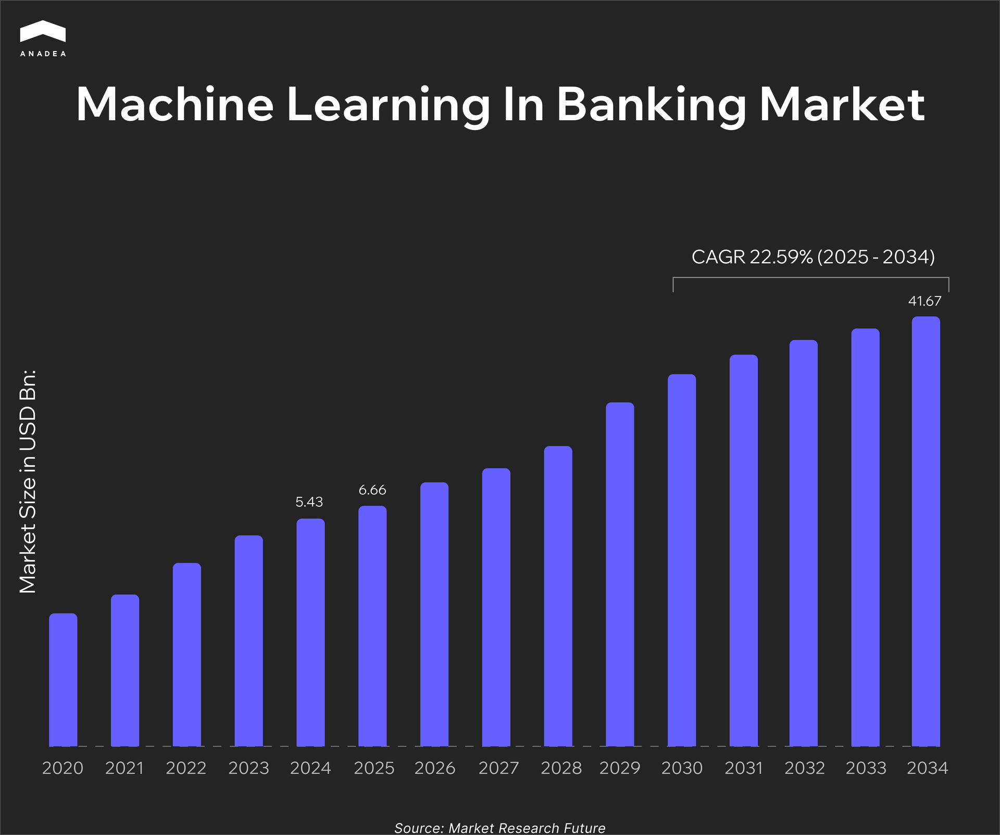

Traditional loan approval processes can take weeks. According to [McKinsey & Company](https://www.mckinsey.com/capabilities/risk-and-resilience/our-insights/the-lending-revolution-how-digital-credit-is-changing-banks-from-the-inside), “time to decision” for corporate loans in traditional systems can reach up to 5 weeks, which is an unacceptably long timeframe in the dynamic business world. ML-driven automation can reduce the time required for such decisions to hours and even minutes. 

But it is not the only valuable application of machine learning in banking. Machine learning fraud detection systems can help banks save billions of dollars, while recommendation solutions can ensure high personalization of customer experience.

In this article, we invite you to explore the value of ML for banking institutions and key use cases where this technology has already proven its efficiency.

## The Role of Machine Learning in Banking Sector

According to the [Market Research Future report](https://www.marketresearchfuture.com/reports/machine-learning-in-banking-market-33033), in 2025, the estimated size of the machine learning in banking market was $6.66 billion. Analysts expect that by 2034, it will hit $41.67 billion. These numbers reflect a CAGR of 22.59% during the period from 2025 to 2034.

The market growth is driven by the banks’ desire to reduce operational costs and enhance risk management. But apart from it, another important booster for the market is a strong demand for personalization of interactions with clients.

In 2024, the [eMarketer survey](https://www.emarketer.com/content/banking-customers-want-more-personalization-understand-ai) revealed that 74% of customers in the US expect to get more personal banking experiences, which marks a clear area for improvement. This goal can be achieved with ML-driven tools designed to analyze a wide pool of customer-related data and provide tailored interactions.

Let’s take a closer look at the benefits of using ML in banking.

* **Reduced risks**. ML models excel at detecting fraud and identifying anomalous patterns in real time. Machine learning tools help spot potential threats at the earliest stages. This enables banks to lower fraud losses and ensure regulatory compliance.
* **Higher revenue**. Predictive pricing and elasticity models allow banks to introduce risk-based pricing. This method optimizes net interest margins (NIM) without compromising fair lending practices. Moreover, ML-powered next-best-action recommendations drive cross-selling and upselling. This can encourage existing clients to buy additional products and services, which unlocks new revenue streams for banking organizations.
* **Cost optimization**. ML is one of the key technologies that power the automation of manual processes related to document verification, onboarding, and transaction monitoring. Automation tools help significantly reduce operational costs and minimize errors caused by the human factor. With such solutions, banks can deal with higher volumes of requests and tasks with the same resources. Meanwhile, employees can focus on higher-value tasks.
* **Enhanced customer experience**. Machine learning in banking and finance enables personalized engagement at scale. Churn prediction, product suggestions, and tailored interactions are among the most important factors for increasing customer satisfaction and loyalty.

## ML in Banking: Data as a Cornerstone

The performance of any ML-driven solution in any domain heavily depends on the quality, volume, and diversity of data that models have for learning. Messy or incomplete input data can lead to poor and biased decisions in risk management, customer churn, and even regulatory issues.

Our team has been working in the [banking app development ](https://anadea.info/blog/mobile-banking-app-development/)market for more than 25 years. This has allowed us to accumulate unique knowledge and a deep understanding of how banking processes are organized. Based on our experience, we have created a list of requirements for the data that you should prepare before building and training your future ML-driven tool.

These are the data categories that are typically used for building ML models for banking and finance. Altogether, this data helps banks get a full picture of customers’ financial habits and behavior.

* Core banking data (deposits, loans, overdrafts, repayment history);
* Payments and cards (transaction details, frequency of payments, key purchase categories, etc.);
* Customer relationship data (CRM records, contact center interactions, feedback history);
* Credit bureau reports (third-party scores and trade line data);
* KYC/AML data (customer verification, sanctions screening, suspicious activity indicators);
* Device and behavioral data (login patterns, typing cadence, geolocation, device fingerprints);
* [Open banking](https://anadea.info/blog/open-finance-vs-open-banking/) feeds (external account balances and transactions).

The used data should be fresh and complete. Otherwise, even the most advanced models won’t demonstrate the expected performance. 

Apart from this, you need to take care of the data security and compliance. 

* Always tokenize and encrypt sensitive data.
* Ensure its traceability back to the source. It is vital for audit purposes.
* Don’t forget to ask for users’ consent when it comes to data collection and processing, especially when it comes to open banking and behavioral data.

## Machine Learning Use Cases in Banking

If you are considering the transformation of your workflows, it’s vital to choose such an application of machine learning in banking that will bring the highest value for employees and customers. Here are some ML use cases that have already proven their efficiency.

### Credit Risk and Underwriting

ML models can enhance and streamline loan approval processes. It is possible thanks to improving risk prediction and automating the reject inference. To make decisions, ML tools incorporate data such as transaction histories, behavioral patterns, and information from alternative sources, like rent and utility payments. Well-trained models are good at separating reliable from unreliable borrowers, which boosts approval rates and helps reduce loss rates.

The problem of traditional credit scoring remains pressing, as millions of consumers remain credit-invisible. Such people do not have credit histories that can be analyzed by traditional scoring solutions. For example, according to [TransUnion estimates](https://newsroom.transunion.co.za/new-telco-powered-credit-score-set-to-transform-access-to-finance-for-millions-of-south-africans/), over 16 million adults in South Africa are left outside the formal credit system. Thanks to working with non-traditional datasets, they make credits available to a significantly wider audience of adult consumers.

### Fraud Detection and AML/Transaction Monitoring

Today, banks can apply near real-time scoring and network-based features to flag suspicious behavior. ML-driven alert triage significantly bolsters Suspicious Activity Report (SAR) efficiency.

[Danske Bank ](https://ai.business/case-studies/enhancing-fraud-detection-through-ai-a-danske-bank-journey)is one of those financial institutions that have introduced AI and ML-powered tools for fraud detection. Before the implementation of a new solution, the bank’s fraud detection rate was 40%, which is a very low level. The daily number of false positives was 1,200, and 99.5% of the detected cases were not related to any fraudulent activities.

The introduced AI fraud detection platform relies on AI to process thousands of various traits and analyze millions of banking transactions in real time. It helped the bank reduce false positives by 60% and increase true positives by 50%.

### Customer Retention and Next-Best-Action

Banks deploy churn propensity and uplift/treatment effect models to detect at-risk customers and tailor their outreach. For example, based on the customer's needs, they can offer cross-selling deposits, loans, or cards. ML-driven recommendations boost customer lifetime value.

As the [Bain & Company research ](https://hbr.org/2014/10/the-value-of-keeping-the-right-customers)revealed, even a 5% churn reduction can ensure a 25-95% increase in profits. According to [various case studies](https://www.gnani.ai/resources/blogs/customer-retention-in-banking-winning-back-lost-customers/), the use of AI tools, including ML recommendation systems, can ensure a significant reduction (of around 18%) in customer attrition and up to 25% improvement in retention of high-value customers.

### Collections and Recovery Optimization

ML models can forecast roll-rates and promise-to-pay likelihood. This enables banks to introduce optimized collection strategies, prioritize high-value accounts, and improve recovery rates.

The use of ML-powered tools, like CreditNirvana products, can ensure a[ 7% increase](https://www.creditnirvana.ai/case-studies/debt-collections-made-easy-by-leveraging-ai-ml-technology/) in overall funds collected, 18% improved normalization of delinquent accounts, and 36% reduction in annual collection expenses.

### Pricing and Margin Optimization

Elasticity models powered by ML allow risk-based pricing and ensure fair lending while optimizing net interest margins (NIM). Banks can dynamically adapt pricing based on predicted risk and competitive factors. 

### Operations and Onboarding Automation

Machine learning tools can be applied for various use cases, including classifying documents, extracting critical data, and verifying identity. All this can be done just in seconds, which is much faster than it used to be when banks relied solely on manual efforts. Moreover, automation of such processes significantly reduces the risk of errors.

## Build or Buy ML Banking Software?

One of the biggest strategic decisions that banks need to make before implementing ML in their processes is whether to build custom tools or to buy ready-to-use solutions. The right choice should mainly depend on the use case and the potential feasibility of software development.

The introduction of vendor solutions can significantly reduce time-to-market and ensure compliance, especially in those systems that require access to broad datasets (like global sanctions and watchlists).

That’s why quite often banks buy tools for:

* Identity verification;
* Device fingerprinting;
* Sanctions screening;
* Document optical character recognition (OCR) and extraction.

Nevertheless, there are a lot of areas where banks can gain a competitive edge by developing custom ML tools. These are use cases where proprietary data and deep domain knowledge can guarantee better results than any off-the-shelf solutions. For example, the range of such areas includes:

* Credit scoring;
* Pricing models;
* Proprietary fraud signals;
* Customer propensity and next-best-action.

To build really impactful and efficient solutions, you need to cooperate with specialists who have relevant expertise in ML and [fintech software development](https://anadea.info/solutions/fintech-software-development). If you don’t have such developers in-house and you are not going to expand your staff, the best approach will be to establish cooperation with an outsourcing software development company.



## Machine Learning in Banking and Finance: Compliance and Governance

Banking is one of the most highly regulated industries. That’s why when you are deploying machine learning in private banking or public institutions, you should take care not only about performance, but also about staying compliant. Strong governance is a must to ensure your ML models stay aligned with global regulatory expectations.

Regulators in different regions set high standards for model governance. In the US, principles for model risk management are defined by the [Federal Reserve’s SR 11-7](https://www.federalreserve.gov/supervisionreg/srletters/sr1107.htm).

The European Central Bank has similar expectations around validation and accountability of ML models.  In July 2025, it published the revised [guide to internal models](https://www.bankingsupervision.europa.eu/ecb/pub/pdf/ssm.supervisory_guide202507.en.pdf?4460c67ecb5d677bacabc2e19942912f). The document includes clarifications for the use of ML techniques in internal models and is aimed at helping organizations streamline the introduction of such tools in their processes.

Apart from banking-specific rules, there are also AI-focused frameworks, such as the [NIST AI Risk Management Framework](https://www.nist.gov/itl/ai-risk-management-framework) and [ISO/IEC 23894](https://www.iso.org/standard/77304.html). They are positioned as global references for managing AI/ML risks across the industries.

It’s vital to highlight that, according to the [EU AI Act](https://artificialintelligenceact.eu/), credit scoring is a “high-risk” use case. It is not prohibited, but it requires enhanced transparency, documentation, and human oversight. For banks operating in Europe, this will mean greater scrutiny on how credit models are trained and explained to consumers.

Moreover, the use of ML tools should also be governed by fair lending laws and privacy regulations (like GDPR and CCPA).

### Practical Tips on How to Ensure Compliance and Ethical Use of Your ML Banking Software

* Conduct pre-deployment bias testing to identify discriminatory patterns.
* Regularly revalidate your models (as their accuracy may decrease over time).
* Validate performance across different customer subgroups (age bands, geographies, and product lines).
* Maintain one or more challenger models in shadow mode to continuously benchmark production models.
* Store model lineage artifacts (data, feature definitions, training code, hyperparameters).
* Keep versioned documentation for each model iteration, including fairness and performance reports.
* Ensure model explainability. Integrate SHAP or LIME explanations directly into case-management tools for underwriters and investigators.

## Final Word

ML in banking has already proven that it can cut costs, reduce risk, streamline operations, and boost revenue. But what is also important is that the use of this technology can reshape customer experiences in this sector. Instant loan approvals, tailored recommendations, and faster transaction processing are just some of the new possibilities.

However, the implementation of machine learning in banking is also tied to new responsibilities. Banks must ensure that models are compliant with evolving regulations and can ensure privacy and fair treatment for all social groups.

If you are planning to introduce a banking ML-driven solution and need professional assistance in its development and deployment, [contact us](https://anadea.info/free-project-estimate). At Anadea, we have the relevant experience and skills to design, build, and scale machine learning systems that deliver measurable business impact.
