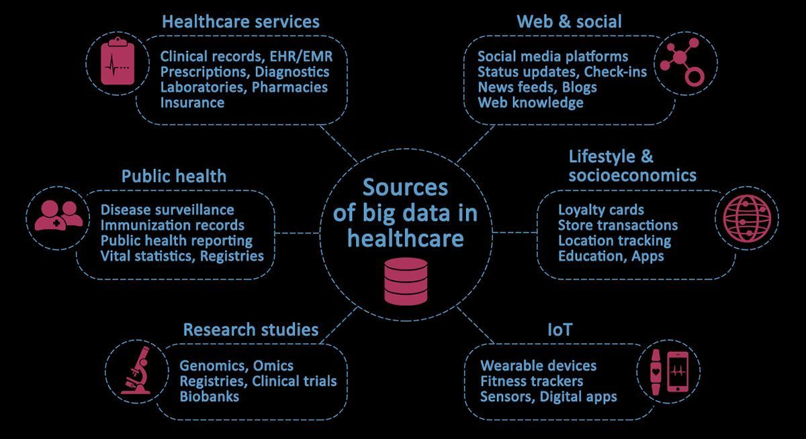

According to McKinsey, the U.S. healthcare system generates over 1 trillion gigabytes of data every year. An incredible volume, even in a world that produces more data annually than we have managed in the course of Human history.

Big data in healthcare is multifaceted, noisy, and dynamic. Almost every interaction, such as a doctor ordering medicine on behalf of a patient, or a receptionist booking an appointment, or an insurance company receiving updates from patients and providers following the completion of treatment, generates data. Vast quantities of it.

Besides clinical notes, medical records and insurance claims, there are other less tangible sources of health-related information, such as data from wearable devices, fitness trackers and social media. Some of this data may be chaotic and unstructured. However, within this diversity lies a tremendous opportunity for deriving new clinical insights based on a much broader set of data.

This graph provides an overview of the major sources of big data in healthcare:

Dr. Eric Schadt, the founding director of the Icahn Institute for Genomics and Multiscale Biology at New York’s Mount Sinai Health System, said in an <a href="https://www.mckinsey.com/industries/life-sciences/our-insights/the-role-of-big-data-in-medicine" target="_blank">interview with McKinsey Sastry Chilukuri</a>:

> The role of big data in medicine is one where we can build better health profiles and better predictive models around individual patients so that we can better diagnose and treat disease.

## Can machine learning unlock the potential of big data?

<a href="https://anadea.info/solutions/machine-learning-software-development" target="_blank">Machine learning solutions</a> can help in unlocking the transformative potential of big data, although probably not as quickly as many would hope.

<a href="https://www.gartner.com/smarterwithgartner/top-trends-on-the-gartner-hype-cycle-for-artificial-intelligence-2019" target="_blank">Gartner</a> suggests excitement around the potential of AI and machine learning (ML) has reached “peak hype.”

Source: <a href="https://www.gartner.com/smarterwithgartner/top-trends-on-the-gartner-hype-cycle-for-artificial-intelligence-2019" rel="nofollow" target="_blank">Gartner</a>

That doesn't mean it’s all hype. Far from it. The potential of big data and machine learning is being proven across dozens of sectors. It simply means those investing in machine learning and big data projects need to be aware that it can, often depending on the state of your data and what you hope to do with it, take longer to realize than the hype suggests at times.

As <a href="https://www.mckinsey.com/industries/life-sciences/our-insights/machine-learning-and-therapeutics-2-0-avoiding-hype-realizing-potential" target="_blank">McKinsey points out</a>, early successes applying machine learning in other industries may not readily translate when attempting to scale machine learning in healthcare. The article goes onto say that “Health—specifically, the understanding of diseases and treatments—is fundamentally different from other areas where machine learning has been used.”

## How machine learning is creating new value in healthcare?

### 1. Supporting disease diagnosis

Tired, overworked doctors make mistakes.

There can be no doubt that an aging population, coupled with overworked caseloads and a shortage of funding in many countries has a negative impact on medical professionals’ ability to diagnose patients successfully.

Machine learning algorithms, when they've been immersed in the topic (analyzed enough data) sufficiently, can help doctors in producing more accurate diagnoses. However, one area that can’t be stressed enough is data quality needs to be strong enough to unlock any value in the data.

Too often, data scientists spend considerably more time cleaning data up before it can be put to good use. ML algorithms, no matter how sophisticated, can’t fix poor quality data.

For example, in an <a href="https://www.spiegel.de/international/world/playing-doctor-with-watson-medical-applications-expose-current-limits-of-ai-a-1221543.html" target="_blank">experiment held at university hospitals in Germany</a>, clinical-practice guidelines were omitted. As a result, a machine learning algorithm suggested that respiratory infections caused most chest pains, completely overlooking cardiac causes. This is of course not correct, and it shows that the inputs in any big data or machine learning project need to be of sufficiently strong quality to produce the outcomes healthcare companies need.

### 2. Reducing administrative burdens on physicians

For every hour a physician spends with a patient, they spend another hour doing admin and paperwork. This admin time contributes to the 80% of data in the healthcare system that is unstructured, containing an enormous amount of potential value.

As doctors start using more ML-powered transcription services, note summary apps, auto-documentation and other systems that integrate with EHRs, it will save them valuable time they can spend with patients. Not only would this increase the number of patients that doctors can see, it will also increase billable time.

Another benefit is when data is input in a more usable format, it will prove more useful for big data and machine learning projects, making it easier for healthcare providers to extract value.

### 3. Optimizing risk in health insurance

Machine learning algorithms are more effective at assessing and adjusting for risk and other factors. When the data inputs are organized the right way, machine learning is being used in healthcare and health insurance to more effectively assess and plan for patient risk and the possibility that a patient will need ongoing treatments.

## Machine Learning applications in 2021

* Medical imaging. Object detection and image recognition are used in Computed tomography and Magnetic resonance for disease detection and prediction. Deep learning models can generate practical interpretations such as tissue shape, size, and volume. Those models can be used for the early detection of Alzheimer’s and diabetic nephropathy.

* Drug discovery and manufacturing. Integration of machine learning into drug discovery and manufacturing has simplified the estimation of a drug’s success rate based on biological factors. Pharmaceutical companies began using machine learning for the advancement of precision medicine, allowing doctors to identify mechanisms for multifactorial diseases.

* Patient healthcare and data analysis. Deep learning models can analyze structured and unstructured data that includes everything from laboratory tests to medications at faster speed and with better accuracy. Furthermore, smartphones and wearable devices reveal data about behavior and lifestyle. These devices can transform data with the help of mobile apps to monitor risk factors about deep learning models.

## Bridging gaps

With the right technology and applications, healthcare providers can make enormous gains from the big data they can access and use. Projects need to start with the right level of appreciation and understanding for how to unlock the value contained within data sources, and how to prepare data for machine learning projects.
