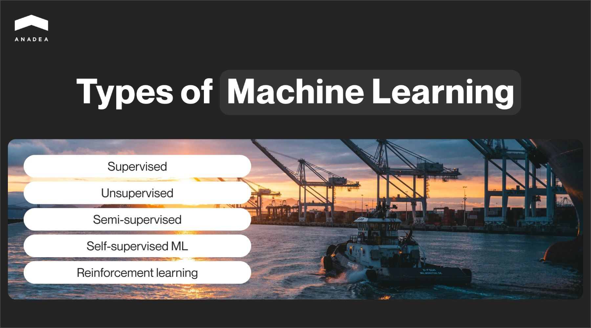
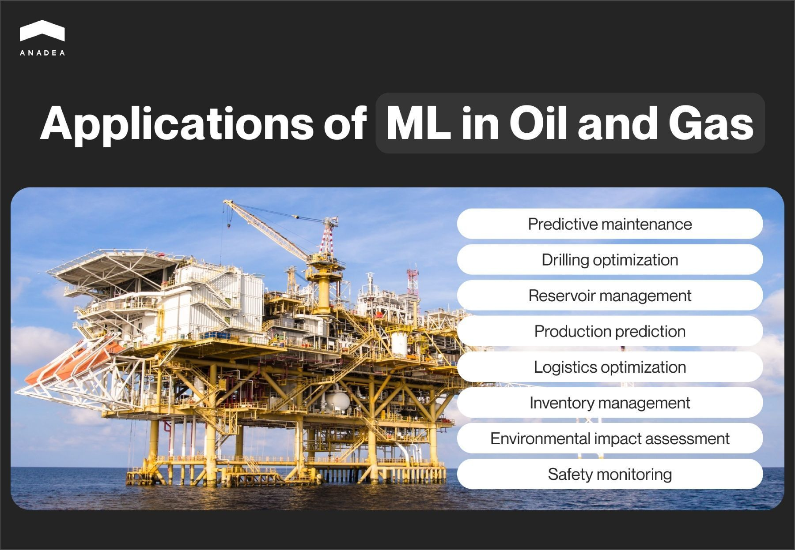
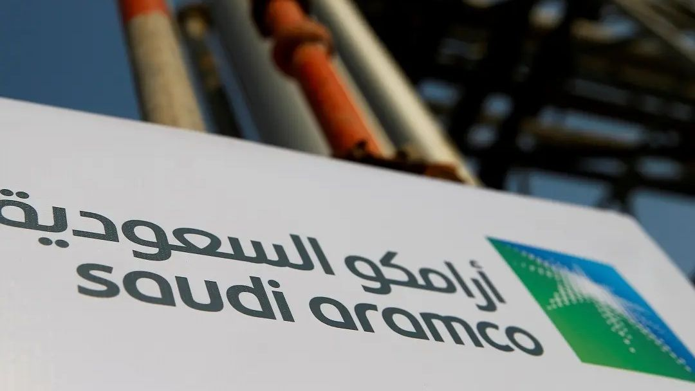
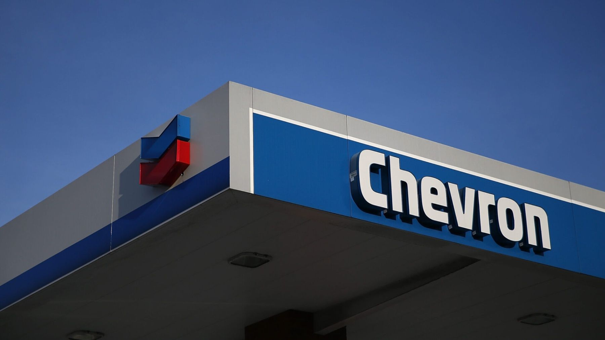

These days, artificial intelligence (AI) and machine learning (ML) are considered among the most powerful technologies in transforming the world around us. The capacities of artificial intelligence, machine learning, and all the related tools are being actively explored now and a lot of experts strongly believe that their real potential for many domains is still undiscovered. In this article, we are going to talk about the value of machine learning for [oil and gas industry](https://anadea.info/solutions/oil-and-gas-software) and focus on real-life use cases of this technology.

## Artificial Intelligence vs Machine Learning

Sometimes, the terms AI and ML are used practically interchangeably, especially in the context of predictive analytics or data processing. And such a trend is absolutely explicable. These technologies are closely related but they are not just the same.

AI is a broad notion related to the application of technologies for creating machines and programs that can mimic human cognitive functions. For example, they can understand written or spoken language, respond to it, analyze information, etc.

Artificial intelligence is a set of technologies that allow systems to learn and perform various actions. For example, you can read about artificial intelligence use cases in oil and gas in [one of our blog articles](https://anadea.info/blog/artificial-intelligence-in-oil-and-gas).

Machine learning is a subset of AI. It lets machines and programs learn and enhance their abilities from gained experience. Thanks to this, the performance of ML-powered solutions improves over time.

To analyze data and make decisions, ML relies on specifically written algorithms. ML models are the result of what the solution has learned from the training data. The better and more consistent data is used, the better the results will be.

<table>
 <tr>
        <th></th>
        <th>Artificial Intelligence</th>
        <th>Machine Learning</th>
    </tr>
    <tr>
        <td>Description</td>
        <td>With AI, machines can mimic human intelligence to address the set tasks.</td>
        <td>With ML, machines can automatically learn from data and experience.</td>
    </tr>
    <tr>
        <td>Scope</td>
        <td>The scope of AI use cases is wide.</td>
        <td>The scope of ML applications is limited.</td>
    </tr>
    <tr>
        <td>Data Types</td>
        <td>AI can work with structured, semi-structured, and unstructured data.</td>
        <td>ML can work only with structured and semi-structured data.</td>
    </tr>
    <tr>
        <td>Methodology</td>
        <td>AI-powered solutions rely on logic and decision trees.</td>
        <td>ML systems rely on statistical models.</td>
    </tr>
</table>

As you can understand from our explanation, artificial intelligence is the broader concept, while machine learning is a branch of AI.



## Types of machine learning

Before proceeding to the discussion of ML use cases in the context of the application of artificial intelligence in oil and gas industry, we need to have a closer look at machine learning itself.

There are several [categories](https://www.ibm.com/blog/machine-learning-types/) of ML algorithms.

1. **Supervised ML.** This type presupposes that models are trained on well-labeled data. It means that in the process of training, engineers need to provide ML models with both input data and a correct output value. Supervised machine learning for oil and gas can be used for image classification, risk assessment, fraud detection, etc.
2. **Unsupervised ML**. In real life, there are a lot of situations when it is impossible to have labeled data for ML model training. As there isn’t any training dataset, models will find hidden patterns and valuable insights from the provided data. Such models can be applied for solutions intended for dealing with more complex tasks if compared to supervised ML models.
3. **Semi-supervised ML**. This model is a combination of the two above-mentioned ones. In this case, there will be a mixture of both labeled and unlabeled data used for training. This ML type is especially helpful when it is too expensive or time-consuming to get labeled data, but there is an abundance of unlabeled data available. Semi-supervised ML can improve their performance and generalization by leveraging the insights from unlabeled data in comparison to those situations when only labeled data is provided.
4. **Self-supervised ML**. As you can guess from the name of this category, such models can learn to predict part of its input from other parts. In other words, in such cases, they do not need to rely on any labeled data. Self-supervised ML can automatically generate labels and transform unsupervised problems into supervised ones. This process is also known as pretext or predictive learning. This ML type is often applied for computer vision and NLP systems when the volume of labeled data for training is exceptionally large.
5. **Reinforcement learning**. ML models can be also trained using a system of reward and punishment. It means that a model takes actions (provides some output), receives feedback in the form of rewards, and aims to maximize the cumulative reward over time. For reinforcement learning, it is not necessary to use any labeled input/output pairs. ML will learn from the consequences of its actions.

As you can see, all these types of ML models presuppose different approaches to model training which can be helpful for various tasks and projects.

Contact AI experts

## Machine learning use cases in oil and gas industry

The number of ML-powered systems and tools for the oil and gas industry is continuously growing, boosted by all the benefits they bring to companies. Machine learning, especially in combination with other advanced technologies, helps businesses to reduce costs, optimize their processes, and enhance safety for their employees.

Below you can find a list of the machine learning use cases in oil and gas that brightly demonstrate the positive impact of ML on such companies.

* **Predictive maintenance**. ML algorithms are trained to process and analyze data received from the sensors installed on machinery to identify unusual patterns in equipment behavior. This helps to predict failures before they occur. As a result, it is possible to reduce downtime and maintenance costs. This ML application can be also observed in the implementation of [digital twins in the oil and gas industry](https://anadea.info/blog/digital-twins-in-oil-and-gas).
* **Drilling optimization**. ML helps to predict the lifespan and efficiency of drill bits based on operational data. With such tools at their disposal, companies can optimize drilling parameters and reduce non-productive time.
* **Reservoir management.** ML can be used to interpret geological data, improve the understanding of subsurface formations, and enhance reservoir modeling. As models can predict reservoir performance under various scenarios, the extraction process can be greatly optimized.
* **Production prediction**. Oil and gas companies can apply ML to increase the accuracy of decline curve analysis. Machine learning models can use historical production data to predict future production rates. As a result, people can get valuable insights for planning and making investment decisions.
* **Logistics optimization**. ML can predict demand and optimize routes which is important for increasing the overall efficiency of transportation and logistics operations.
* **Inventory management.** With ML-powered predictive models, it becomes easier to keep inventory at the most optimal levels.
* **Environmental impact assessment**. Thanks to ML data analysis, oil and gas companies can predict and mitigate the environmental impact of their operations.
* **Safety monitoring.** ML tools can analyze data from wearable sensors and other monitoring equipment to predict and prevent workplace accidents.

## Machine learning for oil and gas: Real-life examples

With all the new opportunities that AI in general and ML, in particular, could bring to their businesses, it is not surprising that a row of prominent oil and gas companies rely on such technologies in their operations. Let us mention a couple of examples.

### Saudi Aramco

Saudi Aramco (the Saudi Arabian Oil Group) is a leading producer of energy and chemicals and one of the largest companies in the world by revenue. Its impressive business growth is known to be driven by the company’s continuous interest in innovations and digital transformation of its processes. Amongst the technologies the potential of which Saudi Aramco is exploring are AI, ML, robotics, drones, robotics, and others. Its investments in research and development stay higher than those of its many market competitors and in 2023, their size was around $3.5 billion.

The adoption of AI innovations in different areas of its business is one of the priorities for Saudi Aramco. For example, AI and ML are used for oil exploration and underwater operations, and in this aspect, the company holds a strong leadership position.

Saudi Aramco published a patent app to show the use of such a solution. Drones are utilized to capture images in sub-surface terrain. Further, these images are analyzed with the help of ML algorithms, which makes it possible to detect pollutants and spills of oil.

AI/ML tools are also used by the company for automating seismic data processing. As a result, specialists have access to real-time updates for sub-surface reservoir models.

### Chevron

Chevron is an American multinational energy corporation which is mainly specialized in oil and gas. The company’s management fully understands that the integration of data collection and machine learning is transforming the energy sector. And to keep their strong market positions, they can’t miss this chance to innovate now when it is high time for it.

At Chevron Canada, machine learning is used to optimize the company’s current operations and boost its capacity for future achievements. Advanced sensors, including acoustic and fiber-optic ones, are utilized to collect data from deep underground where oil and natural gas resources are located.

But that’s not the only source of their business insights. At Chevron, they also integrate data from other sources, including mechanical earth models, simulation modeling, microseismic and fiber-optic measurement. All this is highly important for better performance analysis and more accurate predictions.

The company employs powerful machine learning algorithms to get actionable insights from the raw information. Thanks to this, they can make better-informed decisions and enhance the sustainability and efficiency of their operations.

## Future of ML in oil and gas

The general [machine learning market size](https://www.statista.com/forecasts/1449854/machine-learning-market-size-worldwide) reached the level of over $150 billion in 2023. Experts predict that it will continue to grow steadily through the decade and every year around $50 billion will be added to its volume. It means that by 2030, it will be able to hit the mark of over $528 billion. The sector of solutions powered by machine learning for oil and gas businesses will contribute to this growth.

The implementation of reliable ML solutions is crucial for the success of oil and gas companies and their competitiveness today. Machine learning helps to increase production, optimize drilling operations, decrease labor costs, and bring companies’ revenues to completely new levels.

Given these factors, it will be sensible to presuppose that companies will continue investing in the development of ML and [AI software](https://anadea.info/services/ai-software-development). Such projects are expected to address their current needs and help them get better prepared for future challenges.

If you are also thinking about the launch of software powered by machine learning for oil and gas and are looking for a reliable team to help you with this project, do not hesitate to contact us. At Anadea, we have solid expertise in [ML development](https://anadea.info/services/machine-learning-software-development) for different domains and rich industry knowledge.

We will deeply study your idea and offer a solution that will have the potential to transform the existing business processes for oil and gas companies. Send us an inquiry to get a free quote.

Get in touch
