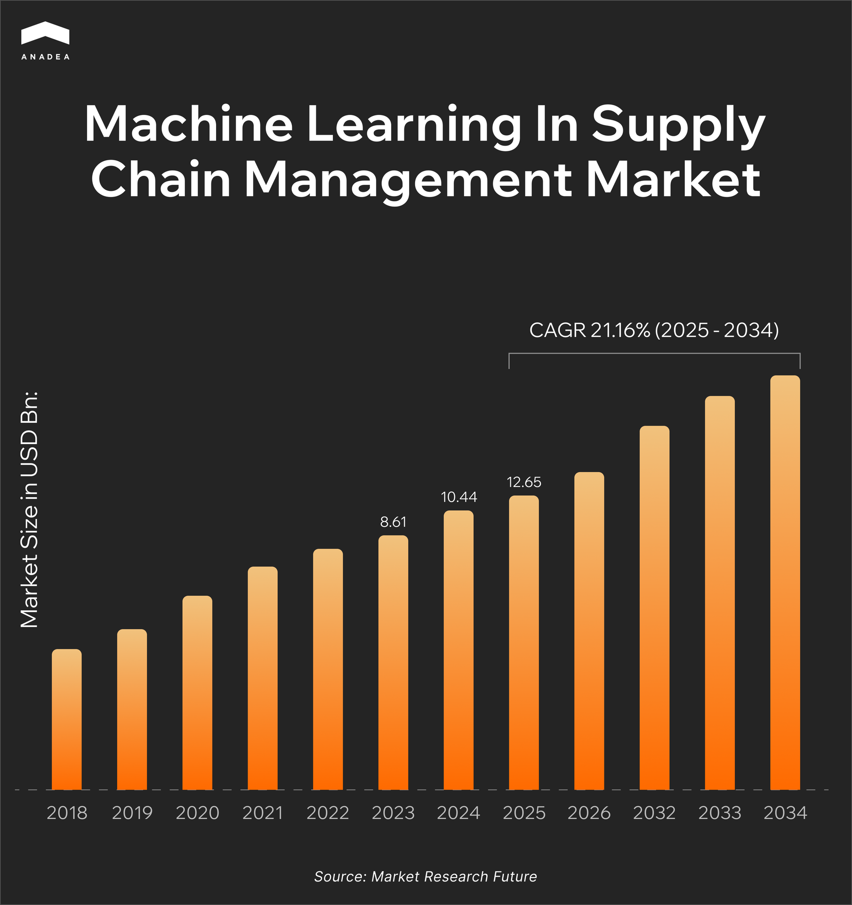

High logistics costs are one of the most serious business challenges that many companies worldwide face today. Studies show such expenses can be[ 15%-25% lower](https://stbfreight.com/supply-chain-visibility/) thanks to increasing comprehensive supply chain visibility. It can be quite difficult to achieve such changes relying solely on manual processes that are prone to mistakes and have scalability limitations. However, modern machine learning systems can address these challenges.

This guide explains the role of ML in supply chain management and shows how businesses can use ML tools to stay strong even amid global disruptions.

## What Is Machine Learning in Supply Chain Management?

Machine learning is a branch of artificial intelligence that enables computers to learn patterns from data and make predictions based on them. ML-driven systems operate without reliance on fixed rules or manual inputs. Moreover, they can improve their outputs over time as they process more information.

In supply chains, ML can automatically detect trends, anticipate disruptions, or optimize operations by learning from historical and real-time data, including order histories, transportation records, and sensor data from vehicles and warehouses.

The table below showcases the main differences between traditional approaches to analytics and ML-powered systems.

<table>

<thead>

<tr>

<th>

<strong>Aspect</strong>

</th>

<th>

<strong>Traditional analytics</strong>

</th>

<th>

<strong>ML analytics</strong>

</th>

</tr>

</thead>

<tbody>

<tr>

<td>

Approach

</td>

<td>

Rule-based solutions; they rely on predefined formulas and historical reports

</td>

<td>

Data-driven systems; ML models learn patterns and improve with more data

</td>

</tr>

<tr>

<td>

Key questions to answer

</td>

<td>

What happened? Why did it happen?

</td>

<td>

What will happen? What should we do?

</td>

</tr>

<tr>

<td>

Flexibility

</td>

<td>

Limited flexibility; such tools require manual updates when conditions change

</td>

<td>

ML systems are adaptive and can automatically adjust to new data and trends

</td>

</tr>

<tr>

<td>

Decision-making

</td>

<td>

Usually reactive, based on past events

</td>

<td>

Proactive, enables forward-looking decisions

</td>

</tr>

<tr>

<td>

Data processing

</td>

<td>

These systems work best with structured, clean datasets

</td>

<td>

ML solutions can process large and unstructured datasets (including IoT data, text, and images). The quality and diversity of data still remain crucial for correct functioning of such systems.

</td>

</tr>

</tbody>

</table>

According to the data published by [Market Research Future](https://www.marketresearchfuture.com/reports/machine-learning-in-supply-chain-management-market-32516), in 2024, the ML in supply chain management market was valued at $10.44 billion. By 2034, it is projected to hit $71.18 billion, which reflects the CAGR of approximately 21% during the period from 2025 to 2034. 

The key factors that drive the market growth are technological advancements in AI and the need for data-driven decision-making. Moreover, today, businesses are striving for cost reduction and more efficient operations, which is quite challenging to ensure with traditional approaches to analytics.

## Benefits of ML Supply Chain Technology

As you can see, the use of AI/ML supply chain software is gaining popularity. But it is not just a modern trend. This innovation has practical value for businesses. Let’s consider the most significant advantages that companies can leverage when implementing ML supply chain technology.

* **Improved demand forecasting**. By working with data from different sources, ML models ensure greater accuracy in their predictions and minimize mismatches between supply and demand.
* **Inventory optimization**. Overstocking results in unnecessary costs. Meanwhile, stockouts increase the risk of losing sales and customer trust. The use of machine learning in supply chain planning helps companies balance these risks. ML algorithms analyze consumption patterns, supplier lead times, and order histories. As a result, the right products are available at the right time.
* **Cost savings and increased efficiency**. ML helps automate such manual tasks as order processing, warehouse management, and logistics planning. Machine learning reduces human error and minimizes labor costs. In addition, advanced optimization algorithms improve route planning and resource allocation.
* **Better risk management**. AI/ML supply chain software can detect early warning signs of disruptions in processes, including but not limited to geopolitical risks and transportation bottlenecks. When businesses identify such vulnerabilities early, they can mitigate risks more efficiently and develop proactive strategies.
* **Increased transparency and visibility**. ML-driven analytics is often integrated with IoT sensors. These technologies allow companies to gain full visibility into their supply chains. Real-time tracking of goods and shipments improves transparency and enhances collaboration among partners.
* **Sustainability and waste reduction**. Machine learning supply chain optimization leads to fewer empty miles, smart fuel consumption, and reduced carbon emissions. The better the demand is predicted, the less waste is produced. This approach supports sustainable and environmentally friendly operations.

## Key Machine Learning in Supply Chain Use Cases	

To better understand how you can leverage the benefits of using ML in supply chain management, it is necessary to consider in more detail the applications of this technology. Below are the most common use cases.

### Machine Learning Supply Chain Forecasting and Planning

Machine learning goes beyond traditional forecasting. To analyze massive amounts of sales data, it combines different techniques and models, including:

* time series analysis (this method presupposes analyzing sequences of data points collected at regular time intervals);
* neural networks (such models make decisions in a way similar to the human brain and nervous system);
* ensemble learning (this technique involves multiple individual models, or learners, to create more accurate predictions than any single model could ensure alone).

ML models work with seasonality data, promotions, competitor moves, weather, and economic conditions. The use of all this data makes forecasting as realistic as possible.

As a result, companies can adjust production to the existing demand more precisely and avoid stockouts and overstocking.

### Inventory Management

Machine learning systems can also continuously track demand fluctuations for adjusting safety stock levels. They consider various factors, such as supplier lead times, warehouse capacity, and demand uncertainty.

Thanks to these ML capabilities, global retailers can leverage ML-driven systems to automatically redistribute stock between warehouses when certain regions face unexpected demand spikes. Read more about the use of [ML in warehouse management](https://anadea.info/blog/ai-in-warehouse-management/) on our blog!

### Predictive Maintenance

Today, modern warehouse equipment, trucks, and manufacturing machinery can be equipped with IoT sensors that continuously collect performance data.

By analyzing such data, ML models can detect even the smallest signals like vibration changes or abnormal energy consumption that may indicate potential failure.

With such data at hand, companies can perform timely maintenance and avoid sudden equipment breakdowns.

### Logistics and Route Optimization

Another ML use case is route optimization. Such systems can help find the best routes by combining real-time traffic, fuel costs, weather patterns, and delivery windows. They can also adapt dynamically if conditions change.

With machine learning supply chain optimization, companies can ensure faster deliveries, as well as lower fuel consumption and reduced carbon emissions. That’s exactly what modern sustainability principles demand.

### Quality Control and Inspection

Computer vision powered by ML can automatically inspect products on the production line. High-resolution cameras are used to detect defects of different kinds, like misalignments or packaging errors.

This greatly improves accuracy and speed compared to human inspection. As a result, it helps reduce waste and minimize customer complaints.

### Fraud Detection and Compliance

ML algorithms are applied to scan procurement data, invoices, financial transactions, and other business data to detect unusual activity. They can quickly identify patterns that may be linked to fraud or compliance risks, for example:

* Unusual transaction amounts (significantly higher or lower than historical norms);
* Unexpected frequency of transactions;
* Sudden vendor activity changes;
* Duplicate invoices;
* Invoice mismatch;
* Transactions from unusual locations.

As a result, such tools protect organizations from financial losses and legal issues, which can also lead to serious reputational damage.

### Supplier Relationship Management

ML models analyze supplier performance based on such factors as on-time delivery rates, defect frequencies, and cost fluctuation. 

As predictive models can flag suppliers at risk of disruption, companies have valuable insights to make smarter sourcing decisions and reduce supplier-related risks.



## Machine Learning and Supply Chain Management: Industry Examples

Today, we can observe real results from the use of machine learning in the processes of various companies. Let’s turn to some of the most well-known and striking examples.

### Walmart: Machine Learning in Retail Supply Chain

Walmart has introduced an [AI/ML-powered inventory system](https://tech.walmart.com/content/walmart-global-tech/en_us/blog/post/walmarts-ai-powered-inventory-system-brightens-the-holidays.html) that helps greatly enhance customer experience during peak periods, like holiday seasons, when the demand is extremely high.

Thanks to this solution, customers can find the products they want at low costs. The system combines historical sales data with predictive analytics, macroeconomic trends, local demographics, and weather patterns. As a result, Walmart can position inventory across stores, distribution centers, and fulfillment hubs in the most efficient way.

It’s worth mentioning that the system can filter out one-time anomalies and continuously learn from customer interactions and geographic sales patterns. 

Want to know more about the use of AI and ML in sales? Read about [automation in retail](https://anadea.info/blog/retail-automation/) in our article!

### Optimization of Cold-Chain Operations

According to the report by [Business Insider](https://www.businessinsider.com/ai-for-cold-chain-operations-safety-algorithms-agents-digital-twins-2025-7?IR=T), such companies as Lineage Logistics, Americold, and Unilever are increasingly using AI and ML to optimize cold-chain operations (where maintaining precise temperatures is critical for frozen foods, pharmaceuticals, and other items). 

At Lineage, computer-vision systems scan incoming shipments. At the same time, AI algorithms determine optimal pallet placement and predict when goods will leave the warehouse.

Americold applies predictive analytics to better anticipate customer demand and proactively plan warehousing capacity.

Meanwhile, Unilever uses AI to forecast ice cream sales based on weather patterns, to improve inventory allocation and boost sales across regions. 

### UPS: Machine Learning in Logistics and Supply Chain

UPS relies on AI and ML to transform its supply chain and delivery operations.

The [ORION system](https://x.com/UPS_News/status/878401038977519616?lang=ca) is the key element of its strategy. It can dynamically optimize delivery routes in real time and reduce mileage and fuel consumption. For instance, it can ensure the reduction of up to [100 million miles](https://em360tech.com/tech-articles/data-juice-101-excerpts-guide) driven annually and savings of up to [$400 million](https://www.informs.org/Impact/O.R.-Analytics-Success-Stories/) per year.

Predictive analytics help UPS anticipate traffic, weather, and mechanical issues, which allows it to adjust routes and prevent delays. Apart from this, AI also enhances customer interactions through NLP-powered chatbots and virtual assistants, so that staff can focus on handling complex inquiries.

Ready to launch your own supply chain solution?

Our developers with multi-year experience in this domain will help you transform your ideas into a real product!

Let’s discuss



## Challenges and Limitations of Machine Learning in Supply Chain Management

Machine learning in logistics and supply chain offers a wide range of opportunities. However, its introduction is also related to some hurdles. If you are also considering ML implementation in your processes, it will be helpful for you to explore the following challenges and the ways to overcome them.

### Data Quality and Availability

To deliver the desired results, ML systems should work with high-quality datasets. Nevertheless, supply chain data is often fragmented. It comes from many isolated sources, like ERP systems, IoT sensors, logistics partners, supplier portals, and customer touchpoints. 

Moreover, such data may be incomplete, outdated, or siloed. This makes it difficult to build reliable ML models that will make accurate predictions.

### High Implementation Costs

The introduction of ML systems requires computational resources (GPUs, cloud infrastructure). Apart from this, the integration with legacy solutions can be pretty expensive. A lot of smaller firms don’t have such budgets for tech initiatives.



### The Black Box Problem

A lot of ML algorithms produce accurate predictions. But at the same time, they offer little or no insight into why and how a decision was made. This lack of transparency makes it hard for supply chain managers to trust automated recommendations.

### Resistance to Change

Employees and business managers may hesitate to adopt ML-driven tools. Quite often, it happens because they are afraid that these systems could replace them at their workplaces. 

### Scalability Issues

An ML model that was trained on a pilot dataset may perform well in some limited use cases (for example, in one region or product category) but they may fail when they are rolled out globally.

### Ethical Concerns

ML systems can unintentionally introduce bias. It may happen if models were trained on biased data. For instance, such tools may favor large suppliers over smaller ones. 

### Cybersecurity Risks

ML systems rely on cloud platforms and IoT devices. Today, they remain attractive targets for cyberattacks. A compromised ML system could manipulate forecasts, disrupt logistics, or expose sensitive data.

## ML in Supply Chain Management: What to Expect in the Future?

Machine learning in supply chains is evolving rapidly. Here are the main trends that are shaping the future of this domain.

* **End-to-end autonomous supply chains**. Today, ML is mainly used in isolated applications (like demand forecasting). With further tech advancements in this field, it will increasingly power self-learning supply chains. In such supply chains, forecasting, inventory management, logistics, and procurement systems will communicate and optimize automatically. Thanks to this, it will be possible to significantly reduce human intervention in routine and inventory planning decisions.
* **Human and AI collaboration**. ML-driven tools will act more like co-pilots. They will not replace human expertise but will augment decision-making with intelligent recommendations. This model of ML implementation can encourage broader adoption across organizations.
* **Hyper-personalization of customer fulfillment**. It is expected that in the future, ML will provide more personalized decisions. For example, it will increasingly tailor supply chain responses to individual customer behaviors. Such systems will offer personalized delivery windows and dynamic pricing to improve customer experience and loyalty.

## Conclusion

Machine learning is changing supply chain management. This technology supports the shift from reactive, manual processes to proactive, data-driven operations. By automating demand prediction, inventory management, and logistics optimization, ML helps companies not only reduce costs but also improve accuracy and efficiency.

With all the provided benefits, machine learning supply chain forecasting and planning are gradually becoming an industry standard. But while some businesses are just exploring the capabilities of this technology, such tools can give a powerful competitive advantage in the highly dynamic market.

If you need a professional partner that will guide you through this journey and help you introduce ML-driven tools into your supply chain processes, at Anadea, we are always ready to offer our support. [Contact us ](https://anadea.info/free-project-estimate)to learn more about our experience in this field and get project estimates for free.
