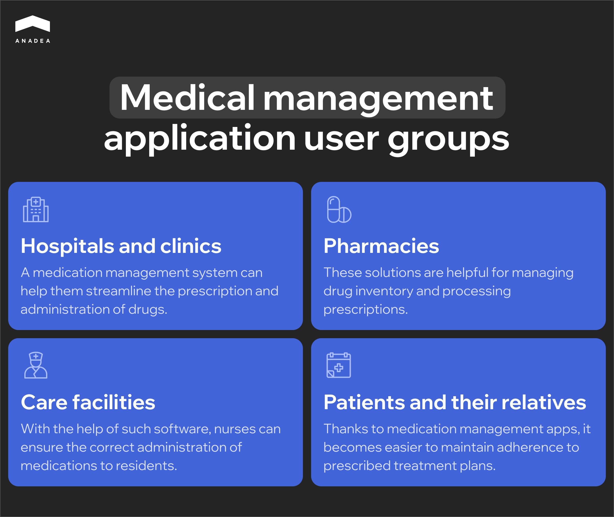
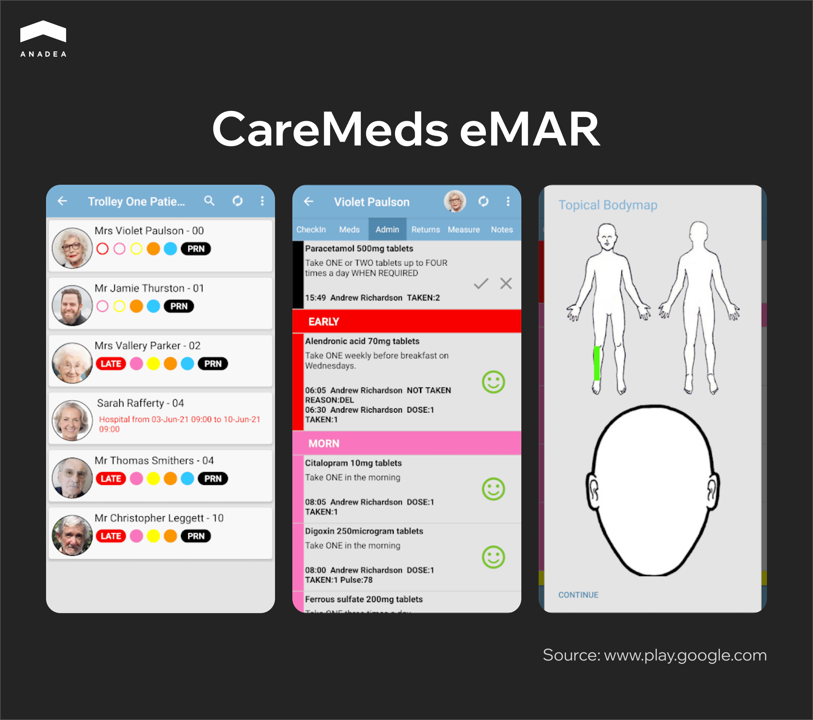
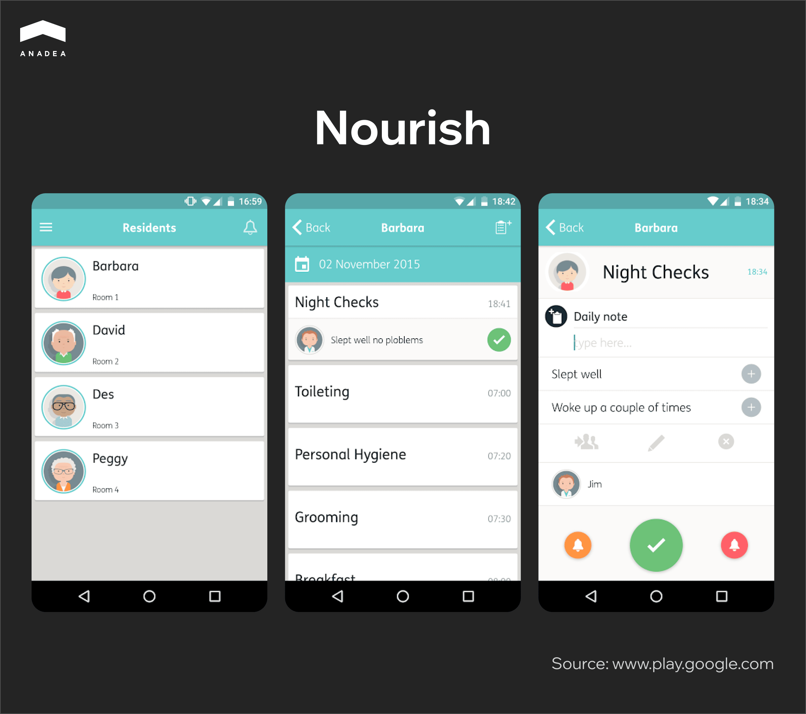
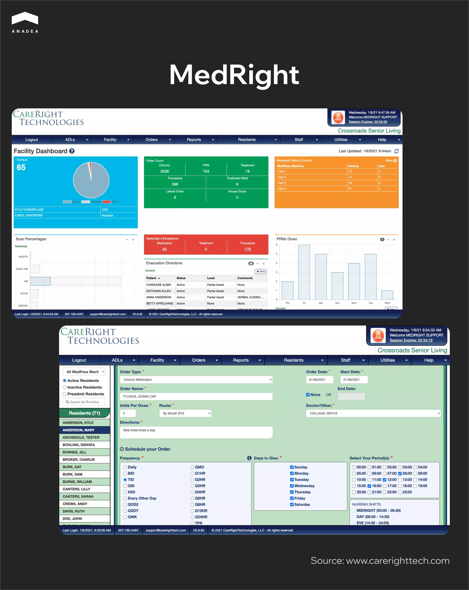
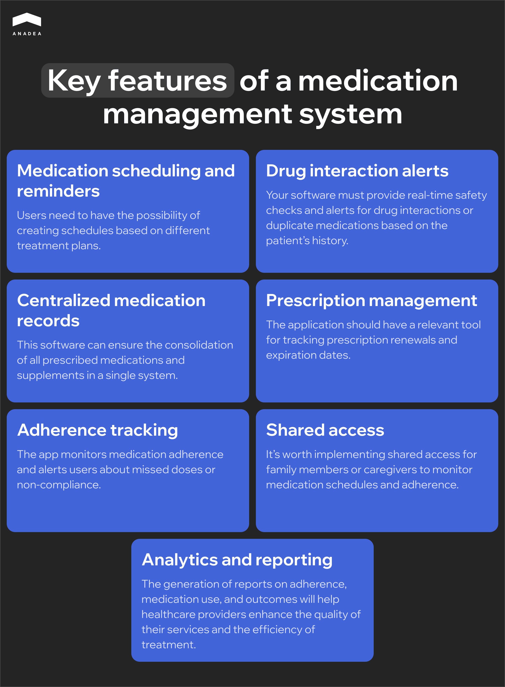

Have you ever heard that drug non-adherence causes hundreds of thousands of deaths all over the world? Misunderstanding, inattentiveness, and human factors are among the influencing factors. Though there isn’t a magic wand that can fully eliminate these factors, there is a digital solution that can minimize them. We are talking about medication management software.

In this article, we will focus on medication management app development and provide practical recommendations for those who are considering the launch of such a product.

## Medication management software: What is it?

A medication management system can be defined as a type of digital solution designed to assist healthcare providers, patients, or caregivers in organizing, monitoring, and optimizing the use of medications. Its purpose is to ensure accurate medication administration, prevent errors, enhance patient safety, and improve treatment outcomes.

## Who may need to use medication management software?

There are several groups of users that medication management apps are typically targeted at:

* ***Hospitals and clinics.*** A medication management system can help them streamline the prescription and administration of drugs.
* ***Pharmacies.*** These solutions are helpful for managing drug inventory and processing prescriptions.
* ***Care facilities.*** With the help of such software, nurses can ensure the correct administration of medications to residents.
* ***Patients and their relatives.*** Thanks to medication management apps, it becomes easier to maintain adherence to prescribed treatment plans.

## Medication management software market: Quick overview

In 2023, the size of the medication management system market achieved the mark of $4 billion. According to the experts’ [expectations](https://www.gminsights.com/industry-analysis/medication-management-systems-market), by 2032, it will be valued at $9.1 billion. These figures indicate that the projected CAGR for the period from 2024 to 2032 will be 9.8%.

What are the factors that drive the market growth? They include both health- and tech-related needs and trends:

* Overall digitalization of the healthcare industry;
* Growing adoption of software tools for process management and automation at hospitals and pharmacies;
* Focus on patient safety;
* Expansion of telemedicine;
* Increasing prevalence of chronic diseases.

### What issues a medication management solution can address

As you can see the market for such solutions, as well as the demand for them, is growing. This can be explained by the fact that they help to overcome a row of issues that currently exist in the healthcare industry. The issues that this software can address are mainly related to the efficiency of processes and patient management.

1. ***Medication non-adherence***. It’s not a rare case when patients can simply forget to take their medicine. Such software can address this problem by providing automated reminders or be used to power smart dispensers to ensure timely medication intake.
2. ***Medication errors.*** When you take some medicine, it is vital to follow the right timing and dosage, as well as to remember about drug interactions. Due to miscommunication or manual tracking, errors are rather common. The use of relevant digital tools will help to minimize these risks.
3. ***Challenges caused by taking multiple medications.*** Very often patients may feel confused when they need to take several medicines within one treatment plan. Organized schedules, simplified medication lists, and interaction checks offered by patient medication management software can be quite helpful.
4. ***Inefficient cost management and medication wastage.*** Medication errors like non-adherence or overprescription can not only threaten patient safety but also cause drug wastage. Monitoring and optimization tools can prevent unnecessary prescriptions and ensure efficient use of medications.
5. ***Difficulties in caregivers’ work.*** Caregivers usually need to interact with more than one patient. At the same time, several caregivers may need to work with the same patient during different shifts. As a result, it can become rather challenging to track a patient’s medications effectively. With shared access to medication schedules and tracking systems for family or professional caregivers, all the related tasks become easier.

Based on the tasks solved, we can formulate the key benefits of using patient medication management software:

* ***Improved medication adherence.*** With timely alerts and reminders, patients are likely not to forget to take medications as prescribed.
* ***Reduction in medication errors.*** Automated checks and notifications help to prevent errors in dosing, timing, and drug interactions.
* ***Streamlined workflow for doctors and nurses.*** Such software facilitates prescription tracking, medication history management, and communication between providers. As a result, it helps to save time and reduce administrative burdens.
* ***Enhanced patient safety.*** Applications of this type are used to track potential adverse drug interactions, duplicate therapies, and contraindications. It means that the risks for patients related to the incorrect usage of drugs are lower.
* ***Personalized treatment plans.*** A medication management system can offer tailored medication schedules and dosage adjustments. These customizations are introduced based on patient-specific needs and conditions.
* ***Scalability and flexibility.*** As a rule, such software is able to adapt to various healthcare settings, including hospitals, nursing homes, and home care. As a result, it makes it possible to address diverse needs.
* ***Improved patient engagement.*** Patient medication management software helps to educate people on the drugs they need to take. With a convenient digital tool, it’s easier for patients to understand and manage their treatment plans and their health in general.
* ***Better chronic disease management.*** A medication management system can support the long-term tracking of medications for chronic conditions like diabetes or hypertension. This enables patients to leverage improved outcomes of treatment efforts.
* ***Centralization of medication records.*** Such systems consolidate medication history into one accessible platform, ensuring all providers and caregivers have up-to-date information.
* ***24/7 treatment oversight.*** With modern apps, it is possible to monitor and manage medications remotely.
* ***Regulatory compliance.*** The use of digital solutions can ensure compliance with healthcare regulations with detailed tracking, audit logs, and reporting capabilities.
* ***Cost savings.*** Patient medication management software can reduce waste from unused or mismanaged medications and lower hospital readmission rates. Moreover, its use minimizes errors that could result in costly complications.



## Medication management software: Common use cases

To better understand the role of such software in the healthcare industry, it’s necessary to look at its most popular use cases.

***Elderly care.*** Medication management software can be enriched with such features as dosage tracking and reminders. These tools can greatly help elderly patients and their caregivers. In this case, we strongly recommend you make interfaces as simple as possible. 

***Chronic disease management.*** Very often such apps are used in working with patients with chronic diseases like asthma or diabetes. Applications of this kind can not only ensure medication adherence but also enable remote health monitoring.

***Pediatric care.*** Quite often, it is not very simple to monitor whether children take their medications in accordance with their treatment plans. A medication management app can provide great assistance to doctors and parents. This application can have not only medication schedules or trackers but also child-friendly educational resources and interfaces. Such features can encourage children to follow their treatment plans with more engagement.

***Recovery and rehabilitation.*** Such software can be also helpful for patients who are undergoing rehabilitation after injuries or surgeries. These apps can be equipped with such features as pain management and rehabilitation milestone tracking. As a result, they can ensure a personalized approach to the recovery process.

***Mental health support.*** It’s important to mention that medication management software can be useful not only for patients with physical health problems. They can be also intended for individuals with mental conditions like anxiety, bipolar disorders, and depression. If you want to offer a solution for this target group, it will be sensible to implement such functionality as therapy session reminders, mood tracking, etc.

***Telehealth and remote patient monitoring.*** Digital tools make it possible for patients to get qualified medical help practically at any time regardless of their location. Telehealth apps have greatly expanded the accessibility of medical services. Medication management functionality can become an important component of any solution intended for providing medical services at a distance. In this case, it is necessary to equip your app with communication tools for providers and patients, as well as virtual consultations and automated alerts for non-adherence.

Also read <a href="https://anadea.info/blog/cost-of-ehr-implementation/" target="_blank>Cost of Implementing EHR: How to Plan Your Budget</a>

## Examples of medication management apps

The benefits of using medication management software are among the strongest boosters for the demand for them. Today the market already can offer a row of successful ready-made platforms of this kind. Of course, they may have their own limitations and peculiarities. Nevertheless, they have their precise target audiences and specific use cases, which cover the needs of different groups. When you are planning your own medication management app development project, it is always helpful to have a look at the solutions that have already won their market share.

### CareMeds eMAR

CareMeds is a tech company that builds innovative apps for pharmacies and care providers. These applications help to enhance the way these organizations manage their patients’ and residents’ medications. According to the information provided by the company on its [website](https://www.caremeds.co.uk/), around 5,000 care providers are using its solutions.

One of its solutions is an electronic medication administration record (eMAR) system that is available exclusively to CareMeds customers. The system is designed to address the needs of residential homes, nursing facilities, care homes, and home care providers.

The app offers real-time access to residents’ medications, as well as detailed info about residents, including their sensitivities, allergies, and color photos.

The solution is available in the UK, Malta, Ireland, France, and Gibraltar.

### Nourish

Nourish is a software development company that provides care management solutions. The company views its mission as offering better-integrated health and social care. The team behind it strives to improve the quality of care with the help of innovations. 

Its all-in-one care management platform Nourish Care provides various features, with medication management being one of them.

Its mobile application dubbed Carer App is equipped with all the necessary features for real-time care planning and recording daily notes.

Currently, t‍his app is intended to be used only by organizations. To sign into it, a user needs to be registered with Nourish Care.

### MedRight

MedRight is known as a user-friendly EHR/eMAR solution that can be implemented in pharmacies and care facilities of different types. The software was developed by CareRight Technologies LLC [founded](https://carerighttech.com/about) in 2006.

To build its own app for medication management, the company researched all available eMAR products, detected their strengths and weaknesses, as well as analyzed the opinions of users. To make the right decision regarding the creation of MedRight, the company’s specialists focused on communication with nursing groups. This was necessary to identify the real needs of users. This communication helped to determine a set of core features that had to be built.

MedRight includes such fools and features as customized service plans, electronic nurse charging, full medication profiles for residents, reports, charts and graphs with vitals and KPIs, reminders, medication history, etc.

The solution is fully HIPAA compliant and can work even in an offline format.

## Is it always a good idea to rely on off-the-shelf solutions?

Using an off-the-shelf medication management solution can be a good idea in many cases, but it’s not always the best option. 

Of course, in comparison to medication management app development, the implementation of a ready-made solution can be a much more budget-friendly initiative. Pre-built solutions do not require upfront investments. And this always becomes the main argument in their favor. Moreover, the implementation doesn’t take long. Even if it is required to customize some features, it will be faster to deploy some changes than to build a solution from scratch. Another weighty argument in this case is that tech support and updates will be the responsibility of a vendor. This also facilitates the interaction with the solution.

However, ready-made software often has a lot of limitations that can be addressed only with custom development. Here are the most important disadvantages of off-the-shelf solutions that you should know about.

* ***Lack of customization.*** A ready-made solution may not fit your specific workflows, organizational needs, or unique patient requirements. As a result, it may be very difficult or even impossible to adapt it to some specific use cases or integrate it with other systems that you rely on.
* ***Feature gaps or overload.*** When you are considering different available solutions, that’s obvious that you are trying to find the one that will have all the required features. However, it is not always possible. Solutions on the market may either lack critical features or include some functionality that you don’t need. But at the same time, this extra functionality can complicate the usage of the solution.
* ***Full dependency on the vendor.*** You will need to rely on the vendor for updates, support, and long-term availability of the solution. On the one hand, it can be even helpful as you do not need to take responsibility for such tasks. On the other hand, you will fully depend on the vendor’s decisions. If the vendor discontinues the product, it could cease operations.
* ***Data security concerns.*** Medication management software always deals with sensitive business data. However, the fact that this data is stored on a third-party platform may raise potential security and privacy issues. Moreover, you may face difficulties in integrating such a solution with your existing internal security protocols.
* ***Scalability limitations.*** Not all available systems can meet the needs of big organizations. This could lead to a lot of tech issues like software freezing and downtimes, especially during peak loads.

If you understand that you can’t tolerate the existing limitations, the best solution for you will be to build custom medication management software. Only in this case, you can be sure that your solution will fully correspond to your requirements.

## When should you consider custom development?

* You have unique requirements that can’t be met by any of the off-the-shelf options.
* You need to integrate your new solution with proprietary or legacy systems.
* You want to have complete control over data storage, security, and compliance.
* You want to have an additional competitive advantage that can be gained with specialized workflows and features.
* You need to ensure the long-term scalability and adaptability of your solution.

## Key features of a medication management system

Your custom solution can have any functionality you need. However, there are some basic features that are typically built for systems of this kind.

* ***Medication scheduling and reminders.*** Users need to have the possibility of creating schedules based on different treatment plans. Moreover, they should be able to set automated reminders for patients to take medications at the correct time and dosage.
* ***Drug interaction alerts.*** Your software should send notifications for potential drug interactions or duplicate medications. Real-time safety checks based on the patient’s medication list and medical history is a must.
* ***Centralized medication records.*** This software can ensure the consolidation of all prescribed medications and supplements in a single system. These records should be available to patients, caregivers, and healthcare providers.
* ***Prescription management.*** The application should have a relevant tool for tracking prescription renewals and expiration dates. In this case, it will be sensible to integrate your system with e-prescription software.
* ***Adherence tracking.*** The app should monitor patient compliance with medication schedules. If missed doses or patterns of non-adherence are detected, the app should send a notification to a user.
* ***Shared access.*** It’s worth implementing shared access for family members or caregivers to monitor medication schedules and adherence. Moreover, depending on the specificity of the workflows at your organization, communication features for caregiver alerts and notifications can be of great help.
* ***Analytics and reporting.*** The generation of reports on adherence, medication use, and outcomes will help healthcare providers enhance the quality of their services and the efficiency of treatment.

## Trends in medication management app development to watch out for

When you are planning to launch a medication management solution, it’s vital to make sure that your digital product will correspond to the current market needs and users’ expectations. That’s why you need to stay tuned with what is happening in the sector and try to reflect the ongoing trends in your product. 

Here’s a list of trends that will be relevant in the near future.

### AI-driven functionality

Artificial intelligence is commonly used today in healthcare solutions. This technology allows medical staff to automate and facilitate a lot of manual processes, as well as increase the quality and efficiency of treatment. For example, in a medication management system, AI algorithms can personalize medication schedules, predict potential adherence issues, and offer customized reminders and support to patients based on their behaviors.

### Incorporation of wearable devices

Today, we can observe significant progress in the development of the Internet of Things and wearable devices. These advancements have great value for the healthcare industry. The use of wearables, like smartwatches, makes it possible to establish continuous monitoring of patient health metrics and medication adherence. 

These devices can offer reminders, monitor physiological responses, and share data with healthcare providers. Thanks to this, they can react to potential threats and issues proactively.

### Integration with EHRs

The adoption of electronic health records is successfully going on in many regions. For efficient use of several digital tools in one environment, it is crucial to establish a smooth connection and data exchange between them. Here is when it is highly sensible to talk about integration. 

Seamless integration with EHRs enables real-time updates to patients’ medication lists, facilitates coordinated care among healthcare providers, and reduces risks related to medication errors.

### Growing implementation of telemedicine functionality

These days, apps for medication management are often equipped with telemedicine functionalities. Such features enable direct communication between patients and healthcare providers. This integration makes it easier to organize real-time consultations and introduce prescription adjustments.

### Advanced data analytics and big data features

The application of powerful analytics tools enables aggregation and analysis of vast amounts of patient data. This results in improved medication adherence strategies and the possibility of introducing personalized treatment plans. 

### Focus on user-centric design

Today the key task for any development team building medication management software should be the creation of intuitive interfaces and user-friendly experiences. The easier the interaction with your app is, the higher your chances of encouraging consistent app usage will be. 

Your solution should cover the needs of different population groups, including elderly people and people with limited technological proficiency. That’s why despite the fact that such systems may have rather complex functionality, interfaces should be as simple as possible. You can also introduce some customization options. You can allow users to change the look of the app for their convenience.

Also read <a href="https://anadea.info/blog/healthcare-crm-development/" target="_blank">Healthcare CRM Development: Why and When Do You Need It?</a>

## Medication management app development process: How to organize it?

One of the most important things that should be done to create successful medication management software is careful planning. The project realization traditionally goes much beyond coding. It should start with ideation and market research and continue even after the official launch of your solution. Here are the key steps that should be included in this process.

***Objective and scope definition.*** First of all, you need to identify the primary purpose. Why do you want to launch your app? What tasks will it perform? Who is your target audience? Based on your answers to these questions, you will be able to determine the must-have features of your app.

***Market research.*** You need to analyze existing medication management apps to identify strengths, weaknesses, and market gaps. Also, you should study regulatory requirements and industry trends. All this will help you to enhance your idea.

***Requirements gathering.*** It will be a good idea to collaborate with stakeholders (patients, and healthcare professionals) to gather functional and non-functional requirements. Here, you will have the possibility to detect integration needs.

***Project plan creation.*** Together with your development team, you should prepare a roadmap with timelines, milestones, and deliverables. It will be also necessary to define budgets for development, testing, marketing, and maintenance.

***App design.*** It is always sensible to start with prototypes and wireframes. They will help you visualize user flows and interface layouts. When you are satisfied with the results, the team can proceed to the [UI/UX design of your healthcare app](https://anadea.info/blog/healthcare-app-design/).

***App development.*** This step includes a lot of coding-related tasks. Developers need to build the required functionality, implement data storage and [APIs](https://anadea.info/blog/healthcare-api/), integrate with third-party services, and introduce security measures.

***App testing.*** It is required to apply different types of apps to ensure all features work as expected, verify that the app is user-friendly and accessible, as well as to make sure that the solution has no bugs and vulnerabilities.

***App launch.*** As soon as everything is ready and you believe that no improvements are needed, your app can be made available to its users. If it is a mobile app targeted at a wide audience, it should be published on a relevant app marketplace. If the app is intended for internal use only, you will need to install it on the devices of your employees.

***Maintenance and updates.*** You will have to update the app with new features, security patches, and performance optimizations. This should be done on a regular basis to support high user satisfaction. You also need to monitor compliance with new versions of regulations and introduce changes if needed.

## How much does it cost to build medication management software?

The questions about the cost are among the most popular ones that we usually get from our clients. That’s quite natural. Budget planning is a very important element of any project. Nevertheless, when talking about custom solutions, it is impossible to name any precise figure without taking into account the project’s requirements. 

* There are several factors that should be considered in the first turn:
* The exact type of your software and the platforms it will be compatible with;
* The number and complexity of features;
* The required integrations;
* The tech stack that will be used;
* The composition and the size of the hired team.

All these factors affect the time needed for the project realization and, consequently, the project cost. Based on our experience, the development of an MVP takes 3-5 months. However, you should remember that a minimum viable product has only basic functions and very simple interfaces. When you proceed to the creation of a full-scale version of your solution, the required time will be prolonged. 

Given the mentioned time periods required for MVP development, such a project can cost around $30,000-$50,000. You can read more about healthcare app development costs here.

To get accurate estimates, you need to contact your development partner. At Anadea, you can [get a quote for free](https://anadea.info/free-project-estimate).

## Medication management app development with Anadea

When you are planning to build a custom medication management solution, it is very important to find a reliable team that will support you in your project realization. It’s vital to establish cooperation with professionals who already have relevant experience. Here, we are talking not only about tech skills but also about a good understanding of the domain in which you work. Only specialists with specific expertise will be able to efficiently address the existing [tech challenges](https://anadea.info/blog/technology-challenges-in-healthcare/) in the healthcare space. 

At Anadea, we have been successfully working in the software development industry since 2000. Over this period of time, we have delivered more than 600 projects of various types for different markets. Healthcare has always been one of our focus areas, which our rich [portfolio](https://anadea.info/projects-b2b#healthcare) can well demonstrate.

We always do our best to continuously track all the trends in the industry and know how to address the existing issues with the power of emerging technologies.

If you want to learn more about us, we will always be happy to answer all your questions. And if you already have an idea for your medication management software, [tell us about it](https://anadea.info/free-project-estimate)! We will consider your request and offer the best solution to address your needs.
