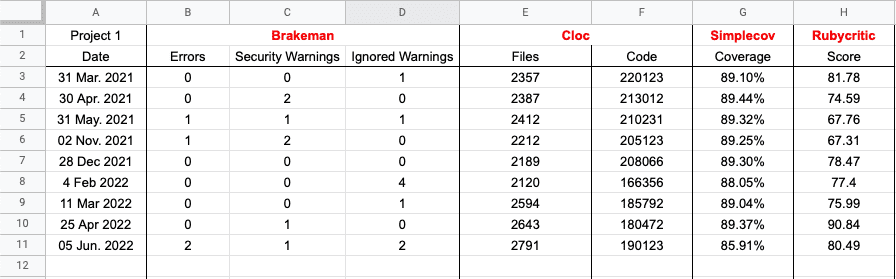

## Metrics Collector Overview

From one point, we've started collecting some metrics from our projects in <a href="https://anadea.info/services/web-development/ruby-on-rails-development" target="_blank">Ruby on Rails</a> so that we could see the dynamic and statistics, because some problems catch your attention only when you can see them right in front of your eyes.

Above mentioned metrics included **percent of test coverage** provided by *simplecov*. With it, we could react in case of sharp decline because we were always trying to have at least 80% code to be covered with tests. Second metric we decided to look into were **vulnerabilities, warnings and deprecations from the brakeman**. That’s how we wouldn't miss the gaps in our projects. Furthermore, to follow best practices, score from *rubycritic* was also included.

And the last one is just a simple amount of code lines and files provided by the *CLOC* library. So that any implementation of big features would be visible in statistics.

As a result, we've understood that we are doing repetitive actions in different projects and with different frequency. And to avoid that, we have decided to automate the process of collecting all desired metrics so that a developer wouldn't waste time on this. Before, in order to collect metrics, they had to launch project, pull all updates, run all tests to get percent of test coverage, run the script that collects all metrics and then put all results into Google Documents that we kept for each project.

With a list of steps wrapped in MetricsCollector, we were able to create a job in the pipeline (in our case it runs on GitLab). The job creates artifacts for each gem presented in our tool, collects all results in a certain structure and moreover, it sends them into our messaging apps. On top of that, it sends the results into appropriate documents to google spreadsheets.

To use MetricsCollector, next should be done:

```ruby
bundle exec metrics_collector
```

By default, it collects metrics from output of all included gems, generates results in json, csv file formats and besides that, shows results in the console to make it visible in pipeline:

```ruby
Cloc total lines: 25000
Cloc total files: 600
Brakeman errors: 1
Brakeman warnings: 2
Brakeman ignored warnings: 1
Coverage: 82.44
Rubycritic score: 66.08
```

By including MetricsCollector in pipeline as a separate job, we were able to easily check metrics after every minor/major update of the project:


We've found it's also a nice addition to make it possible to download desired documents from artifacts:


But it's also not really convenient to get outputs from artifacts all the time, so we have integrated Slack into our tool. Since then, the pipelines in our projects send outputs right to our Slack channels of the corresponding projects.


Both files (csv, json) and text variants are sent at the same time just for convenience.

However, we thought that it would take ages to track any statistics right from Slack, so we have implemented integration with Google Spreadsheets. This made it really convenient to check for the whole history of collected metrics from one place.



It’s worth mentioning that it can upload metrics only to the first worksheet for now.

We’ve used spreadsheet’s official Ruby client so there is not that much of logic for populating worksheet:

```ruby
# Initialize SpreadSheet service
@service = Google::Apis::SheetsV4::SheetsService.new
# Send metrics to the next not populated line in worksheet
@service.append_spreadsheet_value(@spreadsheet,'1:1', @request_body, value_input_option: 'USER_ENTERED' )
```

Since we plan to expand the gem in future, we have encapsulated gem handlers and file generators from business logic, so we won’t have to update old logic and could focus on implementing new sorts of metrics/output options.


## Summary

As a result, we have automated repetitive actions, saved a lot of time from collecting all metrics manually and made the tool easily expandable.

That solution suits our needs perfectly, we will keep maintaining the tool in the future. It's open source so you can check the project in <a href="https://github.com/Anadea/metrics_collector" target="_blank">our official repository</a>.
