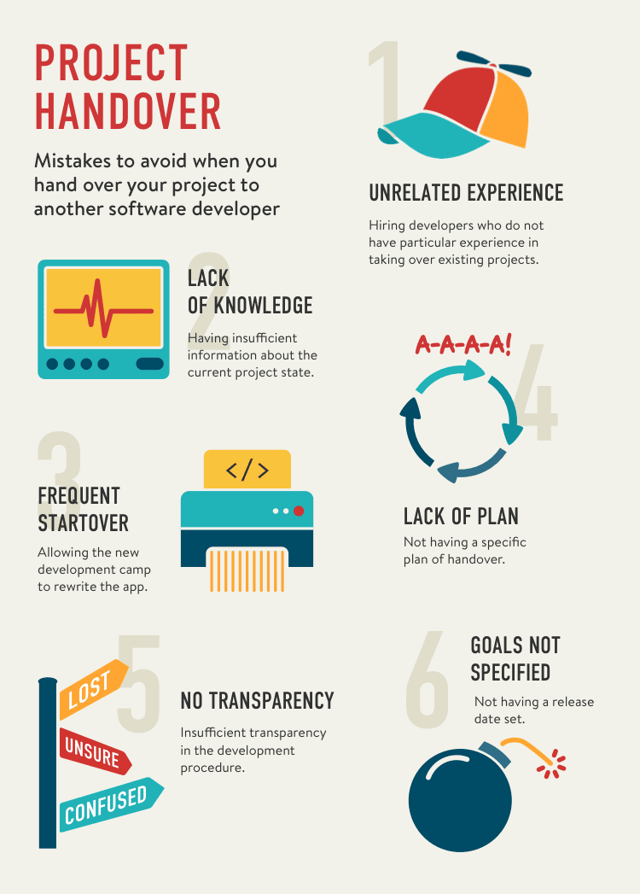

Just like any other field of expertise, software development requires mastery and skills. While some software developers can deliver high-quality applications, others produce buggy code that never makes it into production. Consequently, some project owners successfully launch their projects, while others struggle with faulty builds for months or even years, leading to frustration and disappointment. Despite changing developers, the results remain unchanged, causing project owners to lose faith in their idea and abandon attempts to launch their service.

## Mistakes to avoid

There are certain reasons why project owners face such frustration and disappointment. Here are some common mistakes they make when handing over the project to another development company, which you should avoid at all costs:

### 1. Hiring developers who do not have particular experience in taking over existing projects

Working on an old project is a special area of knowledge. In fact, not every software engineer knows how to get into an existing project correctly. This type of work assumes that the engineer should not only read the code written by other people, but also understand how it is **supposed** to work and how it is related to the customer's goals. If the developer does not have an established strategy to take over the code, he will drown in the previously developed stuff.

### 2. Having insufficient information about the current project state

Knowledge is power. Project owners should always know the state of their code even if it is poor. And even if they know that the code is poor, they should be willing to know **how exactly** poor it is because the project state has significant impact on the development plan. Not having enough information about your project means not being able to plan a success.

### 3. Allowing the new development camp to rewrite the app 

While many developers prefer to start fresh and rewrite old code instead of working on existing issues, relying solely on this approach may indicate a lack of experience with legacy code (see mistake 1) or overlooking the time and budget constraints. In terms of business practicality and affordability, it is often more advisable to improve and refine existing code than to embark on a complete rewrite.

### 4. Not having a specific plan of handover
Every development should be done according to a plan. A project handover requires a plan too, especially if the code is poor. In this case, the plan should highlight steps the developers are going to make to get reasonably good code out of poor code. If you do not have such a plan, your developers will fall into an endless cycle of improvements that do not bring real value to the business side of the project. You will still pay for those improvements, though!

### 5. Insufficient transparency in the development procedure

Project owners tend to rely on developers rather than to monitor and control the deliverables. This can work out if the project is new while the developers are your old friends with a familiar approach. But if you hand over a project, you deal with the opposite situation - the development camp is a stranger while the project can be an old haunted mansion. If you leave the developers there by themselves, you can get even more ghosts over time.

### 6. Not having a release date set

A release date should be part of every development plan. It is true that a handover is an unpredictable process to some extent and the development camp may be uncertain about when it should go live. But if you do not have a release date set, you plan to fail. It is better to schedule a release and then defer it than not to schedule a release at all.

## So, what to do?
Professional software developers have a completely different attitude compared to what amateur developers have. When you interview another software development company that is supposed to take over your project, you can determine their capabilities by making the following steps.

- **Ask them to assess your current code.** You can reach two goals this way: find out more about your code and find out more about the developers. Read the report and check what they have paid attention to. Check if they have paid attention to the security and the test coverage. See whether the report is personalized or vague.
- **Let them come up with a takeover plan.** If they performed a code audit, they should have probably proposed a plan already. If they have not, you can ask them to provide such a plan. A good plan should include communication with the project owner and improving the test coverage.
- **Ask whether they prefer to rewrite the project from the ground up or continue with the current code.** This question should show how they understand your business goals. As I mentioned, developers usually prefer to rewrite the old code, which is normal. But professional developers can do more - they can take into consideration your objectives and constraints. See how they do that and make sure that you have made the right choice.
- **Check what kind of questions they have.** An old code base assumes that new developers should have a lot of questions. But the type of those questions is what really matters. They should ask you about the way the application **should** work rather than how it **does** work. Also, professional developers never want to talk with the previous developers about technical questions. They focus on the business goals instead.

These tips should help you understand capabilities of the software developers you are going to hire. We strongly recommend that you [hire only professional engineers](https://anadea.info/services) who have proven strategies in taking over and launching old projects.

Request a [code audit](https://anadea.info/services/code-review-service) to get a better understanding of the state of your project and learn the most effective way to launch it.
