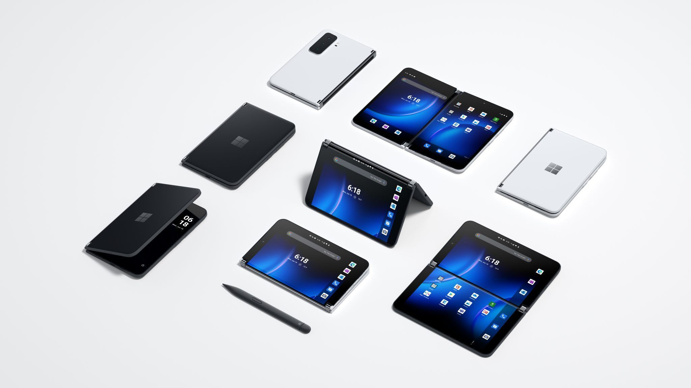

By the end of the year, what do technology enthusiasts do? Right, they google what's up with the industry, where it's heading, and what are the trends for the upcoming year. Now it's time to make predictions on what mobile app trends will rule the world in 2023. Some of them emerged years ago, however, it took time for them to expand, and they are gaining true power over the minds of consumers and entrepreneurs only now. Let's get started!

## Mobile Development Trends in 2023

### Artificial Intelligence
This one is absolutely no surprise. AI is widely used in mobile development for a range of applications. __Personalization__ is a popular use case, as AI can analyze a user's behavior and historical data to deliver personalized content. __Voice recognition technology__ powered by AI enables virtual assistants like Siri and Google Assistant to understand and respond to voice commands. __Image and object recognition__ allows AI to categorize objects in images or videos, which is useful for apps like Snapchat and Instagram filters. AI-powered __<a href="https://anadea.info/blog/what-is-a-chatbot-and-how-to-use-it-for-business" target="_blank">chatbots</a>__ can provide customer support or assist with basic tasks. __Predictive analytics__, using AI, can predict user behavior and optimize app performance. AI is also widely used in mobile app __security__ to detect and prevent fraudulent activity, like credit card fraud or phishing attacks.



### No-Code and Low-Code Development
No-Code and Low-Code Development Platforms (NCDP/LCDP) allow even non-programmers to get closer to the craft of web and mobile development. The No-Code technology translates the regular code to a __drag-and-drop solution__ easily perceived by anyone not quite related to programming with allegedly no need to refer to an <a href="https://anadea.info/services/mobile-development" target="_blank">app building company</a>. This method is a response to the colossal popularity of custom mobile apps development: people want them instantly and they’d gladly skip the step of learning all the necessary programming languages, as well as searching for the right software development team. This makes No-Code and Low-Code one of the leading trends in mobile development in 2023.

Related read: <a https://anadea.info/guides/custom-development-vs-app-builders" target="_blank">Custom Mobile Development vs App Builder: Which to Choose</a>

### Apps for Flip Phones

Flip devices raise much controversy in the tech community, but one can’t deny how popular they are. It’s not even due to their convenience - people are very excited about innovations anyway, and flip phones like __Galaxy Z Flip 3__ and __Microsoft Surface Duo 2__ released in 2021 quench their thirst for fancy new devices. Apps for foldable phones require a complete UI renovation compared to the classical smartphones: an app should adapt for the screen in both folded and unfolded states and remain fully functional.

### IoT Integration
The Internet of Things (IoT), originally designed decades ago for manufacturing units to facilitate machines’ operation, is now becoming a part of people’s daily life. The __IoT technology in mobile development__ allows control of other connected devices remotely: it can be any appliance you have at home. Thanks to unique identifiers, devices communicate with other connected ones and receive messages and commands. A good example is a smart home: see Anadea’s [case study](https://anadea.info/projects/home-automation).

In 2023, the reality of interconnected devices will become more real than we know it.

### 5G Everywhere
The number of 5G connections worldwide is expected to reach almost <a href="https://www.globenewswire.com/news-release/2021/09/22/2301608/0/en/Global-5G-Connections-Are-Growing-Rapidly.html" rel="nofollow" target="_blank">700 mln</a> by the end of 2021. To understand why and what makes 5G a tech trend, take a look at the graph below:

What does such a striking increase in 5G speed mean for mobile development?

Well, it gives a noticeable boost in apps’ functionality. Thanks to 5G, developers will be able to add more features to their apps with no negative impact on their performance. Plus, users can expect fewer connection interruptions due to lower network latency (time taken for data transfer between the source and destination). The real-world latency of 5G is <a href="https://5g.co.uk/guides/4g-versus-5g-what-will-the-next-generation-bring/" rel="nofollow" target="_blank">averaging</a> 17-26ms (milliseconds), while that of 4G is about 36-48 ms - two times longer.

That being said, in 2023, the 5G technology will strengthen its position as a standard in the industry.

### Instant Apps
For this fast pace of life, people tend to make decisions as quickly as possible. A while ago, Google Play enabled the “Try Now” button in its app. It means that a user interested in your app can try it instantly without downloading the full version. It saves time, device’s memory, and allows getting the first impression of the app helping users decide whether they want to install it.

Forge of Empires, a Google Play Instant version of which was uploaded to the store, had a <a href="https://www.thinkwithgoogle.com/intl/en-cee/marketing-strategies/app-and-mobile/innogames-attracts-new-players-and-boosts-conversions-google-play-instant/" rel="nofollow" target="_blank">3X higher conversion rate</a> than an average app by the same studio - all thanks to the demo. Impressive, isn’t it?

So we’d strongly recommend Android developers have instant versions of their apps in addition to downloadable ones.

### Digital Wellbeing
Are you familiar with the words “digital wellbeing” and “digital detox”? __Digital wellbeing__ is basically taking control over the amount and quality of digital content consumed. __Digital detox__ is self-limitation from online activities in favor of real life. Even if you hear (or read) it for the first time, now both are a huge trend that will prosper even more in 2023. Why so?

Lots of people are experiencing anxiety and distraction as a result of the constant use of devices: they involuntary check their phones whenever possible. Surfing the internet, scrolling Instagram feed, and reading news posted every minute is not relaxing but stressful.

To focus on what really matters and manage phone usage, there are tools for setting daily limits and tracking time spent in particular apps. No apps are needed for that, you may say, but digital wellbeing applications are a surprisingly hot trend this year. So why not develop your own one in 2023?

### Wearable Apps
Apps for wearable devices are those for your smartwatch and fitness bracelets. These have a lot to offer: from pulse and steps counter to personal diet advice. <a href="https://mercomcapital.com/90-americans-wearable-mhealth-apps/" rel="nofollow" target="_blank">19%</a> of Americans use fitness trackers and mHealth apps.

The demand for digital wellbeing apps described before is a part of another global trend: the one for self-care and a healthy lifestyle. The COVID-19 pandemic has made it more difficult to keep healthy: staying at home has put certain limitations on physical activity. Thus people monitor their activity to improve their living standards - and it won’t go anywhere in the upcoming year.

### Beacon Technology
Beacons are small devices roughly the size of a regular Wi-Fi router. They are installed in public places, e.g. in stores, to detect the presence of people nearby.

Beacons connect to users’ devices via Bluetooth and send sales and promotions to them, detect time spent in the store, etc. Sending offers gives the store an advantage over other nearest places thanks to a more complete buying experience. Three things are required for the beacon technology to work: the beacon device itself, a device connected to Bluetooth, and the user’s permission, so no privacy violation here.

### VR/AR
No doubt the AR/VR trend is staying for good, as many companies are already embracing its power. Mobile apps have been all for a personalized experience lately, and AR/VR technology can offer that in full measure. Sellers can present their goods to customers in a more appealing way, providing 3D images of those. Customers can see how, for example, a piece of furniture would look in their apartment prior to purchasing it. In addition, those funny filters in Instagram that transform faces and turn them into cartoonish characters are an AR attainment, too.

## Adding Up
These were the 2023 trends in mobile apps development. Knowing what’s trendy and what’s not doesn’t necessarily requires you need to implement these trends in your app right away. Make sure a hot trend actually improves user experience and adds to the problem solution.

We at Anadea understand how challenging it is to keep up with trends and stay in demand, and we’re here to help you! [Contact us](https://anadea.info/contacts) any time, and together we can work something out about your app.
