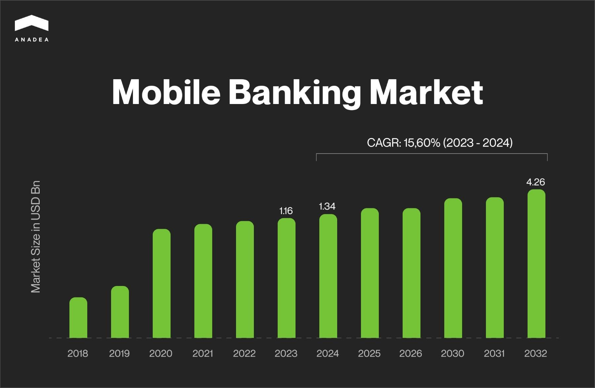
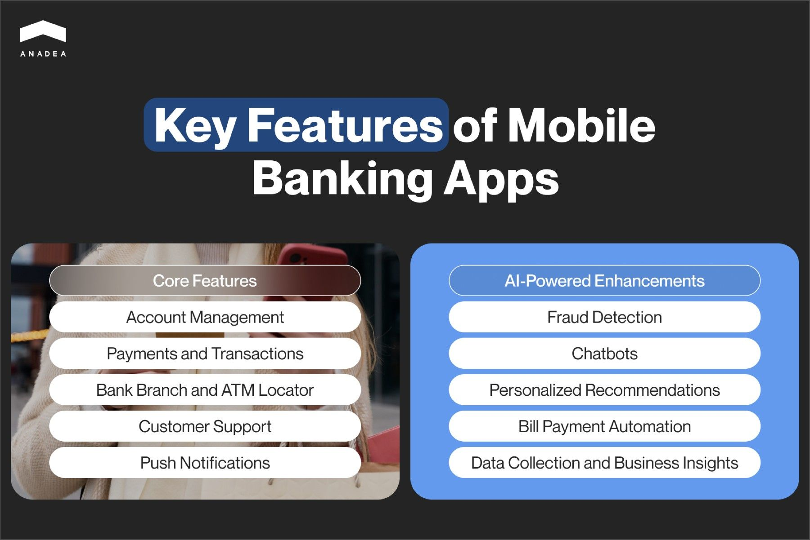
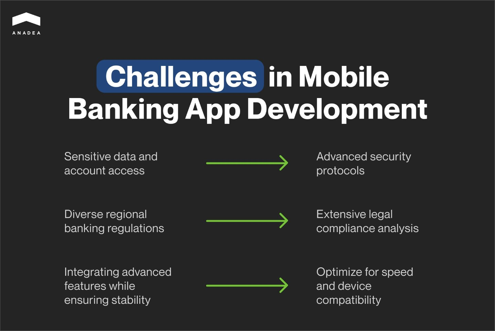

In the modern world, it has already become obvious that the traditional models used in the banking industry can’t fully address customer needs and meet the requirements of all market players. With overall digitalization, it’s impossible to deny the necessity to introduce [digital solutions](https://anadea.info/solutions/financial-software-development) to adapt the existing banking products and services to the current realities.

Today mobile banking app development can become a very promising project. Thanks to the possibility to use the majority of the most highly-demanded banking services directly on their smartphones people can save a lot of time. As a result, their loyalty to their banks increases, as well as the general level of satisfaction. However, to launch an app that will perfectly cope with the set tasks and allow you to reach your key goals, you need to know the trends and standards that can be observed today.

In this article, we are going to talk about how to create a mobile banking app that will be positively welcomed by potential users. We will share some market trends and highlight the existing pitfalls in banking mobile app development.

## Mobile banking market overview

In 2023, the mobile banking market hit a volume of $1.16 billion. With a projected CAGR of over 15%, the industry is [expected](https://www.marketresearchfuture.com/reports/mobile-banking-market-2906) to expand from $1.34 billion to $4.26 billion in 2032.

Speaking about the increasing demand for mobile banking app development services, we can detect a couple of factors that have the strongest impact on the interest in such applications from the side of users.

One of them is the existing desire of people to have better control over their finances. With a modern banking app, people can check their accounts and make transactions at any moment and from anywhere.

Secondly, by developing a mobile banking application you can ensure great convenience for users. It is not necessary to go to a bank office each time when you want to perform any actions with your account or money.

And one more factor is the trend for personalization. Thanks to mobile banking apps, people can get more personalized offers that are fully tailored to their requirements. With access to users’ data, banks can better “hear” people’s needs and expectations. Moreover, people can customize their experiences while interacting with banking apps. For example, they can change the design of their dashboards, choose the most necessary features, set notifications, etc.

## How to create a mobile banking app

Every project begins with an idea. And your mobile banking application development project won’t be an exception. For your inspiration, we recommend you read our [article](https://anadea.info/blog/fintech-business-model) devoted to different types of fintech solutions.

But what should you do next after getting an idea? How to start a banking app? As a rule, the project realization will look the following way.

1. **Market analysis and preparation of requirements**. It’s highly recommended to study the market and attentively review the existing solutions of a similar type. It is necessary to pay attention to their main benefits and try to find what can be done better. Your own product should be unique. However, it should meet modern standards and trends. And such analysis will help you detect them. Based on the results of your research and in accordance with your app concept, you should prepare requirements for developers.
2. **Discussion of your project with a development team.** When you share your vision and explain your expectations to the project team, they will help you polish up your idea and choose the most appropriate tech stack. It will be important to decide on the type of your app, and whether you want to build a native or cross-platform solution.
3. **Planning**. Then the team will design a plan for building your software product. They will also define the timeframes and major milestones.
4. **MVP development.** Very often before investing in a solution with a full set of features, businesses prefer to build a minimum viable project first. This solution will have only the most basic functionality. And its development will require less time and money. Nevertheless, its role in testing the viability of an idea shouldn’t be underestimated. If you are not satisfied with the reaction of end-users to your MVP, you can always introduce changes to it without serious financial risks.
5. **Design and development of a full-scale project.** When you are confident that your application meets the expectations of its target audience, it’s time to build its entire functionality and design its interfaces.
6. **Testing.** It is very important to test your app and fix all the bugs before making your software available to end-users.
7. **Launch**. When all bugs are addressed and all the features work as it was planned, you can submit your product to the app marketplaces.
8. **Support and maintenance.** Every mobile application requires continuous performance monitoring and regular updates. Quite often, it may be necessary to enrich an already existing app with new features or add new integrations in accordance with users’ preferences.

## Tech stack for banking mobile app development

The list of technologies used for building a particular app depends on the functionality of this solution, the platforms where it will be used, market trends, as well as other factors.

However, it is possible to define the most popular technologies and tools that are chosen for such software products today.

* [iOS development](https://anadea.info/services/mobile-development/ios-development): XCode, IOS SDK, Swift
* [Android development](https://anadea.info/services/mobile-development/android-development): Kotlin, Android Studio, Java, SDK
* Cross-platform development: React Native, Xamarin, [Flutter](https://anadea.info/services/mobile-development/flutter-development-services)
* Backend development: Node JS, PHP, Python, [Ruby](https://anadea.info/services/web-development/ruby-on-rails-development), [Java](https://anadea.info/services/web-development/java), [Golang](https://anadea.info/technologies/golang)
* Frontend development: Angular, React, HTML, CSS, JavaScript
* Database: MySQL, PostgreSQL, MongoDB
* Cloud platform: AWS, Google Cloud, Microsoft Azure
* Push notifications Onesignal, Firebase
* Analytics: Apache Spark, IBM

## Mobile banking app development: Key features

To define the right functionality for your app, you should clearly realize who, how, and when may need to use it. In other words, the features to be developed should reflect the tasks that you expect your solution to fulfill.

* **Account management**. Users should be allowed not only to view the current state of their accounts but also to perform some basic actions like blocking their funds or allocating them to a savings plan, etc.
* **Payments and transactions.** Making financial transactions, including P2P operations and paying for different products and services, is a basic feature of modern banking apps. You need to think about ways to make transactions secure and quick. For example, QR code scanning can become a good way to streamline operations.
* **Bank branch and ATM location search**. You can allow people to look for the nearest physical location of your bank directly in the application. It is also necessary to indicate opening hours and the list of services that they can get there. To enhance user experience, you can power this feature with AR.
* **Customer support**. It is important to make it possible for users to contact the bank support team via an app. To automate the interaction with customers, you can introduce a chatbot that will handle the majority of standard inquiries while managers will join the process of communication only in the most complex cases.
* **Push notifications**. Your app should be able to send alerts and reminders to users to make interaction much more engaging and helpful. Users should be able to turn off or set notifications based on their preferences.

## AI-powered features for mobile banking apps

Artificial intelligence is a very promising technology for many industries. Step by step [AI-powered tools](https://anadea.info/blog/ai-in-fintech) are being introduced across various market segments and fintech is not an exception. In 2023, according to [Statista](https://www.statista.com/statistics/1446269/ai-in-fintech-market-size-forecast/), the AI in fintech market size reached the mark of $42.83 billion, and in 2024, it is valued at $44.08 billion. Experts believe that by 2029, it will cross the level of $50 billion. And of course, the introduction of AI-based functionality is not just a modern trend. Such features can bring a lot of benefits to all groups of users.

Let’s consider a couple of ideas for such features for a mobile banking app.

* **Fraud detection.** AI and ML algorithms are extremely good at defining patterns and further detecting any deviations from them that could be a sign of any illicit activities.
* **Chabots**. It can be very expensive and challenging to organize a traditional customer support team that will work in a 24/7 regime and provide answers within a couple of seconds after receiving an inquiry. However, AI chatbots can efficiently address this issue. Chatbots can fully take responsibility for answering FAQs, processing requests, and redirecting the most complex of them to managers.
* **Recommendations**. AI tools can analyze users’ behavior and interests and create personal recommendations for them. For example, they can advise people to consider a new saving plan or explore an investment opportunity.
* **Bill payment automation.** Thanks to AI, it is possible to automate bill payments. Users can schedule the transactions in the most convenient way and all the payments will be done automatically without their intervention.
* **Data collection and business insights**. For banks, it can be highly useful to deeply analyze how users interact with their apps, services, and products. This information can provide them with a better understanding of how they can enhance their offers to better address the needs of their clients. AI can collect and analyze the required data and further visualize the results.



## Challenges of mobile banking app development

As well as any other type of software development project, the creation of a mobile banking app is associated with a row of pitfalls and difficulties. And it will be helpful to consider them beforehand to be ready for possible challenges.

The points that we are going to enumerate below shouldn’t discourage you from building your own solution. However, they should encourage you to pay more attention to the mentioned aspects.

* **Security**. Mobile banking solutions deal with sensitive information. That’s why you should implement strong measures to protect people’s personal data and access to their bank accounts.
* **Regulatory compliance**. Different jurisdictions have their own laws and rules that regulate the banking industry. If your app isn’t compliant with the existing requirements, its use can be prohibited by local authorities. Given this fact, while looking for the answers to the question of how to create mobile banking software, you should also analyze the regulatory requirements in the chosen region.
* **Performance and functionality.** You should find the right balance between innovations and the stable functioning of your solution. It is obvious that you want to enrich your app with the most advanced features that will attract the attention of potential users. At the same time, you should bear in mind that your app should work fast and be compatible with a wide range of devices (including older ones). And it should perform well in all cases.

On our blog, you can also read about the [development of fintech mobile apps](https://anadea.info/blog/fintech-mobile-app-development) in general and the challenges associated with such projects.

## Mobile banking app development cost

One of the main questions that you should think about before starting the project realization is the cost of mobile banking app development services. Nevertheless, you should understand that any more or less accurate amounts can be provided to you only after a detailed analysis of your requirements and expectations.

For estimating your project budget, it is necessary to know:

* The type of your product and its desired functionality;
* Complexity of the project;
* The list of required integrations;
* Tech stack;
* Team composition (the required skills).

Moreover, such factors as timeframes may also have an impact. If you have very pressing deadlines, it can be feasible to expand the development team with extra skills.

The cost of creation of the simplest mobile banking app can start at $30K-40K. Nevertheless, the more advanced features you will need to build, the higher the cost will be. Over time, the project investments can reach $200K and go even higher.

At Anadea, we can provide cost estimates for free. That’s why if you have plans to launch your own mobile banking app, you can contact us to get information about the potential project budget that will be needed.

Request estimate

## How to select a mobile banking app development services company?

When you are interested in banking mobile app development but do not have in-house resources for such a project, you need to look for a vendor. Today the software development industry is a highly competitive one with a lot of companies trying to win their market share. Nevertheless, unfortunately, not all of them can ensure the required quality of their services. That’s why before making up your mind and signing a contract with this or that vendor, you need to conduct diligent research.

Here are a couple of factors that you need to consider:

* **Years in the industry.** Of course, newcomers also should have a chance to build their business. However, when you work with an experienced team, you can be more confident in your seamless cooperation. During the years of work companies can develop their own approaches to working with customers and business processes that ensure the required flexibility. For example, Anadea was founded in 2000 and since that time, we have managed to design our own methods to address customers’ needs in the most efficient way.
* **Expertise in mobile banking application development.** It will be great, if the team that you are going to work with, has already built software solutions for the banking and finance organizations. This will guarantee that developers already have a good understanding of the specificity of such products and the industry requirements. You can check the projects that we've worked on in our [portfolio](https://anadea.info/projects).
* **Tech stack.** When you already know what tasks your app should perform, it’s possible to understand what features should be built and what technologies should be used. It is crucial to make sure that the company that you are going to collaborate with works with the necessary tech stack.
* **Engagement model and financial terms.** It’s important to analyze the terms of cooperation offered by the company. They should correspond to your business processes, budget, and expectations. Though very low rates can look appealing, at the same this could be an alarming sign. That’s why it is vital to find a golden middle between your desire to reduce development costs and the necessity to get a high-quality end product.
* **Reviews**. It is always helpful to analyze the reviews written by the company’s customers on external platforms. It will provide you with a better understanding of all the strong and weak sides of the team under consideration. The rating of Anadea at Clutch is 4.9 out of 5. For us, it is a good indicator that we are on the right way and an excellent motivator to work even harder.

If you want to learn more about software development outsourcing, we recommend you read [our article](https://anadea.info/blog/fintech-outsourcing) where we discussed the peculiarities of this business approach on the example of fintech projects.

## Final word

When you are considering different options of how to develop online banking application, you may need professional support from a reliable partner by your side. And our team can be a great variant for you.

We offer full-cycle mobile banking app development services and can join your project at any step of its realization. We know how to build a mobile banking app of any complexity and will be always happy to share our expertise with you.

If you want to get more information about our offers, do not hesitate to contact us!

Get in touch
