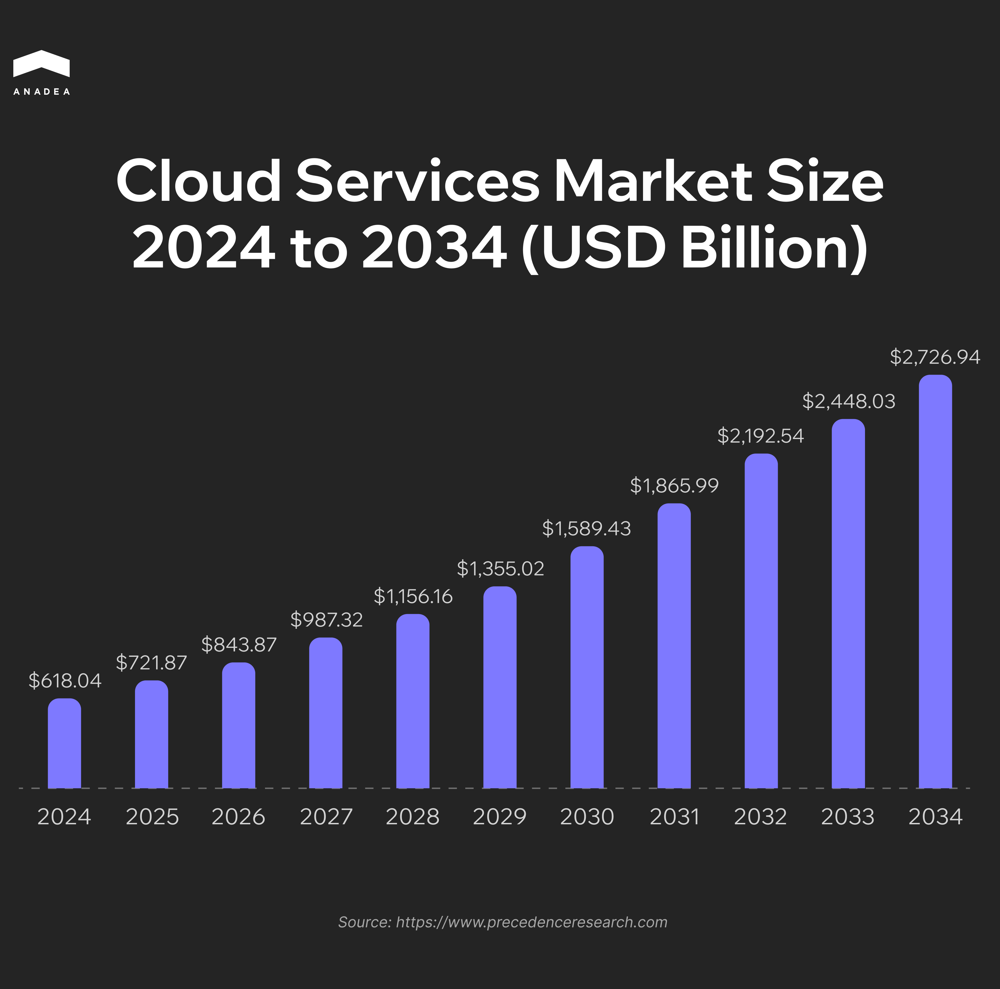
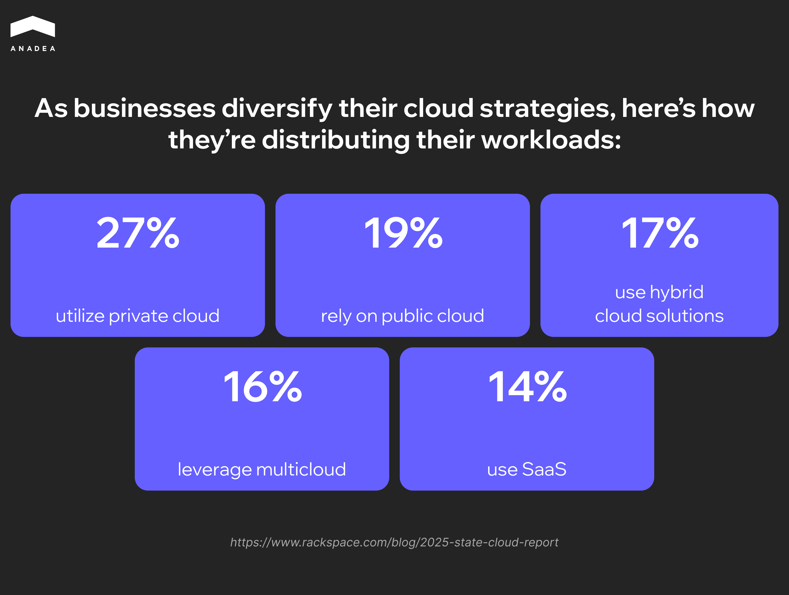
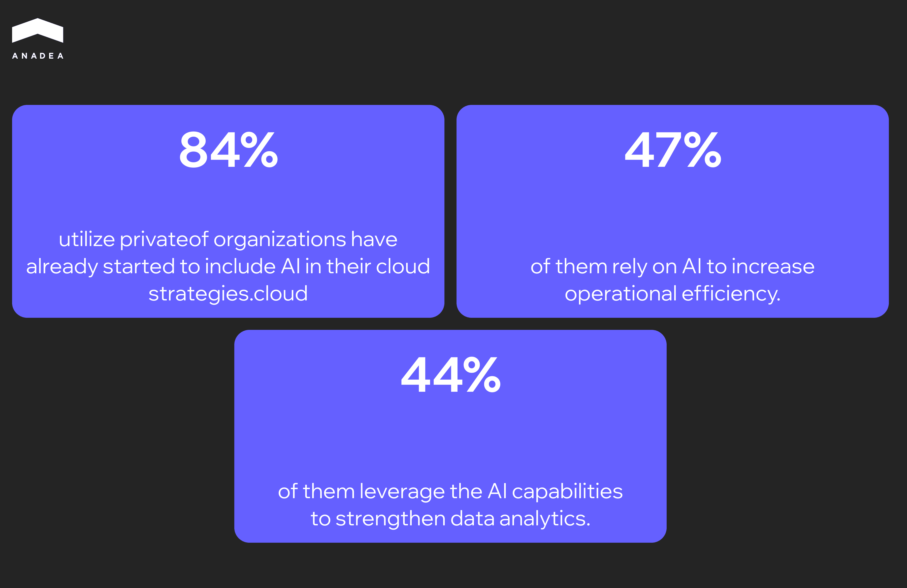
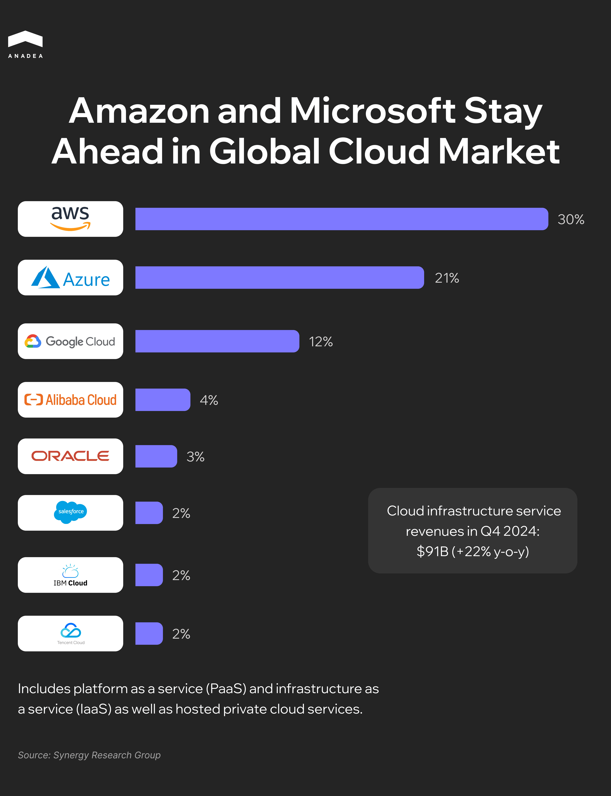

The adoption of cloud technologies has been one of the major tech trends for businesses of different types and sizes over recent years. One of the biggest advantages fueling this shift is cloud cost savings for SMBs and enterprises as companies always look for scalable solutions that optimize expenses while delivering high performance. Flexibility, security, and innovation-friendly environment are among other factors that boost the demand for cloud platforms.

However, to fully leverage the [benefits of cloud computing](https://anadea.info/blog/benefits-of-cloud-based-accounting-software-for-your-business/), companies need to select the right platform. In this article, we are going to talk about the current state of this market and compare the most popular options. Moreover, we will share practical tips on how to choose the most secure cloud storage for SMBs and other organizations with different needs.

## Cloud Market Today: Quick Overview

In 2024, the global cloud services market size reached US$618 billion. Now it is expected to hit the mark of around [US$2,726.94 billion](https://www.precedenceresearch.com/cloud-services-market) by 2034, which means that a CAGR over the forecast period will be 16%.

In 2025, cloud computing continues to evolve in accordance with general tech trends and changing business needs.

For example, it’s worth mentioning that organizations are increasingly adopting hybrid and multi-cloud approaches. This strategy allows them to enhance flexibility and avoid vendor lock-in. 

According to the recently published [report](https://www.rackspace.com/blog/2025-state-cloud-report), in 2025, nearly 27% of businesses are expected to rely on private clouds. At the same time, 17% will use hybrid solutions. It is interesting that 48% of respondents admitted that hybrid cloud solutions will be of significant importance for their IT operations within the next 1-2 years.

The integration of [Artificial Intelligence (AI)](https://anadea.info/services/ai-software-development) into cloud services is among other trends in this space. Cloud providers are investing heavily in AI capabilities. Many of them can offer access to such features as advanced analytics, machine learning, and natural language processing tools. This can fully revolutionize the way businesses work with vast amounts of data.

### Key Market Players

As for the popularity of different cloud service providers, the big three include [AWS](https://aws.amazon.com/), [Microsoft Azure](https://azure.microsoft.com/en-gb/), and [Google Cloud Platform (GCP)](https://cloud.google.com/). With a 30% market share, AWS maintains its leading position. This can be explained by its early market entry, comprehensive service portfolio, and continuous innovation.

Azure and Google Cloud have 20% and 12% market shares respectively. Here’s a full list of top 8 cloud providers:

Though the market shares of some cloud service providers are not as impressive as that of the big three, there are a lot of promising players among them. 

One of them is [DigitalOcean](https://www.digitalocean.com/). Recently, it has seen a surge in popularity, especially among startups and SMBs. This growth is mainly driven by affordability and a developer-friendly approach. Namely, these features greatly cater to the specific needs of smaller businesses. 

As well as its bigger counterparts, DigitalOcean is also focused on strengthening its AI strategy, which makes it a good choice for innovation-oriented businesses.

## Selecting the Best Cloud Service Provider: Factors to Consider

Quite often our customers ask us to name the best cloud platform. However, this becomes rather complicated since we can only help businesses find the most appropriate and cost-efficient option for their existing infrastructure and project. Nevertheless, it won’t be a universal recommendation. All business cases should be viewed individually and to do it, it is necessary to analyze an array of parameters, business and technical requirements. 

To facilitate your search for the best cloud service for your business, we’ve prepared a list of factors that should be taken into account. 

### Your Business and Technical Requirements

Before diving deep into the comparison of the available platforms, you should start with the analysis of your own expectations and needs. The cloud provider should align with your core requirements. The better the platform fits your needs and pain points, the greater your efficiency is. Here are the key parameters to evaluate.

* **Workload type**. Does your business deal mainly with general applications or heavy data processing systems? Do you expect a cloud platform to cope with IoT solutions or high-performance computing tools? Different cloud platforms are designed with different needs in mind.
* **Industry-focused compliance**. Such industries as healthcare, finance, or government require strict compliance with regulations like FATF, FCA, HIPAA or GDPR. Not all cloud platforms cover the same compliance standards. That’s why you should verify whether the selected platform offers compliance tracking and enablement. 
* **Integrations**. You should make sure the cloud platform will seamlessly integrate with your existing IT ecosystem, databases, and third-party services that you rely on.
* **Preferred cloud model**. It is necessary to decide whether you need public, private, hybrid, or multi-cloud support. Your choice should depend on your data sensitivity and infrastructure plans.

### Cost and Pricing

In many cases, the use of cloud services is considered to be a more feasible option than supporting on-premises infrastructure. However, to keep your expenses within the set frameworks and budget, you need to understand the peculiarities of cloud pricing.

The majority of cloud providers offer the pay-as-you-go model. It means that you will pay only for what you use. In other words, if you decide to scale down the used resources, you will pay less.

Additionally, some platforms provide the possibility to pay for reserved instances and get discounts with long-term commitments. When you have a clear understanding of the resources that you will need in the long run, you can benefit from this option.

It’s also paramount to find out whether there aren’t any hidden costs (and if there are, whether they are reasonable and whether you can bear them).

Want to optimize your expenses on cloud services? Our practical tips for cloud cost savings for SMBs and enterprises will help you! To explore them please [follow the link](https://anadea.info/blog/cloud-cost-optimization/). 

You can also read about a <a href="https://anadea.info/projects/outfit-creator">real project</a> from our practice, where our experts helped the customer to reduce cloud infrastructure costs by 50%.


### Performance and Scalability

The chosen cloud platform should not only support your current workloads but also grow with your business. What you need to check:

* Whether the cloud service provider offers locations of data centers close to your users (this will reduce latency).
* Whether the platform can scale up and down automatically based on demand (this will help you avoid tech issues and overpaying for resources that are not used).
* Whether its compute power, memory limits, storage performance, and network throughput are suitable for your workloads (you also need to take into account your further business expansion).

### Security and Data Protection

Data protection is a critical concern for every business. Any damage or breach of sensitive information can lead to very negative (and often even irreversible) reputational and financial losses.

That’s why it is very important to analyze whether the chosen platform can provide the desired security. For instance, a reliable cloud service provider can implement such features and protective measures as data encryption, disaster recovery and backup, as well as robust identity and access management.

Beyond that, it’s worth paying attention to what is considered the best cloud security solutions for SMBs and their compatibility with the chosen platform.

For example, AWS Security Hub can help SMBs automate routine security tasks, protect their apps, data and devices, as well as manage their regulatory compliance.

### Out-of-the-box AI/ML Solutions

Almost all leading cloud service providers offer ready-to-use AI models for various tasks. For example, there can be tools for text analysis, speech recognition, computer vision, and much more. That’s why if you are planning to integrate AI and ML into your workflows, it is vital to check the availability of such out-of-the-box solutions.

Moreover, if you have more specific and ambitious plans for AI implementation, it is also recommended to consider the list of tools and frameworks for custom AI/ML models supported by the cloud platform. For example, TensorFlow, PyTorch, and Theano are among the most highly-demanded technologies.



## AWS, Azure, GCP, or DigitalOcean: The Best Option for SMBs and Enterprises

If you are currently looking for the most suitable cloud platform, it will be helpful to take a look at our comparison of the most popular options among businesses of different types.

### AWS

The platform is well-known for its global reach and great scalability. It often becomes a choice for enterprises and actively expanding businesses. This cloud service provider has a huge network of data centers located all over the world.

AWS provides a wide range of services, including IoT and AI tools, the best cloud security solutions for SMBs, web hosting, and more. It has a mature ecosystem with extensive community support.

### Microsoft Azure

For organizations that work within the Microsoft ecosystem, Azure may become the most preferred option. It provides smooth integration with all Microsoft products. It enables hybrid cloud deployments and offers Windows-based virtual machines.

The platform makes compliance and security its top priority, which is necessary for strictly regulated industries.

### Google Cloud Platform

Google Cloud Platform provides advanced capabilities in data management and analytics. That’s why if your business heavily relies on big data processing and machine learning in its operations, it’s worth considering this cloud vendor.

As Kubernetes was originally designed by Google, it comes as no surprise that GCP provides strong Kubernetes and container support.

### DigitalOcean

DigitalOcean is a niche player that offers fewer enterprise-level features and services compared to AWS, Azure, or GCP. However, with its ease of use, it is actively gaining popularity among SMBs cloud users and developers.

It provides all essential products that most businesses require, including but not limited to VPS hosting, managed databases, and managed Kubernetes. 

Moreover, it has quite predictable pricing, which is highly important for budget planning.

### Comparison of Top Cloud Platforms

<table>

<thead>

<tr>

<th>&nbsp;</th>

<th>

<strong>AWS</strong>

</th>

<th>

<strong>Azure</strong>

</th>

<th>

<strong>GCP</strong>

</th>

<th>

<strong>DigitalOcean</strong>

</th>

</tr>

</thead>

<tbody>

<tr>

<td>

Best for

</td>

<td>

Businesses looking for a range of services and global infrastructure

</td>

<td>

Organizations that work within the Microsoft ecosystem and need hybrid cloud solutions

</td>

<td>

Data-driven projects and businesses leveraging AI/ML capabilities

</td>

<td>

SMBs and developers seeking cost-efficient and simple solutions

</td>

</tr>

<tr>

<td>

Pros

</td>

<td>

Service offerings covering compute, storage, AI/ML, and more;

 

Numerous data centers all across the globe;

 

Robust security features and compliance certifications.

</td>

<td>

Seamless integration with Microsoft products;

 

Extensive global reach with numerous data centers;

 

Strong support for hybrid cloud deployments.

</td>

<td>

Powerful data analytics and ML tools;

 

Competitive pricing;

 

Integration with Google's open-source technologies like Kubernetes.

</td>

<td>

User-friendly interface;

 

Straightforward setup processes;

 

Transparent pricing models.

</td>

</tr>

<tr>

<td>

Cons

</td>

<td>

Complex pricing structure;

 

Steep learning curve due to the vast array of available services.

</td>

<td>

Rather confusing pricing and subscription models;

 

Some services may have limitations compared to competitors.

</td>

<td>

Fewer global data centers compared to AWS and Azure;

Smaller market share.

</td>

<td>

Limited enterprise features compared to many other cloud providers;

 

Linux-centric platform with no native support for Windows.

</td>

</tr>

<tr>

<td>

Pricing&nbsp;

</td>

<td>

Pay-as-you-go model

</td>

<td>

Pay-as-you-go pricing

</td>

<td>

Pay-as-you-go model

</td>

<td>

Structured pricing for different cloud offerings

</td>

</tr>

<tr>

<td>

Free trial

</td>

<td>

Three different types of free offers (including a 12-month free period)

</td>

<td>

Free account with $200 credit

to try Azure tools within 30 days

</td>

<td>

$300 in free credits for new users to test and deploy workloads

</td>

<td>

60-day trial period with free $200 credit

</td>

</tr>

<tr>

<td>

Storage

</td>

<td>

Scalable storage solutions like S3 for object storage and EBS for block storage

</td>

<td>

Solutions like Blob Storage and Disk Storage suitable for businesses with different needs

</td>

<td>

Scalable managed solutions, including Cloud Storage service for storing unstructured data

</td>

<td>

Scalable block storage and S3-compatible object storage solutions

</td>

</tr>

<tr>

<td>

AI/ML tools

</td>

<td>

Comprehensive suite including SageMaker for building, training, and deploying models

</td>

<td>

Azure Machine Learning allows organizations to build and deploy models

</td>

<td>

Wide range of AI and machine learning products, including Vertex AI Agent Builder

</td>

<td>

Basic AI/ML capabilities suitable for smaller projects

</td>

</tr>

</tbody>

</table>

## Final Word

The choice between AWS, Azure, GCP, and DigitalOcean ultimately depends on the unique needs of your business. For SMBs, DigitalOcean stands out for its simplicity. On the other hand, businesses with complex needs or those that heavily rely on hybrid cloud models may find AWS, Azure, or GCP more suitable. They provide vast service offerings, advanced [DevOps tools](https://anadea.info/services/server-administration-and-maintenance) and global infrastructure, which plays a significant role in their high performance.

It’s crucial to choose a platform that will correspond to your goals and precisely address your needs. If you are looking for professional advice or tech expertise, at Anadea, we are always open to new projects. Share your requirements with us to [get estimates for free](https://anadea.info/free-project-estimate)!
