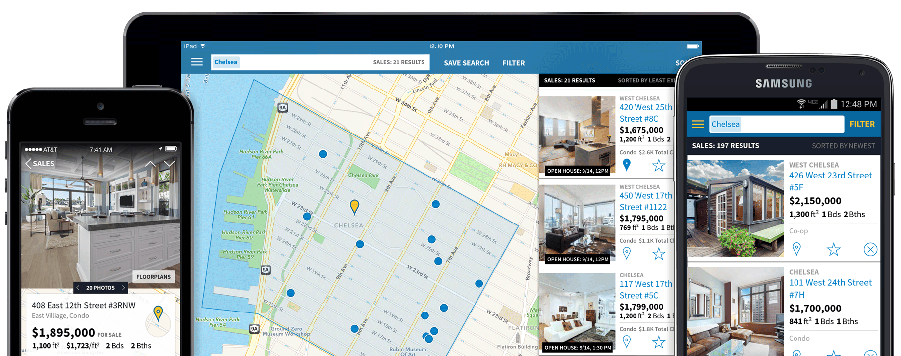

Keep up with changes and news on your local real estate market, do paperwork, wade through bureaucratic procedures, plan open houses, schedule meetings with clients or other agents and meet them, answer calls and emails, update information about your listings, figure out how to differ from competitors, keep a database of leads... On top of that, you understand that having an app is a necessity for your local real estate business, and there is simply no time to address the issue. Looks familiar to you?

We, as a [real estate app development company](https://anadea.info/solutions/real-estate-software), understand that you are too busy to figure out the intricacies of the software development process. In this article, on the example of StreetEasy, we’ll show the main features of real estate web or mobile application and tell you what each feature may give to your business.

## The reasons we chose the case of StreetEasy

We took the example of [StreetEasy](https://anadea.info/projects/streeteasy), a place on the Internet to search for renting and selling a home in New York City because it is a really challenging development of a real estate app in our practical experience. The market is complex, the target audience is mixed, the business requirements are of the highest level, the result is remarkable.

Real estate market of New York City is like no other. The city is split up not only into municipal divisions (boroughs) marked on the map, but also consists of conditional areas located within the boundaries of settlements of ethnic or social groups of inhabitants. All neighborhoods are diverse in terms of lifestyle so greatly that they seem to be different cities.

There is a wide variety of building types: townhouse, pre-war and post-war buildings, brownstone, luxury hi-rise. Besides, NYC is a recognized platform for architectural experiments. Converting an old office or industrial building into residential apartments is a New York City classic.

NYC is a business center of the United States, and therefore it is not surprising that it attracts thousands of people from all over the world. New York City is a city of immigrants. About two hundred nationalities live here. And almost all of them are looking for an apartment to rent.

Everything mentioned above comes to play if you want your app to stand out. Since StreetEasy made it, we can learn from them [how to create a real estate app](https://anadea.info/blog/how-to-create-a-real-estate-web-platform) for renting and selling apartments in a huge city, such as New York City.

## What real estate startups can learn from StreetEasy’s success

StreetEasy is a very localized real estate app. It is known to almost every New York citizen for excellent search criteria and relevant listings. The company has a strong position in the real estate market, its <a href="https://www.owler.com/company/streeteasy" target="_blank">annual revenue is $4M</a>.

In addition to extensive search capabilities, here you will find a huge list of useful materials, reports, interesting historical facts about the Big Apple, and guides to help you rent, buy and sell smarter. There is also a guide on moving to NYC with an affordability calculator!

The service includes a description of neighborhoods with specific characteristics and drawbacks in order to give a general idea about what it’s like to live in this or that New York City’s area. What matters most, it has exclusive and relevant listings, almost no obsolete ones. And agents represent only the owner, no extra agents in the chain.

StreetEasy is not alone among property listing solutions in New York. There are alike services: Buzzbuzzhome, MLS, Naked Apartments. And yet every New Yorker when searching for housing will recommend you the app of StreetEasy. Why is that?

The success of the app is the result of hard work. Let’s look at the distinctive features that made StreetEasy so popular.

### Advanced search. Help them find

Home hunters make their choice based on different factors: area, type of property, year of construction, distance from a subway or certain school, availability of a gym, swimming pool, rooftop or children’s rooms in the building, and many other things. Everyone looking for a house or apartment wants to get what he needs by clicking one button. Therefore, search filters are so important.

As for StreetEasy, it allows filtering the right options for a lot of parameters. For instance, here is what you can do:

* **Customize the search boundary.** You can sort options by type, number of bedrooms, square feet, but beyond that, you can adjust the search area on the map and give it a separate name. That is, when you re-search, you simply open the map under the desired boundaries.

* **Search on the map.** When searching for apartments in a particular area, users have the opportunity to view all the available options directly on the map. The map will show in what building this or that apartment under your request is located. You will also see storm evacuation zones, Citi Bike stations and subway lines near the apartment.

* **Filter by listing and building amenities.** Someone likes to have private outdoor space and laundry in the building, someone needs a gym, and someone is looking for a house with parking. Most often, in order to find out whether the apartment you want has the amenities you need, it is necessary to contact the agent. StreetEasy makes life easier for the users and allows you to filter options by amenities, both listing and building.

* **Search in listings description.** Besides search options mentioned above, you can specify the parameters listed in the description. Specialized terms like “windows facing south”, “home office”, “oak floor” are often mentioned in the description. StreetEasy provides an opportunity to search for everything you need in descriptions.

* **Define the budget.** In addition to the price of the apartment itself, home buyers in New York City pay attention to the cost of ownership or, in other words, how much you will have to pay for the apartment maintenance and taxes every month. You can set limits in the boxes “Maintenance”, “Taxes” and “Price per square foot”.

* **School zones.** New York has about 470 square miles. Imagine this scenario: you have a kid who must be taken to school before work. You buy or rent an apartment near the office, and the school in your area does not fit and you have to take the kid to school in another area. In order to prevent such cases, StreetEasy has a search by school zones.

#### How you may benefit

If you give home buyers advanced search with as many necessary filters as they need, the likelihood that they find what they want will be much higher. It means they will stay on your website or will continue to use your real estate app further.

Advanced search helps to find the most suitable listings and does everything difficult for the person. Which means the real estate app user will thank you by clicking the "Message agent" button.

### Saved search. Facilitate the process

Rather than entering every time your search parameters, you can save them. This kind of search is needed so that you can quickly access those search parameters that you use more or less regularly. For example, if you are looking for a certain pet-friendly condo with two bedrooms and two bathrooms in Hudson Square, but none of the existing listings currently suit you, you can add a search by parameters to your favorite searches, then periodically view new listings appearing by these search parameters. Moreover, you can save listings you liked. This feature is free and available for registered users.

#### How you may benefit

Since the feature is available for registered users you will get information about the target audience and will be able to communicate directly with the users. It will help you to better understand your clients, their needs and preferences, as well as to improve your service.

### Digital analytics. Explore your audience

If you visit NYC you will definitely see <a href="https://streeteasy.com/blog/streeteasy-debuts-2019-ad-campaign/" target="_blank">StreetEasy’s advertising</a> in the subway, taxi tops and buses. The advertising shows a deep understanding of how people are looking for housing in New York City. These ad campaigns are always witty and can be called masterpieces. And all because StreetEasy is laced with analytics tools up and down and knows everything about the target audience: what time of the day users visit the web service, what search queries they use, what apartments interest them most, and so on and so forth.

#### How you may benefit

Understanding the target audience allows you not only to increase the effectiveness of advertising campaigns. Adding Google Analytics and Google Tag Manager to your site enables you to understand how users behave when they come from a certain advertising channel, what interests them most, what prevents them from using your service. Based on the data obtained, you can carry out AB testing, improve user experience, reduce advertising budgets while maintaining efficiency, and so much more.

### Mortgage tools. Be useful for home buyers

If you have ever been interested in mortgage terms, did you have enough strength to figure it out and feel free to say that you chose the best option on the market? For most of us, everything related to mortgage loans can be compared with attempts to understand the structure of a quantum computer. What does StreetEasy have for home buyers with a mortgage loan?

* **Mortgage calculator.** With the help of the mortgage calculator, the borrower can find out how much in the end is overpaid. If earlier such calculations could be recognized directly in the bank, now everything has become more convenient. You can decide in advance whether you should take a loan or not when looking through listings on the site by performing just a few counting operations. It goes without saying the calculations are approximate, however, it helps to determine the affordability by showing how much you need to pay per month.

* **Mortgage rates.** Mortgage rates may vary significantly from different banks. With the help of StreetEasy mortgage rates, visitors can find out which banks within the certain area make home loans for acquiring the property of interest, compare their offers on monthly payments, lender fees and annual percentage rate.

#### How you may benefit

By solving the real problems of real estate property buyers you attract their interest and keep them using your app to continue the process of buying a property.

### Agent tools. Become an assistant to agents

Real estate market is fast moving and very competitive. Brokers work is not stress-free, brokers need all the help they can get. StreetEasy is aware of it and provides agents with valuable tools to manage listings, to generate reports on listing performance, to plan open houses, to automate postings on social networks, and many others. Here you also may sign up for daily or weekly tailored emails with the newest real estate information and find ideas on generating more leads.

#### How you may benefit

It is important to remember that your service is a working tool for real estate professionals. Your real estate app may become a really nice timesaver for agents. By helping them to generate more leads and sell more you will also grow your real estate business.

### Guides for all occasions. Work with the audience

The algorithm for finding housing in New York City is something like the following: prepare the documents, find a listing to buy or rent an apartment in New York, make an appointment, and go to look at it. You like it - you buy or rent it. It would seem that everything looks simple. However, at every step of this algorithm there are many peculiarities and pitfalls.

StreetEasy is a friend and advisor for every visitor. It will guide you through every step of finding the home you dream of. With yelp, it will recommend a restaurant near the house that you liked. If you are moving to NYC for the first time it can give you everything you need from tips on finding a roommate to types of documents you need. It will help you to decide whether you should rent or buy. If you are an agent you can find real estate market reports and information on new developments in the city. On StreetEasy forums you may discuss topics of interest to you.

#### How you may benefit

Any business must communicate with its customers. Business profit depends on this. Guides, tips, forums help to efficiently build interaction with the target audience of the real estate app as well as gain their loyalty. Such an approach also will help you to build a community around your brand as StreetEasy did.

## In summary. How to build a real estate app like StreetEasy

Streeteasy is such a Swiss Army knife kind of a website with a set of functions for sellers, buyers, renters and agents. The process of developing an app like StreetEasy is long and continuing. It is necessary to take into account all aspects of your local real estate market, the needs of your target audience and your business goals.

The success of your app will also depend on the right choice of real estate app developers who will understand your business needs, who will help you to focus on being a realtor, who will provide quality work at each stage of app development, who will be your allies in building a great app for your local real estate firm. We will be happy to share our experience in [building real estate app solutions](https://anadea.info/solutions/real-estate-software) with you.
